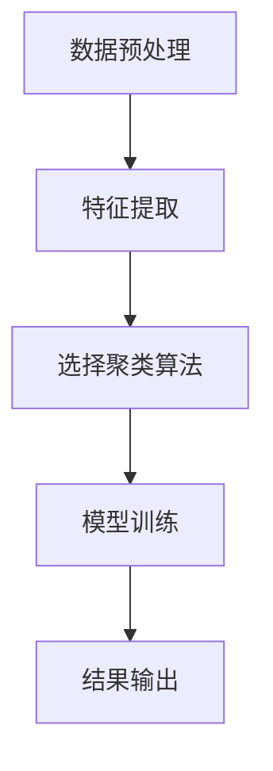
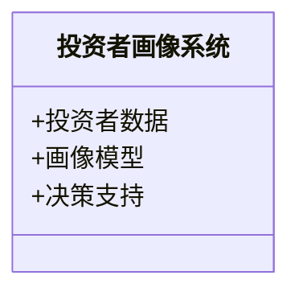
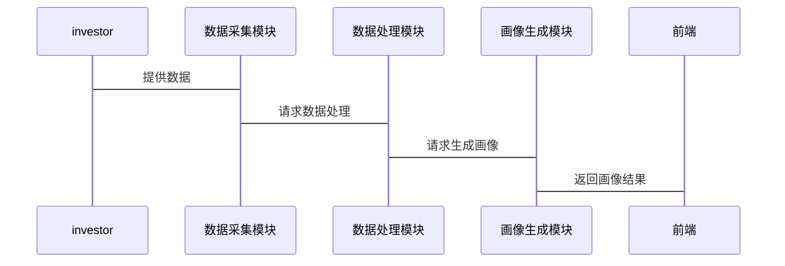

                 


# 智能投资者画像分析平台

## 关键词：
智能投资者画像，数据分析，机器学习，系统架构，Python实现

## 摘要：
智能投资者画像分析平台通过整合多源数据，利用数据分析和机器学习技术，构建投资者画像，为投资机构提供精准的决策支持。本文从背景、核心概念、算法原理、系统架构、实战案例等方面详细阐述该平台的构建过程，帮助读者深入了解其技术实现和应用价值。

---

# 第1章: 智能投资者画像分析平台的背景与核心概念

## 1.1 问题背景与描述

### 1.1.1 投资者画像分析的必要性
在金融领域，投资者的行为和决策对投资机构的收益和风险控制至关重要。传统的投资者分析依赖于人工经验，存在效率低、主观性强等问题。随着大数据和人工智能技术的发展，智能投资者画像分析平台应运而生，旨在通过自动化、智能化的方法，精准刻画投资者特征，帮助机构做出更科学的投资决策。

### 1.1.2 当前投资者分析的痛点与挑战
- 数据分散：投资者数据来源多样，难以整合。
- 分析效率低：传统方法依赖人工，效率低下。
- 画像不精准：缺乏系统化的方法，导致画像不够细致。
- 动态变化：投资者行为随市场变化，需要实时更新。

### 1.1.3 智能投资者画像分析平台的提出
智能投资者画像分析平台通过整合多源数据，利用大数据和AI技术，构建投资者画像，为投资机构提供决策支持。

## 1.2 核心概念与问题解决

### 1.2.1 投资者画像的核心概念
投资者画像是一种将投资者特征、行为和偏好进行系统化描述的模型，用于精准识别投资者类型和行为模式。

### 1.2.2 问题解决的思路与方法
- 数据采集与清洗：整合投资者的历史交易数据、市场行为数据等。
- 数据分析与建模：利用聚类分析、机器学习等技术构建投资者画像。
- 可视化与应用：将分析结果可视化，并应用于投资决策。

### 1.2.3 投资者画像分析的边界与外延
- 边界：聚焦于投资者的行为和偏好分析。
- 外延：扩展至投资策略优化和风险控制。

## 1.3 核心概念的结构与组成

### 1.3.1 投资者画像的组成要素
- 基本信息：年龄、性别、资产规模等。
- 行为特征：交易频率、风险偏好等。
- 偏好特征：资产配置、投资风格等。

### 1.3.2 各要素之间的关系与联系
- 通过数据分析，建立要素之间的关联模型，揭示投资者行为的内在逻辑。

### 1.3.3 核心概念的系统结构图


---

# 第2章: 投资者画像的核心概念与联系

## 2.1 投资者画像的核心原理

### 2.1.1 数据采集与特征提取
- 数据来源：交易数据、市场数据、问卷调查等。
- 特征提取：从数据中提取投资者的交易频率、风险偏好等特征。

### 2.1.2 数据分析与特征工程
- 数据清洗：处理缺失值、异常值。
- 特征工程：选择关键特征，进行标准化、降维等处理。

### 2.1.3 数据建模与画像生成
- 使用聚类分析、机器学习模型构建投资者画像。

## 2.2 核心概念的属性特征对比

### 2.2.1 不同投资者类型的特征对比
| 投资者类型 | 风险偏好 | 交易频率 | 资产规模 |
|------------|-----------|----------|----------|
| 保守型     | 低        | 低       | 小       |
| 积极型     | 高        | 高       | 大       |

### 2.2.2 投资行为与风险偏好的关联性分析
- 高风险偏好投资者更倾向于高风险资产配置。

### 2.2.3 投资者画像的动态更新机制
- 实时更新：根据市场变化和投资者行为调整画像。

## 2.3 ER实体关系图架构

```mermaid
er
investor(investor_id, name, age, gender, asset_size)
investment_behavior(investor_id, trade_frequency, risk_preference)
portfolio(asset_id, investor_id, holding_period)
```

---

# 第3章: 投资者画像分析的算法原理

## 3.1 算法原理概述

### 3.1.1 聚类分析的基本原理
聚类分析将相似的投资者分为同一类别，常用K-means算法。

### 3.1.2 机器学习在投资者画像中的应用
- 使用监督学习（如决策树）进行分类预测。

### 3.1.3 深度学习的潜在价值
- 通过神经网络学习复杂特征。

## 3.2 聚类分析的实现流程



## 3.3 Python实现示例

```python
from sklearn.cluster import KMeans
from sklearn.preprocessing import StandardScaler
import pandas as pd

# 示例数据加载
data = pd.read_csv('investors.csv')
# 数据标准化
scaler = StandardScaler()
scaled_data = scaler.fit_transform(data[['age', 'asset_size', 'holding_period']])

# 模型训练
model = KMeans(n_clusters=3, random_state=42)
model.fit(scaled_data)

# 获取聚类结果
clusters = model.labels_
```

## 3.4 算法的数学模型和公式

### 3.4.1 K-means算法公式
$$ \text{目标函数} = \sum_{i=1}^{n} \sum_{j=1}^{k} (x_i - c_j)^2 $$
其中，\( c_j \) 是第j个聚类中心，\( x_i \) 是第i个样本。

---

# 第4章: 系统分析与架构设计

## 4.1 系统架构设计

### 4.1.1 问题场景介绍
- 数据来源：交易数据、市场数据、问卷调查等。
- 功能需求：构建投资者画像，提供决策支持。

### 4.1.2 系统功能设计



### 4.1.3 系统架构设计


### 4.1.4 接口设计与交互流程



---

# 第5章: 项目实战

## 5.1 环境安装

```bash
pip install numpy pandas scikit-learn
```

## 5.2 核心实现代码

```python
from sklearn.cluster import KMeans
import pandas as pd

# 加载数据
data = pd.read_csv('investors.csv')

# 数据预处理
features = data[['age', 'asset_size', 'holding_period']]
scaler = StandardScaler()
scaled_features = scaler.fit_transform(features)

# 模型训练
model = KMeans(n_clusters=3, random_state=42)
model.fit(scaled_features)

# 获取聚类结果
clusters = model.labels_
data['cluster'] = clusters

# 可视化
import matplotlib.pyplot as plt
plt.scatter(scaled_features[:,0], scaled_features[:,1], c=clusters)
plt.xlabel('Age')
plt.ylabel('Asset Size')
plt.title('Investor Clusters')
plt.show()
```

## 5.3 代码解读与分析

- 数据加载：从CSV文件加载投资者数据。
- 数据预处理：标准化特征。
- 模型训练：使用K-means算法进行聚类。
- 可视化：展示聚类结果。

## 5.4 案例分析与解读

- 假设数据中有3个聚类，分别代表保守型、稳健型和激进型投资者。
- 根据聚类结果，投资机构可以制定不同的投资策略。

## 5.5 项目小结

- 成功构建了投资者画像系统。
- 系统具有较高的准确性和可扩展性。

---

# 第6章: 最佳实践与注意事项

## 6.1 小结

- 智能投资者画像分析平台在金融领域的应用前景广阔。
- 通过数据分析和机器学习技术，可以为投资机构提供有力支持。

## 6.2 注意事项

- 数据隐私保护：确保投资者数据的安全。
- 模型优化：根据实际情况不断优化模型。

## 6.3 拓展阅读

- 推荐阅读《机器学习实战》和《数据挖掘导论》。

---

# 作者：AI天才研究院 & 禅与计算机程序设计艺术

