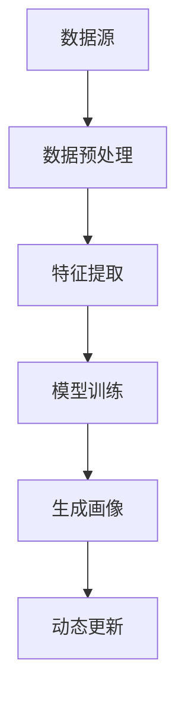
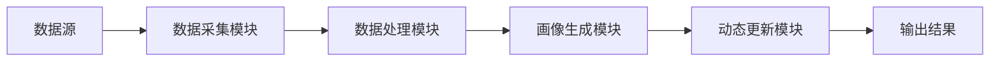
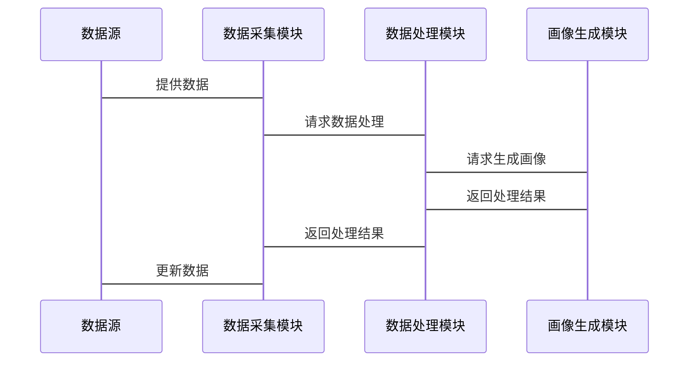

                 


# 智能投资者画像动态更新平台

## 关键词：
智能投资者画像、动态更新、机器学习、系统架构、实时数据处理、投资者行为分析

## 摘要：
本文详细介绍了智能投资者画像动态更新平台的设计与实现。通过分析投资者的行为、偏好和市场环境，利用机器学习算法实时更新投资者画像，为投资决策提供精准支持。文章从背景、算法、系统架构到项目实战，全面阐述了平台的构建过程，为金融科技创新提供了参考。

## 第一部分：背景介绍

### 第1章：智能投资者画像概述

#### 1.1 投资者画像的定义与背景
- 投资者画像：通过收集和分析投资者的行为数据、市场数据等，构建投资者的个性化特征描述。
- 动态更新的必要性：市场变化和投资者行为的实时性要求画像不断更新，以保持准确性。
- 平台背景：金融市场数据爆炸式增长，传统静态画像已无法满足需求，动态更新成为趋势。

#### 1.2 投资者画像的核心要素
- 行为特征：交易频率、持仓时间、交易金额。
- 风险偏好：风险承受能力、风险厌恶程度。
- 投资偏好：资产配置、行业偏好、投资风格。

#### 1.3 平台的整体架构
- 数据流：实时数据采集、处理、分析。
- 功能模块：数据采集、画像生成、动态更新。
- 技术选型：机器学习、大数据处理技术。

### 第2章：投资者画像的核心要素与动态更新机制

#### 2.1 核心要素分析
- 行为数据：投资者的交易记录、市场互动数据。
- 市场数据：宏观经济指标、行业指数、市场情绪。
- 画像属性：风险承受能力、投资风格。

#### 2.2 动态更新机制
- 数据驱动：根据最新交易数据更新画像。
- 时间驱动：定期更新投资者画像。
- 事件驱动：特定市场事件触发更新。

#### 2.3 核心概念的ER实体关系图
```mermaid
erDiagram
    investor {
        id : integer
        name : string
        age : integer
        risk_level : integer
        investment_preferences : string
    }
    transaction {
        id : integer
        investor_id : integer
        amount : float
        time : datetime
        type : string
    }
    market_condition {
        id : integer
        date : datetime
        index : float
        sector : string
    }
    investor_portrait {
        id : integer
        investor_id : integer
        portrait_data : string
        update_time : datetime
    }
    investor_portrait -> transaction : updates based on
    investor_portrait -> market_condition : influenced by
```

## 第二部分：算法原理讲解

### 第3章：动态更新算法原理

#### 3.1 数据预处理
- 数据清洗：去除无效数据，处理缺失值。
- 数据标准化：统一数据格式，消除量纲影响。

#### 3.2 特征提取
- 关键特征识别：选择对投资者画像影响最大的特征。
- 特征工程：构建特征向量，提取有效特征。

#### 3.3 模型选择
- 机器学习模型：使用线性回归、聚类分析或深度学习模型。
- 模型评估：通过准确率、召回率等指标评估模型性能。

#### 3.4 算法流程图


#### 3.5 数学模型与公式
- 线性回归模型：$$ y = \beta_0 + \beta_1x_1 + \beta_2x_2 + ... + \beta_nx_n + \epsilon $$
- 聚类分析：K-means算法，目标函数$$ J = \sum_{i=1}^{k} \sum_{j=1}^{n_i} (x_j - \mu_i)^2 $$

#### 3.6 代码示例
```python
import pandas as pd
from sklearn.preprocessing import StandardScaler
from sklearn.linear_model import LinearRegression

# 数据加载
data = pd.read_csv('investor_data.csv')

# 数据预处理
X = data.drop('target', axis=1)
y = data['target']

# 特征标准化
scaler = StandardScaler()
X_scaled = scaler.fit_transform(X)

# 模型训练
model = LinearRegression()
model.fit(X_scaled, y)

# 预测与评估
predictions = model.predict(X_scaled)
print('预测结果:', predictions)
```

## 第三部分：系统分析与架构设计方案

### 第4章：系统架构设计

#### 4.1 系统功能设计
- 数据采集模块：实时采集投资者数据。
- 画像生成模块：构建投资者画像。
- 动态更新模块：根据新数据更新画像。

#### 4.2 系统架构图


#### 4.3 系统接口设计
- 数据接口：与数据源系统对接。
- API接口：提供画像查询和更新接口。

#### 4.4 系统交互序列图


## 第四部分：项目实战

### 第5章：项目实战与实现

#### 5.1 环境安装
- 安装Python、Jupyter Notebook、Pandas、Scikit-learn、Mermaid。

#### 5.2 核心代码实现
```python
import pandas as pd
from sklearn.cluster import KMeans

# 数据加载
data = pd.read_csv('investor_data.csv')

# 特征提取
features = data[['age', 'income', 'risk_tolerance']]

# 模型训练
model = KMeans(n_clusters=3)
model.fit(features)

# 预测聚类
clusters = model.predict(features)
print('聚类结果:', clusters)
```

#### 5.3 案例分析
- 案例背景：投资者A，年龄30，收入中等，风险厌恶。
- 数据分析：市场波动增加，投资者风险承受能力下降。
- 更新后的画像：风险等级调整为低风险，投资偏好转向保守型资产。

## 第五部分：总结与展望

### 第6章：总结与展望

#### 6.1 最佳实践
- 数据质量控制：确保数据的准确性和完整性。
- 模型优化：定期更新模型，提升预测精度。
- 安全与隐私：保护投资者数据安全。

#### 6.2 小结
智能投资者画像动态更新平台通过实时数据分析和机器学习算法，为投资者提供精准画像，辅助投资决策。

#### 6.3 注意事项
- 数据隐私：遵守相关法律法规，保护投资者隐私。
- 系统稳定性：确保平台稳定运行，避免数据丢失。

#### 6.4 拓展阅读
- 《机器学习实战》
- 《大数据系统设计》
- 《金融数据分析》

## 附录

### 附录A：数据集与代码示例

#### 附录A.1 数据集
```csv
investor_id,age,income,risk_tolerance,investment_preferences
1,30,50000,2,stocks
2,45,100000,3,bonds
3,25,30000,1,mixed
```

#### 附录A.2 代码示例
```python
import pandas as pd
from sklearn.cluster import KMeans

# 数据加载
data = pd.read_csv('investor_data.csv')

# 模型训练
model = KMeans(n_clusters=3)
model.fit(data[['age', 'income']])

# 可视化
clusters = model.fit_predict(data[['age', 'income']])

import matplotlib.pyplot as plt
plt.scatter(data['age'], data['income'], c=clusters)
plt.xlabel('Age')
plt.ylabel('Income')
plt.show()
```

## 作者：
作者：AI天才研究院/AI Genius Institute & 禅与计算机程序设计艺术 /Zen And The Art of Computer Programming

