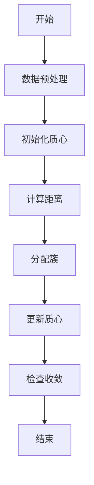
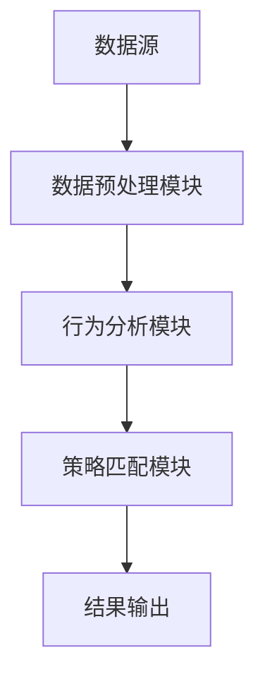
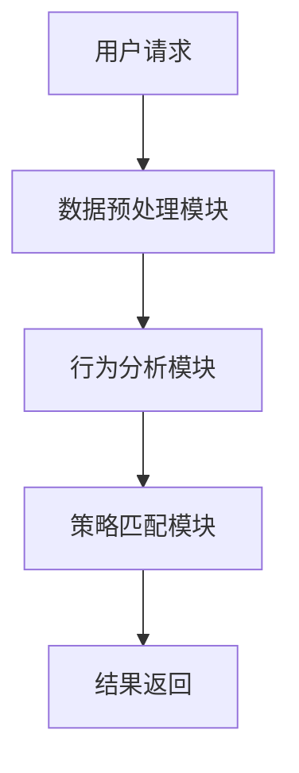

                 


# 第二章: 投资者行为分析的数学模型

## 2.1 投资者行为分析的理论模型

### 2.1.1 期望效用函数模型

期望效用函数（Expected Utility Function）是行为经济学中的核心工具，用于描述投资者在面对不确定性时如何选择最优决策。该模型假设投资者在决策过程中追求的是期望效用的最大化。

**公式推导：**

$$ U = \sum_{t=1}^{n} w_t \cdot u(x_t) $$

其中：
- \( U \) 代表投资者的效用函数。
- \( w_t \) 是第 \( t \) 种结果发生的概率权重。
- \( u(x_t) \) 是第 \( t \) 种结果带来的效用。

### 2.1.2 投资者风险偏好模型

风险偏好模型通过衡量投资者对风险的承受程度，帮助确定其适合的投资策略。常用的模型包括风险中性、风险厌恶和风险寻求。

**公式：**

$$ \lambda = \frac{E[return] - risk_free}{\sigma^2} $$

其中：
- \( \lambda \) 是风险偏好系数。
- \( E[return] \) 是预期收益。
- \( risk_free \) 是无风险利率。
- \( \sigma^2 \) 是收益的标准差。

### 2.1.3 投资者决策树模型

决策树模型通过构建决策树来模拟投资者在不同情况下的决策过程，帮助识别最优策略。

**示例：**

假设投资者面临两种选择：A和B。根据决策树分析，选择A在高概率下带来高收益，而选择B在低概率下带来极高的收益。

## 2.2 投资者行为分析的数学公式

### 2.2.1 投资者效用函数的公式推导

效用函数的构建基于投资者的偏好和风险态度。以柯布-道格拉斯效用函数为例：

$$ U(x, y) = x^\alpha y^\beta $$

其中：
- \( \alpha \) 和 \( \beta \) 是效用权重参数。

### 2.2.2 风险偏好系数的计算公式

$$ \lambda = \frac{E[return] - risk_free}{\sigma^2} $$

计算过程：

1. 计算预期收益 \( E[return] \)。
2. 确定无风险利率 \( risk_free \)。
3. 计算收益的标准差 \( \sigma \)。
4. 代入公式计算 \( \lambda \)。

### 2.2.3 预测模型的数学表达

使用线性回归模型预测投资者行为：

$$ y = \beta_0 + \beta_1 x_1 + \beta_2 x_2 + \epsilon $$

其中：
- \( y \) 是目标变量（投资者行为）。
- \( x_1, x_2 \) 是自变量（投资者特征）。
- \( \beta_0, \beta_1, \beta_2 \) 是回归系数。
- \( \epsilon \) 是误差项。

## 2.3 投资者行为分析的算法实现

### 2.3.1 基于机器学习的投资者行为分类算法

**K近邻算法（KNN）实现步骤：**

1. 数据预处理：加载数据集并进行标准化处理。
2. 数据分割：将数据分为训练集和测试集。
3. 模型训练：使用KNN算法对训练数据进行分类。
4. 模型预测：对测试数据进行预测并计算准确率。

**Python代码示例：**

```python
from sklearn.neighbors import KNeighborsClassifier
from sklearn.metrics import accuracy_score

# 加载数据集
data = pd.read_csv('investor_behavior.csv')

# 数据分割
X = data[['age', 'income', 'risk_tolerance']]
y = data['behavior_type']

# 训练模型
model = KNeighborsClassifier(n_neighbors=3)
model.fit(X, y)

# 预测
y_pred = model.predict(X)

# 计算准确率
print('Accuracy:', accuracy_score(y, y_pred))
```

### 2.3.2 投资者行为预测的回归模型

**线性回归模型实现步骤：**

1. 数据预处理：检查数据分布并处理异常值。
2. 数据分割：划分训练集和测试集。
3. 模型训练：使用线性回归模型拟合数据。
4. 模型预测：预测投资者行为并评估模型性能。

**Python代码示例：**

```python
import statsmodels.api as sm

# 加载数据集
data = pd.read_csv('investor_behavior.csv')

# 数据分割
X = data[['age', 'income', 'risk_tolerance']]
y = data['investment_decision']

# 添加截距项
X = sm.add_constant(X)

# 训练模型
model = sm.OLS(y, X).fit()

# 输出结果
print(model.summary())
```

### 2.3.3 投资者行为分析的聚类算法

**K均值聚类算法实现步骤：**

1. 数据预处理：标准化数据特征。
2. 数据分割：无需分割，直接进行聚类。
3. 模型训练：应用K均值算法进行聚类。
4. 结果分析：评估聚类效果并进行可视化。

**Python代码示例：**

```python
from sklearn.cluster import KMeans
from sklearn.metrics import silhouette_score

# 加载数据集
data = pd.read_csv('investor_behavior.csv')

# 数据预处理
X = data[['age', 'income', 'risk_tolerance']]
X = (X - X.mean()) / X.std()

# 训练模型
model = KMeans(n_clusters=3, random_state=42)
model.fit(X)

# 预测聚类结果
y_pred = model.labels_

# 评估聚类效果
score = silhouette_score(X, y_pred)
print('Silhouette Score:', score)
```

### 2.3.4 算法流程图

使用Mermaid绘制的K均值聚类算法流程图：



## 2.4 投资者行为分析的系统架构设计

### 2.4.1 系统功能模块划分

- **数据采集模块：** 从数据库中获取投资者行为数据。
- **数据预处理模块：** 进行数据清洗和特征工程。
- **行为分析模块：** 应用机器学习算法进行分类和聚类。
- **策略匹配模块：** 根据分析结果匹配合适的投资策略。

### 2.4.2 系统架构设计图

使用Mermaid绘制的系统架构图：



### 2.4.3 系统接口设计

- 数据接口：定义数据格式和API端点。
- 算法接口：定义算法输入和输出的规范。

### 2.4.4 系统交互流程图

使用Mermaid绘制的系统交互流程图：



## 2.5 本章小结

本章详细介绍了投资者行为分析的数学模型和算法实现。通过期望效用函数和风险偏好模型，我们理解了投资者决策的理论基础。接着，通过机器学习算法（如K近邻和K均值）展示了如何将理论应用于实际分析。最后，通过系统架构设计，我们将这些分析整合到一个完整的系统中，为后续的策略匹配奠定了基础。

