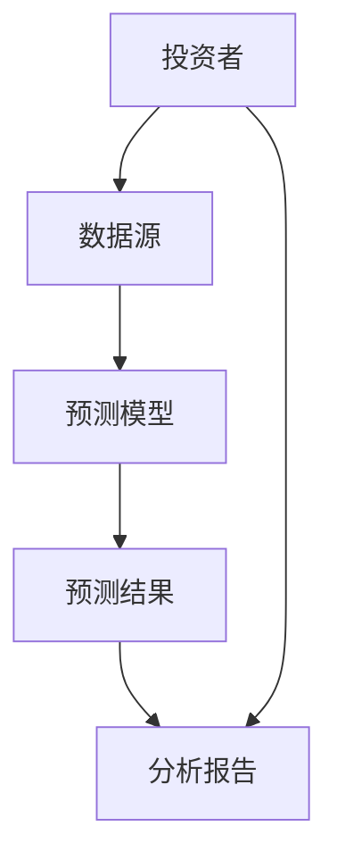
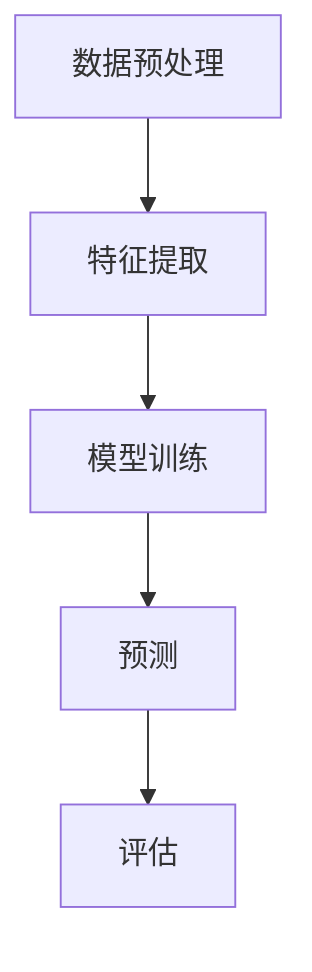
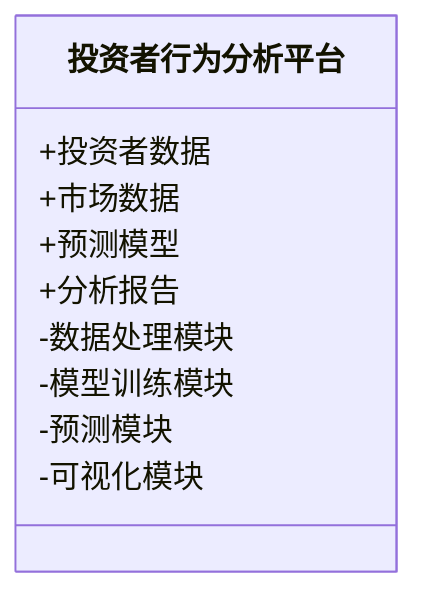
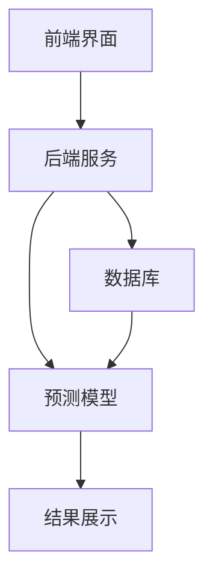
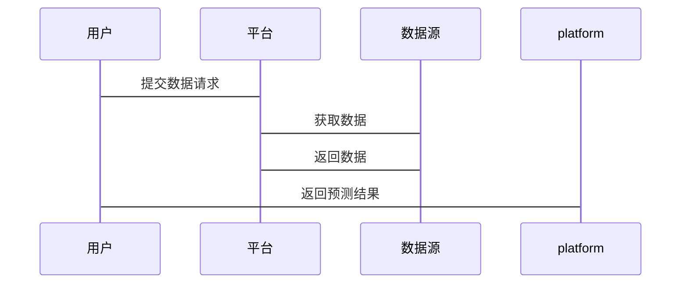

                 


# 智能投资者行为分析与预测平台

> 关键词：投资者行为分析，机器学习，时间序列分析，金融数据分析，智能预测平台

> 摘要：本文将详细介绍智能投资者行为分析与预测平台的构建过程，涵盖从数据采集到模型训练，再到平台实现的全过程。我们将从投资者行为分析的基本概念出发，深入探讨机器学习算法在投资者行为预测中的应用，结合实际案例，展示如何通过技术手段提升投资决策的智能化水平。

---

# 第一部分: 智能投资者行为分析与预测平台背景介绍

## 第1章: 智能投资者行为分析与预测平台概述

### 1.1 问题背景与描述

#### 1.1.1 投资者行为分析的必要性
投资者行为分析是理解市场波动和预测投资决策的核心环节。通过分析投资者的行为模式，我们可以洞察市场的潜在趋势，从而为投资决策提供科学依据。传统的投资者行为分析依赖于经验丰富的分析师，而智能投资者行为分析与预测平台则通过机器学习和大数据技术，实现了自动化、智能化的分析与预测。

#### 1.1.2 智能预测平台的定义与目标
智能投资者行为分析与预测平台是一种结合了人工智能和金融数据分析的系统，旨在通过收集、处理和分析投资者行为数据，预测投资者的未来行为模式，从而帮助投资者和机构做出更明智的投资决策。平台的目标是通过技术手段提升投资决策的效率和准确性。

#### 1.1.3 问题解决的边界与外延
智能投资者行为分析与预测平台主要关注投资者的交易行为、情绪波动和市场反应。其边界包括数据采集、特征提取、模型训练和结果预测，而外延则涉及市场分析、风险评估和投资策略优化。

### 1.2 核心概念与组成

#### 1.2.1 投资者行为的核心要素
投资者行为的核心要素包括：
- **交易记录**：投资者的交易历史，包括买卖时间、金额和频率。
- **市场数据**：市场的波动、指数变化和新闻事件。
- **情绪指标**：投资者的情绪波动，可以通过社交媒体、新闻和市场数据间接反映。

#### 1.2.2 平台功能模块与架构
智能投资者行为分析与预测平台主要包括以下功能模块：
- 数据采集模块：从多种数据源（如交易记录、社交媒体、新闻等）获取投资者行为数据。
- 数据处理模块：对数据进行清洗、特征提取和预处理。
- 模型训练模块：基于机器学习算法训练投资者行为预测模型。
- 预测与可视化模块：展示预测结果并生成可视化报告。

#### 1.2.3 数据流与信息处理流程
从数据采集到预测结果输出的完整流程如下：
1. 数据采集：从多种数据源获取投资者行为数据。
2. 数据预处理：清洗数据并提取特征。
3. 模型训练：基于机器学习算法训练预测模型。
4. 预测与评估：生成预测结果并评估模型性能。

## 第2章: 投资者行为分析的核心概念与联系

### 2.1 核心概念原理

#### 2.1.1 数据驱动的投资者行为分析
数据驱动的投资者行为分析通过收集和分析大量的投资者数据，揭示投资者行为的规律和模式。这种分析方法依赖于大数据技术，能够捕捉到传统方法难以发现的潜在信息。

#### 2.1.2 机器学习在行为预测中的应用
机器学习算法（如随机森林、神经网络）被广泛应用于投资者行为预测。这些算法能够从海量数据中提取特征，并通过训练生成预测模型。

#### 2.1.3 时间序列分析与行为模式识别
时间序列分析是投资者行为分析的重要方法。通过对历史数据的分析，可以识别出投资者行为的周期性、趋势性和随机性特征。

### 2.2 核心概念属性对比

| 概念                | 属性 | 描述                                                                 |
|---------------------|------|----------------------------------------------------------------------|
| 数据来源            | 多样性 | 包括交易记录、社交媒体、市场数据等                                         |
| 模型类型            | 多样性 | 包括监督学习、无监督学习、强化学习等                                         |
| 预测目标            | 多维度 | 包括短期波动预测、长期趋势预测、风险评估等                                   |

### 2.3 实体关系图



---

# 第二部分: 投资者行为分析与预测的算法原理

## 第3章: 投资者行为分析与预测的算法原理

### 3.1 算法流程



### 3.2 算法实现

#### 3.2.1 机器学习模型实现

```python
# 示例代码：基于随机森林的投资者行为预测
from sklearn.ensemble import RandomForestClassifier
import pandas as pd

# 数据加载与预处理
data = pd.read_csv('investor_behavior.csv')
X = data.drop('label', axis=1)
y = data['label']

# 特征提取与模型训练
model = RandomForestClassifier()
model.fit(X, y)

# 预测与评估
predictions = model.predict(X)
print('模型准确率:', model.score(X, y))
```

#### 3.2.2 数学模型与公式

##### 线性回归模型
$$ y = \beta_0 + \beta_1x_1 + \beta_2x_2 + ... + \beta_nx_n $$

##### 随机森林模型
$$ y = \text{投票结果} $$

---

# 第三部分: 系统分析与架构设计方案

## 第4章: 系统分析与架构设计方案

### 4.1 问题场景介绍

#### 4.1.1 项目背景
智能投资者行为分析与预测平台旨在通过技术手段提升投资决策的智能化水平，帮助投资者和机构做出更明智的投资决策。

### 4.2 系统功能设计

#### 4.2.1 领域模型



### 4.3 系统架构设计



### 4.4 系统接口设计

#### 4.4.1 API接口
- 数据接口：`GET /data`，获取投资者行为数据。
- 模型接口：`POST /predict`，提交数据并获取预测结果。

### 4.5 系统交互设计



---

# 第四部分: 项目实战

## 第5章: 项目实战

### 5.1 环境安装

```bash
pip install pandas scikit-learn matplotlib
```

### 5.2 系统核心实现

#### 5.2.1 核心代码

```python
# 数据预处理
import pandas as pd
import numpy as np

data = pd.read_csv('investor_behavior.csv')
data = data.dropna()
data = pd.get_dummies(data)

# 模型训练
from sklearn.ensemble import RandomForestClassifier
model = RandomForestClassifier()
model.fit(data.drop('label', axis=1), data['label'])

# 模型评估
from sklearn.metrics import accuracy_score
predictions = model.predict(data.drop('label', axis=1))
print('准确率:', accuracy_score(data['label'], predictions))
```

#### 5.2.2 代码解读与分析
- 数据预处理：删除缺失值并进行独热编码。
- 模型训练：使用随机森林分类器进行训练。
- 模型评估：计算预测准确率。

### 5.3 实际案例分析

#### 5.3.1 案例分析：股票价格预测

```python
# 示例代码：股票价格预测
import pandas as pd
from sklearn.neural_network import MLPRegressor

data = pd.read_csv('stock_prices.csv')
X = data[['open', 'high', 'low', 'volume']]
y = data['close']

model = MLPRegressor()
model.fit(X, y)

predictions = model.predict(X)
print('预测结果:', predictions)
print('真实结果:', y.values)
```

### 5.4 项目小结
通过实际案例分析，我们可以看到智能投资者行为分析与预测平台在实际应用中的巨大潜力。通过技术手段提升投资决策的智能化水平，将为投资者和机构带来更大的竞争优势。

---

# 第五部分: 最佳实践

## 第6章: 最佳实践

### 6.1 小结
智能投资者行为分析与预测平台通过机器学习和大数据技术，能够显著提升投资决策的效率和准确性。

### 6.2 注意事项
- 数据质量：确保数据的准确性和完整性。
- 模型选择：根据具体需求选择合适的算法。
- 风险控制：合理评估模型的局限性和潜在风险。

### 6.3 拓展阅读
- 《机器学习实战》
- 《Python金融数据分析》
- 《时间序列分析与应用》

---

作者：AI天才研究院/AI Genius Institute & 禅与计算机程序设计艺术 /Zen And The Art of Computer Programming

