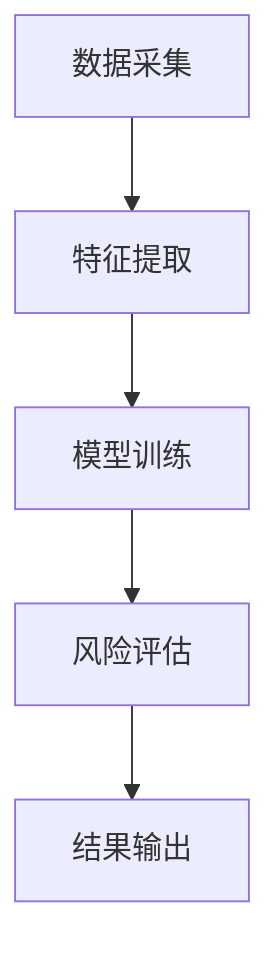

                 


# 智能投资者风险偏好动态评估

> 关键词：智能投资者、风险偏好、动态评估、机器学习、金融建模

> 摘要：本文探讨了如何利用人工智能技术，特别是机器学习和深度学习方法，对投资者的风险偏好进行动态评估。通过分析投资者的行为特征、市场环境和宏观经济指标，构建动态评估模型，并结合实际案例和系统实现，展示了如何在金融领域应用这些技术来优化投资决策。

---

# 第1章: 智能投资者风险偏好动态评估概述

## 1.1 投资者风险偏好的基本概念

### 1.1.1 投资者风险偏好的定义
投资者的风险偏好是指投资者在面对不同风险水平的投资时，愿意承担风险的程度。这种偏好并非一成不变，而是会随着市场环境、个人情绪和宏观经济状况的变化而动态调整。

### 1.1.2 风险偏好与投资决策的关系
风险偏好直接影响投资者的投资决策。风险厌恶的投资者更倾向于选择低风险、稳定收益的资产，而风险寻求的投资者则可能投资于高风险、高回报的资产。

### 1.1.3 动态评估的意义与应用场景
动态评估能够捕捉投资者风险偏好的实时变化，帮助金融机构实时调整投资策略，优化资产配置，降低投资风险。

---

## 1.2 智能投资者风险偏好动态评估的背景

### 1.2.1 传统风险评估方法的局限性
传统方法通常基于静态数据和固定模型，无法捕捉投资者风险偏好的动态变化。

### 1.2.2 人工智能技术在金融领域的应用
人工智能技术，尤其是机器学习和深度学习，能够处理海量数据，提取复杂特征，实时更新模型，为动态评估提供了技术支持。

### 1.2.3 动态评估的必要性与优势
动态评估能够实时反映市场变化和投资者行为，帮助金融机构做出更精准的投资决策。

---

## 1.3 本书内容与目标

### 1.3.1 本书的核心目标
本书旨在探讨如何利用人工智能技术，构建投资者风险偏好动态评估模型，并将其应用于实际投资决策中。

### 1.3.2 本书的结构安排
本书分为八章，涵盖投资者行为特征分析、风险偏好理论、动态评估模型设计、系统实现等内容。

### 1.3.3 本书的读者群体
本书适合金融从业者、数据科学家、技术开发者以及对智能投资感兴趣的研究者阅读。

---

# 第2章: 投资者行为特征与风险偏好理论

## 2.1 投资者行为特征分析

### 2.1.1 投资者决策模型
投资者的决策模型受到多种因素影响，包括心理因素、市场环境和个人特征。

### 2.1.2 投资者情绪与行为偏差
投资者情绪波动和行为偏差（如过度自信、从众心理）会影响其风险偏好。

### 2.1.3 不同类型投资者的行为特征
不同类型投资者（如机构投资者、散户）的行为特征和风险偏好存在显著差异。

---

## 2.2 风险偏好理论基础

### 2.2.1 风险中性、厌恶与寻求理论
投资者可以根据风险偏好分为风险中性、厌恶和寻求三类。

### 2.2.2 风险偏好与资产定价的关系
风险偏好影响投资者对风险资产的需求，进而影响资产的定价。

### 2.2.3 现代投资组合理论与风险偏好
现代投资组合理论强调在不同风险偏好下构建最优投资组合。

---

## 2.3 风险偏好动态变化的驱动因素

### 2.3.1 市场环境变化的影响
市场波动、经济周期等因素会影响投资者的风险偏好。

### 2.3.2 个人特征与心理因素
投资者的年龄、性别、教育背景等个人特征和心理因素会影响其风险偏好。

### 2.3.3 宏观经济指标的影响
GDP增长率、通货膨胀率等宏观经济指标也会对投资者风险偏好产生影响。

---

# 第3章: 智能投资者风险偏好动态评估的理论基础

## 3.1 行为金融学与动态评估

### 3.1.1 行为金融学的核心观点
行为金融学强调投资者行为中的非理性因素对市场的影响。

### 3.1.2 行为金融学对动态评估的启示
投资者行为特征是动态评估的重要输入。

### 3.1.3 基于行为特征的动态评估模型
通过分析投资者行为特征，构建动态评估模型。

---

## 3.2 现代统计学习方法

### 3.2.1 时间序列分析与动态评估
时间序列分析适用于捕捉风险偏好的动态变化。

### 3.2.2 非参数统计方法在风险评估中的应用
非参数方法能够处理复杂的数据分布。

### 3.2.3 非线性回归模型与风险偏好预测
非线性回归模型能够更好地拟合复杂的风险偏好关系。

---

## 3.3 机器学习与深度学习在金融中的应用

### 3.3.1 机器学习在风险评估中的优势
机器学习能够处理海量数据，发现复杂模式。

### 3.3.2 常见机器学习算法在风险偏好动态评估中的应用
支持向量机（SVM）、随机森林（RF）、神经网络等算法均可应用于风险偏好评估。

### 3.3.3 深度学习在复杂金融数据中的应用
深度学习能够处理文本、图像等非结构化数据，提升评估精度。

---

# 第4章: 动态评估模型的设计与实现

## 4.1 数据特征提取与处理

### 4.1.1 投资者行为数据的特征提取
提取投资者的交易频率、持仓时间等行为特征。

### 4.1.2 市场数据的特征提取
提取市场波动率、收益率等市场特征。

### 4.1.3 数据预处理与标准化
对数据进行清洗、归一化等预处理，确保模型输入一致性。

---

## 4.2 模型构建与优化

### 4.2.1 基于机器学习的模型构建
选择合适的机器学习算法，构建风险偏好预测模型。

### 4.2.2 模型参数优化与调优
使用网格搜索、随机搜索等方法优化模型参数。

### 4.2.3 模型评估与验证
采用交叉验证、ROC曲线等方法评估模型性能。

---

## 4.3 模型的动态更新与维护

### 4.3.1 动态更新策略
根据实时数据更新模型，确保评估结果的时效性。

### 4.3.2 模型维护与监控
定期监控模型性能，及时发现并修复问题。

---

# 第5章: 系统实现与技术细节

## 5.1 系统架构设计

### 5.1.1 系统功能模块
包括数据采集、特征提取、模型训练、风险评估等模块。

### 5.1.2 系统架构图
使用Mermaid绘制系统架构图，展示各模块之间的关系。



---

## 5.2 系统接口设计

### 5.2.1 数据接口
定义数据输入格式和接口协议，确保数据流畅传输。

### 5.2.2 模型接口
定义模型调用接口，方便前端和后端交互。

---

## 5.3 系统实现与代码示例

### 5.3.1 数据预处理代码
```python
import pandas as pd
from sklearn.preprocessing import StandardScaler

data = pd.read_csv('investor_data.csv')
features = data[['age', 'gender', 'investment_experience']]
scaler = StandardScaler()
features_scaled = scaler.fit_transform(features)
```

### 5.3.2 模型训练代码
```python
from sklearn.ensemble import RandomForestClassifier

model = RandomForestClassifier(n_estimators=100, random_state=42)
model.fit(features_scaled, labels)
```

---

## 5.4 系统测试与优化

### 5.4.1 模型性能测试
使用测试数据评估模型准确率、召回率等指标。

### 5.4.2 系统优化
通过并行计算、缓存优化等方法提升系统性能。

---

# 第6章: 实际案例分析与应用

## 6.1 案例背景介绍

### 6.1.1 案例目标
展示动态评估模型在实际投资中的应用效果。

### 6.1.2 数据来源
介绍案例中使用的数据来源和特征。

---

## 6.2 模型应用与效果评估

### 6.2.1 模型预测结果
展示模型预测的风险偏好分布。

### 6.2.2 模型效果对比
将动态评估模型与传统模型进行对比，评估其优势。

---

## 6.3 案例分析与总结

### 6.3.1 案例分析
通过具体案例分析，展示模型的实际应用效果。

### 6.3.2 总结
总结动态评估模型在实际投资中的价值和意义。

---

# 第7章: 未来展望与技术挑战

## 7.1 前沿技术与发展趋势

### 7.1.1 强化学习的应用
强化学习在动态策略优化中的潜力。

### 7.1.2 NLP技术的应用
自然语言处理技术在投资者情绪分析中的应用。

### 7.1.3 多模态数据的融合
结合文本、图像等多种数据源提升评估精度。

---

## 7.2 技术挑战与解决方案

### 7.2.1 数据隐私与安全
如何在保护数据隐私的前提下进行模型训练。

### 7.2.2 模型解释性
提升模型的可解释性，便于实际应用中的理解和调整。

---

## 7.3 未来发展方向

### 7.3.1 技术融合
将多种人工智能技术结合，提升评估精度。

### 7.3.2 应用场景扩展
探索更多应用场景，如风险管理、智能投顾等。

---

# 第8章: 总结与展望

## 8.1 本书总结

### 8.1.1 核心内容回顾
总结本书的核心内容和主要观点。

### 8.1.2 重点内容提示
提示读者关注动态评估模型的关键点。

---

## 8.2 最佳实践与注意事项

### 8.2.1 数据处理
强调数据清洗和特征工程的重要性。

### 8.2.2 模型选择
建议根据实际需求选择合适的模型和算法。

### 8.2.3 系统优化
提供系统优化的实用建议。

---

## 8.3 未来研究方向

### 8.3.1 新技术探索
探索新技术在风险偏好评估中的应用。

### 8.3.2 应用场景拓展
拓展动态评估模型的应用场景，提升其价值。

---

作者：AI天才研究院 & 禅与计算机程序设计艺术

---

通过以上章节的详细撰写，我希望能够为读者提供一篇内容丰富、结构清晰、技术深入的专业博客文章。如果需要进一步的细节或代码实现，请随时告知！

