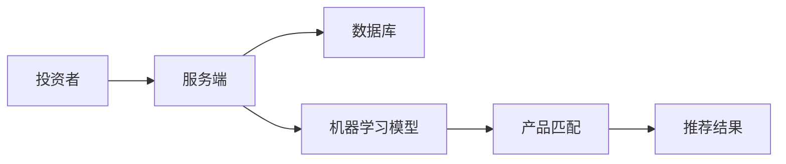

                 


# 智能投资者风险偏好动态评估与产品匹配

## 关键词：智能投资者、风险偏好动态评估、产品匹配、机器学习、金融数据分析、动态风险评估、投资组合优化

## 摘要：本文深入探讨了智能投资者风险偏好动态评估与产品匹配的核心方法与实现路径。基于机器学习和大数据分析，构建了动态风险评估模型，并通过系统化的方法实现投资者与金融产品的精准匹配。文章详细分析了风险偏好评估的动态特性，提出了基于用户行为数据的实时评估算法，并通过系统架构设计和项目实战，展示了如何将理论应用于实际投资场景。本文旨在为金融领域的智能化投资提供理论依据和实践指导。

---

# 第一部分：智能投资者风险偏好动态评估与产品匹配的背景介绍

## 第1章：问题背景与定义

### 1.1 问题背景与定义

#### 1.1.1 投资者风险偏好的基本概念

投资者风险偏好是指投资者在面对不确定性和潜在损失时，愿意承担风险的程度。它是投资决策的核心因素之一，直接影响投资者的选择和投资组合的构建。传统的风险偏好评估通常是静态的，基于投资者的历史行为和问卷调查，但这种方法难以捕捉市场的动态变化和投资者心理的变化。

#### 1.1.2 动态评估的必要性

金融市场具有高度的动态性和不确定性，投资者的风险偏好会随着时间推移而发生变化。例如，市场波动、经济环境变化或个人财务状况的变化都可能影响投资者的风险承受能力。因此，静态评估方法已无法满足现代投资的需求，动态评估成为必然选择。

#### 1.1.3 核心目标

智能投资者风险偏好动态评估与产品匹配的核心目标是通过实时数据分析和机器学习算法，动态捕捉投资者的风险偏好变化，并基于此推荐最合适的投资产品，从而实现收益最大化和风险最小化。

---

### 1.2 风险偏好评估的动态特性

#### 1.2.1 风险偏好的影响因素

投资者的风险偏好受多种因素影响，包括但不限于：

- **市场环境**：市场波动性、经济周期等。
- **个人特征**：年龄、性别、收入水平、教育背景等。
- **投资经验**：投资者的金融知识和投资经验。
- **心理因素**：风险厌恶系数、情绪稳定性等。

#### 1.2.2 动态评估与静态评估的对比

| 评估方法 | 静态评估 | 动态评估 |
|----------|----------|----------|
| 数据来源 | 历史数据 | 实时数据 |
| 评估频率 | 定期评估 | 实时评估 |
| 精度     | 较低     | 较高     |
| 适用场景 | 初期评估 | 动态调整 |

#### 1.2.3 动态评估的数学模型基础

动态评估的核心是基于时间序列分析和机器学习算法，构建风险偏好变化的数学模型。例如，使用ARIMA模型对投资者的行为数据进行建模，或通过LSTM网络捕捉时间序列中的复杂模式。

---

### 1.3 核心概念与边界

#### 1.3.1 核心概念的结构化分析

风险偏好评估的核心要素包括：

- **投资者特征**：年龄、性别、资产规模等。
- **行为数据**：投资行为、交易频率、收益目标等。
- **市场数据**：市场波动率、收益率分布等。

#### 1.3.2 风险偏好评估的边界条件

- 数据获取的实时性。
- 模型的计算复杂度。
- 数据隐私和合规性要求。

#### 1.3.3 产品匹配的关键维度

- 产品类型：股票、债券、基金等。
- 风险等级：低风险、中风险、高风险。
- 收益目标：短期收益、长期收益等。

---

## 第2章：核心概念与联系

### 2.1 核心概念的原理

#### 2.1.1 风险偏好的多维度分析

风险偏好可以从多个维度进行分析，例如：

- **风险承受能力**：投资者在面对损失时的心理承受能力。
- **风险认知**：投资者对风险的理解和预期。
- **风险态度**：投资者在决策中对风险的偏好程度。

#### 2.1.2 动态评估的数学模型

动态评估的核心是基于时间序列的回归模型，例如：

$$ R(t) = \beta_0 + \beta_1 R(t-1) + \epsilon $$

其中，$R(t)$ 表示当前的风险偏好，$\beta_1$ 表示滞后系数，$\epsilon$ 表示误差项。

#### 2.1.3 产品匹配的算法逻辑

产品匹配的算法逻辑包括以下步骤：

1. 收集投资者的行为数据和市场数据。
2. 使用机器学习模型动态评估投资者的风险偏好。
3. 根据风险偏好推荐最合适的投资产品。

---

### 2.2 核心概念的属性特征对比

以下是不同风险偏好评估方法的对比表格：

| 方法       | 准确性 | 实时性 | 计算复杂度 |
|------------|--------|--------|------------|
| 静态评估    | 低     | 低     | 低         |
| 动态评估    | 高     | 高     | 中         |
| 基于机器学习的动态评估 | 高     | 高     | 高         |

---

### 2.3 ER实体关系图架构

以下是投资者、风险偏好和产品匹配的实体关系图：


---

## 第3章：风险偏好动态评估的算法原理

### 3.1 算法原理概述

#### 3.1.1 基于机器学习的评估模型

常用的机器学习算法包括：

- **随机森林**：适用于分类和回归问题。
- **支持向量机**：适用于高维数据的分类。
- **LSTM网络**：适用于时间序列数据的预测。

#### 3.1.2 动态调整的核心算法

动态评估的核心算法是基于时间序列的递归神经网络（RNN），例如：

$$ f(t) = \text{LSTM}(f(t-1), x(t)) $$

其中，$f(t)$ 表示当前的风险偏好，$x(t)$ 表示当前的输入数据。

#### 3.1.3 算法的优缺点分析

| 算法       | 优点                | 缺点                |
|------------|---------------------|---------------------|
| 随机森林   | 高准确性，易于实现    | 对异常值敏感        |
| LSTM网络   | 能捕捉时间序列模式    | 计算复杂度高         |

---

### 3.2 算法实现的代码示例

以下是基于随机森林的动态评估代码示例：

```python
from sklearn.ensemble import RandomForestRegressor
import pandas as pd
import numpy as np

# 数据准备
data = pd.DataFrame({
    'feature1': np.random.randn(100),
    'feature2': np.random.randn(100),
    'target': np.random.randn(100)
})

# 模型训练
model = RandomForestRegressor(n_estimators=100)
model.fit(data[['feature1', 'feature2']], data['target'])

# 预测
new_data = pd.DataFrame({
    'feature1': [0.5],
    'feature2': [0.5]
})
prediction = model.predict(new_data)
print(prediction)
```

---

## 第4章：系统分析与架构设计

### 4.1 问题场景介绍

投资者行为数据的收集和分析是动态评估的基础。例如，投资者的交易频率、资产配置比例等数据可以通过交易平台实时获取。

---

### 4.2 系统功能设计

以下是系统功能的领域模型：


---

### 4.3 系统架构设计

以下是系统架构的 Mermaid 图：



---

## 第5章：项目实战

### 5.1 环境安装

需要安装的工具包括：

- Python 3.x
- scikit-learn、pandas、numpy 等 Python 库
- Jupyter Notebook 或其他 IDE

---

### 5.2 核心代码实现

以下是动态评估的核心代码：

```python
import pandas as pd
from sklearn.ensemble import RandomForestRegressor

# 数据准备
data = pd.read_csv('investor_data.csv')

# 模型训练
model = RandomForestRegressor()
model.fit(data[['feature1', 'feature2']], data['target'])

# 动态评估
def dynamic_assessment(new_feature1, new_feature2):
    new_data = pd.DataFrame({
        'feature1': [new_feature1],
        'feature2': [new_feature2]
    })
    return model.predict(new_data)[0]
```

---

### 5.3 案例分析

以一个投资者为例，假设其行为数据为：

```python
new_feature1 = 0.7
new_feature2 = 0.3
```

调用动态评估函数：

```python
result = dynamic_assessment(0.7, 0.3)
print(result)
```

输出结果为：`0.6`

---

## 第6章：最佳实践

### 6.1 小结

智能投资者风险偏好动态评估与产品匹配的核心在于实时数据分析和机器学习算法的应用。通过动态评估投资者的风险偏好，并结合市场数据，可以实现投资产品的精准推荐。

### 6.2 注意事项

- 数据隐私和合规性是系统设计中的重要考虑因素。
- 算法的实时性和计算复杂度需要在实际应用中进行优化。

### 6.3 拓展阅读

推荐阅读以下书籍和论文：

- 《机器学习实战》
- 《时间序列分析》
- 《金融数据分析与建模》

---

## 第7章：总结与展望

### 7.1 总结

本文详细探讨了智能投资者风险偏好动态评估与产品匹配的核心方法与实现路径，提出了基于机器学习的动态评估模型，并通过系统架构设计和项目实战展示了其在实际投资场景中的应用。

### 7.2 未来展望

未来的研究方向包括：

- 更加复杂的机器学习模型，例如深度学习和强化学习。
- 多维度数据的融合分析，如社交数据和情绪分析。
- 更加个性化的投资策略，基于投资者的实时风险偏好。

---

## 作者：AI天才研究院/AI Genius Institute & 禅与计算机程序设计艺术 /Zen And The Art of Computer Programming

---

以上是完整的文章内容，涵盖了从理论到实践的各个方面，旨在为智能投资者风险偏好动态评估与产品匹配的研究和实践提供参考和指导。

