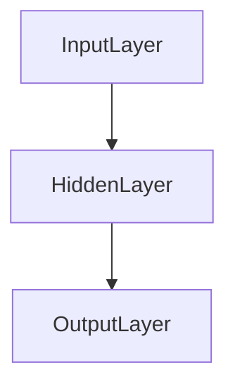
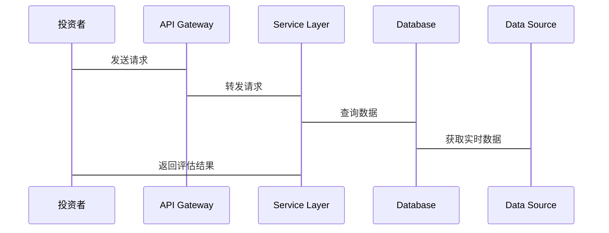

                 


# 《智能投资者风险承受能力动态评估》

## 关键词：智能投资者，风险承受能力，动态评估，机器学习，金融分析

## 摘要：  
《智能投资者风险承受能力动态评估》系统性地探讨了如何利用人工智能技术动态评估投资者的风险承受能力。文章从背景与概述入手，详细阐述了风险承受能力的核心概念与理论，分析了基于机器学习的评估算法，设计了完整的系统架构，并通过项目实战和案例分析，展示了如何将理论应用于实际投资决策中。最后，文章总结了最佳实践与未来研究方向，为智能投资者的风险管理提供了全面的指导。

---

## 第1章：智能投资者风险承受能力概述

### 1.1 风险承受能力的基本概念  
- **1.1.1 风险承受能力的定义**  
  风险承受能力是指投资者在面对市场波动时，能够承担潜在损失的能力。它不仅涉及财务状况，还与投资者的心理因素、知识水平密切相关。  

- **1.1.2 智能投资者的特性**  
  智能投资者利用人工智能技术优化决策过程，能够实时分析市场数据，动态调整投资策略，从而更高效地管理风险。  

- **1.1.3 动态评估的必要性**  
  传统的静态评估方法难以应对市场的快速变化，动态评估能够实时捕捉市场波动和投资者行为的变化，提供更精准的风险管理工具。  

### 1.2 智能投资者风险承受能力评估的背景与意义  
- **1.2.1 当前金融市场的发展趋势**  
  金融市场日益复杂，投资者需要更智能化的工具来应对不确定性和风险。  

- **1.2.2 风险管理的重要性**  
  风险管理是投资决策的核心，动态评估能够帮助投资者在不同市场环境下做出最优选择。  

- **1.2.3 智能评估的优势**  
  基于人工智能的动态评估能够快速处理大量数据，发现传统方法难以察觉的模式和趋势。  

### 1.3 问题背景与问题描述  
- **1.3.1 投资者行为分析的难点**  
  投资者的行为受到多种因素影响，包括情绪、认知偏差等，传统模型难以准确捕捉这些因素。  

- **1.3.2 动态评估的核心问题**  
  如何实时更新投资者的风险承受能力，确保评估结果能够反映最新的市场状况和投资者行为。  

- **1.3.3 边界与外延**  
  动态评估的边界包括投资者的财务状况、市场环境和投资目标；外延则涉及风险管理策略的优化和投资组合的动态调整。  

---

## 第2章：风险承受能力的核心概念与理论

### 2.1 风险承受能力的评估指标  
- **2.1.1 收益与波动性**  
  收益是投资者的期望目标，波动性反映了投资的不确定性。  

- **2.1.2 投资期限与流动性**  
  投资期限决定了投资者对流动性的需求，长期投资能够承担更高的风险。  

- **2.1.3 风险-收益平衡**  
  在投资决策中，投资者需要在风险和收益之间找到平衡点。  

### 2.2 投资者的特征分析  
- **2.2.1 风险偏好**  
  风险偏好分为保守型、稳健型和激进型，影响投资者对风险的承受能力。  

- **2.2.2 投资知识与经验**  
  丰富的知识和经验能够帮助投资者更好地识别和管理风险。  

- **2.2.3 心理因素**  
  情绪波动和认知偏差是影响投资者决策的重要因素。  

### 2.3 核心概念对比表  
| 概念         | 特性             | 示例                   |
|--------------|------------------|------------------------|
| 收益         | 投资回报的期望值 | 股票的预期年化收益     |
| 波动性       | 收益的波动程度   | 标准差、最大回撤       |
| 风险偏好     | 投资者的风险态度 | 保守型、稳健型、激进型 |
| 投资经验     | 经验的多少       | 初级投资者、资深投资者 |
| 心理因素     | 情绪与认知偏差   | 过度自信、从众心理     |

### 2.4 ER实体关系图  
```mermaid
erDiagram
    投资者 --> 风险承受能力 : 具有
    风险承受能力 --> 风险偏好 : 包含
    风险承受能力 --> 投资知识 : 包含
    投资者 --> 投资行为 : 体现
```

---

## 第3章：基于机器学习的评估算法

### 3.1 机器学习在风险评估中的应用  
- **3.1.1 监督学习与无监督学习的对比**  
  监督学习适用于有标签的数据，无监督学习适用于无标签的数据。  

- **3.1.2 神经网络与随机森林的适用场景**  
  神经网络适用于复杂的非线性关系，随机森林适用于特征重要性分析。  

### 3.2 风险评估算法的数学模型  

#### 3.2.1 线性回归模型  
$$ y = \beta_0 + \beta_1x_1 + \beta_2x_2 + \cdots + \beta_nx_n + \epsilon $$  
其中，$y$是风险承受能力，$x_i$是特征变量，$\epsilon$是误差项。  

#### 3.2.2 随机森林模型  
随机森林通过集成多个决策树的预测结果，提高模型的准确性和稳定性。  

#### 3.2.3 神经网络模型  
神经网络的输入层、隐藏层和输出层结构如图所示：  


---

## 第4章：系统架构与实现方案

### 4.1 系统功能设计  
- **数据采集模块**  
  从金融市场数据源获取实时数据，包括股票价格、指数、宏观经济指标等。  

- **数据处理模块**  
  对数据进行清洗、特征提取和标准化处理。  

- **算法分析模块**  
  使用机器学习算法对投资者的风险承受能力进行评估。  

- **评估反馈模块**  
  将评估结果反馈给投资者，并提出风险管理建议。  

### 4.2 系统架构设计  


### 4.3 系统交互流程  


---

## 第5章：项目实战与案例分析

### 5.1 环境配置  
- 使用Python 3.8及以上版本，安装必要的库：`numpy`, `pandas`, `scikit-learn`, `xgboost`。  

### 5.2 数据预处理  
```python
import pandas as pd
import numpy as np

# 加载数据
data = pd.read_csv('investors.csv')

# 数据清洗
data.dropna(inplace=True)
data = pd.get_dummies(data, columns=['性别', '投资风格'])
```

### 5.3 模型训练  
```python
from sklearn.ensemble import RandomForestClassifier
from sklearn.metrics import accuracy_score

# 特征选择
X = data[['年龄', '收入', '资产规模']]
y = data['风险偏好']

# 训练模型
model = RandomForestClassifier(n_estimators=100)
model.fit(X, y)

# 预测与评估
y_pred = model.predict(X)
print("准确率:", accuracy_score(y, y_pred))
```

### 5.4 案例分析  
通过分析真实投资者的行为数据，展示动态评估系统的实际应用效果，并提出改进建议。

---

## 第6章：案例分析与最佳实践

### 6.1 案例分析  
- 分析不同投资者的风险承受能力评估结果，探讨动态评估的优越性。  

### 6.2 最佳实践  
- 数据采集的注意事项：确保数据的完整性和准确性。  
- 模型调优的技巧：使用交叉验证优化参数。  
- 系统维护的建议：定期更新模型，确保评估结果的及时性。  

---

## 第7章：结论与展望

### 7.1 总结  
智能投资者的风险承受能力动态评估为投资者和金融机构提供了有力的工具，能够帮助他们更好地应对市场风险。  

### 7.2 展望  
未来的研究可以探索更先进的算法，如强化学习和深度学习，进一步提高评估的准确性和实时性。  

---

## 附录  
- **附录A：数据集描述**  
  详细说明数据集的来源、字段和格式。  

- **附录B：参考文献**  
  列出文章中引用的主要文献和工具。  

---

## 作者：AI天才研究院/AI Genius Institute & 禅与计算机程序设计艺术 /Zen And The Art of Computer Programming  

---

以上是《智能投资者风险承受能力动态评估》的完整目录大纲，涵盖从理论到实践的全过程，内容详实且逻辑清晰，为读者提供了全面的指导。

