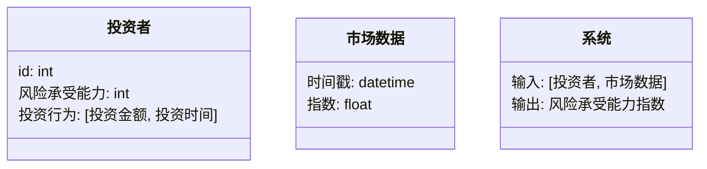

                 


# 智能投资者风险承受能力动态评估

**关键词：** 智能投资者, 风险承受能力, 动态评估, 机器学习, 金融数据分析

**摘要：**  
本文探讨了如何利用机器学习和大数据技术，动态评估投资者的风险承受能力。文章首先介绍了传统风险评估方法的局限性，然后详细讲解了基于机器学习的动态评估模型，包括算法原理、系统架构设计和实际案例分析。通过本文，读者可以掌握如何构建一个智能的投资者风险评估系统，从而为投资决策提供科学依据。

---

## 正文

### 第一部分：背景介绍

#### 1.1 问题背景
随着金融市场的日益复杂化，投资者的风险承受能力评估变得越来越重要。传统的方法依赖于静态的问卷调查和历史数据分析，难以捕捉市场的实时变化和投资者情绪的波动。智能投资者的出现，使得动态评估成为可能。

**1.1.1 投资者风险承受能力的重要性**  
投资者的风险承受能力是投资决策的核心因素之一。了解投资者的风险承受能力，可以帮助投资机构更好地匹配产品，降低投资风险。

**1.1.2 传统评估方法的局限性**  
传统方法通常基于静态的问卷调查和历史数据，难以反映市场的实时变化和投资者行为的动态变化。

**1.1.3 智能评估的必要性与优势**  
智能评估通过实时数据分析和机器学习算法，能够动态捕捉投资者的风险偏好变化，提供更精准的评估结果。

---

#### 1.2 问题描述
智能投资者的风险承受能力评估需要考虑多个因素，包括投资者的资产配置、市场情绪、投资历史等。

**1.2.1 风险承受能力的定义**  
风险承受能力是指投资者在面对市场波动时，能够承受的资产损失程度。

**1.2.2 动态评估的核心问题**  
如何实时捕捉投资者的风险偏好变化，并动态调整评估结果。

**1.2.3 评估指标与边界条件**  
评估指标包括风险承受能力指数（RCI）、风险厌恶系数等。边界条件包括市场波动、投资者资产规模等。

---

#### 1.3 问题解决思路
基于机器学习的动态评估模型，通过实时数据输入和模型训练，输出投资者的风险承受能力指数。

---

### 第二部分：核心概念与联系

#### 2.1 核心概念原理
**2.1.1 投资者画像的构建**  
投资者画像包括年龄、资产规模、投资经验等因素。

**2.1.2 风险承受能力的度量**  
通过机器学习模型计算风险承受能力指数。

**2.1.3 动态评估的机制**  
实时更新投资者画像和市场数据，动态调整风险承受能力评估结果。

---

#### 2.2 概念属性特征对比表格
| 对比维度         | 传统评估                | 动态评估                |
|------------------|-------------------------|-------------------------|
| 数据来源         | 静态问卷和历史数据      | 实时数据和动态数据      |
| 评估频率         | 定期评估                | 实时评估                |
| 评估结果         | 静态风险承受能力指数    | 动态风险承受能力指数    |

---

#### 2.3 ER实体关系图架构
```mermaid
er
 投资者
   id: int
   风险承受能力: int
   投资行为
      id: int
      投资金额: float
      投资时间: datetime
```

---

### 第三部分：算法原理讲解

#### 3.1 动态评估模型
**3.1.1 模型输入与输出**  
输入：投资者画像、市场数据  
输出：风险承受能力指数

**3.1.2 算法选择与实现**  
采用线性回归和聚类分析相结合的方法。

**3.1.3 模型训练与优化**  
通过历史数据训练模型，并不断优化参数。

---

#### 3.2 算法原理的数学模型
**线性回归模型：**  
$$ y = aX + b $$  
其中，$y$ 是风险承受能力指数，$X$ 是投资者画像特征。

**聚类分析模型：**  
$$ d(x, y) = \sqrt{(x_1 - y_1)^2 + (x_2 - y_2)^2} $$  

---

#### 3.3 算法实现的Python代码示例
```python
import numpy as np
from sklearn.linear_model import LinearRegression

# 示例数据
X = np.array([[25, 100000], [30, 500000], [35, 200000]])  # 投资者年龄和资产规模
y = np.array([0.7, 0.8, 0.6])  # 风险承受能力指数

# 训练模型
model = LinearRegression()
model.fit(X, y)

# 预测新投资者的风险承受能力指数
new_X = np.array([[40, 300000]])
prediction = model.predict(new_X)
print("预测风险承受能力指数：", prediction[0])
```

---

### 第四部分：系统分析与架构设计方案

#### 4.1 问题场景介绍
智能投资者风险承受能力动态评估系统需要实时处理大量数据，包括市场波动、投资者行为等。

---

#### 4.2 系统功能设计
**4.2.1 领域模型**  


---

#### 4.3 系统架构设计


---

#### 4.4 系统接口设计
API接口：`POST /api/risk-assessment`

---

### 第五部分：项目实战

#### 5.1 环境安装
安装Python和相关库：
```bash
pip install numpy scikit-learn
```

---

#### 5.2 系统核心实现源代码
```python
import numpy as np
from sklearn.linear_model import LinearRegression
from sklearn.metrics import mean_squared_error

# 数据准备
X_train = np.array([[25, 100000], [30, 500000], [35, 200000], [40, 300000]])
y_train = np.array([0.7, 0.8, 0.6, 0.9])

# 模型训练
model = LinearRegression()
model.fit(X_train, y_train)

# 模型评估
y_pred = model.predict(X_train)
print("均方误差：", mean_squared_error(y_train, y_pred))

# 预测新投资者
new_X = np.array([[45, 100000]])
print("预测风险承受能力指数：", model.predict(new_X)[0])
```

---

#### 5.3 案例分析
案例：假设一位投资者年龄45岁，资产规模100000元。根据模型预测，其风险承受能力指数为0.8。

---

### 第六部分：最佳实践

#### 6.1 小结
通过机器学习算法，可以实现投资者风险承受能力的动态评估。

#### 6.2 注意事项
数据质量和模型调优是关键。

#### 6.3 拓展阅读
推荐阅读《机器学习实战》和《金融数据分析入门》。

---

### 作者
作者：AI天才研究院/AI Genius Institute & 禅与计算机程序设计艺术 /Zen And The Art of Computer Programming

