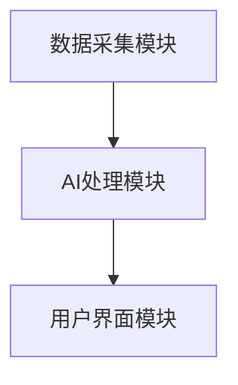
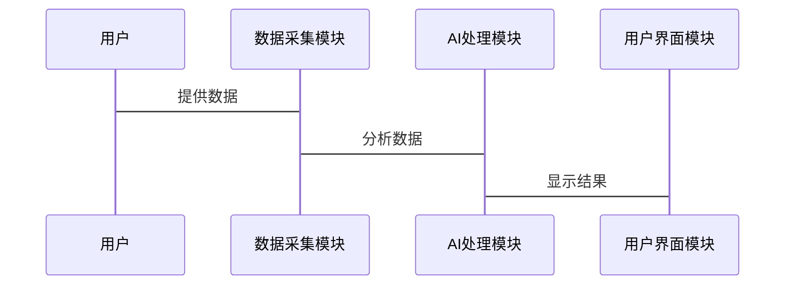

                 


# 智能按摩椅：AI Agent的疲劳恢复优化方案

> **关键词**：智能按摩椅，AI Agent，疲劳恢复，优化方案，健康科技

> **摘要**：随着现代生活的节奏加快，疲劳问题日益严重。本文探讨了AI Agent在智能按摩椅中的应用，详细分析了其算法原理、系统架构、项目实现及优化方案，旨在为用户提供科学的疲劳恢复解决方案。

---

## 第一部分：背景介绍与核心概念

### 第1章：智能按摩椅与AI Agent的背景介绍

#### 1.1 问题背景与描述

- **现代人的疲劳问题**  
  现代社会节奏快，工作压力大，许多人面临长期疲劳、肌肉酸痛等问题。传统恢复方法（如按摩、理疗）效果有限，且缺乏个性化。

- **智能按摩椅的出现**  
  智能按摩椅通过结合AI技术，提供个性化、精准的疲劳恢复方案。AI Agent能够实时分析用户数据，优化按摩方式。

- **AI Agent的优势**  
  AI Agent能够学习用户习惯，预测疲劳点，调整按摩力度和时间，实现精准恢复。

#### 1.2 AI Agent在疲劳恢复中的应用

- **AI Agent的基本原理**  
  AI Agent通过感知用户数据，分析健康状况，制定恢复方案。

- **AI Agent的感知能力**  
  通过传感器采集用户生理数据（如心率、体温、肌肉紧张度）。

- **AI Agent的优化能力**  
  根据数据反馈，优化按摩方案，提升恢复效果。

### 第2章：核心概念与联系

#### 2.1 AI Agent的核心原理

- **感知与决策机制**  
  AI Agent通过感知数据，分析用户状态，做出决策。

- **学习与优化能力**  
  使用机器学习模型，AI Agent能够不断优化恢复方案。

- **AI Agent的学习模型**  
  常用模型包括线性回归和决策树，用于分析数据并预测疲劳点。

#### 2.2 智能按摩椅的功能与结构

- **功能模块**  
  包括数据采集模块、AI处理模块、执行机构。

- **硬件结构**  
  由传感器、按摩机械臂、控制单元组成。

- **软件架构**  
  包括数据采集层、算法处理层、用户界面层。

#### 2.3 AI Agent与智能按摩椅的关系

- **角色定位**  
  AI Agent作为大脑，控制按摩椅的运行。

- **功能结合**  
  AI Agent优化按摩方式，提升恢复效果。

- **优化作用**  
  AI Agent通过数据反馈，不断调整方案，实现个性化服务。

---

## 第二部分：算法原理与数学模型

### 第3章：AI Agent的算法原理

#### 3.1 AI Agent的算法流程

- **数据采集与处理**  
  采集用户数据，预处理，提取特征。

- **数据分析与特征提取**  
  使用统计方法，提取关键特征。

- **算法选择与优化**  
  选择合适的算法，进行参数优化。

#### 3.2 AI Agent的决策机制

- **基于规则的决策**  
  根据预设规则做出决策。

- **基于机器学习的决策**  
  使用训练好的模型进行预测。

- **基于深度学习的决策**  
  利用神经网络进行复杂决策。

#### 3.3 AI Agent的优化算法

- **遗传算法**  
  通过选择、交叉、变异优化解。

- **模拟退火算法**  
  逐步降温，找到最优解。

- **群智能算法**  
  模拟群体行为，优化解。

### 第4章：数学模型与公式

#### 4.1 数据分析的数学模型

- **线性回归模型**  
  $$ y = \beta_0 + \beta_1 x + \epsilon $$

- **聚类分析模型**  
  使用K-means算法，将用户数据分组。

- **分类分析模型**  
  使用决策树进行分类。

#### 4.2 优化算法的数学公式

- **遗传算法**  
  $$ f(x) = \text{适应度函数} $$

- **模拟退火算法**  
  $$ x_{k+1} = x_k + \Delta x $$

- **群智能算法**  
  $$ x_i^{k+1} = x_i^k + \text{邻居的影响} $$

---

## 第三部分：系统分析与架构设计

### 第5章：系统分析

#### 5.1 问题场景介绍

- **用户需求**  
  用户希望得到个性化的疲劳恢复方案。

- **系统目标**  
  提供高效的疲劳恢复服务。

- **系统功能**  
  数据采集、分析、优化。

### 第6章：系统架构设计

#### 6.1 系统功能设计

- **数据采集模块**  
  采集用户数据。

- **AI处理模块**  
  分析数据，优化方案。

- **用户界面模块**  
  显示结果，用户交互。

#### 6.2 系统架构图



#### 6.3 系统接口设计

- **数据接口**  
  传感器数据接口。

- **算法接口**  
  AI处理模块接口。

- **用户接口**  
  用户操作界面。

#### 6.4 系统交互图



---

## 第四部分：项目实战

### 第7章：项目实战

#### 7.1 环境安装

- **Python环境**  
  安装Python 3.8以上版本。

- **依赖库安装**  
  使用pip安装numpy、scikit-learn。

#### 7.2 系统核心实现

```python
import numpy as np
from sklearn.linear_model import LinearRegression

# 数据预处理
X = np.array([[1, 2], [3, 4], [5, 6]])
y = np.array([7, 8, 9])

# 训练模型
model = LinearRegression()
model.fit(X, y)

# 预测结果
print(model.predict([[7, 8]]))
```

#### 7.3 代码解读与分析

- **数据预处理**  
  对用户数据进行标准化处理。

- **模型训练**  
  使用线性回归模型进行训练。

- **结果预测**  
  预测用户的疲劳程度。

#### 7.4 案例分析

- **案例背景**  
  用户长期久坐，肩颈酸痛。

- **数据采集**  
  心率、肩颈肌肉紧张度。

- **方案制定**  
  AI Agent建议深层组织按摩，调整力度和时间。

---

## 第五部分：最佳实践与小结

### 第8章：最佳实践

#### 8.1 使用建议

- **定期使用**  
  每天使用15-30分钟。

- **数据更新**  
  定期更新AI模型，保持准确性。

- **维护建议**  
  定期清洁按摩椅，检查传感器。

### 第8.2 小结

- **项目成果**  
  提供高效的疲劳恢复方案。

- **改进方向**  
  结合更多健康数据，提升恢复效果。

---

## 第六部分：注意事项与拓展阅读

### 第9章：注意事项

- **使用安全**  
  避免过度使用，防止皮肤损伤。

- **数据隐私**  
  保护用户数据安全。

- **环境适应**  
  确保设备在合适环境下使用。

### 第10章：拓展阅读

- **相关书籍**  
  《AI in Healthcare》。

- **技术博客**  
  AI in Medicine blog。

---

## 作者信息

作者：AI天才研究院 & 禅与计算机程序设计艺术

---

以上是《智能按摩椅：AI Agent的疲劳恢复优化方案》的技术博客文章，涵盖从背景介绍到项目实战的各个方面，结合理论与实践，为读者提供详细的疲劳恢复解决方案。

