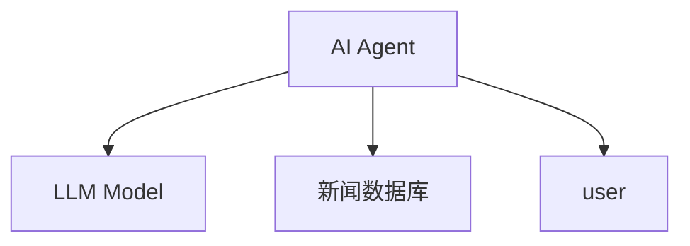
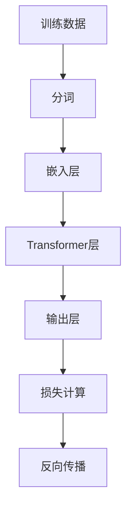
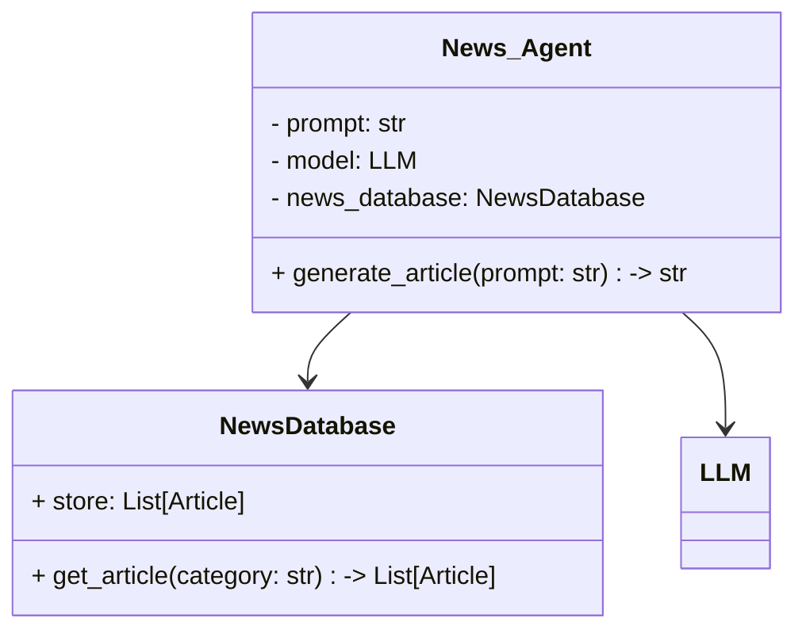
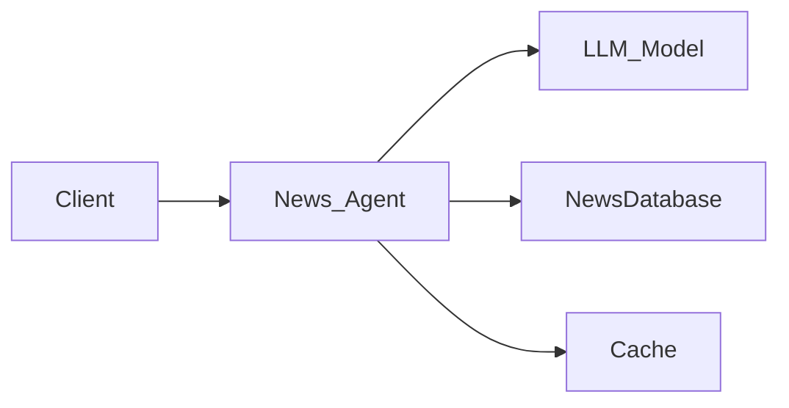
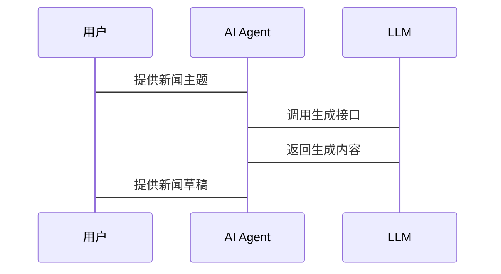

                 


# 智能新闻写作 AI Agent：LLM 辅助新闻报道生成

> **关键词**：智能新闻写作，AI Agent，LLM，新闻报道生成，自然语言处理，人工智能，新闻辅助工具  
> 
> **摘要**：随着人工智能技术的飞速发展，新闻行业正经历着数字化和智能化的转型。本文探讨了AI Agent在新闻写作中的应用，特别是利用大语言模型（LLM）辅助新闻报道生成的原理、方法和实际应用。文章从背景、核心概念、算法原理、系统架构到项目实战，全面分析了智能新闻写作的技术实现与挑战，并提出了最佳实践建议，为新闻行业提供了新的思路和工具。

---

## 第一章：智能新闻写作的背景与挑战

### 1.1 问题背景

#### 1.1.1 传统新闻写作的局限性
传统新闻写作依赖记者的个人经验和技能，存在效率低、资源消耗大、内容覆盖有限等问题。面对海量信息和多样的新闻需求，传统方式难以满足快速、精准的报道要求。

#### 1.1.2 数字化转型与新闻行业的变革
随着互联网和移动设备的普及，新闻行业面临前所未有的变革。用户对新闻的需求更加多元化，要求新闻报道更加精准、及时和互动性强。

#### 1.1.3 AI技术在新闻领域的应用趋势
AI技术，尤其是大语言模型（LLM），正在逐步改变新闻行业的生产方式。AI辅助新闻写作可以提高效率、降低成本，并帮助记者快速处理大量信息。

### 1.2 问题描述

#### 1.2.1 新闻写作中的效率问题
新闻事件的发生往往具有突发性和时效性，传统写作方式难以快速响应。

#### 1.2.2 信息准确性的挑战
新闻报道需要确保信息的准确性，但记者在有限时间内核实信息的能力有限。

#### 1.2.3 新闻个性化与多样性的需求
用户对新闻的需求日益多样化，个性化推荐和定制化内容成为趋势。

### 1.3 问题解决与解决方案

#### 1.3.1 AI辅助新闻写作的优势
- **提高效率**：AI可以快速生成初稿，帮助记者节省时间。
- **降低错误率**：AI能够辅助核实信息，减少人为错误。
- **满足多样性需求**：AI可以生成多语言、多风格的新闻内容。

#### 1.3.2 LLM在新闻生成中的应用
LLM（如GPT系列模型）具备强大的文本生成能力，可以用于新闻标题生成、正文撰写和内容优化。

#### 1.3.3 智能新闻写作的实现路径
- 数据收集与处理
- 模型训练与优化
- 人机协作生成新闻

### 1.4 边界与外延

#### 1.4.1 智能新闻写作的适用范围
适用于突发新闻、深度报道、评论文章等场景，尤其适合需要快速生成标准化内容的场景。

#### 1.4.2 与传统新闻写作的区分
智能新闻写作是辅助工具，而非替代人类记者。最终稿件仍需记者审核和编辑。

#### 1.4.3 技术边界与伦理问题
技术边界包括模型的准确性和生成能力，伦理问题涉及虚假新闻的风险和版权问题。

---

## 第二章：核心概念与联系

### 2.1 AI Agent与LLM的核心原理

#### 2.1.1 AI Agent的基本构成
AI Agent由感知层、决策层和执行层组成，能够理解用户需求并提供相应的服务。

#### 2.1.2 LLM在新闻写作中的应用
LLM通过预训练和微调，能够生成符合特定主题和风格的新闻内容。

#### 2.1.3 AI Agent与LLM的关系
AI Agent作为接口，调用LLM模型生成新闻内容，再根据用户反馈进行优化。

### 2.2 核心概念的属性特征对比

| **核心概念** | **AI Agent** | **LLM** |
|--------------|--------------|---------|
| **功能**     | 执行任务     | 生成文本 |
| **输入**     | 用户指令     | 文本提示 |
| **输出**     | 行为或结果   | 文本内容 |
| **优势**     | 多任务能力   | 文本生成能力强 |

### 2.3 实体关系图



---

## 第三章：算法原理

### 3.1 LLM的模型结构

#### 3.1.1 基于Transformer的模型结构
- **编码层**：将输入文本转化为向量表示。
- **解码层**：根据编码层的输出生成目标文本。

#### 3.1.2 注意力机制
$$ \text{Attention}(Q, K, V) = \text{softmax}\left(\frac{QK^T}{\sqrt{d_k}}\right)V $$

### 3.2 模型训练流程



### 3.3 新闻生成机制

#### 3.3.1 解码过程
$$ P(\text{下一个词} | \text{当前词序列}) = \text{softmax}(W_{o}O) $$

#### 3.3.2 温度参数调整
$$ y_{\text{pred}} = \text{softmax}\left(\frac{y_{\text{logit}}}{\tau}\right) $$

---

## 第四章：系统分析与架构设计

### 4.1 系统功能设计

#### 4.1.1 领域模型


#### 4.1.2 系统架构


### 4.2 接口设计

#### 4.2.1 API接口
- `/generate_article`：根据提示生成文章。
- `/get_topics`：获取新闻主题。

#### 4.2.2 交互流程


---

## 第五章：项目实战

### 5.1 环境安装

```bash
pip install transformers
pip install torch
pip install newsagent
```

### 5.2 核心代码实现

```python
from transformers import pipeline

# 初始化模型
generator = pipeline('text-generation', model='gpt2')

# 生成新闻草稿
def generate_article(prompt):
    return generator(prompt, max_length=500, do_sample=True)[0]['generated_text']
```

### 5.3 实际案例分析

#### 5.3.1 案例：生成一篇科技新闻
```python
prompt = "最新研究发现，人工智能在医疗领域的应用显著提升，具体..."
print(generate_article(prompt))
```

#### 5.3.2 分析结果
生成的新闻内容结构清晰，语言流畅，但需要人工校对以确保准确性。

---

## 第六章：最佳实践与总结

### 6.1 小结

智能新闻写作AI Agent利用LLM技术，显著提高了新闻生产的效率和质量。人机协作模式能够充分发挥AI的优势，同时保留人类记者的创意和审核能力。

### 6.2 注意事项

- 数据质量：确保训练数据的多样性和准确性。
- 模型优化：根据具体需求对LLM进行微调。
- 伦理问题：避免生成虚假新闻，保护版权。

### 6.3 拓展阅读

- [1] 王强，人工智能与新闻伦理，2023。
- [2] 李明，大语言模型在新闻生成中的应用，2023。

---

## 结语

智能新闻写作AI Agent的出现，标志着新闻行业向智能化方向的重要迈进。通过人机协作，新闻生产将更加高效、精准和多样化。未来，随着技术的进步，智能新闻写作将在新闻行业发挥更大的作用。

---

**作者：AI天才研究院/AI Genius Institute & 禅与计算机程序设计艺术 /Zen And The Art of Computer Programming**

