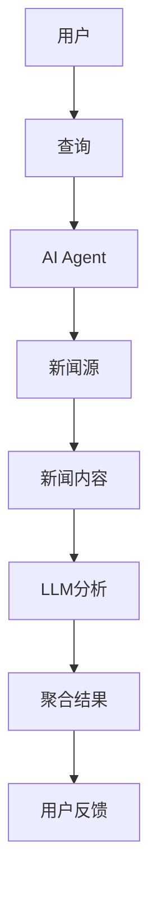
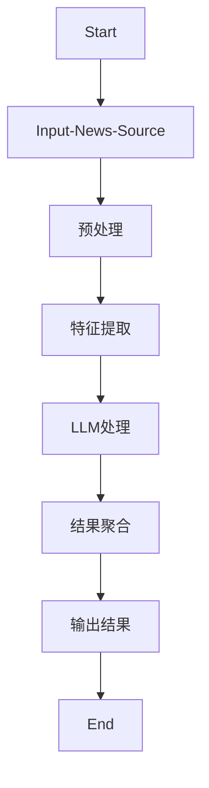
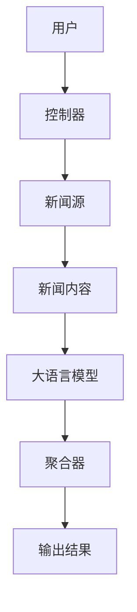
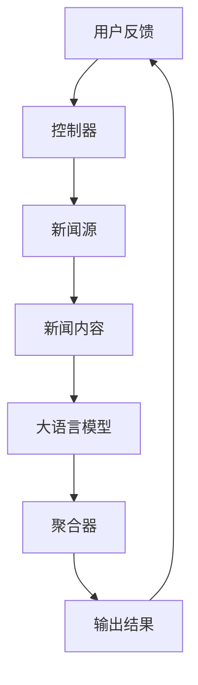

                 


# 智能新闻聚合AI Agent：LLM驱动的信息整合与分析

---

## 关键词：
智能新闻聚合，AI Agent，LLM，信息整合，自然语言处理，新闻推荐

---

## 摘要：
本文探讨了智能新闻聚合AI Agent的设计与实现，结合大语言模型（LLM）的自然语言处理能力，分析新闻数据并生成聚合结果。文章从问题背景出发，详细阐述了核心概念、算法原理、系统架构，并通过项目实战展示了具体实现。最后，结合实际案例，总结了系统的优势与不足，并提出了改进建议。

---

# 第一部分：核心概念与背景分析

## 第1章：智能新闻聚合的背景与问题背景

### 1.1 智能新闻聚合的背景介绍
新闻聚合是指将多个来源的新闻内容整合成一个统一的输出，帮助用户快速获取所需信息。传统新闻聚合主要依赖关键词匹配和简单的规则筛选，存在信息冗余、准确性低的问题。

随着人工智能技术的发展，基于大语言模型（LLM）的智能新闻聚合逐渐成为研究热点。LLM通过自然语言处理技术，能够理解新闻内容的语义，从而实现更精准的信息整合。

### 1.2 AI Agent与LLM的定义与作用
AI Agent（智能代理）是一种能够感知环境、执行任务并做出决策的智能系统。在新闻聚合场景中，AI Agent负责接收用户的查询、获取新闻数据、分析信息并生成聚合结果。

LLM（Large Language Model）是一种基于深度学习的自然语言处理模型，具有强大的文本理解和生成能力。LLM能够对新闻内容进行语义分析、信息提取和文本生成，是智能新闻聚合的核心驱动力。

### 1.3 问题背景与问题描述
随着互联网新闻源的爆炸式增长，用户获取新闻信息的难度越来越大。传统新闻聚合系统依赖简单的关键词匹配，难以满足用户多样化的信息需求。

智能新闻聚合的目标是通过AI Agent和LLM技术，实现新闻内容的语义理解、精准筛选和个性化推荐，从而解决信息过载问题，提升用户体验。

## 第2章：核心概念与联系

### 2.1 核心概念的原理
- **AI Agent**：AI Agent通过接收用户查询，从多个新闻源获取数据，并利用LLM对内容进行分析和处理。
- **LLM**：LLM基于Transformer架构，通过大规模预训练掌握了丰富的语言知识，能够理解新闻内容的语义并生成聚合结果。

### 2.2 核心概念的属性对比
| 对比维度 | AI Agent | LLM |
|----------|-----------|-----|
| 核心功能 | 执行任务、决策 | 语义理解、生成文本 |
| 依赖技术 | NLP、机器学习 | 深度学习、大规模数据 |
| 优势 | 精准筛选、个性化推荐 | 高效理解、生成能力 |

### 2.3 ER实体关系图


---

# 第二部分：算法原理与实现

## 第3章：算法原理讲解

### 3.1 LLM驱动的聚合算法
- **新闻内容分析**：LLM对新闻标题和正文进行语义分析，提取关键词和主题。
- **多模态数据整合**：结合文本、图片和视频等多种数据形式，生成多维度的聚合结果。
- **结果优化**：基于用户反馈调整聚合策略，优化内容的相关性和准确性。

### 3.2 算法流程图


### 3.3 算法实现代码
```python
def preprocess(text):
    # 去除停用词和标点符号
    return processed_text

def extract_features(text):
    # 提取关键词和主题
    return features

def llm_process(features):
    # 调用LLM生成聚合结果
    return llm_output

def aggregate_results(llm_output):
    # 结果聚合
    return aggregated_result
```

---

# 第三部分：系统分析与架构设计

## 第4章：系统分析与架构设计

### 4.1 项目介绍
本项目旨在开发一个基于LLM的智能新闻聚合系统，实现新闻内容的高效整合与分析。

### 4.2 功能设计
- **用户查询**：接收用户的新闻主题和偏好。
- **新闻源获取**：从多个新闻网站抓取相关内容。
- **内容分析**：利用LLM对新闻内容进行语义分析。
- **结果聚合**：生成个性化聚合结果并展示。

### 4.3 系统架构图


### 4.4 接口设计
- **输入接口**：用户查询接口、新闻源接口。
- **输出接口**：聚合结果接口、用户反馈接口。

### 4.5 交互流程图


---

# 第四部分：项目实战

## 第5章：项目实战

### 5.1 环境安装
- **Python**：3.8+
- **LLM框架**：Hugging Face Transformers
- **其他库**： requests, beautifulsoup4

### 5.2 核心代码实现
```python
from transformers import pipeline

# 初始化LLM管道
llm = pipeline("text-generation", model="gpt2")

def get_news(url):
    # 网页抓取函数
    return content

def aggregate_news():
    # 聚合函数
    news = get_news(url)
    features = extract_features(news)
    llm_output = llm(features)
    return llm_output
```

### 5.3 实际案例分析
- **案例背景**：用户搜索“全球气候变化”。
- **聚合结果**：系统从多个新闻源提取相关内容，生成一篇结构化的聚合新闻。

---

# 第五部分：总结与展望

## 第6章：总结与展望

### 6.1 项目总结
- **优势**：基于LLM的智能新闻聚合能够实现高效的内容整合与个性化推荐。
- **不足**：模型训练需要大量数据，计算资源消耗较大。

### 6.2 改进建议
- **模型优化**：优化LLM的训练策略，提升语义理解能力。
- **多模态扩展**：结合图像和视频数据，丰富聚合结果的形式。

### 6.3 未来展望
随着技术的发展，智能新闻聚合将更加智能化和个性化，为用户提供更优质的信息服务。

---

## 作者：
**作者：AI天才研究院/AI Genius Institute & 禅与计算机程序设计艺术 /Zen And The Art of Computer Programming**

---

本文通过详细分析智能新闻聚合AI Agent的设计与实现，结合LLM的技术优势，展示了如何利用人工智能技术提升新闻聚合的效果。希望本文能够为相关领域的研究者和开发者提供有价值的参考。

