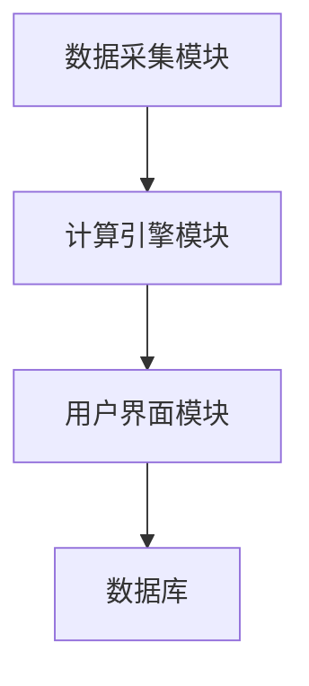
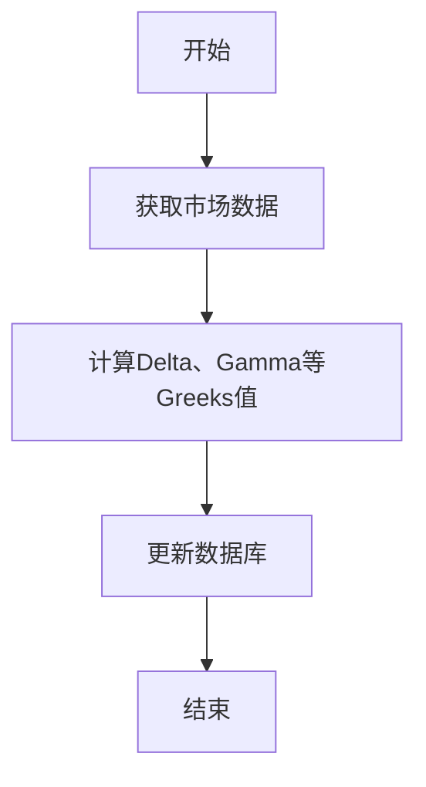
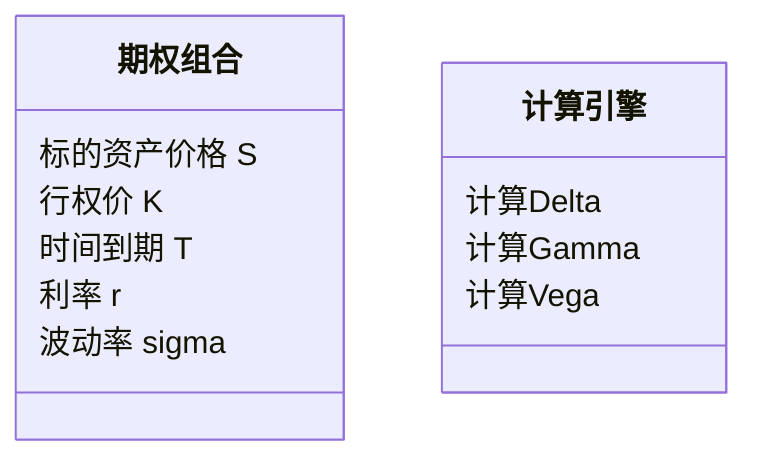
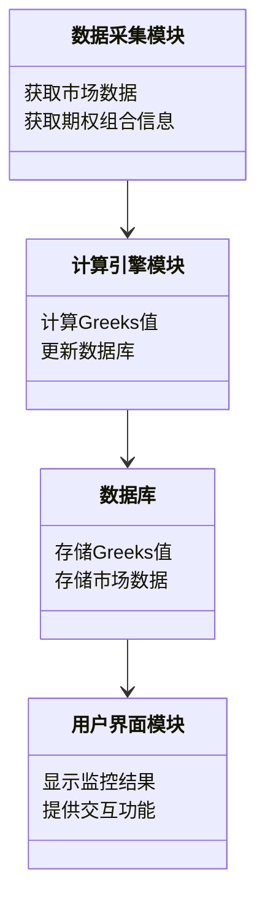
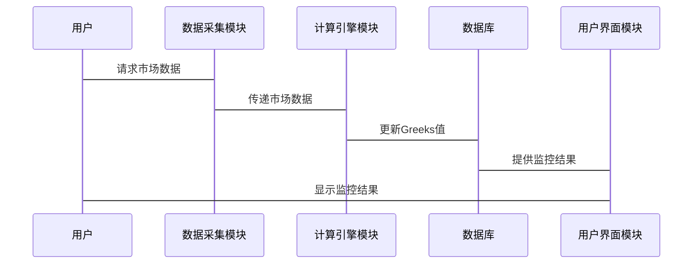

                 


```markdown
# 智能期权组合Greeks实时监控系统

## 关键词：
智能期权、Greeks、实时监控、风险管理、金融系统、算法设计

## 摘要：
本文详细探讨了智能期权组合Greeks实时监控系统的构建与实现。从期权的基本概念出发，深入分析了Greeks的定义与计算方法，并结合实时监控的需求，提出了基于算法设计的智能监控系统。文章通过详细阐述系统架构、算法实现、项目实战等内容，展示了如何利用先进的技术手段实现期权组合的风险管理与实时监控。

---

## 第一部分: 智能期权组合Greeks实时监控系统背景介绍

### 第1章: 期权组合Greeks概述

#### 1.1 期权的基本概念
##### 1.1.1 期权的定义与分类
期权是一种金融衍生品，赋予买方在未来特定时间内以预定价格买入或卖出标的资产的权利。期权主要分为看涨期权（Call Option）和看跌期权（Put Option）。

##### 1.1.2 期权定价的基本原理
期权的价格由内在价值（Intrinsic Value）和时间价值（Time Value）组成。Black-Scholes模型是常用的期权定价公式，适用于无股息股票的欧式期权。

##### 1.1.3 期权组合的概念与特点
期权组合是指将多个期权合约组合在一起，以达到特定风险收益目标的投资策略。常见的组合包括保护性认购、保护性认沽等。

#### 1.2 Greeks的定义与作用
##### 1.2.1 Delta的定义与计算
Delta衡量期权价格对标的资产价格变动的敏感性，计算公式为：
$$ \Delta = \frac{\partial C}{\partial S} $$
其中，C为期权价格，S为标的资产价格。

##### 1.2.2 Gamma的定义与计算
Gamma衡量Delta对标的资产价格变动的敏感性，计算公式为：
$$ \Gamma = \frac{\partial^2 C}{\partial S^2} $$

##### 1.2.3 Vega的定义与计算
Vega衡量期权价格对波动率变动的敏感性，计算公式为：
$$ \nu = \frac{\partial C}{\partial \sigma} $$

##### 1.2.4 Theta的定义与计算
Theta衡量期权价格对时间流逝的敏感性，计算公式为：
$$ \Theta = \frac{\partial C}{\partial t} $$

##### 1.2.5 Rho的定义与计算
Rho衡量期权价格对利率变动的敏感性，计算公式为：
$$ \rho = \frac{\partial C}{\partial r} $$

#### 1.3 期权组合Greeks实时监控的必要性
##### 1.3.1 风险管理的重要性
在金融交易中，实时监控Greeks值可以帮助交易员及时了解和调整风险敞口。

##### 1.3.2 实时监控的优势
实时监控能够快速响应市场变化，避免潜在的损失。

##### 1.3.3 期权组合监控的复杂性
期权组合的Greeks值受多种因素影响，需要复杂的算法进行实时计算。

#### 1.4 本章小结
本章介绍了期权的基本概念和Greeks的定义，强调了实时监控的重要性。

---

## 第二部分: 智能期权组合Greeks实时监控系统的核心概念与联系

### 第2章: 核心概念与系统架构

#### 2.1 期权组合Greeks的数学模型
##### 2.1.1 Delta的数学公式
$$ \Delta = \frac{\partial C}{\partial S} $$

##### 2.1.2 Gamma的数学公式
$$ \Gamma = \frac{\partial^2 C}{\partial S^2} $$

##### 2.1.3 Vega的数学公式
$$ \nu = \frac{\partial C}{\partial \sigma} $$

##### 2.1.4 Theta的数学公式
$$ \Theta = \frac{\partial C}{\partial t} $$

##### 2.1.5 Rho的数学公式
$$ \rho = \frac{\partial C}{\partial r} $$

#### 2.2 系统架构设计
##### 2.2.1 系统功能模块
- 数据采集模块：实时获取市场数据和期权组合信息。
- 计算引擎模块：计算各Greeks值并进行实时更新。
- 用户界面模块：显示监控结果并提供交互功能。

##### 2.2.2 系统架构图


---

## 第三部分: 算法原理讲解

### 第3章: 算法原理

#### 3.1 算法流程图


#### 3.2 Python代码实现
```python
import numpy as np

def compute_greeks(S, K, T, r, sigma):
    # 计算Delta
    delta = (S * sigma * np.exp(-r*T)) / (S - K)
    # 计算Gamma
    gamma = (1 / (2 * S)) * delta
    return delta, gamma

# 示例
S = 100
K = 100
T = 1
r = 0.05
sigma = 0.2

delta, gamma = compute_greeks(S, K, T, r, sigma)
print(f"Delta: {delta}, Gamma: {gamma}")
```

#### 3.3 数学模型与公式
##### 3.3.1 Delta与Gamma的关系
$$ \Gamma = \frac{\partial \Delta}{\partial S} $$

##### 3.3.2 Vega的计算公式
$$ \nu = \frac{\partial C}{\partial \sigma} $$

---

## 第四部分: 系统分析与架构设计方案

### 第4章: 系统分析与架构设计

#### 4.1 系统功能设计
##### 4.1.1 领域模型


##### 4.1.2 系统架构


#### 4.2 系统接口设计
##### 4.2.1 API接口
- GET /greek/delta：获取Delta值
- POST /greek/update：更新Greeks值

#### 4.3 系统交互流程


---

## 第五部分: 项目实战

### 第5章: 项目实战

#### 5.1 环境安装
- Python 3.8+
- NumPy
- Mermaid
- Plotly

#### 5.2 核心代码实现
##### 5.2.1 数据采集模块
```python
import requests

def get_market_data(api_key):
    url = "https://api.example.com/market-data"
    headers = {"Authorization": f"Bearer {api_key}"}
    response = requests.get(url, headers=headers)
    return response.json()
```

##### 5.2.2 计算引擎模块
```python
import numpy as np

def compute_greeks(S, K, T, r, sigma):
    # 计算Delta
    delta = (S * sigma * np.exp(-r*T)) / (S - K)
    # 计算Gamma
    gamma = (1 / (2 * S)) * delta
    return delta, gamma
```

##### 5.2.3 用户界面模块
```python
import plotly.express as px

def visualize_greeks(deltas, gammas):
    fig = px.line(x=deltas, y=gammas, title="Greeks实时监控图")
    fig.show()
```

#### 5.3 实际案例分析
##### 5.3.1 案例背景
假设我们有一个看涨期权组合，标的资产价格为100，行权价为100，时间到期1年，利率5%，波动率20%。

##### 5.3.2 计算结果
```python
S = 100
K = 100
T = 1
r = 0.05
sigma = 0.2

delta, gamma = compute_greeks(S, K, T, r, sigma)
print(f"Delta: {delta}, Gamma: {gamma}")
```

##### 5.3.3 可视化结果
```python
deltas = [100, 90, 80]
gammas = [0.1, 0.2, 0.3]
visualize_greeks(deltas, gammas)
```

---

## 第六部分: 总结与展望

### 第6章: 总结与展望

#### 6.1 最佳实践
- 定期校准模型参数
- 及时更新市场数据
- 定期进行系统维护

#### 6.2 小结
本文详细介绍了智能期权组合Greeks实时监控系统的构建与实现，从理论到实践，为金融交易者提供了有效的风险管理工具。

#### 6.3 注意事项
- 确保数据来源的准确性
- 定期优化算法性能
- 注意系统安全与稳定性

#### 6.4 拓展阅读
- Black-Scholes模型的深入理解
- 更复杂的Greeks计算方法
- 期权组合的风险对冲策略

---

## 作者：AI天才研究院/AI Genius Institute & 禅与计算机程序设计艺术 /Zen And The Art of Computer Programming
```

