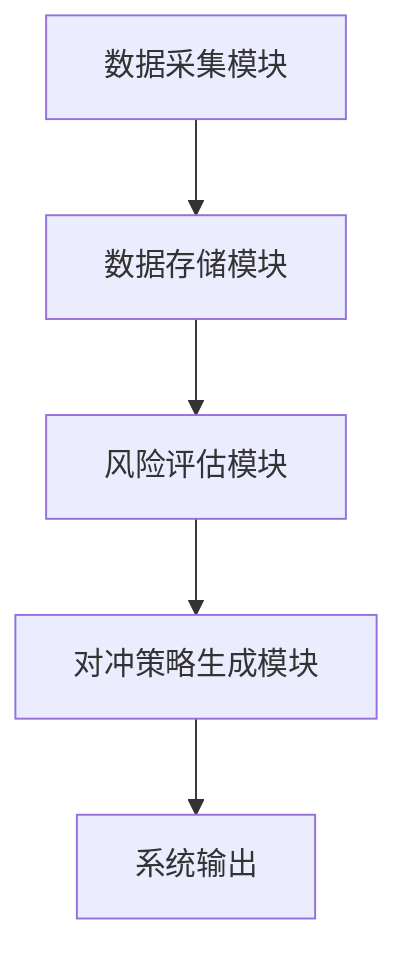

                 


# 智能期权组合风险敞口管理与对冲系统

> 关键词：智能期权，风险敞口管理，对冲系统，蒙特卡洛模拟，随机优化，机器学习

> 摘要：本文详细介绍了智能期权组合风险敞口管理与对冲系统的构建与实现。从期权的基本概念和风险敞口的量化方法入手，结合数学模型和算法原理，阐述了基于机器学习和蒙特卡洛模拟的对冲策略优化方法。通过系统架构设计和项目实战，展示了如何利用智能算法实现期权组合的风险管理与对冲。

---

## 第一部分: 智能期权组合风险敞口管理与对冲系统概述

### 第1章: 期权组合风险敞口管理概述

#### 1.1 期权的基本概念

##### 1.1.1 期权的定义与分类

期权是一种金融衍生品，赋予持有者在特定时间内以特定价格买入或卖出某种资产的权利。期权可以分为看涨期权（Call Option）和看跌期权（Put Option），并根据执行价格和到期日的不同进行分类。

##### 1.1.2 期权的风险敞口特征

期权的风险敞口主要体现在价格波动、波动率变化、时间和凸性风险等方面。通过组合期权，可以有效降低单一期权的风险，但组合的整体风险敞口需要进行量化和管理。

##### 1.1.3 期权组合的风险管理意义

在金融市场中，期权组合的风险管理至关重要。通过智能对冲系统，可以实时监控和调整组合的风险敞口，避免潜在的损失。

---

#### 1.2 风险敞口的量化方法

##### 1.2.1 Delta、Gamma、Vega等风险指标

- **Delta**：衡量期权价格对标的资产价格变化的敏感性。
- **Gamma**：衡量Delta对标的资产价格变化的敏感性。
- **Vega**：衡量期权价格对波动率变化的敏感性。

##### 1.2.2 风险敞口的组合效应

通过组合期权，可以将多个风险指标进行加权，形成整体风险敞口的量化指标。

##### 1.2.3 风险敞口的动态变化

期权组合的风险敞口会随着市场波动和时间的推移而动态变化，需要实时监控和调整。

---

#### 1.3 智能对冲的核心概念

##### 1.3.1 对冲的基本原理

对冲是指通过建立相反头寸来抵消原有头寸的风险敞口。智能对冲通过算法优化对冲头寸，实现风险最小化。

##### 1.3.2 智能对冲的优势

- **自动化**：基于算法实时调整对冲头寸。
- **优化**：通过数学模型优化对冲策略。
- **适应性**：能够根据市场变化动态调整。

##### 1.3.3 对冲系统的应用场景

智能对冲系统广泛应用于金融机构、对冲基金和风险管理公司，帮助管理复杂的期权组合风险。

---

### 第2章: 智能期权组合风险敞口管理的核心概念

#### 2.1 风险敞口的量化模型

##### 2.1.1 风险价值（VaR）模型

VaR是指在给定置信水平下，资产组合可能遭受的最大损失。VaR模型通过统计方法估计期权组合的潜在损失。

##### 2.1.2 穿透风险（CVaR）模型

CVaR是指在VaR的基础上，进一步考虑尾部风险的量化指标。

##### 2.1.3 风险敞口的数学表达式

$$ \text{VaR} = \mu + z \cdot \sigma $$
$$ \text{CVaR} = \mu + \frac{z}{\sqrt{2\pi}} \cdot \sigma $$

---

#### 2.2 对冲策略的优化方法

##### 2.2.1 Delta对冲策略

通过调整对冲头寸的Delta值，实现对期权组合价格变化的对冲。

##### 2.2.2 Gamma对冲策略

通过调整Gamma值，进一步优化Delta对冲的效果。

##### 2.2.3 Vega对冲策略

通过调整Vega值，对冲波动率变化带来的风险。

---

#### 2.3 智能对冲算法原理

##### 2.3.1 基于机器学习的对冲算法

利用机器学习模型（如随机森林、神经网络）预测市场波动，优化对冲策略。

##### 2.3.2 基于蒙特卡洛模拟的对冲策略

通过蒙特卡洛模拟市场波动，评估不同对冲策略的风险敞口。

##### 2.3.3 基于随机优化的对冲方法

通过随机优化算法，找到最优的对冲头寸组合。

---

## 第三部分: 智能期权组合风险敞口管理系统的算法实现

### 第3章: 算法原理与实现

#### 3.1 算法原理

##### 3.1.1 蒙特卡洛模拟算法

$$ P = \frac{1}{N} \sum_{i=1}^{N} f(X_i) $$
其中，\( X_i \) 是随机变量 \( X \) 的样本。

##### 3.1.2 随机优化算法

通过随机搜索或模拟退火等方法，寻找最优对冲策略。

##### 3.1.3 机器学习算法

利用监督学习模型预测市场变化，优化对冲策略。

---

#### 3.2 算法实现步骤

##### 3.2.1 数据预处理

- 清洗数据
- 标准化处理
- 特征提取

##### 3.2.2 模型训练

- 训练机器学习模型
- 调参优化
- 模型评估

##### 3.2.3 对冲策略生成

- 根据模型预测结果生成对冲头寸
- 实时监控市场变化
- 动态调整对冲策略

---

### 第4章: 系统架构设计

#### 4.1 系统模块划分

- 数据采集模块：实时采集市场数据
- 风险评估模块：量化风险敞口
- 对冲策略生成模块：优化对冲头寸

#### 4.2 系统架构设计



---

### 第5章: 项目实战

#### 5.1 环境安装

- Python 3.8+
- NumPy、Pandas、Scikit-learn、TensorFlow

#### 5.2 核心实现代码

```python
import numpy as np
import pandas as pd
from sklearn.ensemble import RandomForestRegressor

# 数据预处理
data = pd.read_csv('option_data.csv')
X = data.drop('target', axis=1)
y = data['target']

# 模型训练
model = RandomForestRegressor(n_estimators=100)
model.fit(X, y)

# 对冲策略生成
def generate_hedge_strategy():
    predicted_risk = model.predict(X)
    # 根据预测结果生成对冲头寸
    hedge_positions = np.where(predicted_risk > 0.5, 1, 0)
    return hedge_positions
```

---

### 第6章: 最佳实践与总结

#### 6.1 最佳实践

- 定期回测对冲策略
- 监控模型性能
- 更新模型参数

#### 6.2 注意事项

- 数据质量至关重要
- 模型需要持续优化
- 风险管理是核心

#### 6.3 拓展阅读

- 《机器学习在金融中的应用》
- 《蒙特卡洛方法与金融建模》

---

## 结语

智能期权组合风险敞口管理与对冲系统通过结合数学模型、算法优化和系统架构设计，为金融风险管理提供了强大的工具。未来，随着人工智能技术的进步，智能对冲系统将在金融市场中发挥越来越重要的作用。

---

## 作者

作者：AI天才研究院（AI Genius Institute） & 禅与计算机程序设计艺术（Zen And The Art of Computer Programming）

