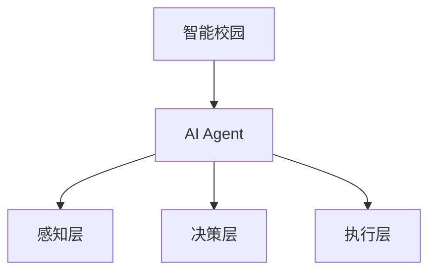
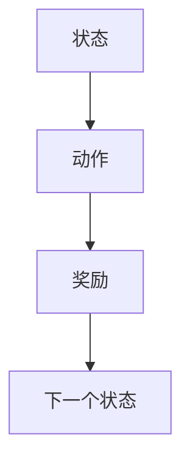
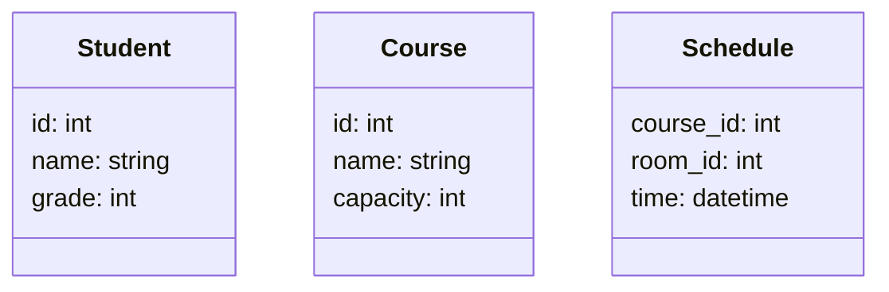
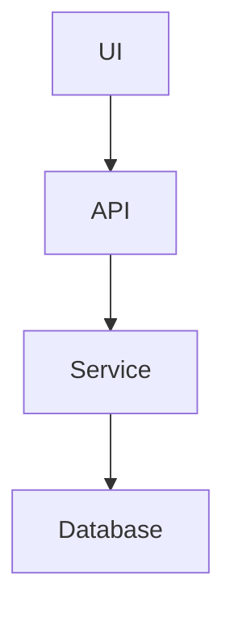
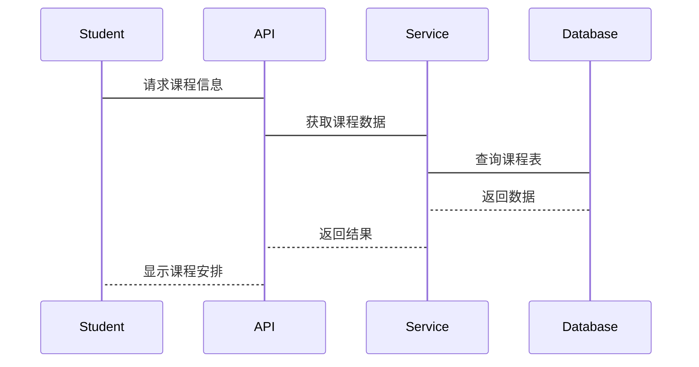

                 


# 智能校园：AI Agent的全方位教育管理

> **关键词：** AI Agent, 智能校园, 教育管理, 机器学习, 自动化管理

> **摘要：**  
> 本文探讨了AI Agent在智能校园中的应用，详细分析了其在教育管理中的核心概念、算法原理、系统设计与实际案例。通过分章节的深入讲解，展示了AI Agent如何通过感知、决策和执行机制优化校园管理流程，帮助教育机构提升效率和质量。

---

# 第一部分: 智能校园与AI Agent概述

## 第1章: 智能校园与AI Agent的背景与概念

### 1.1 智能校园的背景与发展

#### 1.1.1 智能校园的定义与特点
智能校园是指通过物联网、云计算、大数据和人工智能等技术，构建的智能化校园环境。其特点包括：
- **智能化**：利用AI技术实现自动化管理。
- **数据驱动**：基于数据进行决策。
- **个性化**：提供定制化的教育服务。

#### 1.1.2 AI Agent的基本概念与技术基础
AI Agent（智能代理）是能够感知环境、自主决策并执行任务的实体。其技术基础包括：
- **机器学习**：用于模式识别和预测。
- **自然语言处理**：实现人机交互。
- **知识表示**：构建领域知识模型。

#### 1.1.3 智能校园中AI Agent的应用价值
AI Agent可以提升校园管理的效率，例如：
- 自动化课程安排。
- 实时监控学生行为。
- 智能资源分配。

### 1.2 AI Agent在教育管理中的问题背景

#### 1.2.1 传统教育管理的痛点与挑战
传统教育管理存在以下问题：
- **效率低**：人工处理大量重复性工作。
- **数据孤岛**：信息分散，难以整合。
- **个性化不足**：难以满足学生个性化需求。

#### 1.2.2 AI Agent如何解决这些问题
AI Agent通过自动化处理和数据整合，可以：
- 提高管理效率。
- 实现数据共享。
- 支持个性化服务。

#### 1.2.3 AI Agent在教育管理中的边界与外延
AI Agent的应用范围包括：
- 学生管理。
- 教学管理。
- 资源管理。

### 1.3 智能校园与AI Agent的核心要素

#### 1.3.1 核心概念的结构与组成
AI Agent在智能校园中的核心要素包括：
- **感知层**：收集环境数据。
- **决策层**：基于数据做出决策。
- **执行层**：执行决策任务。

#### 1.3.2 AI Agent与智能校园的关系图解


#### 1.3.3 本章小结
本章介绍了智能校园和AI Agent的基本概念，分析了AI Agent在教育管理中的应用价值和挑战。

---

# 第二部分: AI Agent的核心概念与原理

## 第2章: AI Agent的核心概念与联系

### 2.1 AI Agent的感知机制

#### 2.1.1 感知的定义与实现方式
感知是指AI Agent通过传感器或数据源获取环境信息。实现方式包括：
- **数据采集**：收集学生行为数据。
- **特征提取**：从数据中提取有用特征。
- **数据预处理**：清洗和转换数据。

#### 2.1.2 常见的感知技术对比分析
```mermaid
table
| 技术         | 描述                              |
|--------------|----------------------------------|
| 传感器       | 物理设备采集数据                 |
| 数据库       | 从数据库中获取结构化数据         |
| API          | 通过API接口获取外部数据         |
```

#### 2.1.3 感知在教育管理中的应用案例
例如，通过摄像头和传感器监控教室环境，实现安全监控。

### 2.2 AI Agent的决策机制

#### 2.2.1 决策的定义与实现原理
决策是基于感知数据做出选择。实现原理包括：
- **规则引擎**：基于预定义规则进行决策。
- **机器学习模型**：通过训练数据预测最优决策。

#### 2.2.2 基于规则的决策 vs 基于学习的决策
```mermaid
table
| 方法         | 描述                              |
|--------------|----------------------------------|
| 基于规则     | 依赖预定义规则，决策过程确定    |
| 基于学习     | 依赖训练数据，决策过程灵活      |
```

#### 2.2.3 决策在教育管理中的应用场景
例如，根据学生的学习数据推荐个性化学习计划。

### 2.3 AI Agent的执行机制

#### 2.3.1 执行的定义与实现方式
执行是指AI Agent将决策转化为实际操作。实现方式包括：
- **自动化工具**：通过脚本或自动化软件执行任务。
- **人工辅助**：在复杂任务中结合人工操作。

#### 2.3.2 执行过程中的反馈机制
反馈机制用于调整AI Agent的行为。例如：
- **闭环控制系统**：根据执行结果调整下一步操作。

#### 2.3.3 执行在教育管理中的实际案例
例如，自动分配教室资源，如课程安排和设备使用。

### 2.4 AI Agent的核心概念对比表

```mermaid
table
| 概念         | 描述                              |
|--------------|----------------------------------|
| 感知         | 获取环境信息                      |
| 决策         | 基于信息做出选择                |
| 执行         | 将决策转化为行动                |
```

#### 2.4.2 AI Agent与其他智能系统的关系


#### 2.4.3 本章小结
本章详细讲解了AI Agent的感知、决策和执行机制，并通过对比分析明确了各部分的关系。

---

# 第三部分: AI Agent的算法与数学模型

## 第3章: AI Agent的核心算法原理

### 3.1 强化学习算法

#### 3.1.1 强化学习的定义与特点
强化学习是一种通过试错机制学习策略的方法。特点包括：
- **目标导向**：通过最大化累积奖励。
- **环境交互**：通过与环境交互获得反馈。

#### 3.1.2 强化学习的数学模型



数学公式：
- 状态值函数：$$ V(s) = \max_a Q(s, a) $$
- 动作值函数：$$ Q(s, a) = r + \gamma \max_{a'} Q(s', a') $$

#### 3.1.3 强化学习的Python实现示例

```python
import numpy as np

class Agent:
    def __init__(self, state_space, action_space):
        self.state_space = state_space
        self.action_space = action_space
        self.q_table = np.zeros((state_space, action_space))
    
    def choose_action(self, state):
        return np.argmax(self.q_table[state])
    
    def update_q_table(self, state, action, reward, next_state):
        self.q_table[state, action] = reward + gamma * np.max(self.q_table[next_state])
```

#### 3.1.4 强化学习的教育管理应用
例如，用于学生行为引导，如奖励制度设计。

---

# 第四部分: 系统分析与架构设计

## 第4章: 系统设计与实现

### 4.1 项目介绍

#### 4.1.1 项目背景
本项目旨在开发一个基于AI Agent的智能校园管理系统，优化校园资源配置。

### 4.2 功能设计

#### 4.2.1 领域模型设计


#### 4.2.2 系统架构设计


#### 4.2.3 接口设计
- **API接口**：提供RESTful API，如`/api/schedule`。
- **数据接口**：与数据库交互，如MySQL。

#### 4.2.4 交互流程


### 4.3 项目实现

#### 4.3.1 环境配置
- **开发环境**：Python 3.8+，Django框架。
- **数据库**：MySQL。

#### 4.3.2 核心代码实现

```python
from django.http import JsonResponse
from .models import Schedule

def get_schedule(request):
    if request.method == 'GET':
        course_id = request.GET.get('course_id', '')
        schedules = Schedule.objects.filter(course_id=course_id)
        data = [{'id': s.id, 'room': s.room_id, 'time': s.time} for s in schedules]
        return JsonResponse(data, safe=False)
```

#### 4.3.3 案例分析
例如，实现课程自动排课功能，通过AI Agent优化教室和时间分配。

### 4.4 项目小结
本章详细描述了智能校园管理系统的架构设计和实现过程，展示了AI Agent在实际项目中的应用。

---

# 第五部分: 总结与展望

## 第5章: 总结与展望

### 5.1 本章总结
本文详细探讨了AI Agent在智能校园中的应用，从概念、算法到系统设计，全面解析了其在教育管理中的潜力和价值。

### 5.2 未来展望
未来，AI Agent将在智能校园中发挥更大的作用，例如：
- 更智能的资源分配。
- 更个性化的教育服务。
- 更高效的校园安全监控。

### 5.3 最佳实践 tips
- **数据质量**：确保数据的准确性和完整性。
- **模型优化**：定期更新和优化AI模型。
- **隐私保护**：重视学生数据的隐私保护。

### 5.4 总结全文
AI Agent为智能校园的建设提供了新的可能性，通过不断的技术进步和实践探索，其应用前景将更加广阔。

---

# 作者

作者：AI天才研究院/AI Genius Institute & 禅与计算机程序设计艺术 /Zen And The Art of Computer Programming

---

**注意：** 如果需要完整的代码示例或其他详细内容，请告诉我，我将为您提供更多细节。

