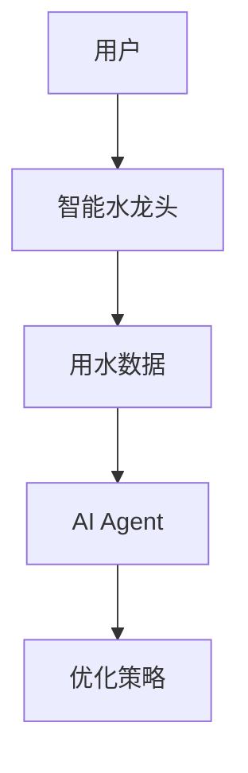
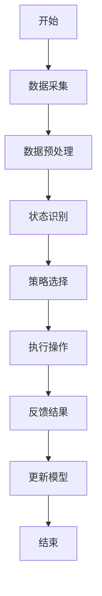
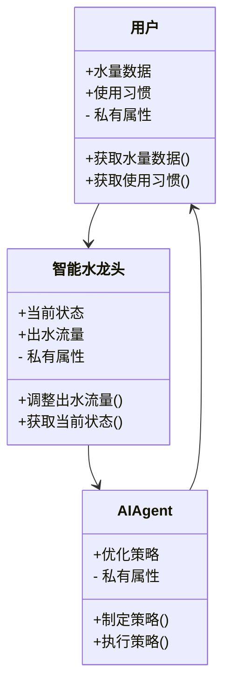
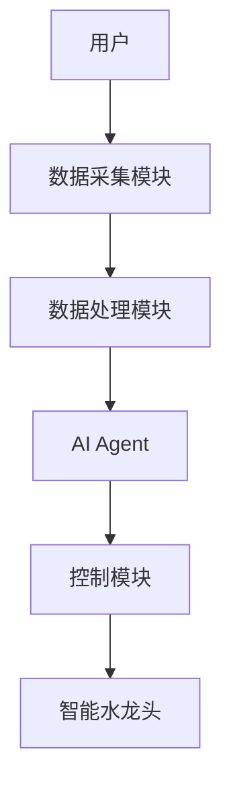

                 


# 智能水龙头：AI Agent的用水效率优化控制

## 关键词：智能水龙头、AI Agent、用水效率、优化控制、AI算法

## 摘要：  
本文探讨了AI Agent在智能水龙头中的应用，详细分析了用水效率优化的背景、核心概念、算法原理、系统架构及项目实战。通过AI Agent的实时学习和优化能力，实现用水效率的最大化，为智能硬件领域提供创新解决方案。

---

# 正文

## 第1章：智能水龙头与AI Agent概述

### 1.1 问题背景与挑战

#### 1.1.1 用水效率的重要性  
水资源是人类生存和发展的基础，但全球水资源分布不均，且浪费现象严重。优化用水效率对于节约资源和可持续发展至关重要。

#### 1.1.2 智能水龙头的应用场景  
智能水龙头广泛应用于家庭、公共场所和工业场所，能够实时监测和优化用水量，减少浪费。

#### 1.1.3 当前用水效率优化的痛点  
传统水龙头无法实时反馈用水数据，难以进行精准优化。用户行为多样，需动态调整用水策略。

### 1.2 AI Agent的基本概念

#### 1.2.1 AI Agent的定义  
AI Agent是具有感知环境、自主决策和执行任务的智能实体，能够通过数据反馈不断优化行为。

#### 1.2.2 AI Agent的核心特征  
- **自主性**：无需人工干预，自动执行任务。  
- **反应性**：实时感知环境变化，动态调整策略。  
- **学习能力**：通过数据反馈优化决策模型。  

#### 1.2.3 AI Agent与传统控制系统的区别  
AI Agent能够自主学习和优化，而传统控制系统依赖固定规则。

### 1.3 智能水龙头的用水效率优化

#### 1.3.1 用水效率优化的目标  
- 最大化用水效率，减少浪费。  
- 根据用户行为动态调整出水流量。  

#### 1.3.2 AI Agent在用水效率优化中的作用  
AI Agent通过实时数据反馈，优化用水策略，实现精准控制。

#### 1.3.3 智能水龙头的系统架构  
系统包括数据采集、AI算法、控制执行三个部分，协同工作实现优化控制。

---

## 第2章：AI Agent与用水效率优化的核心概念

### 2.1 核心概念原理

#### 2.1.1 AI Agent的基本原理  
AI Agent通过感知环境、分析数据、制定策略和执行操作，实现目标优化。

#### 2.1.2 用水效率优化的数学模型  
建立数学模型，量化用水效率，为AI Agent提供决策依据。

#### 2.1.3 智能水龙头的控制机制  
基于AI Agent的决策，调整水龙头的出水流量和时间。

### 2.2 核心概念属性特征对比

| 概念      | 属性           | 特征                   |
|-----------|----------------|------------------------|
| AI Agent  | 自主性         | 独立决策               |
|           | 反应性         | 实时响应环境变化       |
|           | 学习能力       | 通过反馈优化模型       |
| 水效率优化 | 精准性         | 减少水资源浪费         |
|           | 动态性         | 根据用户行为调整策略   |

### 2.3 ER实体关系图  


---

## 第3章：AI Agent的算法原理

### 3.1 算法概述

#### 3.1.1 算法选择的依据  
选择强化学习算法，因其适合动态环境下的策略优化。

#### 3.1.2 算法的优缺点分析  
- 优点：动态适应性强，自适应优化。  
- 缺点：需要大量数据训练，计算资源消耗大。

### 3.2 算法流程图  


### 3.3 算法实现代码

```python
class AI-Agent:
    def __init__(self):
        self.model = self.build_model()
        
    def build_model(self):
        # 构建强化学习模型
        pass
    
    def perceive(self, data):
        # 数据处理
        pass
    
    def decide(self, state):
        # 策略选择
        pass
    
    def learn(self, reward):
        # 模型更新
        pass
```

### 3.4 数学模型与公式

#### 3.4.1 强化学习的基本公式  
$$ R = r_t \rightarrow \theta_{t+1} = \theta_t + \alpha (Q(\theta_t, a_t) - J(\theta_t)) $$

---

## 第4章：系统分析与架构设计

### 4.1 系统分析

#### 4.1.1 问题场景介绍  
用户行为多样，用水需求变化频繁，需动态优化用水策略。

#### 4.1.2 系统功能设计  
- 数据采集：实时采集用水数据。  
- 数据分析：分析用户行为和用水模式。  
- 策略制定：基于分析结果制定优化策略。  

### 4.2 系统架构设计

#### 4.2.1 领域模型类图  


#### 4.2.2 系统架构图  


### 4.3 系统接口设计

#### 4.3.1 接口描述  
- 数据采集接口：获取用水数据。  
- 策略执行接口：下发优化策略。  

#### 4.3.2 交互流程  
用户触发用水，数据采集模块获取数据，AI Agent分析并制定策略，控制模块执行。

---

## 第5章：项目实战

### 5.1 环境安装

#### 5.1.1 安装Python和相关库  
安装Python 3.8及以上版本，安装TensorFlow、Keras等库。

### 5.2 核心功能实现

#### 5.2.1 数据采集模块  
编写代码采集用水数据，如水量、使用频率等。

#### 5.2.2 AI Agent实现  
实现强化学习算法，训练模型优化用水策略。

#### 5.2.3 控制模块  
根据AI Agent的决策，调整水龙头的出水流量。

### 5.3 实际案例分析  
通过实际数据，展示AI Agent优化前后的用水效率变化，验证算法的有效性。

---

## 第6章：最佳实践与总结

### 6.1 项目成果总结  
通过AI Agent优化用水策略，显著提升了用水效率，减少了水资源浪费。

### 6.2 应用案例分析  
分析实际应用场景中的数据，展示优化效果。

### 6.3 项目实施的关键点  
- 数据采集的准确性  
- AI算法的实时性和有效性  
- 系统架构的可扩展性  

### 6.4 未来研究方向  
- 更复杂的用户行为建模  
- 更高效的算法优化  
- 多目标优化问题研究  

---

## 作者：AI天才研究院/AI Genius Institute & 禅与计算机程序设计艺术 /Zen And The Art of Computer Programming

---

**本文是基于AI Agent在智能水龙头中的应用，详细探讨了优化控制的实现。通过理论分析和实践案例，展示了AI技术在提升用水效率中的巨大潜力。**

