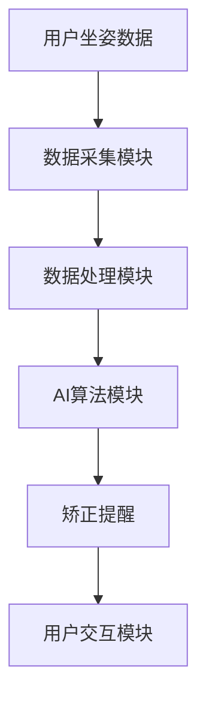
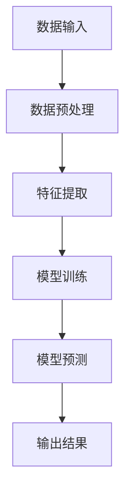

                 


# 智能沙发：AI Agent的坐姿矫正提醒

---

## 关键词

- AI Agent
- 智能沙发
- 坐姿矫正
- 人体姿态识别
- 传感器技术
- 健康监测

---

## 摘要

本文详细探讨了AI Agent在智能沙发中的应用，重点介绍了如何通过AI技术实现坐姿矫正提醒功能。文章从背景介绍、技术基础、系统设计、算法实现、项目实战等多个方面展开，深入剖析了智能沙发的实现原理和应用场景。通过结合人体姿态识别、传感器技术和AI算法，本文提出了一种创新的坐姿矫正解决方案，为用户提供了科学的健康建议，同时展望了智能沙发在未来的发展趋势。

---

## 第一部分：背景与概念

### 第1章：AI Agent与智能沙发概述

#### 1.1 AI Agent的基本概念

AI Agent（人工智能代理）是一种能够感知环境、自主决策并执行任务的智能实体。它通过传感器获取数据，利用算法进行分析和判断，并通过执行器（如显示器、声音提示等）与用户交互。AI Agent的核心功能包括数据采集、信息处理、决策制定和反馈输出。

- **AI Agent的特点**：
  - **自主性**：能够自主决策和行动。
  - **反应性**：能够实时感知环境变化并做出响应。
  - **学习能力**：通过数据训练不断优化性能。
  - **适应性**：能够根据环境调整行为。

- **AI Agent的应用场景**：
  - 智能家居：如智能音箱、智能空调等。
  - 智能助手：如Siri、Google Assistant等。
  - 智能健康设备：如智能手环、智能镜子等。

#### 1.2 智能沙发的定义与特点

智能沙发是一种结合了物联网技术、传感器技术和AI算法的智能家具。它不仅具备传统沙发的舒适性，还能够通过内置的传感器和AI Agent实时监测用户的坐姿，并通过语音或震动等方式给予矫正提醒。

- **智能沙发的特点**：
  - **智能化**：通过传感器和AI算法实现智能化监测和提醒。
  - **舒适性**：设计符合人体工学，提供舒适的坐姿建议。
  - **实时性**：能够实时监测用户的坐姿并给予反馈。

#### 1.3 坐姿矫正的重要性

坐姿不正确会导致颈椎病、腰椎病等健康问题。通过AI Agent的实时监测和提醒，智能沙发可以帮助用户保持正确的坐姿，预防健康问题。

- **坐姿不良的健康危害**：
  - 颈椎病：长时间低头或歪头会导致颈椎负担加重。
  - 腰椎病：久坐且坐姿不正确会压迫脊椎。
  - 肩膀僵硬：长时间单侧倾斜会导致肩膀僵硬。

---

## 第二部分：技术基础

### 第2章：人体姿态识别技术

#### 2.1 人体姿态识别的原理

人体姿态识别是通过传感器或摄像头获取人体的姿态信息，并通过算法进行分析和分类。常见的姿态识别技术包括基于图像的姿势识别和基于传感器的姿势检测。

- **基于图像的姿势识别**：
  - 使用摄像头采集人体的姿态图像。
  - 通过OpenCV或深度学习模型（如YOLO、Faster R-CNN）进行姿势检测和分类。

- **基于传感器的姿势检测**：
  - 使用加速度计、陀螺仪等传感器获取人体的姿态数据。
  - 通过数据分析和特征提取，判断人体的姿势状态。

#### 2.2 常见的姿态识别算法

- **基于OpenCV的姿势识别**：
  - OpenCV是一个开源的计算机视觉库，提供了丰富的图像处理函数。
  - 使用OpenCV进行姿势识别需要先检测人体的关键点，如肩、肘、膝等，然后通过关键点的位置关系判断姿势状态。

- **基于深度学习的姿势识别**：
  - 深度学习模型（如卷积神经网络）可以自动学习人体姿态的特征。
  - 使用数据集（如COCO dataset）进行训练，模型可以准确识别人体的姿态。

---

### 第3章：传感器与智能沙发

#### 3.1 智能沙发中的传感器类型

- **压力传感器**：
  - 安装在沙发坐垫中，用于检测用户的坐姿压力分布。
  - 通过压力分布数据判断用户的坐姿是否正确。

- **倾斜传感器**：
  - 安装在沙发的支撑结构中，用于检测沙发的倾斜角度。
  - 通过倾斜角度数据判断用户的坐姿是否正确。

- **温度与湿度传感器**：
  - 用于监测用户的舒适度，如温度过高或湿度过大时，智能沙发可以调节温度和湿度。

#### 3.2 传感器数据的采集与处理

- **数据采集**：
  - 使用传感器采集坐姿相关的数据，如压力分布、倾斜角度等。
  - 数据采集需要高精度和实时性。

- **数据预处理**：
  - 对采集到的数据进行去噪处理，消除干扰信号。
  - 数据预处理包括滤波、归一化等步骤。

- **数据传输**：
  - 将预处理后的数据传输到AI Agent进行分析和处理。
  - 数据传输需要考虑实时性和安全性。

---

## 第三部分：系统设计

### 第4章：AI Agent的系统架构

#### 4.1 系统架构设计

- **分层架构**：
  - **数据采集层**：负责采集传感器数据。
  - **数据处理层**：对数据进行预处理和特征提取。
  - **算法层**：使用AI算法进行姿势识别和矫正建议。
  - **用户交互层**：通过语音或震动等方式与用户交互。

- **微服务架构**：
  - **数据采集服务**：负责采集传感器数据。
  - **数据处理服务**：负责数据预处理和特征提取。
  - **AI算法服务**：负责姿势识别和矫正建议。
  - **用户交互服务**：负责与用户的交互。

#### 4.2 系统功能模块

- **数据采集模块**：
  - 通过传感器采集坐姿相关的数据。
  - 数据采集模块需要与传感器硬件进行通信。

- **数据处理模块**：
  - 对采集到的数据进行预处理和特征提取。
  - 数据处理模块需要具备高效的计算能力。

- **AI算法模块**：
  - 使用深度学习模型进行姿势识别。
  - 根据识别结果生成矫正建议。

- **用户交互模块**：
  - 通过语音或震动等方式向用户发送矫正提醒。
  - 用户交互模块需要具备良好的用户体验设计。

---

### 第5章：系统功能设计

#### 5.1 系统功能模块实现

- **数据采集与传输**：
  - 使用传感器采集坐姿数据，并通过无线通信技术（如蓝牙、Wi-Fi）传输到AI Agent。
  - 数据传输需要考虑实时性和安全性。

- **姿势识别与分析**：
  - 使用深度学习模型进行姿势识别。
  - 根据识别结果判断坐姿是否正确。

- **矫正提醒与反馈**：
  - 当识别到坐姿不正确时，AI Agent会通过语音或震动等方式提醒用户调整坐姿。
  - 矫正提醒需要具备良好的用户体验设计，避免打扰用户的正常工作。

#### 5.2 系统功能流程图

以下是一个简要的系统功能流程图：



---

## 第四部分：算法实现

### 第6章：AI Agent的算法原理

#### 6.1 坐姿矫正算法的数学模型

坐姿矫正算法的核心是基于人体姿态的分类。常用的算法包括支持向量机（SVM）和随机森林（Random Forest）。

- **支持向量机（SVM）**：
  - SVM是一种监督学习算法，适用于分类问题。
  - SVM通过构建一个超平面，将数据分成不同的类别。
  - 在坐姿矫正中，SVM可以用于将坐姿分为正确和不正确两类。

- **随机森林（Random Forest）**：
  - 随机森林是一种基于决策树的集成学习算法。
  - 它通过构建多个决策树，并将它们的结果进行投票或平均，得到最终的分类结果。
  - 随机森林适用于高维数据的分类问题。

#### 6.2 算法流程图

以下是一个坐姿矫正算法的流程图：



---

## 第五部分：项目实战

### 第7章：智能沙发的实现

#### 7.1 环境安装

- **硬件环境**：
  - 智能沙发硬件：传感器、控制器、无线通信模块。
  - AI Agent：单片机或嵌入式系统。

- **软件环境**：
  - 开发工具：Python、TensorFlow、OpenCV。
  - 操作系统：Linux、Windows。

#### 7.2 核心代码实现

以下是一个基于Python的坐姿矫正算法实现示例：

```python
import numpy as np
from sklearn import svm

# 数据预处理
def preprocess_data(data):
    # 假设data是一个包含传感器数据的列表
    # 这里进行归一化处理
    normalized_data = (data - np.mean(data)) / np.std(data)
    return normalized_data

# 模型训练
def train_model(train_data, train_labels):
    # 使用SVM进行训练
    clf = svm.SVC()
    clf.fit(train_data, train_labels)
    return clf

# 模型预测
def predict姿势矫正(model, test_data):
    # 进行预测
    predicted_labels = model.predict(test_data)
    return predicted_labels

# 主函数
def main():
    # 加载数据
    data = np.load('姿勢數據.npy')
    labels = np.load('姿勢標籤.npy')

    # 数据预处理
    processed_data = preprocess_data(data)

    # 划分训练集和测试集
    train_data = processed_data[:int(0.8 * len(processed_data))]
    train_labels = labels[:int(0.8 * len(processed_data))]
    test_data = processed_data[int(0.8 * len(processed_data)):]
    test_labels = labels[int(0.8 * len(processed_data)):]

    # 模型训练
    model = train_model(train_data, train_labels)

    # 模型预测
    predictions = predict姿势矫正(model, test_data)

    # 输出结果
    print('预测结果:', predictions)
    print('真实标签:', test_labels)

if __name__ == '__main__':
    main()
```

---

## 第六部分：总结与展望

### 第8章：总结与展望

#### 8.1 总结

本文详细探讨了AI Agent在智能沙发中的应用，重点介绍了如何通过AI技术实现坐姿矫正提醒功能。通过结合人体姿态识别、传感器技术和AI算法，智能沙发能够实时监测用户的坐姿，并通过语音或震动等方式给予矫正提醒，帮助用户保持正确的坐姿，预防健康问题。

#### 8.2 展望

未来，智能沙发将更加智能化和个性化。随着AI技术的不断发展，智能沙发将具备更多的功能，如个性化矫正建议、健康数据监测、智能家居联动等。同时，随着5G技术的发展，智能沙发将实现更高效的实时通信和数据共享，为用户提供更优质的用户体验。

---

## 作者：AI天才研究院/AI Genius Institute & 禅与计算机程序设计艺术 /Zen And The Art of Computer Programming

