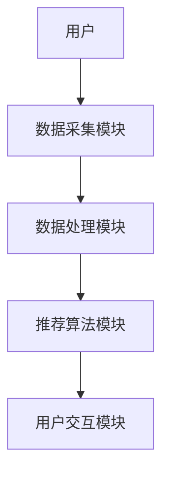

                 


# 智能沙发：AI Agent的家庭活动建议系统

## 关键词：AI Agent, 家庭活动建议, 智能家居, 推荐系统, 用户行为分析

## 摘要：  
本文详细探讨了AI Agent在家庭环境中提供活动建议系统的实现与应用。通过分析家庭活动建议的核心需求、AI Agent的工作原理、推荐算法的数学基础、系统架构设计以及实际项目实现，本文为读者提供了从理论到实践的全面指导。文章结合具体案例和代码实现，深入浅出地展示了如何利用AI技术提升家庭生活的智能化水平。

---

## 第一部分：家庭活动建议系统概述

### 第1章：问题背景与需求分析

#### 1.1 家庭活动建议系统的发展背景
智能家居的普及为家庭生活带来了前所未有的便利，但如何充分利用这些智能设备提供个性化的服务，仍然是一个挑战。家庭成员的需求多样化，包括娱乐、健身、学习、社交等多种活动。传统的智能家居系统通常仅限于设备控制，而缺乏主动提供活动建议的能力。

#### 1.2 家庭活动建议系统的核心问题
- **用户行为分析**：如何通过数据采集和分析，准确理解家庭成员的偏好和需求。
- **个性化推荐**：基于用户行为和家庭环境，生成个性化的活动建议。
- **系统可扩展性**：如何设计一个灵活的系统，能够适应不同家庭的需求变化。

#### 1.3 系统目标与边界
- **目标**：通过AI Agent提供智能化的家庭活动建议，提升生活品质。
- **边界**：系统仅专注于家庭场景，不涉及工作或其他公共场景。

---

## 第二部分：AI Agent的核心概念与工作原理

### 第2章：AI Agent的基本概念与特点

#### 2.1 AI Agent的定义与分类
- **定义**：AI Agent是一种能够感知环境、执行任务并主动提供服务的智能实体。
- **分类**：根据功能可分为信息检索型、任务执行型和社交互动型。

#### 2.2 家庭场景下的AI Agent特点
- **个性化服务**：基于家庭成员的个性化需求提供服务。
- **实时响应**：能够快速响应用户需求，提供即时建议。
- **数据隐私**：确保家庭数据的安全性和隐私性。

#### 2.3 AI Agent与传统推荐系统的区别
- **主动性**：AI Agent能够主动学习和调整推荐策略。
- **交互性**：支持自然语言交互，提升用户体验。

---

## 第三部分：算法原理与数学模型

### 第3章：推荐算法的核心原理

#### 3.1 基于概率的推荐模型
- **概率计算**：通过贝叶斯定理计算用户对某项活动的兴趣概率。
- **公式**：$$P(A|B) = \frac{P(B|A) \cdot P(A)}{P(B)}$$

#### 3.2 协同过滤算法
- **基于用户的协同过滤**：通过相似用户的活动记录进行推荐。
- **基于物品的协同过滤**：通过分析物品之间的关联性进行推荐。

#### 3.3 深度学习模型
- **神经网络结构**：使用神经网络对用户行为和环境数据进行深度学习，生成推荐结果。

---

## 第四部分：系统架构与设计

### 第4章：系统架构设计

#### 4.1 系统功能模块
- **数据采集模块**：负责采集用户行为和环境数据。
- **数据处理模块**：对数据进行清洗和特征提取。
- **推荐算法模块**：基于数据生成活动建议。
- **用户交互模块**：与用户进行实时互动。

#### 4.2 系统架构图


---

## 第五部分：项目实战与实现

### 第5章：项目实现

#### 5.1 环境安装
- **Python 3.8+**
- **TensorFlow、Scikit-learn**

#### 5.2 核心代码实现
```python
import numpy as np
from sklearn.metrics.pairwise import cosine_similarity

# 示例数据：用户活动偏好矩阵
user_activity = np.array([[0.8, 0.2, 0.5], [0.3, 0.7, 0.6]])

# 计算相似度
similarity = cosine_similarity(user_activity)

# 输出相似度最高的前两项
def get_top_matches(similarity_matrix, index, top_n=2):
    sorted_indices = np.argsort(similarity_matrix[index])[::-1]
    return sorted_indices[:top_n]

print(get_top_matches(similarity, 0, 2))
```

#### 5.3 代码解读与优化
- **数据预处理**：确保数据的准确性和完整性。
- **算法优化**：通过调整模型参数提升推荐准确率。

---

## 第六部分：总结与展望

### 第6章：总结与展望

#### 6.1 系统总结
- **实现价值**：通过AI Agent提供智能化的家庭活动建议，显著提升了用户体验。
- **技术优势**：结合深度学习和协同过滤算法，实现了精准推荐。

#### 6.2 未来展望
- **多模态数据融合**：结合图像、语音等多种数据源，提升推荐准确性。
- **动态调整机制**：根据实时数据动态调整推荐策略。

---

## 作者：AI天才研究院 & 禅与计算机程序设计艺术

---

以上内容是基于《智能沙发：AI Agent的家庭活动建议系统》的技术博客文章。希望这篇文章能够为读者提供从理论到实践的全面指导，帮助大家更好地理解和实现类似系统。

