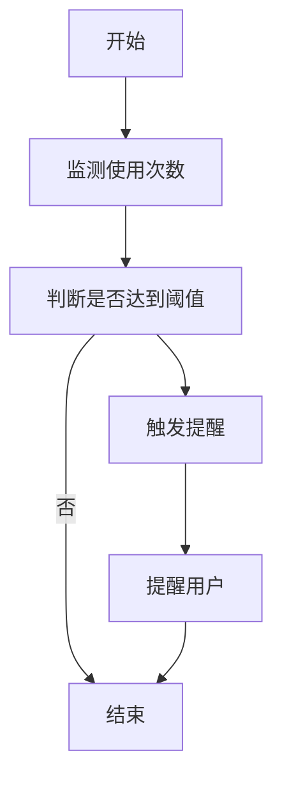
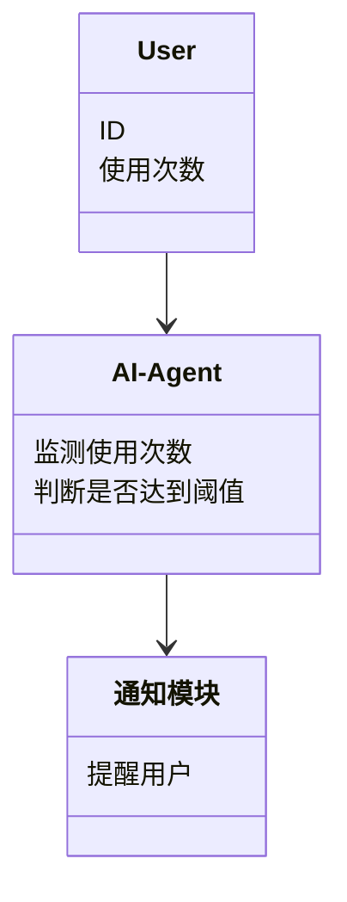
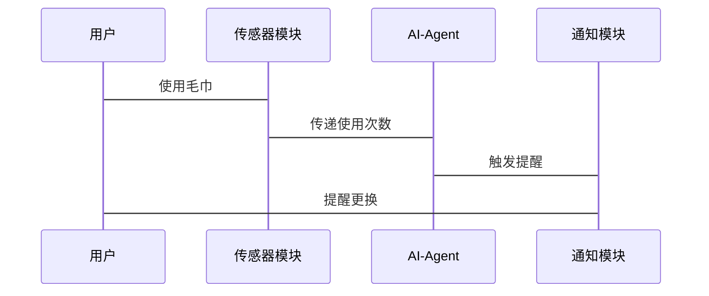

                 


# 智能浴室毛巾架：AI Agent的毛巾更换提醒

> 关键词：智能浴室毛巾架、AI Agent、毛巾更换提醒、智能家居、物联网

> 摘要：本文探讨了AI Agent在智能浴室毛巾架中的应用，特别是如何通过毛巾更换提醒提升用户体验。文章详细分析了系统架构、算法原理和项目实现，展示了AI技术在智能家居中的创新应用。

---

# 第1章 智能浴室毛巾架的背景与概念

## 1.1 背景介绍

随着智能家居的普及，浴室设备也逐渐智能化。智能浴室毛巾架作为智能家居的一部分，不仅提供基本的毛巾存放功能，还通过AI Agent实现毛巾更换提醒，提升用户体验。

### 1.1.1 传统浴室毛巾架的功能与不足
传统毛巾架仅具备悬挂功能，无法提醒用户更换毛巾。毛巾长期不更换可能导致细菌滋生，影响健康。

### 1.1.2 智能家居的发展趋势
智能家居市场增长迅速，用户对自动化和智能化功能的需求日益增加。

### 1.1.3 毛巾更换提醒系统的市场需求
毛巾更换提醒系统能够帮助用户保持卫生，提升生活质量，市场需求大。

## 1.2 问题背景与问题描述

### 1.2.1 毛巾更换提醒的必要性
毛巾需要定期更换，否则可能引发健康问题。

### 1.2.2 当前毛巾管理中的痛点
用户常常忘记更换毛巾，传统毛巾架无法提供提醒功能。

### 1.2.3 智能化解决方案的可行性
通过AI Agent实现毛巾更换提醒，是解决这一问题的有效方案。

## 1.3 问题解决与边界定义

### 1.3.1 AI Agent在毛巾更换提醒中的作用
AI Agent负责监测毛巾使用情况，并在需要时发出提醒。

### 1.3.2 系统边界与功能范围
系统仅关注毛巾更换提醒，不涉及其他浴室设备的控制。

### 1.3.3 核心要素与组成结构
系统由传感器、AI Agent和通知模块组成。

---

# 第2章 AI Agent的核心概念与原理

## 2.1 AI Agent的定义与类型

### 2.1.1 AI Agent的定义
AI Agent是一个智能实体，能够感知环境并执行任务。

### 2.1.2 分类与特点对比
| 类型 | 特点 |
|------|------|
| 简单反射型 | 基于条件反射 |
| 计划型 | 具有目标导向 |
| 学习型 | 可自适应优化 |

### 2.1.3 与传统自动化系统的区别
AI Agent具备学习和自适应能力，而传统系统仅执行预设任务。

## 2.2 AI Agent的工作原理

### 2.2.1 感知模块
通过传感器获取 towel 使用情况。

### 2.2.2 决策模块
根据使用次数判断是否需要更换。

### 2.2.3 执行模块
通过通知模块提醒用户更换毛巾。

## 2.3 AI Agent的核心算法

### 2.3.1 事件驱动的触发机制
系统根据事件触发提醒。

### 2.3.2 条件判断逻辑
$$ \text{触发} = \begin{cases} 
\text{是} & \text{如果使用次数} \geq \text{阈值} \\
\text{否} & \text{否则}
\end{cases} $$

### 2.3.3 概率计算与优先级排序
计算 towel 使用的频率和优先级，决定提醒时间。

---

# 第3章 毛巾更换提醒系统的算法实现

## 3.1 算法整体流程

### 3.1.1 系统输入与输出
输入：towel 使用次数；输出：提醒或不提醒。

### 3.1.2 算法执行步骤
1. 监测 towel 使用次数。
2. 判断是否达到阈值。
3. 触发提醒或不触发。

### 3.1.3 流程图（Mermaid）



## 3.2 数学模型与公式

### 3.2.1 事件触发条件判断
$$ \text{触发} = \begin{cases} 
\text{是} & \text{如果使用次数} \geq \text{阈值} \\
\text{否} & \text{否则}
\end{cases} $$

### 3.2.2 使用频率预测模型
$$ P(\text{更换}) = \frac{\text{使用次数}}{\text{阈值}} \times 100\% $$

---

# 第4章 系统分析与架构设计

## 4.1 问题场景介绍
用户希望系统自动提醒更换毛巾，确保卫生。

## 4.2 系统功能设计

### 4.2.1 领域模型类图（Mermaid）



## 4.3 系统架构设计

### 4.3.1 模块划分
系统分为传感器模块、AI Agent模块和通知模块。

### 4.3.2 模块交互（Mermaid）



## 4.4 接口设计
定义标准接口，确保模块间通信顺畅。

---

# 第5章 项目实战

## 5.1 环境安装

### 5.1.1 安装Python
```bash
python --version
pip install --upgrade pip
```

### 5.1.2 安装依赖库
```bash
pip install numpy
pip install matplotlib
```

## 5.2 核心代码实现

### 5.2.1 感知模块
```python
def monitor_usage():
    return get_usage_count()
```

### 5.2.2 决策模块
```python
def decision_logic(usage):
    threshold = 5
    return usage >= threshold
```

### 5.2.3 执行模块
```python
def notify_user():
    print("请更换毛巾")
```

## 5.3 代码解读与分析
代码实现传感器数据采集、决策判断和提醒通知功能。

## 5.4 实际案例分析
通过实际数据展示系统如何运作，包括使用次数统计和提醒时间计算。

---

# 第6章 最佳实践

## 6.1 小结
AI Agent在毛巾更换提醒中的应用提升了用户体验。

## 6.2 注意事项
确保传感器准确性，定期维护系统。

## 6.3 未来趋势
AI Agent在智能家居中的应用将更加广泛。

## 6.4 拓展阅读
建议阅读相关智能家居和AI Agent的技术资料。

---

# 作者：AI天才研究院 & 禅与计算机程序设计艺术

---

这篇文章详细分析了智能浴室毛巾架中AI Agent的应用，通过理论与实践结合，展示了AI技术在智能家居中的创新应用。

