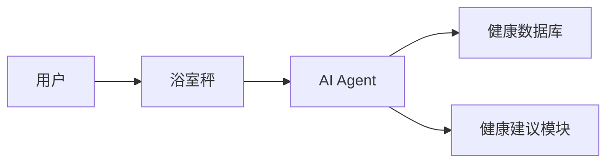
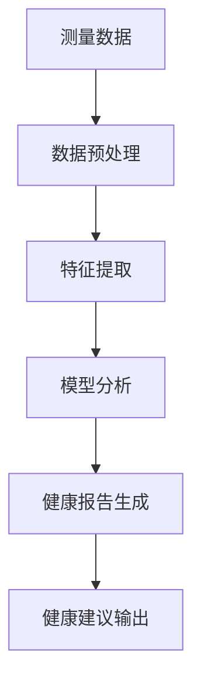
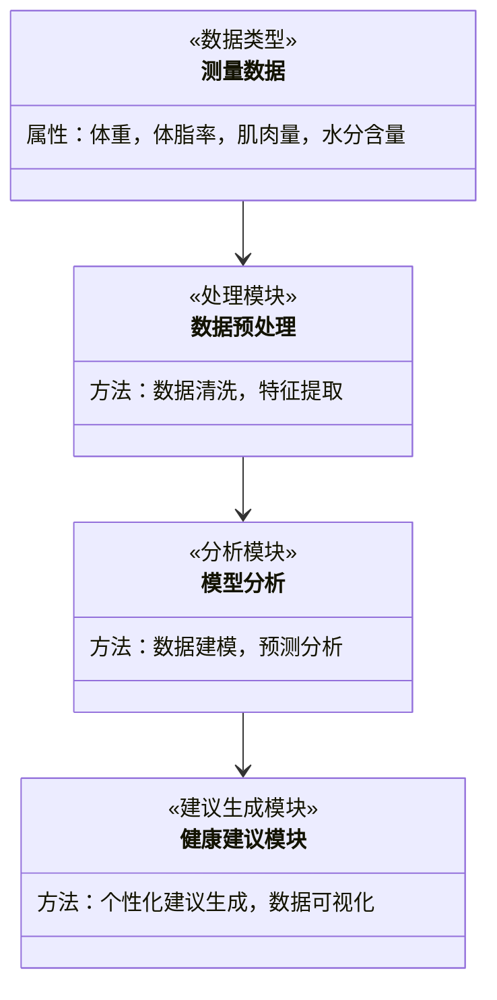
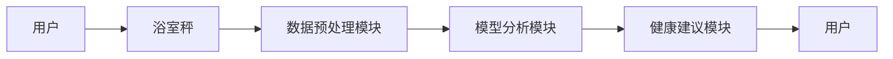
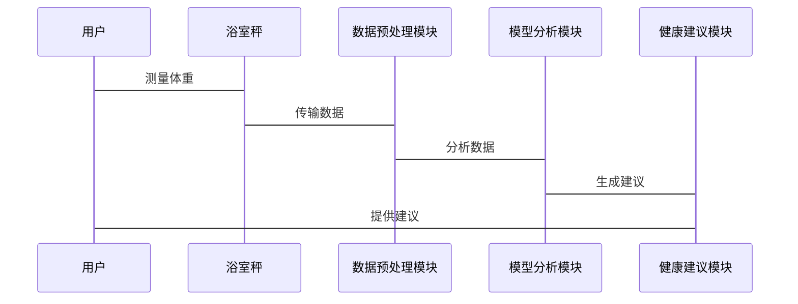

                 


```markdown
# 智能浴室秤：AI Agent的身体成分分析与健康建议

> 关键词：智能浴室秤、AI Agent、身体成分分析、健康建议、算法原理、系统架构

> 摘要：本文将详细探讨智能浴室秤结合AI Agent在身体成分分析与健康建议方面的应用。从背景介绍、核心概念、算法原理、系统架构到项目实战，深入分析智能浴室秤如何通过AI技术为用户提供个性化的健康建议，帮助用户更好地管理身体健康。

---

# 第一部分: 智能浴室秤与AI Agent的背景介绍

## 第1章: 背景与概念

### 1.1 智能浴室秤的发展历程
- 1.1.1 传统浴室秤的功能与局限性
  - 测量体重的基本功能
  - 数据记录的简单性
  - 缺乏数据分析与个性化建议

- 1.1.2 智能化时代的浴室秤革新
  - 移动端App的引入
  - 数据同步与云端存储
  - 初步的健康数据分析

- 1.1.3 AI Agent的引入与意义
  - AI Agent的核心作用
  - 提供个性化健康建议的价值
  - 未来的智能化健康管理方向

### 1.2 AI Agent的基本概念
- 1.2.1 什么是AI Agent
  - 定义与特点
  - AI Agent在不同领域的应用
  - AI Agent与传统软件的区别

- 1.2.2 AI Agent的核心功能与特点
  - 数据分析与处理能力
  - 自然语言理解与生成
  - 个性化推荐与建议

- 1.2.3 AI Agent在健康领域的应用潜力
  - 健康数据的实时分析
  - 个性化健康建议的生成
  - 长期健康管理的支持

### 1.3 身体成分分析与健康建议的重要性
- 1.3.1 身体成分分析的基本概念
  - 身体成分的构成
  - 各项指标的定义与意义

- 1.3.2 健康建议的必要性与多样性
  - 健康建议的类型
  - 个性化健康建议的必要性

- 1.3.3 智能浴室秤的创新价值
  - 智能浴室秤的优势
  - 结合AI Agent的独特性

### 1.4 本章小结
- 总结本章内容，强调智能浴室秤与AI Agent结合的重要性与潜力

---

# 第二部分: AI Agent的核心概念与联系

## 第2章: 核心概念与原理

### 2.1 AI Agent的实体关系图


### 2.2 身体成分分析的流程图


### 2.3 算法原理与数学模型
- 2.3.1 线性回归模型
  $$y = \beta_0 + \beta_1x + \epsilon$$

- 2.3.2 支持向量机模型
  $$maximize\ \frac{1}{2}\|w\|^2$$
  $$subject\ to\ y_i(w\cdot x_i + b) = 1$$

### 2.4 本章小结
- 总结AI Agent的核心概念与工作原理，为后续章节打下基础

---

# 第三部分: 算法原理与实现

## 第3章: AI Agent的算法实现

### 3.1 机器学习模型的选择与训练
- 3.1.1 数据集的构建与预处理
  - 数据清洗与标准化
  - 特征工程

- 3.1.2 模型训练与优化
  - 算法选择与调参
  - 模型评估与验证

- 3.1.3 模型部署与实时分析
  - 模型的实时预测能力
  - 模型的可解释性

### 3.2 身体成分分析的数学模型
- 3.2.1 线性回归模型的实现
  - 数据输入与模型训练
  - 预测结果与误差分析

- 3.2.2 支持向量机模型的实现
  - 数据分类与模型训练
  - 分类结果的评估

### 3.3 算法实现的代码示例
- 3.3.1 线性回归模型的Python实现
```python
import numpy as np
from sklearn.linear_model import LinearRegression

# 数据准备
X = np.array([[1], [2], [3], [4]])
y = np.array([2, 4, 5, 4])

# 模型训练
model = LinearRegression()
model.fit(X, y)

# 预测
print(model.predict([[5]]))
```

- 3.3.2 支持向量机模型的Python实现
```python
from sklearn import svm

# 数据准备
X = [[1, -1], [-1, 1], [1, 1], [-1, -1]]
y = [1, -1, -1, 1]

# 模型训练
model = svm.SVC()
model.fit(X, y)

# 预测
print(model.predict([[1, 1]]))
```

### 3.4 本章小结
- 总结算法实现的关键步骤与注意事项

---

# 第四部分: 系统分析与架构设计

## 第4章: 智能浴室秤系统的架构设计

### 4.1 问题场景介绍
- 用户需求分析
- 系统功能需求

### 4.2 项目介绍
- 项目目标
- 项目范围
- 项目关键点

### 4.3 系统功能设计（领域模型）


### 4.4 系统架构设计


### 4.5 系统接口设计
- 接口定义与调用方式
- 接口的输入输出格式

### 4.6 系统交互设计


### 4.7 本章小结
- 总结系统架构设计的关键点与实现步骤

---

# 第五部分: 项目实战

## 第5章: 项目实战与代码实现

### 5.1 环境安装与配置
- 开发工具安装
- 依赖库安装

### 5.2 系统核心实现
- 数据采集与处理
- 模型训练与部署
- 健康建议生成

### 5.3 代码实现与解读
- 数据预处理代码
- 模型训练代码
- 健康建议生成代码

### 5.4 实际案例分析
- 数据输入与分析
- 模型预测结果
- 健康建议展示

### 5.5 本章小结
- 总结项目实战的实现过程与经验教训

---

# 第六部分: 最佳实践与总结

## 第6章: 最佳实践与总结

### 6.1 小结
- 总结全文内容
- 强调智能浴室秤与AI Agent结合的重要性

### 6.2 注意事项
- 数据隐私保护
- 系统稳定性与安全性
- 用户体验优化

### 6.3 拓展阅读
- 相关技术文献
- 实际应用场景
- 未来发展趋势

### 6.4 本章小结
- 总结全文，并展望未来发展方向

---

# 作者：AI天才研究院/AI Genius Institute & 禅与计算机程序设计艺术 /Zen And The Art of Computer Programming
```

