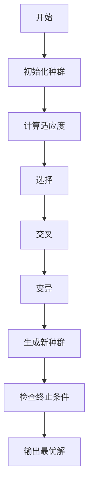
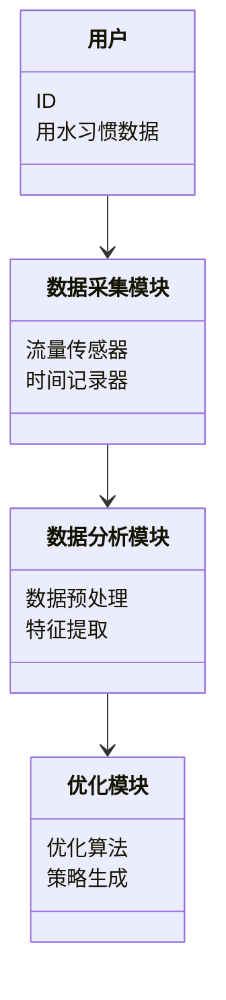
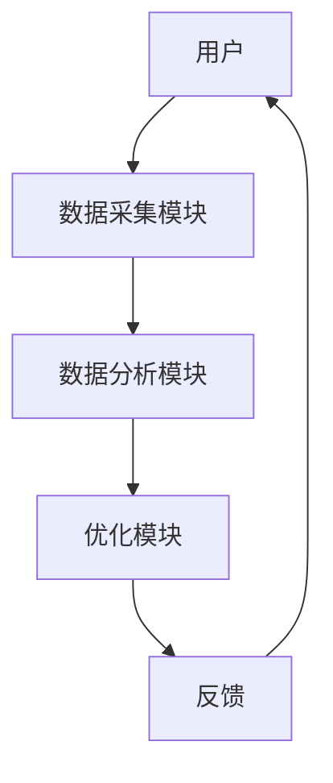

                 


# 智能浴室系统：AI Agent的用水习惯优化

## 关键词：智能浴室系统，AI Agent，用水习惯优化，数据驱动，优化算法，系统架构

## 摘要：本文探讨了智能浴室系统如何通过AI Agent优化用户的用水习惯。文章从背景介绍、核心概念、算法原理、系统架构、项目实战到最佳实践，详细阐述了智能浴室系统的设计与实现，展示了AI技术在智能家居领域的广泛应用和潜力。

---

# 第一部分: 智能浴室系统概述

## 第1章: 智能浴室系统背景与问题背景

### 1.1 用水习惯优化的背景

#### 1.1.1 水资源浪费的现状
全球水资源短缺问题日益严重，节约用水成为每个人的责任。然而，传统浴室设备无法有效监控和优化用户的用水习惯，导致水资源浪费。

#### 1.1.2 智能家居的发展趋势
智能家居技术的快速发展为改善生活品质提供了可能。通过智能设备和AI技术，家庭用水习惯的优化成为可能。

#### 1.1.3 AI技术在家居领域的应用前景
AI技术在家居领域的应用越来越广泛，通过数据采集和分析，AI Agent可以实时优化用户的用水习惯，减少浪费。

### 1.2 智能浴室系统的定义与特点

#### 1.2.1 智能浴室系统的定义
智能浴室系统是一种结合AI技术的智能设备，通过实时监测和分析用户的用水行为，提供优化建议或自动调整设备设置。

#### 1.2.2 智能浴室系统的核心特点
- **智能化**：通过AI代理实时分析用户行为，提供个性化优化方案。
- **数据驱动**：基于传感器数据和用户行为数据，优化用水习惯。
- **自动化**：根据优化结果自动调整设备，减少人为干预。

#### 1.2.3 智能浴室系统与传统浴室的区别
传统浴室设备仅提供基本的用水功能，而智能浴室系统通过AI代理实现数据采集、分析和优化，提供智能化的用水管理。

### 1.3 用水习惯优化的必要性

#### 1.3.1 用水习惯对资源浪费的影响
不良的用水习惯可能导致水资源浪费，增加水费开支，同时对环境造成压力。

#### 1.3.2 用水习惯优化的经济价值
通过优化用水习惯，可以显著降低水费开支，同时减少水资源浪费，具有重要的经济价值。

#### 1.3.3 用水习惯优化的社会意义
优化用水习惯有助于缓解水资源短缺问题，促进可持续发展，具有重要的社会意义。

### 1.4 本章小结
本章介绍了智能浴室系统的发展背景、定义和特点，以及优化用水习惯的必要性。通过AI代理实现智能化的用水管理，是未来智能家居发展的趋势。

---

## 第2章: AI Agent在智能浴室系统中的应用

### 2.1 AI Agent的基本概念

#### 2.1.1 AI Agent的定义
AI Agent是一种智能体，能够感知环境、自主决策并执行任务。在智能浴室系统中，AI Agent负责数据采集、分析和优化。

#### 2.1.2 AI Agent的核心功能
- 数据采集与分析：通过传感器收集用水数据，分析用户行为。
- 用户行为建模：建立用户行为模型，预测和优化用水习惯。
- 优化策略生成：根据分析结果，生成优化策略并执行。

#### 2.1.3 AI Agent与传统自动化的区别
AI Agent具备自主决策和学习能力，能够根据实时数据动态调整策略，而传统自动化设备仅能执行预设任务。

### 2.2 AI Agent在智能浴室系统中的角色

#### 2.2.1 数据采集与分析
AI Agent通过水流传感器、时间记录等设备，实时采集用户用水数据，并进行预处理和特征提取。

#### 2.2.2 用户行为建模
基于采集的数据，AI Agent建立用户行为模型，分析用户的用水习惯，识别浪费行为。

#### 2.2.3 优化策略生成
根据用户行为模型，AI Agent生成优化策略，如调整淋浴时间、减少无效用水等，降低水资源浪费。

### 2.3 AI Agent的优势与挑战

#### 2.3.1 AI Agent的优势
- **智能化**：能够自主学习和优化，适应用户的用水习惯。
- **高效性**：通过实时数据处理，快速生成优化策略。
- **个性化**：根据用户行为提供个性化建议，提升用户体验。

#### 2.3.2 AI Agent在智能浴室系统中的挑战
- **数据隐私**：用户数据的采集和使用需要严格保护隐私。
- **算法优化**：需要高效的算法来实时处理数据并生成优化策略。
- **设备兼容性**：需要与各种浴室设备兼容，确保系统的稳定运行。

#### 2.3.3 解决挑战的可能方向
- **数据隐私**：通过加密技术和匿名化处理，保护用户数据。
- **算法优化**：研究更高效的优化算法，提升系统的实时性。
- **设备兼容性**：制定统一的接口标准，确保设备的互操作性。

### 2.4 本章小结
本章详细介绍了AI Agent在智能浴室系统中的应用，包括其基本概念、角色和优势，同时分析了面临的挑战及解决方案。

---

## 第3章: 智能浴室系统的数据采集与分析

### 3.1 数据采集模块

#### 3.1.1 水流传感器
水流传感器用于实时监测用户的用水量，采集数据包括水流速度、持续时间等。

#### 3.1.2 用水时间记录
记录用户每次使用浴室的时间，分析用户的使用习惯。

#### 3.1.3 用户行为数据采集
通过传感器和用户输入，采集用户的用水习惯数据，如淋浴频率、每次用水时长等。

### 3.2 数据分析模块

#### 3.2.1 数据预处理
对采集的数据进行清洗和标准化，去除噪声数据，确保数据分析的准确性。

#### 3.2.2 数据特征提取
从数据中提取关键特征，如高峰用水时间、平均用水量等，用于用户行为建模。

#### 3.2.3 数据可视化
将数据可视化，帮助用户和系统更好地理解用水习惯，如绘制用水量随时间的变化图。

### 3.3 数据驱动的优化策略

#### 3.3.1 基于数据的用水习惯分析
通过数据分析，识别用户的浪费行为，如长时间淋浴、频繁冲洗马桶等。

#### 3.3.2 数据驱动的优化算法
采用机器学习算法，如聚类和分类，分析用户行为，预测和优化用水习惯。

#### 3.3.3 数据隐私与安全
确保用户数据的隐私和安全，采用加密技术和访问控制，防止数据泄露。

### 3.4 本章小结
本章介绍了智能浴室系统中的数据采集与分析模块，包括数据采集、预处理、特征提取和优化策略生成，同时强调了数据隐私和安全的重要性。

---

## 第4章: AI Agent的优化算法与实现

### 4.1 优化算法概述

#### 4.1.1 常见优化算法介绍
常用的优化算法包括遗传算法、模拟退火和蚁群算法等，各有优缺点。

#### 4.1.2 算法选择的依据
根据问题特点和数据规模选择合适的算法，如遗传算法适用于组合优化问题。

#### 4.1.3 算法的优缺点分析
遗传算法具有全局搜索能力，但计算复杂度较高；模拟退火算法适用于局部优化，计算效率高。

### 4.2 基于遗传算法的优化策略

#### 4.2.1 算法原理
遗传算法模拟生物进化过程，通过选择、交叉和变异操作生成新的解，逐步优化目标函数。

#### 4.2.2 算法流程图


#### 4.2.3 Python代码实现
```python
def fitness(individual):
    # 计算个体的适应度
    pass

def evolve(population_size, generations):
    population = initialize_population(population_size)
    for _ in range(generations):
        population = select(population)
        population = crossover(population)
        population = mutate(population)
    return population

evolve(population_size=100, generations=50)
```

### 4.3 算法的数学模型

#### 4.3.1 目标函数
$$ \text{目标函数} = \sum_{i=1}^{n} x_i $$
其中，$x_i$ 表示第i个解的目标值。

#### 4.3.2 约束条件
$$ \sum_{i=1}^{n} x_i \leq \text{最大用水量} $$

### 4.4 本章小结
本章介绍了优化算法的基本原理和实现，重点讲解了遗传算法在智能浴室系统中的应用，展示了如何通过算法优化用户的用水习惯。

---

## 第5章: 系统分析与架构设计

### 5.1 系统架构设计

#### 5.1.1 领域模型


#### 5.1.2 系统架构图


### 5.2 系统接口设计

#### 5.2.1 数据接口
定义数据采集模块与数据分析模块之间的接口，确保数据的正确传递。

#### 5.2.2 用户接口
设计友好的用户界面，让用户能够查看优化建议和调整系统设置。

### 5.3 本章小结
本章描述了智能浴室系统的整体架构，包括领域模型、系统架构图和接口设计，展示了系统的模块化和可扩展性。

---

## 第6章: 项目实战

### 6.1 环境安装

#### 6.1.1 开发环境
安装Python、TensorFlow、Kafka等工具，搭建开发环境。

#### 6.1.2 数据库选择
选择合适的数据库存储用户数据，如MySQL或MongoDB。

### 6.2 系统核心实现

#### 6.2.1 数据采集模块实现
编写代码采集水流数据，存储到数据库中。

#### 6.2.2 数据分析模块实现
使用机器学习算法分析数据，生成优化策略。

#### 6.2.3 优化模块实现
实现遗传算法优化策略，调整浴室设备设置。

### 6.3 案例分析与总结

#### 6.3.1 实际案例
通过实际案例展示优化效果，如减少用水量30%。

#### 6.3.2 优化效果分析
分析优化效果，总结经验教训。

### 6.4 本章小结
本章通过实际项目展示了智能浴室系统的实现过程，包括环境安装、核心模块实现和案例分析。

---

## 第7章: 最佳实践与小结

### 7.1 最佳实践

#### 7.1.1 数据隐私保护
采用加密技术和访问控制，确保用户数据的安全。

#### 7.1.2 算法优化
研究更高效的算法，提升系统的实时性和准确性。

#### 7.1.3 系统维护
定期更新系统软件和算法，确保系统的稳定运行。

### 7.2 本章小结
本章总结了智能浴室系统的设计与实现过程，提出了最佳实践建议，为后续研究提供了参考。

---

## 结语

智能浴室系统通过AI Agent优化用户的用水习惯，是智能家居发展的趋势。本文详细介绍了系统的背景、核心概念、算法原理、架构设计和项目实战，展示了AI技术在家居领域的广泛应用和潜力。

---

## 作者

作者：AI天才研究院/AI Genius Institute & 禅与计算机程序设计艺术/Zen And The Art of Computer Programming

