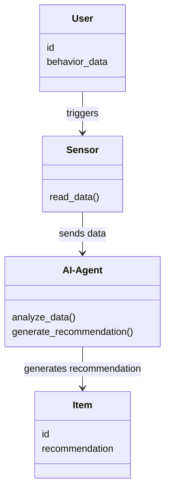

                 


# 智能浴室置物架：AI Agent的个人卫生习惯分析

> **关键词**：智能浴室置物架，AI Agent，个人卫生习惯，物联网技术，推荐算法，智能家居

> **摘要**：  
> 本文深入探讨了智能浴室置物架的设计与实现，结合AI Agent技术，分析个人卫生习惯，优化浴室环境。文章从背景与目标、技术基础、算法原理、系统设计、项目实战到优化与展望，全面解析智能浴室置物架的核心技术与应用场景，为智能家居和个人卫生管理提供创新解决方案。

---

## 第一部分: 智能浴室置物架的背景与概述

### 第1章: 智能浴室置物架的背景与目标

#### 1.1 问题背景
智能浴室置物架的设计初衷是解决传统浴室置物架功能单一、空间利用不足以及个人卫生习惯难以数字化的问题。现代家庭对智能家居的需求日益增长，浴室作为家庭的重要空间，亟需智能化解决方案。

#### 1.2 问题描述
传统浴室置物架仅具备放置物品的功能，无法满足用户对智能化、个性化卫生管理的需求。通过引入AI Agent和物联网技术，可以实现对用户卫生习惯的实时监测与智能推荐，优化浴室空间利用。

#### 1.3 问题解决思路
利用AI Agent和物联网技术，构建智能浴室置物架系统，实现对用户卫生习惯的数字化分析，并通过推荐算法优化浴室环境。

---

## 第二部分: AI Agent与物联网技术基础

### 第2章: AI Agent的核心原理

#### 2.1 AI Agent的基本概念
AI Agent是一种智能体，能够感知环境、执行任务并做出决策。在智能浴室置物架中，AI Agent用于分析用户行为数据，提供个性化建议。

#### 2.2 AI Agent的分类与应用
AI Agent可以分为简单反射型、基于模型型和目标驱动型。在浴室置物架中，目标驱动型AI Agent用于分析用户卫生习惯，优化置物架的使用。

#### 2.3 AI Agent的核心算法
AI Agent的核心算法包括机器学习算法和自然语言处理算法。在浴室置物架中，使用协同过滤算法进行用户行为分析，推荐最优置物方案。

---

### 第3章: 物联网技术在智能浴室置物架中的应用

#### 3.1 物联网的基本概念
物联网通过传感器和网络技术，实现设备间的数据交互。在浴室置物架中，物联网技术用于采集用户行为数据。

#### 3.2 物联网技术的核心组件
物联网系统包括传感器、通信模块和云端数据处理模块。在浴室置物架中，传感器用于监测用户的卫生习惯，云端处理数据并生成推荐。

#### 3.3 物联网在智能浴室置物架中的具体应用
通过物联网技术，智能浴室置物架能够实时监测用户的卫生习惯，优化置物架的使用，提升用户体验。

---

## 第三部分: 算法原理

### 第4章: 基于协同过滤的推荐算法

#### 4.1 算法原理
协同过滤是一种常用推荐算法，通过分析用户的相似性，推荐用户感兴趣的内容。在浴室置物架中，协同过滤用于分析用户的卫生习惯，推荐最优的置物方案。

#### 4.2 算法流程
1. 数据采集：通过传感器采集用户的卫生习惯数据。
2. 数据预处理：清洗数据，提取有用特征。
3. 计算相似度：使用余弦相似度计算用户间的相似度。
4. 生成推荐：基于相似度，推荐最优的置物方案。

#### 4.3 算法实现
```python
import numpy as np

def cosine_similarity(user_vector, item_vector):
    return np.dot(user_vector, item_vector) / (np.linalg.norm(user_vector) * np.linalg.norm(item_vector))

def collaborative_filtering(users, items):
    # 计算用户间相似度
    user_similarities = {}
    for user in users:
        user_similarities[user] = {}
        for other_user in users:
            if other_user != user:
                similarity = cosine_similarity(users[user], users[other_user])
                user_similarities[user][other_user] = similarity
    return user_similarities
```

---

## 第四部分: 系统分析与架构设计

### 第5章: 系统功能设计

#### 5.1 领域模型类图


---

## 第五部分: 项目实战

### 第6章: 项目实战

#### 6.1 环境安装
```bash
pip install numpy scikit-learn
```

#### 6.2 核心代码实现
```python
from sklearn.metrics.pairwise import cosine_similarity

def main():
    # 示例用户行为数据
    users = {
        'user1': [1, 0, 1],
        'user2': [0, 1, 1],
        'user3': [1, 1, 0]
    }

    # 计算相似度矩阵
    user_vectors = np.array([users[user] for user in users])
    similarity_matrix = cosine_similarity(user_vectors)

    print(similarity_matrix)

if __name__ == '__main__':
    main()
```

---

## 第六部分: 优化与展望

### 第7章: 优化与展望

#### 7.1 小结
智能浴室置物架通过AI Agent和物联网技术，实现了对用户卫生习惯的智能化分析与优化，为智能家居和个人卫生管理提供了创新解决方案。

#### 7.2 注意事项
在实际应用中，需注意数据隐私保护和系统稳定性，确保用户体验。

#### 7.3 拓展阅读
推荐阅读相关领域的书籍和论文，深入研究AI Agent和物联网技术的最新进展。

---

**作者：AI天才研究院（AI Genius Institute） & 禅与计算机程序设计艺术（Zen And The Art of Computer Programming）**

