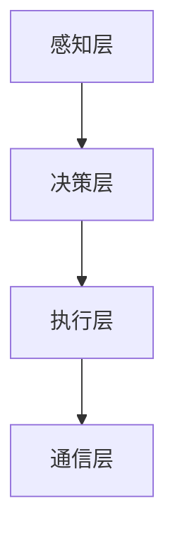
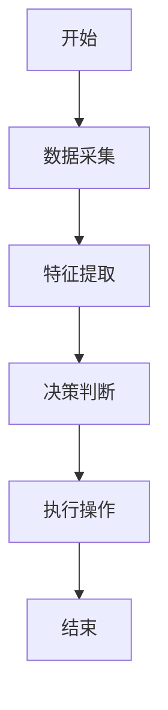

                 


# 智能浴室置物架：AI Agent的个人卫生习惯改善

> 关键词：智能浴室置物架、AI Agent、个人卫生习惯、物联网、智能家居

> 摘要：本文探讨了智能浴室置物架的设计与实现，结合AI Agent技术，通过数据分析和智能决策，改善个人卫生习惯。文章详细介绍了系统的背景、核心原理、算法流程、系统架构，并通过项目实战和最佳实践提供全面的技术指导。

---

## 第一部分：背景与概述

### 第1章：智能浴室置物架的背景与目标

#### 1.1 问题背景
现代浴室中，置物架的设计和使用存在诸多痛点：空间利用不合理、物品摆放混乱、缺乏智能化管理。这些问题不仅影响用户体验，还可能导致卫生习惯不佳，影响健康。

#### 1.2 问题描述
传统浴室置物架功能单一，无法根据用户习惯调整布局。物品摆放不当可能导致滑落或霉变，影响卫生。用户行为的多样性和环境因素（如湿度、温度）进一步加剧了这些问题。

#### 1.3 问题解决与目标
通过引入AI Agent技术，智能浴室置物架能够实时感知环境和用户行为，优化物品摆放，提升卫生习惯。目标用户包括注重卫生的家庭和个人，尤其是有小孩或老人的家庭。

#### 1.4 技术基础与研究现状
AI Agent技术在智能家居中的应用逐渐普及，但将其应用于浴室置物架尚属创新。现有研究主要集中在智能硬件和物联网技术，本文将结合这些技术实现智能置物架。

---

## 第二部分：核心概念与联系

### 第2章：AI Agent的核心原理

#### 2.1 AI Agent的基本原理
AI Agent通过感知环境、分析数据、做出决策并执行操作。感知层使用传感器收集数据，决策层基于数据做出判断，执行层调整物品摆放。

#### 2.2 核心概念对比
| 特性       | 传统置物架       | AI Agent置物架     |
|------------|------------------|---------------------|
| 功能       | 简单摆放         | 智能识别与调整     |
| 智能化     | 无               | 高度智能化         |
| 用户体验   | 不佳             | 优化                |

#### 2.3 系统架构
使用Mermaid图展示系统架构，包括感知层、决策层、执行层和通信层。



---

## 第三部分：算法原理讲解

### 第3章：AI Agent的算法实现

#### 3.1 算法流程
使用Mermaid流程图展示AI Agent的工作流程：



#### 3.2 数学模型
使用基于距离的物体识别算法，公式如下：

$$
\text{距离} = \sqrt{(x_2 - x_1)^2 + (y_2 - y_1)^2}
$$

---

## 第四部分：系统分析与架构设计

### 第4章：系统架构设计

#### 4.1 项目介绍
智能浴室置物架旨在通过AI技术优化物品摆放，改善卫生习惯。

#### 4.2 系统功能设计
- 物品识别
- 智能摆放
- 环境监测

#### 4.3 系统架构
使用Mermaid图展示系统架构：


---

## 第五部分：项目实战

### 第5章：环境安装与代码实现

#### 5.1 环境安装
安装Python、TensorFlow等库：

```bash
pip install numpy tensorflow
```

#### 5.2 核心代码实现
提供物体识别的Python代码：

```python
import numpy as np
import tensorflow as tf

# 数据预处理
def preprocess_image(image):
    # 缩放图像到合适尺寸
    resized = tf.image.resize(image, (100, 100))
    return resized / 255.0

# 模型训练
def train_model():
    model = tf.keras.Sequential([
        tf.keras.layers.Conv2D(32, (3,3), activation='relu', input_shape=(100, 100, 3)),
        tf.keras.layers.MaxPooling2D((2,2)),
        tf.keras.layers.Flatten(),
        tf.keras.layers.Dense(128, activation='relu'),
        tf.keras.layers.Dense(1, activation='sigmoid')
    ])
    model.compile(optimizer='adam', loss='binary_crossentropy', metrics=['accuracy'])
    return model

# 使用预训练模型
model = train_model()
model.save('bathroom_item.h5')
```

#### 5.3 代码解读
代码实现物体识别功能，模型训练后用于分类物品类型。

---

## 第六部分：最佳实践

### 第6章：总结与展望

#### 6.1 小结
本文详细介绍了智能浴室置物架的设计与实现，结合AI Agent技术优化卫生习惯。

#### 6.2 注意事项
数据隐私保护、系统维护等注意事项。

#### 6.3 拓展阅读
建议阅读相关书籍和文献，深入了解AI技术在智能家居中的应用。

---

## 作者信息

作者：AI天才研究院/AI Genius Institute & 禅与计算机程序设计艺术 /Zen And The Art of Computer Programming

---

**本文为《智能浴室置物架：AI Agent的个人卫生习惯改善》的完整目录和内容概要，后续将根据需求扩展为详细文章。**

