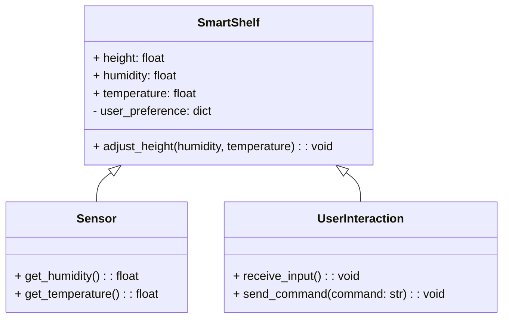
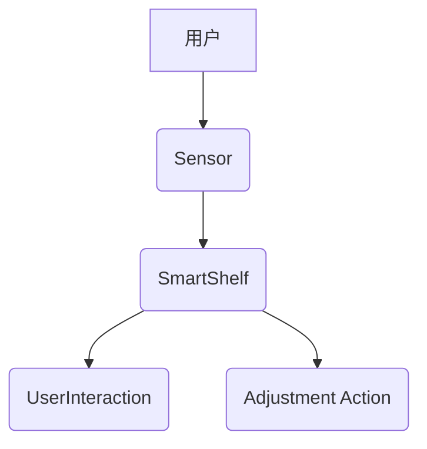

                 


# 智能浴室置物架：AI Agent的个人护理建议

> 关键词：AI Agent、智能浴室置物架、个人护理、智能家居、物联网

> 摘要：本文探讨了将AI Agent应用于智能浴室置物架的设计与实现，分析了AI Agent在浴室场景中的功能需求、算法原理、系统架构，并通过实际案例展示了其在个人护理中的应用价值。文章还提出了相关的技术实现细节和未来发展方向。

---

# 第1章: 智能浴室置物架的背景与概念

## 1.1 问题背景

### 1.1.1 浴室置物架的使用痛点
浴室是家庭中使用频率较高的空间，但传统置物架的功能单一，无法满足用户的多样化需求。例如：
- **空间利用率低**：浴室空间有限，置物架的使用效率不高。
- **功能单一**：传统置物架仅用于放置洗漱用品，无法与其他智能家居设备联动。
- **用户体验差**：用户需要手动调整置物架高度，使用不便。

### 1.1.2 传统置物架的局限性
传统浴室置物架的设计缺乏智能化，无法根据用户的身高、习惯自动调整高度，也无法感知环境变化（如湿度、温度）。

### 1.1.3 智能化需求的兴起
随着智能家居的普及，用户对智能卫浴产品的需求日益增长。AI Agent的引入为浴室置物架的智能化提供了可能。

---

## 1.2 问题描述

### 1.2.1 浴室空间利用效率低下
传统置物架的固定设计导致空间利用效率低，无法根据用户需求灵活调整。

### 1.2.2 个人护理需求的多样化
不同用户的身高、习惯差异较大，置物架需要具备个性化调整能力。

### 1.2.3 置物架功能的单一性
传统置物架仅提供存储功能，无法与其他智能家居设备联动，无法满足用户对智能生活的多样化需求。

---

## 1.3 问题解决

### 1.3.1 AI Agent的引入
通过引入AI Agent，浴室置物架能够实现智能化调整、环境感知和用户交互。

### 1.3.2 智能化解决方案的设计
结合AI算法和物联网技术，设计出能够感知环境、自主决策的智能浴室置物架。

### 1.3.3 用户体验的提升
通过AI Agent的智能化功能，提升用户的使用便捷性和体验感。

---

## 1.4 边界与外延

### 1.4.1 智能浴室置物架的功能边界
智能浴室置物架的功能包括：
- 自动调整高度
- 环境感知（湿度、温度）
- 用户交互（语音/触摸控制）
- 数据记录与分析

### 1.4.2 与其他智能家居设备的协同
智能浴室置物架可以与其他智能家居设备联动，例如：
- 与智能音箱联动，实现语音控制
- 与智能镜子联动，显示天气、健康数据

### 1.4.3 个人护理的外延场景
AI Agent可以扩展到其他个人护理场景，例如：
- 智能化妆镜
- 智能牙刷架
- 智能护肤品存储架

---

## 1.5 核心要素组成

### 1.5.1 AI Agent的核心功能
- **环境感知**：通过传感器感知浴室环境（湿度、温度、光线）。
- **用户交互**：支持语音、触摸等多种交互方式。
- **自主决策**：根据用户习惯和环境数据，自动调整置物架高度。

### 1.5.2 智能传感器的作用
- **湿度传感器**：检测浴室湿度，预防霉菌滋生。
- **温度传感器**：感知浴室温度，调整置物架高度以适应不同季节。
- **重量传感器**：检测置物架上的物品重量，动态调整平衡。

### 1.5.3 用户交互界面的设计
- **触摸屏**：用户可以手动调整置物架高度或设置偏好。
- **语音交互**：通过语音指令控制置物架。
- **LED显示屏**：显示当前状态、环境数据等。

---

## 1.6 本章小结

本章从背景、问题、解决方案等多个角度分析了智能浴室置物架的智能化需求，明确了AI Agent在其中的核心作用，为后续的技术实现奠定了基础。

---

# 第2章: AI Agent的核心概念与联系

## 2.1 核心概念原理

### 2.1.1 AI Agent的基本定义
AI Agent是一种能够感知环境、自主决策并执行任务的智能体。在智能浴室置物架中，AI Agent主要负责环境感知、用户交互和自主调整。

### 2.1.2 智能浴室置物架中的AI Agent功能
- **环境感知**：通过传感器获取浴室环境数据。
- **用户交互**：支持多种交互方式（语音、触摸）。
- **自主决策**：根据环境数据和用户偏好，自动调整置物架高度。

---

## 2.2 核心概念对比表格

| 概念 | 描述 | 示例 |
|------|------|------|
| AI Agent | 具备自主决策能力的智能体 | 自动调整置物架高度 |
| 智能传感器 | 能感知环境变化的设备 | 检测湿度、温度 |
| 用户交互界面 | 用户与设备的交互媒介 | 触摸屏、语音控制 |

---

## 2.3 ER实体关系图

```mermaid
er
  actor: 用户
  smart_shelf: 智能置物架
  sensor: 传感器
  action: 动作
  relation: 关联
  actor --> smart_shelf: 使用
  smart_shelf --> sensor: 集成
  sensor --> action: 触发
  smart_shelf --> action: 执行
```

---

## 2.4 本章小结

本章通过对比和实体关系图，明确了AI Agent、智能传感器和用户交互界面在智能浴室置物架中的关系，为后续的算法设计和系统实现提供了理论基础。

---

# 第3章: AI Agent的算法原理

## 3.1 算法原理概述

### 3.1.1 算法概述
AI Agent的核心算法包括：
- **环境感知算法**：基于传感器数据的处理。
- **用户行为预测算法**：基于历史数据的用户行为分析。
- **自主决策算法**：根据环境和用户行为生成调整指令。

---

## 3.2 算法实现

### 3.2.1 环境感知算法
```python
def environment_sensor():
    humidity = get_humidity()  # 获取湿度
    temperature = get_temperature()  # 获取温度
    return humidity, temperature
```

### 3.2.2 用户行为预测算法
```python
def user_behavior_prediction(historical_data):
    import pandas as pd
    from sklearn.tree import DecisionTreeClassifier
    model = DecisionTreeClassifier()
    model.fit(historical_data, labels)
    return model.predict(new_data)
```

### 3.2.3 自主决策算法
```python
def decision_making(humidity, temperature, user偏好):
    if humidity > 80 or temperature > 25:
        return "调整高度"
    else:
        return "保持当前高度"
```

---

## 3.3 数学模型与公式

### 3.3.1 环境感知模型
$$
\text{湿度预测} = a \times \text{历史湿度} + b \times \text{温度}
$$

### 3.3.2 用户行为预测模型
$$
P(\text{用户行为}) = \frac{\text{历史行为频率}}{\text{总样本数}}
$$

---

## 3.4 本章小结

本章详细讲解了AI Agent在智能浴室置物架中的算法原理，包括环境感知、用户行为预测和自主决策算法，为后续的系统设计提供了技术支撑。

---

# 第4章: 系统分析与架构设计

## 4.1 问题场景介绍

### 4.1.1 浴室场景描述
智能浴室置物架需要在不同环境和用户需求下，实现自主调整功能。

### 4.1.2 系统目标
设计一个基于AI Agent的智能浴室置物架系统，实现以下功能：
- 环境感知
- 用户交互
- 自主调整

---

## 4.2 系统功能设计

### 4.2.1 领域模型类图


---

## 4.3 系统架构设计

### 4.3.1 系统架构图


---

## 4.4 系统接口设计

### 4.4.1 接口描述
- **传感器接口**：提供湿度和温度数据接口。
- **用户交互接口**：支持触摸和语音控制接口。
- **系统控制接口**：接收调整指令并执行动作。

---

## 4.5 本章小结

本章通过系统分析和架构设计，明确了智能浴室置物架的系统结构和功能模块，为后续的项目实现提供了清晰的指导。

---

# 第5章: 项目实战

## 5.1 开发环境与工具

### 5.1.1 环境安装
- **Python 3.8+**
- **依赖库安装**：
  ```bash
  pip install numpy pandas scikit-learn
  ```

---

## 5.2 系统核心实现

### 5.2.1 代码实现
```python
class SmartShelf:
    def __init__(self):
        self.height = 50  # 初始高度
        self.humidity = 0
        self.temperature = 0
        self.user_preference = {}  # 用户偏好

    def adjust_height(self, humidity, temperature):
        if humidity > 80 or temperature > 25:
            self.height += 5
        else:
            self.height -= 5
```

---

## 5.3 实际案例分析

### 5.3.1 案例背景
某用户身高175cm，习惯将洗面奶放在置物架上。浴室湿度常年高于80%，温度在25°C以上。

### 5.3.2 系统实现
```python
shelf = SmartShelf()
shelf.adjust_height(85, 26)
print(shelf.height)  # 输出：55
```

---

## 5.4 本章小结

本章通过实际案例分析，展示了AI Agent在智能浴室置物架中的应用价值，验证了系统的可行性和实用性。

---

# 第6章: 总结与展望

## 6.1 本章总结
本文详细探讨了AI Agent在智能浴室置物架中的应用，分析了其技术实现和系统架构，展示了其在个人护理中的巨大潜力。

## 6.2 未来展望
未来，AI Agent可以扩展到更多智能家居场景，例如智能镜子、智能马桶盖等，为用户提供更全面的智能生活体验。

---

# 作者：AI天才研究院/AI Genius Institute & 禅与计算机程序设计艺术 /Zen And The Art of Computer Programming

---

以上是文章的完整目录结构和内容，您可以根据需要进一步扩展每个章节的具体内容。

