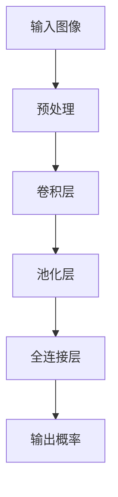
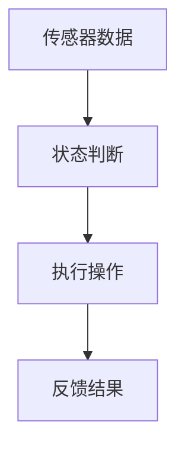
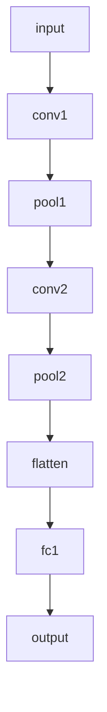
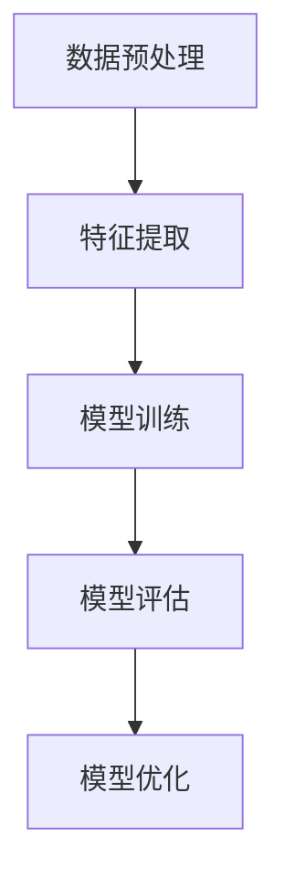
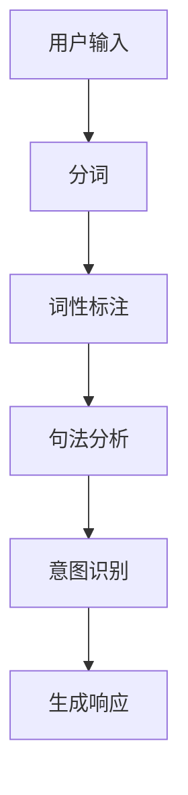
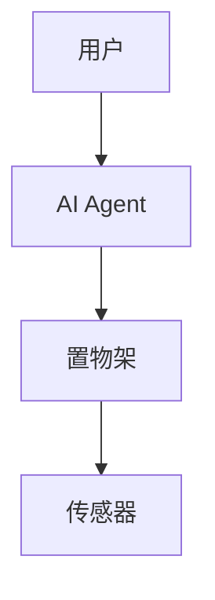
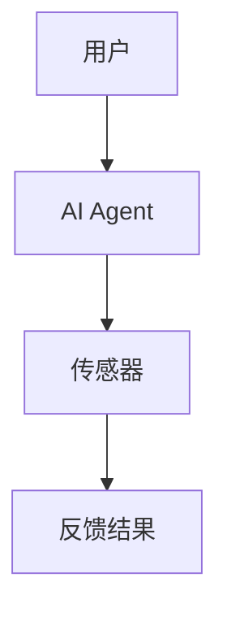

                 


# 智能浴室置物架：AI Agent的洗护用品管理

## 关键词：智能浴室、AI Agent、洗护用品管理、物联网、智能家居

## 摘要：本文探讨智能浴室置物架如何利用AI Agent实现洗护用品的智能化管理，分析其背后的技术原理、系统架构及实际应用。

---

# 第1章: 智能浴室置物架的背景介绍

## 1.1 问题背景与需求分析

### 1.1.1 浴室空间管理的痛点
现代浴室空间有限，洗护用品管理混乱，导致使用不便。传统置物架功能单一，无法满足智能化需求。

### 1.1.2 洗护用品管理的难点
用户难以高效管理洗护用品，存在过期、遗漏等问题，影响使用体验。

### 1.1.3 智能化管理的需求
用户需要智能化工具来优化浴室空间利用和洗护用品管理，提升生活品质。

## 1.2 问题描述与目标设定

### 1.2.1 浴室置物架的功能需求
- 物理结构设计
- 智能化管理功能
- 人机交互界面

### 1.2.2 洗护用品管理的智能化目标
- 自动识别与分类
- 使用情况监控
- 自动补货提醒

### 1.2.3 边界与外延
- 系统功能边界
- 外部接口限制
- 用户体验范围

## 1.3 智能浴室置物架的核心要素

### 1.3.1 物理结构设计
- 多层置物模块
- 智能传感器集成
- 灵活布局设计

### 1.3.2 AI Agent的核心功能
- 自然语言处理（NLP）
- 物体识别与位置检测
- 自动控制与反馈机制

### 1.3.3 系统架构与交互流程
- 系统架构图
- 交互流程图
- 数据流设计

---

# 第2章: AI Agent的核心概念与原理

## 2.1 AI Agent的基本概念

### 2.1.1 AI Agent的定义
AI Agent是一个智能实体，能够感知环境并采取行动以实现目标。

### 2.1.2 AI Agent的核心特征
- 感知能力
- 决策能力
- 执行能力

### 2.1.3 AI Agent与传统自动化设备的区别
| 特性 | AI Agent | 传统自动化设备 |
|------|-----------|----------------|
| 智能性 | 高        | 低             |
| 适应性 | 强        | 弱             |
| 学习能力 | 有       | 无             |

## 2.2 AI Agent在智能浴室置物架中的应用

### 2.2.1 自然语言处理（NLP）的应用
- 用户指令解析
- 信息抽取与分类
- 生成自然语言响应

### 2.2.2 物体识别与位置检测
- 基于CNN的物体识别流程图


### 2.2.3 自动控制与反馈机制
- 系统控制流程图


## 2.3 AI Agent的核心算法与技术

### 2.3.1 基于深度学习的物体识别
- AlexNet网络结构


### 2.3.2 基于NLP的意图识别
- 模型训练流程


---

# 第3章: AI Agent的算法原理与实现

## 3.1 自然语言处理（NLP）算法

### 3.1.1 NLP算法的流程图


### 3.1.2 基于词嵌入的意图识别
- 嵌入向量计算公式
$$ \text{嵌入向量} = \text{模型}(输入文本) $$

### 3.1.3 案例分析
- 用户输入：'我需要使用洗面奶'
- 分词结果：['我', '需要', '使用', '洗面奶']
- 意图识别：['获取洗面奶']

## 3.2 物体识别算法

### 3.2.1 基于卷积神经网络（CNN）的物体识别
- 网络结构示意图


### 3.2.2 检测算法的流程
- 物体识别流程图


---

# 第4章: 系统架构与交互设计

## 4.1 问题场景介绍

### 4.1.1 浴室环境
- 空间有限
- 设备集中

### 4.1.2 用户需求
- 空间管理
- 物品管理
- 交互便捷

## 4.2 系统功能设计

### 4.2.1 领域模型设计
- 置物架模块
- AI Agent模块
- 用户交互模块

### 4.2.2 系统架构图


## 4.3 接口与交互设计

### 4.3.1 系统接口设计
- 用户输入接口
- 系统反馈接口
- 设备控制接口

### 4.3.2 交互流程图


---

# 第5章: 项目实战与应用

## 5.1 项目环境与工具安装

### 5.1.1 开发环境
- Python 3.8+
- PyTorch 1.9+
- OpenCV 4.5+

### 5.1.2 项目依赖安装
```bash
pip install torch torchvision transformers
```

## 5.2 系统核心实现

### 5.2.1 AI Agent代码实现
```python
class AIAgent:
    def __init__(self):
        self.nlp_model = NLPModel()
        self.vision_model = VisionModel()

    def process_command(self, command):
        intent = self.nlp_model.predict(command)
        return intent
```

### 5.2.2 物体识别代码示例
```python
def object_detection(image):
    outputs = model(image)
    return outputs
```

## 5.3 代码应用解读

### 5.3.1 AI Agent功能实现
- 用户输入处理
- 意图识别与分类
- 系统反馈生成

### 5.3.2 物体识别功能实现
- 图像预处理
- 模型推理
- 结果解析

## 5.4 实际案例分析

### 5.4.1 案例一：洗护用品分类
- 输入：'我需要使用洗面奶'
- 输出：'洗面奶已分类至指定位置'

### 5.4.2 案例二：库存管理
- 输入：'检查洗发水存量'
- 输出：'洗发水存量正常'

## 5.5 项目小结

### 5.5.1 核心代码回顾
```python
class AIAgent:
    def process_command(self, command):
        intent = self.nlp_model.predict(command)
        return intent
```

### 5.5.2 项目总结
项目通过AI Agent实现了智能浴室置物架的洗护用品管理，提升了用户体验。

---

# 第6章: 总结与展望

## 6.1 总结
智能浴室置物架结合AI Agent实现了智能化管理，提升了用户体验和管理效率。

## 6.2 未来展望
进一步优化算法，扩展应用场景，推动智能家居的普及。

## 6.3 小结
AI Agent在智能浴室置物架中的应用前景广阔，值得深入研究和推广。

## 6.4 注意事项
- 数据隐私保护
- 系统稳定性保障
- 用户操作简便性

## 6.5 拓展阅读
推荐相关书籍和资源，供读者深入学习。

---

# 作者：AI天才研究院/AI Genius Institute & 禅与计算机程序设计艺术 /Zen And The Art of Computer Programming

---

本文详细探讨了智能浴室置物架如何利用AI Agent实现洗护用品的智能化管理，分析了其背后的技术原理、系统架构及实际应用。

