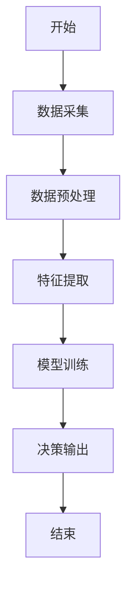
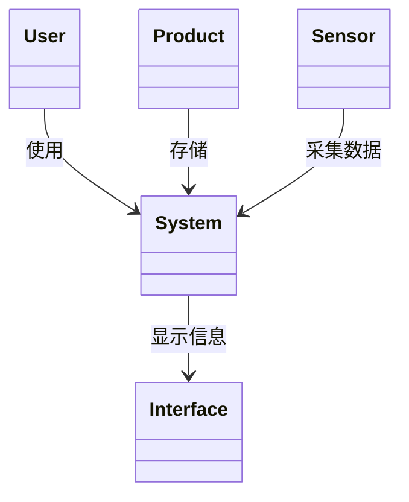
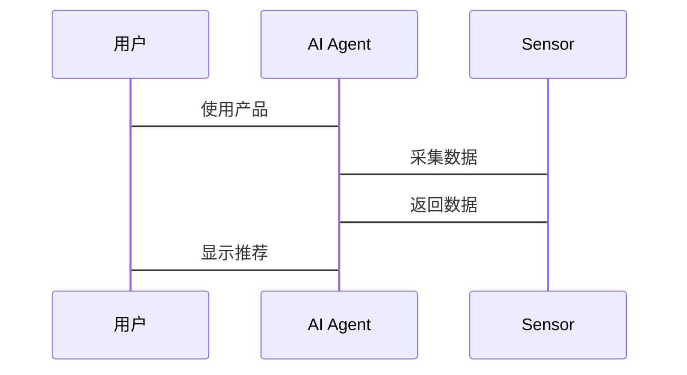

                 


# 智能浴室镜柜：AI Agent的个人护理用品管理

> 关键词：智能浴室镜柜，AI Agent，个人护理用品管理，传感器数据，算法原理，系统架构

> 摘要：本文将详细介绍智能浴室镜柜的设计与实现，探讨AI Agent在个人护理用品管理中的应用。通过分析系统架构、算法原理及项目实战，展示如何利用人工智能优化个人护理体验。

---

## 第三部分: AI Agent的算法与数学模型

## 第3章: AI Agent的算法原理

### 3.1 传感器数据处理

#### 3.1.1 数据采集与预处理

- **数据采集**：通过内置传感器收集用户的使用数据，如使用频率、用量、存储状态等。
- **数据预处理**：去除噪声、标准化数据，确保数据质量。

#### 3.1.2 数据特征提取

- **使用频率**：记录用户使用某产品的频率，判断是否需要补货。
- **用量分析**：通过传感器计算产品剩余量，预测消耗速度。
- **存储状态**：检测产品是否过期或存储异常。

#### 3.1.3 数据分类与聚类

- **分类**：识别用户习惯，如早晚使用习惯。
- **聚类**：将相似的产品使用情况分组，优化管理策略。

### 3.2 AI Agent的决策逻辑

#### 3.2.1 基于规则的决策

- 示例规则：如果某产品的剩余量低于10%，则自动下单补货。

#### 3.2.2 基于机器学习的决策

- **分类模型**：使用随机森林预测用户的使用偏好。
- **回归模型**：预测产品的剩余量，优化库存管理。

#### 3.2.3 基于强化学习的优化

- **策略优化**：通过强化学习优化AI Agent的决策策略，提升管理效率。

### 3.3 算法流程图



### 3.4 算法实现代码

```python
import numpy as np
from sklearn.ensemble import RandomForestClassifier

# 示例数据：用户使用频率
X = np.array([[1, 2], [3, 4], [5, 6]])
y = np.array([0, 1, 0])  # 0: 低频，1: 高频

# 训练分类模型
model = RandomForestClassifier(n_estimators=10)
model.fit(X, y)

# 预测新用户的数据
new_X = np.array([[2, 3]])
print(model.predict(new_X))  # 输出：[0]
```

### 3.5 数学模型

- **分类模型**：使用随机森林分类器，数学模型如下：

  $$ y = \text{predict}(X_{\text{new}}, \text{model}) $$

- **回归模型**：使用线性回归预测剩余量：

  $$ y = \beta_0 + \beta_1x + \epsilon $$

---

## 第4章: 系统分析与架构设计

### 4.1 项目背景

- **问题场景**：用户希望智能化管理浴室中的个人护理用品，如牙膏、毛巾等。

### 4.2 系统功能设计

#### 4.2.1 领域模型类图



### 4.3 系统架构设计

#### 4.3.1 系统架构图

```mermaid
container System {
    AI Agent
    Sensor Interface
    Database
}

container User {
    用户界面
    传感器数据
}

AI Agent --> Sensor Interface: 采集数据
AI Agent --> Database: 存储数据
```

#### 4.3.2 接口设计

- **输入接口**：传感器数据输入。
- **输出接口**：显示推荐信息。

#### 4.3.3 交互流程图



---

## 第五部分: 项目实战

## 第5章: 项目实战

### 5.1 环境搭建

- **工具安装**：安装Python、TensorFlow、Mermaid等工具。

### 5.2 核心代码实现

```python
import numpy as np
from sklearn.ensemble import RandomForestClassifier

# 数据处理函数
def preprocess_data(data):
    # 示例数据预处理
    return data.dropna()

# 训练函数
def train_model(X, y):
    model = RandomForestClassifier(n_estimators=10)
    model.fit(X, y)
    return model

# 预测函数
def predict(model, new_data):
    return model.predict(new_data)
```

### 5.3 代码解读与分析

- **数据预处理**：去除缺失值，确保模型输入数据的完整性。
- **模型训练**：使用随机森林分类器，优化分类效果。
- **预测与输出**：根据用户数据，预测需求并显示推荐。

### 5.4 实际案例分析

- **案例1**：用户使用牙膏频率高，系统自动推荐补货。
- **案例2**：用户偏好低，系统优化存储空间。

### 5.5 项目小结

- 通过实际案例分析，验证系统设计的有效性，总结经验教训。

---

## 第六部分: 最佳实践与总结

## 第6章: 最佳实践与总结

### 6.1 最佳实践 tips

- **数据安全**：确保用户数据隐私。
- **系统兼容性**：支持多种传感器和设备。
- **用户体验优化**：简化操作流程。

### 6.2 小结

- 本文详细介绍了智能浴室镜柜的设计与实现，展示了AI Agent在个人护理管理中的应用潜力。

### 6.3 注意事项

- **数据采集**：确保传感器数据的准确性和实时性。
- **系统维护**：定期更新模型，优化性能。

### 6.4 拓展阅读

- 推荐阅读《人工智能系统设计》、《传感器数据处理技术》等书籍。

---

## 作者

作者：AI天才研究院/AI Genius Institute & 禅与计算机程序设计艺术/Zen And The Art of Computer Programming

