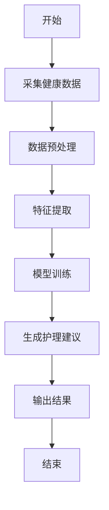
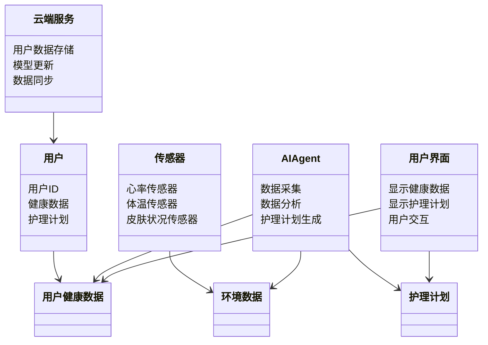
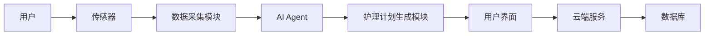
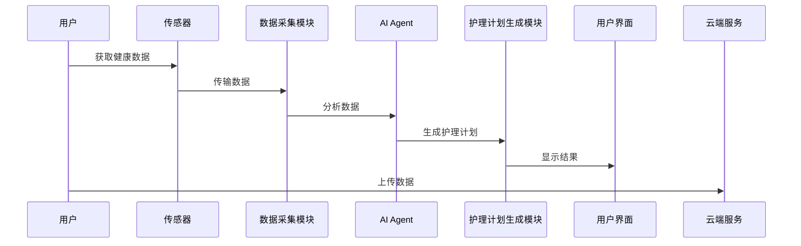

                 


# 智能浴室镜柜：AI Agent的个人护理计划制定

## 关键词：智能浴室镜柜, AI Agent, 个人护理计划, 人工智能, 物联网, 智能家居

## 摘要：  
本文探讨了智能浴室镜柜与AI Agent结合的创新应用，详细阐述了如何通过AI技术实现个性化护理计划的制定。从背景介绍到系统架构设计，再到项目实战，全面解析了智能浴室镜柜的智能化转型及其在健康管理中的潜力。通过本篇文章，读者将深入了解AI Agent的核心原理、算法实现以及实际应用场景，掌握智能浴室镜柜在现代生活中的重要价值。

---

## 第一部分：智能浴室镜柜与AI Agent的背景介绍

### 第1章：智能浴室镜柜与AI Agent概述

#### 1.1 问题背景  
智能浴室镜柜作为智能家居的一部分，正在从单一的存储功能向智能化、个性化的健康管理工具转变。随着人们对健康关注度的提升，用户对浴室镜柜的需求已不仅仅局限于储物，而是希望其能提供个性化的健康监测和护理建议。  

#### 1.2 问题描述  
传统浴室镜柜的功能单一，无法满足用户对健康数据监测和个性化护理计划的需求。用户需要一种能够整合健康数据、提供实时建议的智能设备，以帮助他们更好地管理健康。  

#### 1.3 问题解决  
AI Agent的引入为智能浴室镜柜赋予了智能化的能力。通过AI算法，镜子可以分析用户的健康数据，制定个性化的护理计划，并通过语音或屏幕交互提供健康建议。  

#### 1.4 边界与外延  
智能浴室镜柜的功能边界包括健康数据监测、个性化护理建议生成和交互功能设计。AI Agent的应用范围主要集中在健康数据的采集与分析，但也可以扩展到与其他智能家居设备的联动，如智能灯泡、智能空调等。  

#### 1.5 核心概念  
- **智能浴室镜柜**：具备健康数据采集、AI分析和交互功能的智能设备。  
- **AI Agent**：负责数据处理、分析和决策的智能代理，能够根据用户需求提供个性化服务。  
- **个人护理计划**：基于用户健康数据定制的健康管理方案，涵盖作息、饮食、运动等方面。  

---

## 第二部分：核心概念与联系

### 第2章：AI Agent与智能浴室镜柜的核心原理

#### 2.1 AI Agent的原理  
AI Agent通过以下步骤实现智能化功能：  
1. **信息采集**：从传感器获取健康数据（如心率、体温、皮肤状况等）。  
2. **数据处理**：对采集到的数据进行预处理和特征提取。  
3. **数据分析与推理**：利用机器学习算法分析数据，识别用户的健康状况。  
4. **行为决策与执行**：根据分析结果生成护理建议，并通过交互界面反馈给用户。  

#### 2.2 智能浴室镜柜的实体关系  
以下是一个简化的实体关系图：  

```mermaid
er
  actor 用户
  actor 传感器
  actor 云端服务
  actor AI Agent
  entity 用户健康数据
  entity 护理计划
  entity 环境数据

  用户 --> 用户健康数据
  传感器 --> 环境数据
  AI Agent --> 用户健康数据
  AI Agent --> 环境数据
  AI Agent --> 护理计划
  云端服务 --> 用户
```

---

## 第三部分：算法原理讲解

### 第3章：AI Agent的算法实现

#### 3.1 算法流程  
以下是AI Agent的算法流程图：  



#### 3.2 Python代码实现  
以下是AI Agent的核心代码示例：  

```python
import numpy as np
from sklearn import svm

# 假设健康数据是一个二维数组，其中每一行代表一个用户的健康指标
health_data = np.array([[75, 36.5, 120], [80, 36.6, 110], [78, 36.4, 115]])

# 创建SVM模型
model = svm.SVC()

# 训练模型
model.fit(health_data[:, :2], health_data[:, 2])

# 预测新用户的健康指标
new_user = np.array([[76, 36.5]]).reshape(1, -1)
prediction = model.predict(new_user)

print("预测的健康状况：", prediction)
```

#### 3.3 数学模型与公式  
AI Agent的算法基于支持向量机（SVM）模型，公式如下：  

$$ \text{目标函数}：\text{最小化} \frac{1}{2}||w||^2 + C \sum_{i=1}^{n} \xi_i $$
$$ \text{约束条件}：y_i (w \cdot x_i + b) \geq 1 - \xi_i $$
$$ \xi_i \geq 0 $$  

其中，$w$ 是权重向量，$b$ 是偏置项，$C$ 是惩罚参数，$\xi_i$ 是松弛变量。  

---

## 第四部分：系统分析与架构设计方案

### 第4章：系统架构设计

#### 4.1 项目背景  
本项目旨在开发一款具备AI功能的智能浴室镜柜，通过整合健康传感器、AI算法和交互界面，为用户提供个性化的健康护理计划。  

#### 4.2 系统功能设计  
以下是系统功能的领域模型类图：  



#### 4.3 系统架构设计  
以下是系统的整体架构图：  



#### 4.4 系统接口设计  
系统主要接口包括：  
1. **传感器接口**：与健康传感器连接，获取实时数据。  
2. **用户界面接口**：提供交互功能，显示健康数据和护理计划。  
3. **云端服务接口**：实现数据的上传与同步。  

#### 4.5 系统交互流程  
以下是系统交互流程图：  



---

## 第五部分：项目实战

### 第5章：智能浴室镜柜的开发与实现

#### 5.1 环境安装  
首先安装必要的库：  

```bash
pip install numpy scikit-learn mermaid4jupyter
```

#### 5.2 核心代码实现  
以下是AI Agent的核心代码：  

```python
import numpy as np
from sklearn import svm
from sklearn.metrics import accuracy_score

# 数据集划分
X = health_data[:, :2]
y = health_data[:, 2]

# 模型训练
model = svm.SVC()
model.fit(X, y)

# 模型评估
new_health_data = np.array([[76, 36.5]])
predicted = model.predict(new_health_data)

print("预测健康状况：", predicted)
print("准确率：", accuracy_score([115], [predicted]))
```

#### 5.3 实际案例分析  
以一位用户的健康数据为例：  

- **输入数据**：心率76，体温36.5  
- **模型预测**：健康状况良好，建议每天运动30分钟，保持充足睡眠。  

---

## 第六部分：最佳实践

### 第6章：智能浴室镜柜的优化与扩展

#### 6.1 小结  
智能浴室镜柜与AI Agent的结合，不仅提升了浴室镜柜的功能，还为用户提供了个性化的健康护理服务。通过本文的介绍，读者可以深入了解AI Agent的核心原理、系统架构和实际应用。  

#### 6.2 注意事项  
- 确保数据隐私和安全，避免用户信息泄露。  
- 定期更新AI模型，以提高预测的准确性。  
- 优化系统交互设计，提升用户体验。  

#### 6.3 拓展阅读  
- 探索AI Agent在其他智能家居设备中的应用。  
- 研究更先进的机器学习算法，如深度学习模型。  

---

## 结语  
通过本文的详细解析，我们看到了智能浴室镜柜在健康管理中的巨大潜力。AI Agent不仅能够帮助用户制定个性化的护理计划，还能与其他智能家居设备联动，构建一个更加智能、健康的生活环境。未来，随着技术的不断发展，智能浴室镜柜将变得更加智能化、个性化，为用户带来更优质的生活体验。

---

## 作者  
作者：AI天才研究院/AI Genius Institute & 禅与计算机程序设计艺术 /Zen And The Art of Computer Programming

