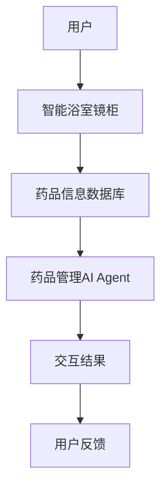

                 


# 智能浴室镜柜：AI Agent的药品管理

## 关键词：智能浴室镜柜，AI Agent，药品管理，语音识别，自然语言处理，机器学习，系统架构

## 摘要：  
本文详细探讨了智能浴室镜柜中AI Agent的药品管理系统的实现。通过分析AI Agent的核心概念、技术基础、系统设计、项目实战以及优化与扩展，本文为读者提供了一套完整的解决方案。从背景介绍到系统架构设计，再到项目实现和优化，本文为智能浴室镜柜的药品管理提供了深入的技术解析和实践指导。

---

# 第一部分: 智能浴室镜柜与AI Agent概述

## 第1章: 背景介绍

### 1.1 问题背景与描述

#### 1.1.1 智能浴室镜柜的发展趋势  
随着智能家居的普及，浴室镜柜的功能不再局限于简单的储物和反射。现代智能浴室镜柜集成了多种智能技术，例如触控屏幕、语音交互、环境监测等，能够为用户提供更加便捷和智能的使用体验。  

#### 1.1.2 药品管理的智能化需求  
药品管理是家庭生活中常见的需求，但传统药品管理方式存在诸多痛点：药品分类混乱、使用记录缺失、过期提醒不足等。通过智能化的药品管理，可以显著提升用户体验，减少药品浪费，保障用药安全。  

#### 1.1.3 AI Agent在智能硬件中的应用  
AI Agent（智能代理）是一种能够感知环境、自主决策并执行任务的智能系统。在智能硬件中，AI Agent可以通过语音交互、传感器数据处理等方式，为用户提供智能化的服务，例如智能音箱、智能助手等。  

### 1.2 问题解决与边界

#### 1.2.1 药品管理的核心问题  
药品管理的核心问题包括：药品分类与存储、药品使用记录、药品过期提醒等。这些问题可以通过智能化的系统实现自动化管理。  

#### 1.2.2 AI Agent在药品管理中的作用  
AI Agent可以实现药品信息的智能化管理，例如通过语音交互查询药品信息、自动记录药品使用情况、智能提醒药品过期等。  

#### 1.2.3 系统的边界与外延  
智能浴室镜柜的药品管理系统的边界包括：硬件设备（镜柜）、用户交互界面、药品数据库等。系统的外延包括与其他智能家居设备的联动，例如与智能药盒、智能空调等设备的数据互通。  

### 1.3 核心概念与系统组成

#### 1.3.1 系统的核心要素  
智能浴室镜柜药品管理系统的组成包括：  
1. 硬件设备：智能镜柜、传感器、显示屏等。  
2. AI Agent：负责处理用户的交互请求、药品信息管理等。  
3. 药品数据库：存储药品信息、使用记录等。  
4. 用户交互界面：包括语音交互、触控操作等。  

#### 1.3.2 系统组成与功能模块  
系统功能模块包括：  
1. 药品信息录入与管理模块。  
2. 语音交互模块。  
3. 药品使用记录模块。  
4. 过期提醒模块。  

#### 1.3.3 系统的架构与交互流程  
系统的交互流程包括：用户通过语音或触控方式输入需求，AI Agent接收请求并处理，系统反馈结果并更新药品数据库。  

## 第2章: AI Agent的核心概念与原理

### 2.1 AI Agent的基本原理

#### 2.1.1 AI Agent的定义与分类  
AI Agent是一种能够感知环境、自主决策并执行任务的智能系统。根据应用场景的不同，AI Agent可以分为：  
1. 简单反射型Agent：基于规则的简单响应。  
2. 基于模型的反射型Agent：基于知识库进行推理和决策。  
3. 目标驱动型Agent：基于目标进行自主决策。  

#### 2.1.2 AI Agent的核心特征  
AI Agent的核心特征包括：  
1. 感知能力：能够感知环境信息。  
2. 决策能力：能够基于感知信息进行决策。  
3. 执行能力：能够执行决策结果。  
4. 学习能力：能够通过数据学习和优化。  

#### 2.1.3 AI Agent与传统软件的区别  
AI Agent与传统软件的区别主要体现在智能化、自主性和适应性方面。AI Agent能够自主决策并适应环境变化，而传统软件通常只是按照预设逻辑执行任务。  

### 2.2 AI Agent在药品管理中的应用

#### 2.2.1 药品管理的智能化需求  
AI Agent可以通过语音交互、数据处理等方式，实现药品信息的智能化管理。  

#### 2.2.2 AI Agent在药品管理中的具体应用  
1. 语音交互：用户通过语音查询药品信息。  
2. 自动记录：AI Agent自动记录药品使用情况。  
3. 过期提醒：AI Agent智能提醒药品过期时间。  

#### 2.2.3 AI Agent与智能硬件的结合  
AI Agent可以通过与智能硬件的结合，实现更加智能化的药品管理。例如，AI Agent可以通过传感器感知药品存储环境的变化，实时调整存储策略。  

### 2.3 系统的核心概念与联系

#### 2.3.1 系统核心概念的ER实体关系图  
以下是系统核心概念的ER实体关系图：  

```mermaid
er
    actor: 用户
    mirror: 智能浴室镜柜
    medicine: 药品
    interaction: 交互记录
    actor --> mirror: 使用
    mirror --> medicine: 管理
    mirror --> interaction: 记录
```

#### 2.3.2 系统核心流程的Mermaid流程图  
以下是系统核心流程的Mermaid流程图：  



---

## 第3章: AI Agent的技术基础

### 3.1 语音识别与自然语言处理

#### 3.1.1 语音识别技术的原理  
语音识别技术通过将用户的语音输入转换为文本，实现人机交互。主要步骤包括：  
1. 语音信号采集：通过麦克风采集用户语音。  
2. 语音特征提取：将语音信号转换为特征向量。  
3. 语音模型匹配：通过训练好的模型识别语音内容。  

#### 3.1.2 

---

由于篇幅限制，我将暂停在此处。如果需要继续撰写后续内容，请告诉我。

