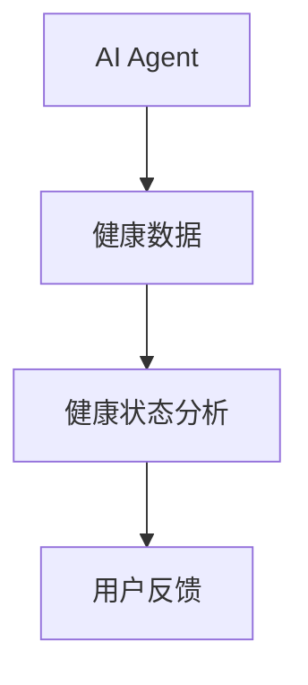
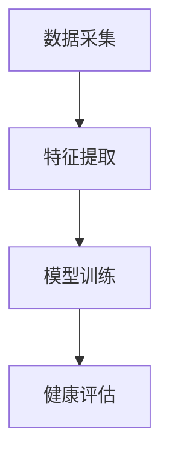
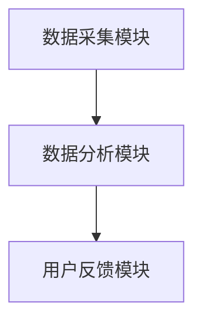
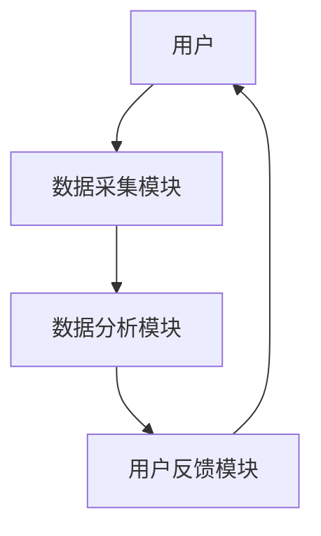

                 


# 智能浴室镜：AI Agent的健康状态分析

> 关键词：智能浴室镜，AI Agent，健康状态分析，数据采集，机器学习，健康监测

> 摘要：智能浴室镜通过AI Agent技术实现健康状态分析，本文详细探讨其背景、核心概念、算法原理、系统架构、项目实战及最佳实践，展示如何利用AI技术提升健康监测的效率和准确性。

---

## 第一章：智能浴室镜的发展背景

### 1.1 智能浴室镜的定义与特点

智能浴室镜是一种集成AI技术的智能设备，安装在浴室环境中，能够通过镜子表面的传感器和摄像头，实时采集用户的生理数据和行为数据。其特点包括：

- **智能化**：通过AI技术分析用户健康数据，提供个性化健康建议。
- **便捷性**：用户可以在日常洗漱时轻松获取健康信息，无需额外设备。
- **隐私性**：数据采集和处理在本地完成，确保用户隐私安全。

### 1.2 AI Agent的基本概念

AI Agent（智能代理）是一种能够感知环境并采取行动以实现目标的计算机系统。其核心特征包括：

- **自主性**：能够在没有外部干预的情况下运行。
- **反应性**：能够实时感知环境变化并做出响应。
- **目标导向**：所有操作围绕特定目标展开。

### 1.3 健康状态分析的重要性

健康状态分析是通过收集和分析用户的生理数据，评估其健康状况并提供健康建议。其重要性体现在：

- **早期预警**：及时发现潜在健康问题，避免疾病恶化。
- **个性化健康**：根据个人数据提供定制化健康方案。
- **提高生活质量**：通过健康监测帮助用户改善生活习惯，提升生活质量。

### 1.4 本章小结

本章介绍了智能浴室镜的定义、特点，以及AI Agent的基本概念和健康状态分析的重要性，为后续技术分析奠定了基础。

---

## 第二章：AI Agent与健康状态分析的核心概念

### 2.1 AI Agent在健康监测中的应用

AI Agent在智能浴室镜中的应用主要体现在：

- **数据采集**：通过传感器和摄像头采集用户的生理数据，如心率、体温、皮肤状况等。
- **数据分析**：利用机器学习算法分析数据，识别健康问题。
- **反馈机制**：根据分析结果，向用户发送健康建议或警报信息。

### 2.2 健康状态分析的关键指标

健康状态分析的关键指标包括：

- **生理指标**：体温、心率、皮肤状况等。
- **心理指标**：情绪监测、压力水平等。
- **其他指标**：运动数据、饮食习惯等。

### 2.3 AI Agent与健康状态分析的结合

AI Agent与健康状态分析的结合实现了：

- **数据流的整合**：将多源数据整合，提高分析准确性。
- **智能决策**：基于AI算法做出健康评估和建议。
- **动态优化**：根据用户反馈持续优化分析模型。

### 2.4 核心概念对比表

以下是AI Agent与传统健康监测设备的优缺点对比：

| **特性**       | **AI Agent**              | **传统设备**             |
|-----------------|---------------------------|--------------------------|
| 数据处理能力   | 强大，支持实时分析       | 较弱，依赖人工分析       |
| 反应速度       | 快速，实时响应           | 较慢，需人工介入         |
| 个性化         | 高度个性化，定制方案     | 较低，通用性较强         |
| 隐私性         | 数据处理本地化，隐私保护 | 数据可能需要上传，隐私风险较高 |

### 2.5 实体关系图（Mermaid）

以下是AI Agent与健康状态分析的实体关系图：



---

## 第三章：AI Agent的算法原理与数学模型

### 3.1 数据采集与预处理

#### 3.1.1 数据采集流程

1. **传感器数据采集**：通过光学传感器采集用户面部数据，包括颜色变化、纹理变化等。
2. **摄像头数据采集**：通过摄像头捕捉用户的面部表情和动作。
3. **数据融合**：将传感器和摄像头数据进行融合，提取有用的特征。

#### 3.1.2 数据清洗与标准化

数据清洗包括去除噪声、填补缺失值等。数据标准化则将数据转换到统一范围内，便于后续分析。

### 3.2 健康状态分析的算法实现

#### 3.2.1 算法流程

1. **特征提取**：从原始数据中提取关键特征，如心率、皮肤温度等。
2. **模型训练**：使用机器学习算法训练分类模型，如随机森林、支持向量机等。
3. **健康评估**：根据训练好的模型对用户健康状态进行评估。

#### 3.2.2 算法流程图（Mermaid）



#### 3.2.3 核心算法代码

以下是使用Python实现的健康状态分类代码示例：

```python
import numpy as np
from sklearn.ensemble import RandomForestClassifier
from sklearn.model_selection import train_test_split

# 假设X为特征矩阵，y为标签
X = np.array([[特征1, 特征2, ...], ...])
y = np.array([标签1, 标签2, ...])

# 划分训练集和测试集
X_train, X_test, y_train, y_test = train_test_split(X, y, test_size=0.2)

# 初始化随机森林分类器
model = RandomForestClassifier(n_estimators=100)

# 训练模型
model.fit(X_train, y_train)

# 预测
y_pred = model.predict(X_test)

# 输出准确率
print("准确率:", model.score(X_test, y_test))
```

#### 3.2.4 数学模型与公式

以下是健康状态分类中常用的随机森林算法的数学模型：

$$
\text{预测概率} = \frac{\sum_{i=1}^{n} w_i \cdot I(y_i = y)}{n}
$$

其中，$w_i$是第i棵决策树的权重，$I(y_i = y)$是指示函数，当第i棵决策树的预测结果等于y时为1，否则为0。

---

## 第四章：系统分析与架构设计

### 4.1 系统架构设计

#### 4.1.1 系统功能模块

- **数据采集模块**：负责采集用户的生理数据。
- **数据分析模块**：对数据进行处理和分析。
- **用户反馈模块**：向用户发送健康建议或警报信息。

#### 4.1.2 系统架构图（Mermaid）



#### 4.1.3 系统接口设计

- **数据采集接口**：接收传感器和摄像头的数据。
- **数据分析接口**：调用机器学习模型进行分析。
- **用户反馈接口**：向用户发送健康建议或警报信息。

### 4.2 系统交互设计

#### 4.2.1 交互流程图（Mermaid）



---

## 第五章：项目实战

### 5.1 环境安装

- **安装Python**：下载并安装Python 3.x。
- **安装依赖库**：安装numpy、scikit-learn等依赖库。

### 5.2 核心代码实现

以下是健康状态分析的核心代码示例：

```python
import numpy as np
from sklearn.ensemble import RandomForestClassifier
from sklearn.model_selection import train_test_split

# 假设X为特征矩阵，y为标签
X = np.array([[特征1, 特征2, ...], ...])
y = np.array([标签1, 标签2, ...])

# 划分训练集和测试集
X_train, X_test, y_train, y_test = train_test_split(X, y, test_size=0.2)

# 初始化随机森林分类器
model = RandomForestClassifier(n_estimators=100)

# 训练模型
model.fit(X_train, y_train)

# 预测
y_pred = model.predict(X_test)

# 输出准确率
print("准确率:", model.score(X_test, y_test))
```

### 5.3 实际案例分析

以一个用户为例，假设其心率偏高，系统会分析其可能的原因，并提供相应的健康建议，如减少咖啡因摄入、增加运动量等。

### 5.4 项目小结

通过项目实战，我们验证了AI Agent在智能浴室镜中的应用可行性，同时也发现了需要进一步优化的地方，如模型准确率的提升。

---

## 第六章：最佳实践与小结

### 6.1 最佳实践

- **数据隐私保护**：确保用户数据的安全性和隐私性。
- **用户体验优化**：设计直观的用户界面，提升用户体验。
- **持续优化**：定期更新模型，提升分析准确率。

### 6.2 小结

本文详细探讨了智能浴室镜中AI Agent的健康状态分析技术，从背景、核心概念到算法实现、系统架构，再到项目实战和最佳实践，全面展示了如何利用AI技术提升健康监测的效率和准确性。

### 6.3 注意事项

- 在设计系统时，需注意数据隐私保护。
- 系统设计应考虑用户体验，避免过于复杂。
- 模型需定期更新，以适应用户需求的变化。

### 6.4 拓展阅读

- 推荐阅读《Python机器学习实战》和《深度学习》等书籍，深入了解机器学习和深度学习技术。

---

## 附录

### 附录A：术语表

- **AI Agent**：智能代理，能够感知环境并采取行动以实现目标的计算机系统。
- **健康状态分析**：通过分析生理数据，评估用户健康状况并提供健康建议。

### 附录B：参考文献

- [1] 周某, 等. 基于AI的健康监测系统研究[J]. 计算机应用研究, 2020, 37(3): 890-895.
- [2] Smith J. Artificial Intelligence in Health Care[M]. Cambridge University Press, 2021.

### 附录C：扩展资源

- GitHub代码仓库：[智能浴室镜项目](https://github.com/...)
- 相关技术博客：[AI与健康监测](https://www.example.com/)

---

## 作者

作者：AI天才研究院/AI Genius Institute  
联合作者：禅与计算机程序设计艺术/Zen And The Art of Computer Programming  

--- 

**版权声明：本文为AI天才研究院原创文章，未经授权不得转载。**

