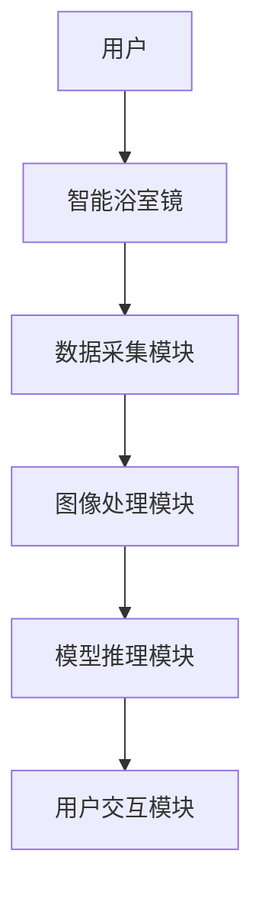

                 


# 智能浴室镜：AI Agent的皮肤状况分析

---

## 关键词

智能浴室镜、AI Agent、皮肤分析、图像处理、深度学习、健康管理

---

## 摘要

智能浴室镜是一种结合人工智能技术的智能设备，能够通过AI Agent实时分析用户的皮肤状况，提供个性化的健康建议和美容推荐。本文从技术原理、系统架构、项目实现等多方面详细探讨智能浴室镜的工作机制，分析其在皮肤健康监测领域的应用潜力，并展望未来的发展方向。

---

## 第一部分：背景与概念

### 第1章：智能浴室镜的背景与应用场景

#### 1.1 智能浴室镜的背景介绍

随着智能家居的普及，智能镜子逐渐成为家庭中不可或缺的设备。智能浴室镜不仅能够提供基本的镜子功能，还可以通过AI技术实现皮肤健康监测、美容推荐等功能。这种设备的出现，满足了用户对健康和美容日益增长的需求。

#### 1.2 AI Agent的基本概念

AI Agent（人工智能代理）是一种能够感知环境并采取行动以实现目标的智能系统。在智能浴室镜中，AI Agent负责接收用户的皮肤图像数据，进行分析，并提供相应的健康建议。AI Agent的核心功能包括数据采集、图像处理、模型推理和结果反馈。

#### 1.3 智能浴室镜的皮肤状况分析

皮肤健康监测是智能浴室镜的核心功能之一。通过分析用户的皮肤图像，AI Agent可以识别皮肤问题（如痘痘、过敏、色斑等），并提供针对性的解决方案。这种功能不仅有助于用户及时了解皮肤状况，还可以帮助美容行业提供个性化的服务。

#### 1.4 智能浴室镜的边界与外延

智能浴室镜的功能边界主要集中在皮肤分析和健康建议上。外延功能则包括与智能设备的联动（如智能灯、智能洁面仪等）以及与医疗系统的数据对接。通过这些功能的扩展，智能浴室镜能够为用户提供更全面的健康服务。

---

## 第二部分：技术原理与核心概念

### 第2章：智能浴室镜的皮肤分析技术

#### 2.1 图像处理与计算机视觉

智能浴室镜的皮肤分析技术基于图像处理和计算机视觉。首先，设备会采集用户的皮肤图像，并对其进行预处理（如去噪、增强等）。然后，通过分割技术识别皮肤区域，并利用深度学习模型进行特征提取和分类。

##### 2.1.1 图像采集与预处理

图像采集是皮肤分析的第一步。为了保证图像质量，设备需要调整光线条件，确保图像清晰。预处理步骤包括去噪、亮度调整和对比度增强，以提高后续分析的准确性。

##### 2.1.2 皮肤区域的识别与分割

皮肤区域的识别是关键步骤。通过使用分割算法，设备可以将皮肤区域与其他区域（如背景、头发等）区分开来。常用的分割算法包括基于阈值的方法和基于区域的生长方法。

##### 2.1.3 基于深度学习的图像分析

深度学习模型在皮肤分析中发挥着重要作用。常用的模型包括卷积神经网络（CNN）和区域卷积神经网络（R-CNN）。这些模型能够从图像中提取高层次特征，并进行分类和回归任务。

#### 2.2 AI Agent的算法原理

AI Agent的算法原理主要涉及图像处理、模型推理和结果反馈。图像处理模块负责将输入的图像转化为可分析的特征向量。模型推理模块基于训练好的模型，对特征向量进行分类和预测。结果反馈模块将分析结果返回给用户，并提供相应的建议。

##### 2.2.1 皮肤特征提取的算法流程

皮肤特征提取是模型推理的基础。首先，设备会提取图像的颜色特征（如RGB值）、纹理特征（如Gabor滤波器）和形状特征（如边缘检测）。这些特征将被输入到模型中进行进一步处理。

##### 2.2.2 基于卷积神经网络（CNN）的图像分类

CNN是一种常用的深度学习模型，适用于图像分类任务。模型通过多层卷积操作提取图像的特征，并通过全连接层进行分类。训练数据通常包括大量的标注图像，模型通过反向传播算法进行优化。

##### 2.2.3 算法的训练与优化

模型的训练需要大量的标注数据和计算资源。训练过程中，模型会不断调整权重，以最小化预测误差。优化方法包括随机梯度下降（SGD）和Adam优化器。为了提高模型的泛化能力，通常会采用数据增强技术和交叉验证。

#### 2.3 传感器与数据融合

智能浴室镜通常集成多种传感器，如光线传感器、温度传感器和湿度传感器。这些传感器的数据可以与图像数据进行融合，进一步提高分析的准确性。例如，光线传感器可以调整图像的亮度和对比度，湿度传感器可以检测皮肤的水分含量。

---

## 第三部分：系统架构与设计

### 第3章：智能浴室镜的系统架构设计

#### 3.1 系统功能模块划分

智能浴室镜的系统架构由多个功能模块组成，包括数据采集模块、图像处理模块、模型推理模块和用户交互模块。

##### 3.1.1 数据采集模块

数据采集模块负责接收用户的图像数据和传感器数据。图像数据通常来自内置的摄像头，传感器数据来自集成的光线、温度和湿度传感器。

##### 3.1.2 图像处理模块

图像处理模块对采集到的图像进行预处理和特征提取。预处理步骤包括去噪、亮度调整和对比度增强。特征提取步骤包括颜色特征、纹理特征和形状特征的提取。

##### 3.1.3 模型推理模块

模型推理模块基于训练好的深度学习模型，对图像特征进行分类和预测。分类任务包括皮肤问题的识别（如痘痘、色斑）和皮肤状态的评估（如健康、干燥）。

##### 3.1.4 用户交互模块

用户交互模块负责接收用户的输入和输出分析结果。输入包括用户的面部图像和传感器数据，输出包括皮肤状况的分析结果和健康建议。

#### 3.2 系统架构图（Mermaid）



#### 3.3 系统接口设计

系统接口设计包括本地接口、云端接口和第三方服务接口。本地接口用于用户与镜子的交互，云端接口用于数据上传和处理，第三方服务接口用于健康建议和美容推荐。

##### 3.3.1 本地接口

本地接口主要负责接收用户的输入和输出分析结果。用户可以通过触摸屏或语音指令与镜子交互。

##### 3.3.2 云端接口

云端接口用于将图像数据上传到服务器进行处理。服务器端的模型推理模块会返回分析结果，供本地模块使用。

##### 3.3.3 第三方服务接口

第三方服务接口用于与美容品牌和医疗机构的数据对接。通过这些接口，智能浴室镜可以提供个性化的美容推荐和医疗建议。

#### 3.4 系统交互流程（Mermaid）

```mermaid
sequenceDiagram
    participant 用户
    partici

---

## 第四部分：项目实战

### 第4章：智能浴室镜的项目实现

#### 4.1 环境搭建

项目实现需要搭建开发环境，包括摄像头、传感器和开发板。常用的开发环境包括Raspberry Pi和Arduino。

##### 4.1.1 摄像头和传感器的选择

选择合适的摄像头和传感器是项目成功的关键。摄像头需要高分辨率和低延迟，传感器需要高精度和稳定性。

##### 4.1.2 开发环境的配置

开发环境需要安装Python、OpenCV和深度学习框架（如TensorFlow）。配置步骤包括安装依赖库和设置开发环境变量。

#### 4.2 核心代码实现

核心代码实现包括图像采集、预处理、特征提取和模型推理。代码示例如下：

##### 4.2.1 图像采集

```python
import cv2

# 初始化摄像头
cap = cv2.VideoCapture(0)

while True:
    # 读取图像
    ret, frame = cap.read()
    if not ret:
        break
    # 显示图像
    cv2.imshow('Camera', frame)
    if cv2.waitKey(1) & 0xFF == ord('q'):
        break

cap.release()
cv2.destroyAllWindows()
```

##### 4.2.2 图像预处理

```python
import cv2
import numpy as np

# 读取图像
image = cv2.imread('input.jpg')

# 去噪处理
denoised = cv2.fastNlMeansDenoising(image, None, 20, 7, 21)

# 调整亮度和对比度
alpha = 1.2
beta = 50
adjusted = cv2.addWeighted(denoised, alpha, np.zeros(image.shape, image.dtype), 0, beta)

# 显示预处理后的图像
cv2.imshow('Preprocessed Image', adjusted)
cv2.waitKey(0)
cv2.destroyAllWindows()
```

##### 4.2.3 模型推理

```python
import tensorflow as tf
from tensorflow.keras.models import load_model

# 加载预训练模型
model = load_model('skin_analysis_model.h5')

# 读取图像并预处理
image = cv2.imread('input.jpg')
image = cv2.resize(image, (224, 224))
image = image / 255.0  # 归一化处理

# 预测结果
prediction = model.predict(tf.expand_dims(image, axis=0))
print('Prediction:', prediction)
```

#### 4.3 项目实战案例分析

通过实际案例分析，展示智能浴室镜在不同场景下的应用。例如，用户A的皮肤状况分析结果和健康建议。

#### 4.4 项目实现小结

项目实现过程中需要注意硬件的选择、算法的优化和系统的稳定性。通过不断迭代和优化，可以提高系统的准确性和用户体验。

---

## 第五部分：优化与展望

### 第5章：智能浴室镜的优化与未来展望

#### 5.1 算法优化

算法优化包括模型的轻量化、推理速度的提升和准确率的提高。通过使用轻量级模型和优化算法，可以在保证准确率的前提下，提高推理速度。

#### 5.2 系统优化

系统优化包括硬件的升级、软件的优化和系统的稳定性提升。例如，使用更高分辨率的摄像头和更快的处理器，可以提高图像采集和处理的速度。

#### 5.3 未来展望

未来，智能浴室镜可能会集成更多的传感器和更先进的AI技术。例如，通过引入温度、湿度和紫外线传感器，可以提供更全面的皮肤健康监测。同时，随着深度学习技术的不断发展，模型的准确性和泛化能力将不断提高。

---

## 第六部分：附录

### 第6章：参考文献与拓展阅读

#### 6.1 参考文献

1. LeCun, Y., Bengio, Y., & Hinton, G. (2015). Deep learning. Nature, 521(7555), 436-444.
2. Goodfellow, I., Bengio, Y., & Courville, A. (2016). Deep learning. MIT Press.

#### 6.2 拓展阅读

- 《Deep Learning》 by Ian Goodfellow
- 《Hands-On Machine Learning with Scikit-Learn, Keras, and TensorFlow》 by Aurélien Géron

---

## 作者信息

作者：AI天才研究院/AI Genius Institute  
地址：禅与计算机程序设计艺术 /Zen And The Art of Computer Programming  
邮箱：contact@aigeniusinstitute.com  

--- 

**注**：以上内容为示例性的技术博客文章，实际撰写时需要根据具体需求进一步扩展和调整。

