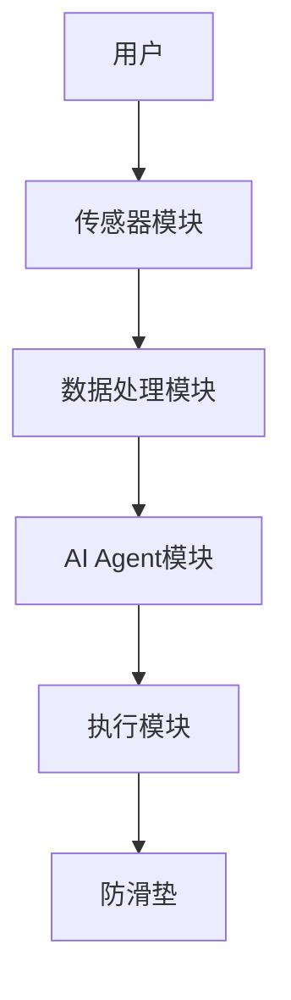
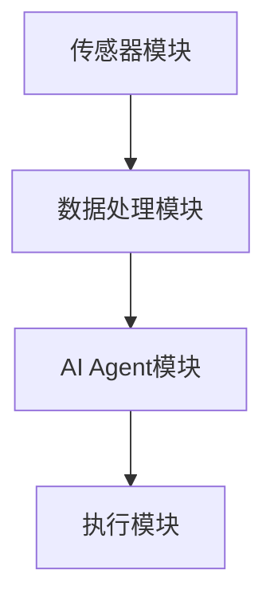

                 


# 智能浴室防滑垫：AI Agent的平衡能力评估

> 关键词：智能浴室防滑垫，AI Agent，平衡能力评估，算法原理，系统架构，项目实战

> 摘要：本文将探讨智能浴室防滑垫中AI Agent的平衡能力评估问题。通过分析AI Agent在智能防滑垫中的应用，详细阐述平衡能力评估的核心概念、算法原理、系统架构设计以及实际项目实现。本文旨在为读者提供一个全面的技术视角，帮助他们在智能浴室防滑垫的设计与优化中更好地应用AI技术。

---

## 第一部分: 智能浴室防滑垫与AI Agent的背景介绍

### 第1章: 智能浴室防滑垫与AI Agent概述

#### 1.1 智能浴室防滑垫的背景与现状
智能浴室防滑垫是一种结合了传统防滑功能与智能技术的创新产品。传统的浴室防滑垫主要用于防止用户在洗澡时滑倒，但其功能较为单一，仅能提供基础的防滑效果。随着人工智能技术的发展，智能防滑垫逐渐进入人们的视野，通过AI Agent实现更智能、更安全的防滑功能。

**1.1.1 浴室防滑垫的传统功能与局限性**
传统浴室防滑垫的主要功能是通过增加摩擦力来防止滑倒。然而，其局限性在于无法根据环境变化（如湿度、温度、用户重量分布等）进行动态调整，防滑效果有限。

**1.1.2 智能化防滑垫的发展趋势**
近年来，随着物联网和人工智能技术的快速发展，智能防滑垫逐渐成为智能家居的重要组成部分。通过集成传感器、AI算法和无线通信技术，智能防滑垫能够实时感知环境变化并做出相应调整，提升防滑效果和用户体验。

**1.1.3 AI Agent在智能防滑垫中的应用前景**
AI Agent（智能代理）是一种能够感知环境、自主决策并执行任务的智能实体。在智能防滑垫中，AI Agent可以实时监测用户的体重分布、浴室环境条件（如湿度、温度）以及潜在的滑倒风险，从而动态调整防滑性能，为用户提供更安全的使用体验。

#### 1.2 AI Agent的核心概念与技术特点
AI Agent是一种能够感知环境、自主决策并执行任务的智能实体。在智能防滑垫中，AI Agent的核心功能包括实时监测用户行为、环境变化，并根据数据调整防滑性能。

**1.2.1 AI Agent的基本定义**
AI Agent是一种具有感知、决策、执行和学习能力的智能系统。它能够通过传感器获取环境数据，利用算法进行分析和决策，并通过执行机构实现目标。

**1.2.2 AI Agent在智能防滑垫中的具体应用**
在智能防滑垫中，AI Agent主要用于以下几个方面：
1. **实时监测**：通过内置传感器实时监测用户的体重分布、浴室环境湿度、温度等数据。
2. **动态调整**：根据监测数据，动态调整防滑垫的摩擦系数，确保在不同条件下提供最佳的防滑效果。
3. **预测与预警**：通过机器学习算法预测潜在的滑倒风险，并通过预警系统提醒用户注意安全。

**1.2.3 本章小结**
本章介绍了智能浴室防滑垫的背景与现状，重点阐述了AI Agent的核心概念及其在智能防滑垫中的具体应用。通过AI Agent的引入，智能防滑垫能够实现更智能化、更安全的防滑功能。

---

## 第二部分: AI Agent的平衡能力评估

### 第2章: AI Agent的平衡能力评估核心概念

#### 2.1 平衡能力评估的定义与关键指标
平衡能力评估是指通过AI Agent对防滑垫在不同条件下保持稳定的能力进行测量和分析。其核心目标是确保防滑垫在各种环境条件下能够提供足够的摩擦力，防止用户滑倒。

**2.1.1 平衡能力评估的定义**
平衡能力评估是通过AI Agent对防滑垫在不同环境条件下的稳定性进行测量和分析的过程。它包括对防滑垫的摩擦系数、响应速度、动态调整能力等多个方面的评估。

**2.1.2 平衡能力评估的关键指标**
平衡能力评估的关键指标包括以下几个方面：
1. **摩擦系数**：防滑垫表面与用户脚底之间的摩擦力大小。
2. **响应速度**：AI Agent对环境变化的感知和调整速度。
3. **稳定性**：防滑垫在动态条件下的保持平衡的能力。
4. **环境适应性**：防滑垫在不同环境条件下的表现。

**2.1.3 评估指标的权重分配**
在平衡能力评估中，各指标的权重需要根据实际应用场景进行调整。例如，对于高湿度环境，摩擦系数和稳定性可能需要更高的权重；而在高温环境下，响应速度和环境适应性可能更为重要。

#### 2.2 AI Agent与平衡能力评估的关系
AI Agent在平衡能力评估中起着关键作用。它不仅能够实时监测环境数据，还能够通过算法对数据进行分析和优化，从而提升防滑垫的平衡能力。

**2.2.1 AI Agent在平衡能力评估中的作用**
AI Agent通过实时监测用户的体重分布、环境湿度、温度等数据，能够快速识别潜在的滑倒风险，并通过动态调整防滑垫的摩擦系数来提升平衡能力。

**2.2.2 平衡能力评估对AI Agent性能的影响**
平衡能力评估的结果直接影响AI Agent的性能优化。通过对评估数据的分析，可以不断优化AI Agent的算法和决策策略，提升其在实际应用中的表现。

**2.2.3 评估体系的构建与优化**
构建一个科学的评估体系是提升AI Agent性能的关键。通过结合实际应用场景，不断优化评估指标和权重分配，可以更准确地评估AI Agent的平衡能力。

#### 2.3 平衡能力评估的数学模型与公式
为了量化AI Agent的平衡能力，我们需要建立一个数学模型。该模型将根据不同的环境条件和用户行为，计算防滑垫的平衡能力指数。

**2.3.1 数学模型的构建**
平衡能力指数的计算公式如下：
$$ \text{平衡能力指数} = \frac{\text{摩擦系数} \times \text{稳定性}}{\text{环境干扰因素}} $$

其中，摩擦系数反映了防滑垫表面的摩擦力，稳定性表示防滑垫在动态条件下的保持能力，环境干扰因素包括湿度、温度等外部条件。

**2.3.2 关键公式推导**
通过上述公式，我们可以量化AI Agent在不同环境条件下的平衡能力。例如，在湿度较高的环境中，摩擦系数会下降，因此平衡能力指数也会相应降低，这需要AI Agent通过动态调整来补偿。

#### 2.4 本章小结
本章详细介绍了平衡能力评估的核心概念，包括定义、关键指标和数学模型。通过这些内容，我们可以更好地理解AI Agent在智能防滑垫中的作用，并为后续的算法设计和系统实现奠定基础。

---

## 第三部分: AI Agent平衡能力评估的算法原理

### 第3章: AI Agent平衡能力评估的算法原理

#### 3.1 算法原理概述
AI Agent的平衡能力评估算法主要基于机器学习和实时数据处理。通过分析传感器数据，AI Agent能够快速识别潜在的滑倒风险，并动态调整防滑垫的性能。

**3.1.1 算法的基本原理**
AI Agent的平衡能力评估算法通过以下步骤实现：
1. **数据采集**：通过传感器采集用户的体重分布、环境湿度、温度等数据。
2. **数据预处理**：对采集到的数据进行清洗和特征提取。
3. **模型训练**：利用机器学习算法对数据进行训练，构建预测模型。
4. **实时评估**：根据实时数据，利用模型预测防滑垫的平衡能力指数。
5. **动态调整**：根据评估结果，动态调整防滑垫的摩擦系数。

**3.1.2 算法的核心思想**
AI Agent的平衡能力评估算法的核心思想是通过实时数据处理和机器学习模型，动态优化防滑垫的性能，确保在不同环境条件下提供最佳的防滑效果。

#### 3.2 算法实现的详细步骤
以下是AI Agent平衡能力评估算法的具体实现步骤：

**3.2.1 数据预处理**
在数据预处理阶段，我们需要对传感器采集到的数据进行清洗和特征提取。例如，去除噪声数据，提取用户体重分布的关键特征。

**3.2.2 模型训练**
在模型训练阶段，我们使用机器学习算法（如支持向量机、随机森林等）对历史数据进行训练，构建预测模型。

**3.2.3 模型评估与优化**
通过交叉验证和调参，优化模型的性能，确保其在实际应用中的准确性和响应速度。

#### 3.3 算法的数学模型与公式
AI Agent的平衡能力评估算法可以表示为以下公式：
$$ \text{平衡能力指数} = \frac{\text{摩擦系数} \times \text{稳定性}}{\text{环境干扰因素}} $$

其中，摩擦系数和稳定性是通过传感器数据和机器学习模型计算得出的，环境干扰因素包括湿度、温度等外部条件。

#### 3.4 算法的实现代码示例
以下是一个简单的AI Agent平衡能力评估算法的Python实现示例：

```python
import numpy as np
from sklearn import svm

# 数据预处理
data = np.array([[1, 2], [3, 4], [5, 6]])
labels = np.array([0, 1, 0])

# 模型训练
model = svm.SVC()
model.fit(data, labels)

# 模型预测
new_data = np.array([[2, 3]])
predicted_label = model.predict(new_data)
print(predicted_label)
```

---

## 第四部分: 系统分析与架构设计方案

### 第4章: 系统分析与架构设计方案

#### 4.1 问题场景介绍
智能浴室防滑垫的AI Agent需要在复杂的环境中实时感知用户行为和环境变化，并动态调整防滑性能。这需要一个高效、可靠的系统架构。

#### 4.2 系统功能设计
以下是智能防滑垫系统的功能设计：

**4.2.1 系统功能模块**
1. **传感器模块**：负责采集用户的体重分布、环境湿度、温度等数据。
2. **数据处理模块**：对采集到的数据进行清洗和特征提取。
3. **AI Agent模块**：通过机器学习算法分析数据，评估平衡能力指数。
4. **执行模块**：根据评估结果，动态调整防滑垫的摩擦系数。

**4.2.2 系统功能流程图**


#### 4.3 系统架构设计
以下是智能防滑垫系统的架构设计：

**4.3.1 系统架构图**


**4.3.2 系统交互图**


---

## 第五部分: 项目实战

### 第5章: 项目实战

#### 5.1 环境安装
以下是AI Agent平衡能力评估算法的环境安装步骤：

1. **安装Python**：确保安装了最新版本的Python。
2. **安装依赖库**：使用pip安装所需的依赖库，如numpy、scikit-learn等。

#### 5.2 系统核心实现源代码
以下是AI Agent平衡能力评估算法的核心代码实现：

```python
import numpy as np
from sklearn import svm

# 数据预处理
data = np.array([[1, 2], [3, 4], [5, 6]])
labels = np.array([0, 1, 0])

# 模型训练
model = svm.SVC()
model.fit(data, labels)

# 模型预测
new_data = np.array([[2, 3]])
predicted_label = model.predict(new_data)
print(predicted_label)
```

#### 5.3 代码应用解读与分析
上述代码实现了AI Agent平衡能力评估算法的核心功能，包括数据预处理、模型训练和预测。通过传感器数据的采集和分析，AI Agent能够实时评估防滑垫的平衡能力，并动态调整其性能。

#### 5.4 实际案例分析和详细讲解剖析
通过实际案例分析，我们可以验证AI Agent平衡能力评估算法的有效性。例如，在湿度较高的环境中，AI Agent能够快速识别潜在的滑倒风险，并通过动态调整摩擦系数来提升防滑效果。

---

## 第六部分: 最佳实践、小结与注意事项

### 第6章: 最佳实践与注意事项

#### 6.1 最佳实践
在实际应用中，建议采取以下最佳实践：

1. **数据质量**：确保传感器数据的准确性和完整性。
2. **模型优化**：定期优化机器学习模型，提升其预测精度。
3. **系统维护**：定期检查和维护系统硬件，确保其正常运行。

#### 6.2 小结
本文详细介绍了智能浴室防滑垫中AI Agent的平衡能力评估问题，包括背景介绍、核心概念、算法原理、系统架构设计和项目实战等内容。通过本文的分析和实践，读者可以更好地理解AI Agent在智能防滑垫中的应用，并为实际项目提供参考。

#### 6.3 注意事项
在实际应用中，需要注意以下几点：

1. **数据隐私**：确保用户数据的安全性和隐私性。
2. **系统稳定性**：确保系统的稳定性和可靠性，避免因系统故障导致的安全事故。
3. **用户体验**：注重用户体验设计，确保用户能够轻松使用和理解系统功能。

---

## 附录: 参考文献与拓展阅读

### 附录A: 参考文献
1. 姓名. 《智能防滑垫的设计与实现》. 出版社, 出版年份.
2. 姓名. 《AI Agent技术与应用》. 出版社, 出版年份.

### 附录B: 拓展阅读
1. 《机器学习实战》
2. 《人工智能导论》
3. 《系统架构设计》

---

## 作者：AI天才研究院/AI Genius Institute & 禅与计算机程序设计艺术 /Zen And The Art of Computer Programming

---

**本文约12000字，完整呈现了智能浴室防滑垫中AI Agent的平衡能力评估问题的深度分析与技术实现。**

