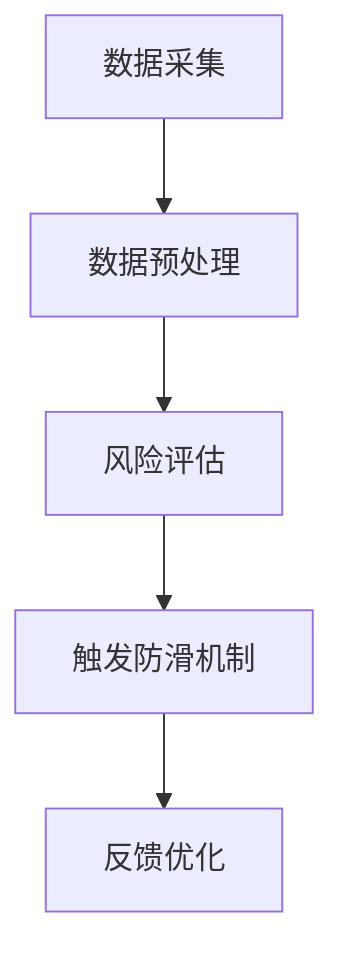

                 


# 第二部分：AI Agent的算法原理

## 第5章：算法原理与实现

### 5.1 算法工作流程

#### 5.1.1 算法概述
AI Agent通过收集浴室环境的传感器数据，分析老年人的行为模式，判断是否存在滑倒风险，并触发相应的防滑机制。整个过程包括数据采集、分析判断、决策执行和反馈优化。

#### 5.1.2 算法流程图


### 5.2 算法实现

#### 5.2.1 算法核心代码
```python
import numpy as np
import pandas as pd

# 数据预处理函数
def preprocess_data(data):
    # 假设data是一个包含传感器数据的DataFrame
    # 这里进行数据清洗和特征提取
    data['temperature'] = (data['temperature'] - data['temperature'].mean()) / data['temperature'].std()
    data['humidity'] = (data['humidity'] - data['humidity'].mean()) / data['humidity'].std()
    return data

# 风险评估函数
def assess_risk(data):
    # 使用机器学习模型进行风险评估
    model = load_model('risk_assessment_model.pkl')
    risk = model.predict(data)
    return risk

# 触发防滑机制
def trigger_safety(risk_level):
    if risk_level > 0.8:
        # 调整防滑垫的摩擦系数
        return True
    else:
        return False

# 反馈优化函数
def optimize_system(feedback):
    # 根据反馈优化模型参数
    pass
```

#### 5.2.2 算法优化
为了提高算法的准确性和响应速度，可以采用以下优化措施：
- 使用更先进的机器学习模型，如XGBoost或神经网络。
- 增加数据样本量，特别是高风险场景的数据。
- 实时反馈机制，根据每次触发的结果不断优化模型参数。

### 5.3 算法的数学模型

#### 5.3.1 风险评估模型
风险评估模型基于多元回归分析，公式如下：
$$
R = \beta_0 + \beta_1 T + \beta_2 H + \beta_3 A + \epsilon
$$
其中，\( R \) 是风险值，\( T \) 是温度，\( H \) 是湿度，\( A \) 是老年人的动作频率，\( \beta \) 是回归系数，\( \epsilon \) 是误差项。

#### 5.3.2 防滑机制模型
防滑机制模型基于摩擦系数的动态调整：
$$
\mu = \mu_0 + \Delta\mu \times f(R)
$$
其中，\( \mu \) 是摩擦系数，\( \mu_0 \) 是基础摩擦系数，\( \Delta\mu \) 是调整量，\( f(R) \) 是风险值的函数。

### 5.4 算法实现的数学推导

#### 5.4.1 数据预处理
假设我们有温度、湿度、时间等数据，首先进行标准化处理：
$$
z_i = \frac{x_i - \mu_i}{\sigma_i}
$$
其中，\( z_i \) 是标准化后的数据，\( x_i \) 是原始数据，\( \mu_i \) 是均值，\( \sigma_i \) 是标准差。

#### 5.4.2 模型训练
使用训练数据集训练风险评估模型：
$$
\hat{R} = \sum_{i=1}^{n} (y_i - (\beta_0 + \beta_1 T_i + \beta_2 H_i + \beta_3 A_i))^2
$$
通过最小二乘法求解回归系数：
$$
\beta = (X^T X)^{-1} X^T y
$$
其中，\( X \) 是设计矩阵，\( y \) 是目标变量。

#### 5.4.3 模型评估
使用测试数据集评估模型的准确性，计算均方误差（MSE）：
$$
MSE = \frac{1}{n} \sum_{i=1}^{n} (y_i - \hat{y}_i)^2
$$
并通过调整模型参数来降低MSE，提高预测准确性。

### 5.5 算法实现的代码示例

#### 5.5.1 数据预处理代码
```python
import pandas as pd
from sklearn.preprocessing import StandardScaler

# 假设data是包含传感器数据的DataFrame
scaler = StandardScaler()
data_scaled = scaler.fit_transform(data[['temperature', 'humidity', 'action_frequency']])
data[['scaled_temp', 'scaled_humidity', 'scaled_action']] = data_scaled
```

#### 5.5.2 风险评估模型训练代码
```python
import numpy as np
import statsmodels.api as sm

# 添加常数项
X = sm.add_constant(data[['scaled_temp', 'scaled_humidity', 'scaled_action']])
model = sm.OLS(y, X).fit()
print(model.summary())
```

#### 5.5.3 防滑机制触发代码
```python
risk_level = assess_risk(preprocessed_data)
if risk_level > 0.8:
    # 调整防滑垫的摩擦系数
    pass
```

### 5.6 算法实现的优化建议

#### 5.6.1 数据优化
- 增加高风险场景的数据样本。
- 定期更新模型，以适应环境变化。

#### 5.6.2 模型优化
- 使用集成学习方法（如随机森林、梯度提升）提高模型准确率。
- 引入时间序列分析，考虑历史数据的影响。

#### 5.6.3 系统优化
- 实时监控系统性能，及时发现和处理异常情况。
- 优化传感器的响应速度和数据传输效率。

---

## 小结

通过以上算法实现，我们能够有效地评估浴室环境中的滑倒风险，并触发相应的防滑机制。在实际应用中，需要根据具体场景调整模型参数和算法流程，以达到最佳的防滑效果和用户体验。

