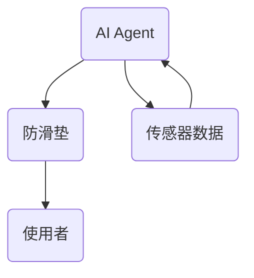
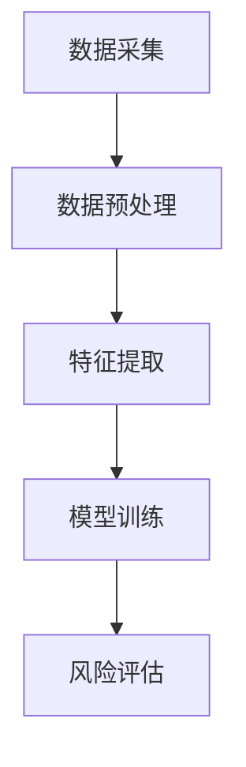
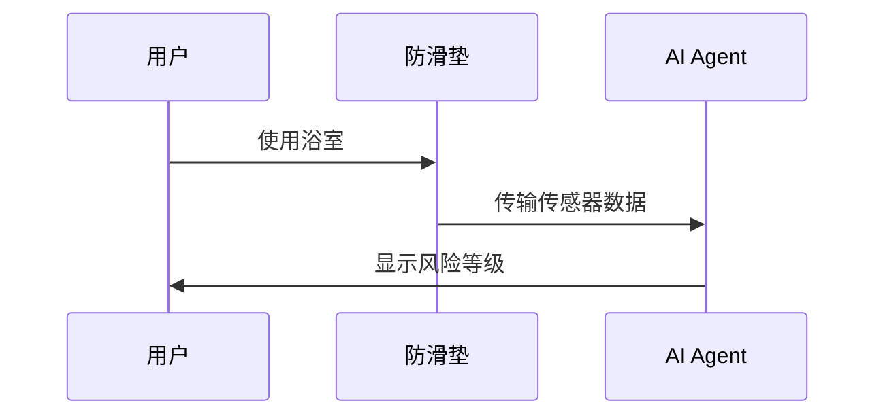

                 


```markdown
# 智能浴室防滑垫：AI Agent的跌倒风险评估

> 关键词：跌倒风险评估，智能防滑垫，AI Agent，浴室安全，数据驱动解决方案，机器学习算法

> 摘要：本文探讨了AI Agent在智能浴室防滑垫中的应用，重点分析了如何利用数据驱动的方法评估跌倒风险，并提出了一套基于机器学习的解决方案。通过详细的技术分析和系统设计，本文展示了如何构建一个高效、可靠的跌倒风险评估系统，从而提升浴室安全。

---

## 第一部分: 背景介绍

### 第1章: 背景与问题背景

#### 1.1 问题背景
- **跌倒风险的普遍性**：跌倒是老年人和儿童浴室中常见的安全事故，尤其是浴室地面湿滑时。
- **智能浴室防滑垫的市场需求**：随着智能家居的普及，智能防滑垫的需求日益增长。
- **AI Agent在跌倒风险评估中的作用**：AI Agent可以实时分析数据，提供精准的跌倒风险评估。

#### 1.2 问题描述
- **跌倒风险的主要影响因素**：地面湿滑、防滑垫的摩擦系数、使用者的体重分布等。
- **智能防滑垫的功能需求**：实时监测环境和使用者状态，评估跌倒风险。
- **AI Agent的评估目标**：通过数据驱动的方法，准确预测跌倒风险。

#### 1.3 问题解决思路
- **智能防滑垫的设计理念**：结合物理特性和智能算法，提供实时安全监测。
- **AI Agent的核心功能**：数据采集、特征提取、风险评估、反馈控制。
- **技术实现路径**：传感器数据采集 → 数据预处理 → 模型训练 → 风险评估。

#### 1.4 边界与外延
- **功能边界**：仅关注跌倒风险评估，不涉及防滑垫的物理控制。
- **技术边界**：基于AI Agent的算法，不涉及硬件设计。
- **应用场景的外延**：适用于家庭浴室、公共浴室等。

#### 1.5 核心要素组成
- **智能防滑垫的物理特性**：摩擦系数、材质、尺寸。
- **AI Agent的数据输入**：传感器数据、环境数据、用户数据。
- **评估结果的输出形式**：风险等级、预警信号。

---

## 第二部分: 核心概念与联系

### 第2章: 核心概念与原理

#### 2.1 AI Agent的基本原理
- **定义与特点**：AI Agent是一种智能体，能够感知环境并做出决策。
- **在跌倒风险评估中的应用**：实时分析数据，提供评估结果。
- **核心算法**：基于机器学习的分类和回归算法。

#### 2.2 跌倒风险评估的原理
- **评估指标**：摩擦系数、步态分析、体重分布。
- **数据采集与处理**：传感器数据的采集与预处理。
- **风险评估模型的构建**：基于机器学习的模型训练。

#### 2.3 智能防滑垫的技术特征
- **物理特性**：高摩擦系数、防水、耐用。
- **传感器配置**：压力传感器、湿度传感器、加速度传感器。
- **智能控制模块**：数据采集模块、AI处理模块、反馈控制模块。

#### 2.4 核心概念对比表
| 概念 | 特征 | 优势 | 局限 |
|------|------|------|------|
| AI Agent | 数据处理能力 | 高效性 | 数据依赖性 |
| 跌倒风险评估 | 评估指标 | 准确性 | 复杂性 |
| 智能防滑垫 | 物理特性 | 安全性 | 成本较高 |

#### 2.5 实体关系图


---

## 第三部分: 算法原理

### 第3章: 算法原理

#### 3.1 算法概述
- **目标**：通过机器学习模型，评估跌倒风险。
- **输入**：传感器数据（压力、湿度、加速度）。
- **输出**：风险等级（低、中、高）。

#### 3.2 算法流程


#### 3.3 核心算法
- **机器学习模型**：随机森林、支持向量机（SVM）、神经网络。
- **数学模型**：基于逻辑回归的风险评估模型。

#### 3.4 数学公式
- **损失函数**：交叉熵损失函数。
  $$ L = -\frac{1}{m}\sum_{i=1}^{m} [y_i \ln(a_i) + (1-y_i)\ln(1-a_i)] $$
- **优化器**：Adam优化器。
  $$ \theta = \theta - \eta \frac{\partial L}{\partial \theta} $$

#### 3.5 代码实现
```python
import numpy as np
from sklearn.model_selection import train_test_split
from sklearn.linear_model import LogisticRegression

# 数据预处理
X = np.array([[湿度, 压力, 加速度]])
y = np.array([风险等级])

# 划分训练集和测试集
X_train, X_test, y_train, y_test = train_test_split(X, y, test_size=0.2)

# 模型训练
model = LogisticRegression()
model.fit(X_train, y_train)

# 模型评估
accuracy = model.score(X_test, y_test)
print(f"模型准确率: {accuracy}")
```

---

## 第四部分: 系统分析与架构设计

### 第4章: 系统分析与架构设计

#### 4.1 问题场景介绍
- **场景描述**：使用者在浴室中，防滑垫实时监测并评估跌倒风险。

#### 4.2 系统功能设计
- **领域模型**：用户、防滑垫、AI Agent。
  ```mermaid
  classDiagram
      class 用户 {
          体重
          步态
      }
      class 防滑垫 {
          摩擦系数
          传感器数据
      }
      class AI Agent {
          数据处理
          风险评估
      }
      用户 --> 防滑垫
      防滑垫 --> AI Agent
      AI Agent --> 用户
  ```

#### 4.3 系统架构设计
- **架构图**：
  ```mermaid
  context 智能防滑垫系统 {
      AI Agent
      传感器模块
      数据处理模块
      风险评估模块
      用户反馈模块
  }
  ```

#### 4.4 系统接口设计
- **输入接口**：传感器数据接口。
- **输出接口**：风险评估结果接口、用户反馈接口。

#### 4.5 系统交互流程图


---

## 第五部分: 项目实战

### 第5章: 项目实战

#### 5.1 环境安装
- **安装Python**：版本3.8及以上。
- **安装库**：numpy、scikit-learn、mermaid。

#### 5.2 核心代码实现
```python
import numpy as np
from sklearn import metrics
from sklearn.datasets import make_classification

# 生成样本数据
X, y = make_classification(n_samples=1000, n_features=3, n_classes=2)

# 划分训练集和测试集
X_train, X_test, y_train, y_test = train_test_split(X, y, test_size=0.2)

# 模型训练
model = LogisticRegression()
model.fit(X_train, y_train)

# 预测结果
y_pred = model.predict(X_test)

# 模型评估
print(f"准确率: {metrics.accuracy_score(y_test, y_pred)}")
print(f"精确率: {metrics.precision_score(y_test, y_pred)}")
print(f"召回率: {metrics.recall_score(y_test, y_pred)}")
```

#### 5.3 案例分析
- **数据预处理**：处理传感器数据，提取特征。
- **模型训练**：训练逻辑回归模型。
- **结果展示**：可视化风险评估结果。

#### 5.4 项目总结
- **核心收获**：掌握了AI Agent在跌倒风险评估中的应用。
- **经验教训**：数据质量和模型选择对结果影响重大。

---

## 第六部分: 应用案例与最佳实践

### 第6章: 应用案例与最佳实践

#### 6.1 最佳实践
- **数据质量**：确保数据的准确性和完整性。
- **模型选择**：根据实际需求选择合适的算法。
- **系统优化**：定期更新模型，优化系统性能。

#### 6.2 小结
- **总结**：AI Agent在智能浴室防滑垫中的应用，显著提升了跌倒风险评估的效率和准确性。
- **展望**：未来可以结合更多传感器数据，进一步优化评估模型。

#### 6.3 注意事项
- **数据隐私**：保护用户数据隐私。
- **系统稳定性**：确保系统在复杂环境下的稳定性。
- **用户体验**：提供友好的用户反馈界面。

#### 6.4 拓展阅读
- **推荐书籍**：《机器学习实战》、《深度学习入门》。
- **推荐文章**：智能传感器在智能家居中的应用。

---

## 作者

作者：AI天才研究院/AI Genius Institute & 禅与计算机程序设计艺术 /Zen And The Art of Computer Programming

---

**文章结束**
```

