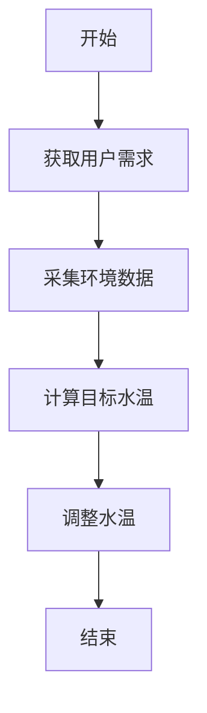
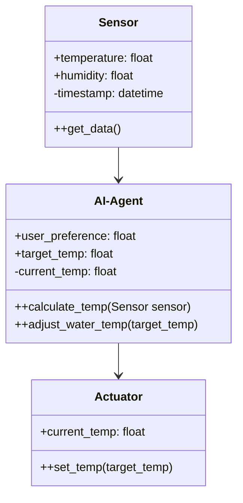
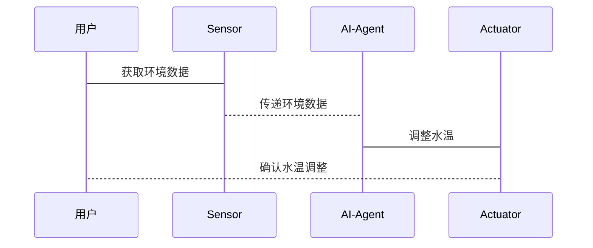

                 


# 智能浴室：AI Agent的水温调节系统

> 关键词：AI Agent，智能浴室，水温调节系统，物联网，传感器，数据处理

> 摘要：本文详细探讨了智能浴室中AI Agent水温调节系统的实现，从背景介绍到系统架构设计，再到项目实战，全面解析了该系统的核心技术与应用场景。通过详细分析AI Agent的工作原理、算法设计和系统实现，本文为读者提供了从理论到实践的完整指南。

---

## 第一部分: 背景介绍

### 第1章: 问题背景与系统概述

#### 1.1 问题背景

智能浴室的概念随着智能家居的发展而逐渐兴起。传统的浴室水温调节系统主要依赖手动操作，用户需要通过旋钮或按键调整水温，这种方式不仅效率低下，而且难以满足个性化需求。此外，传统系统无法根据环境变化（如室温、湿度）或用户习惯自动调整，导致用户体验不佳，能源浪费问题也较为突出。

AI Agent（人工智能代理）作为一种能够感知环境、自主决策的智能体，能够有效解决这些问题。通过引入AI Agent，浴室系统可以实现智能化的水温调节，为用户提供更加舒适、节能的使用体验。

---

#### 1.2 系统概述

##### 1.2.1 智能浴室水温调节系统的定义
智能浴室水温调节系统是一种结合AI技术的智能控制系统，通过传感器采集环境数据（如温度、湿度、用户习惯等），利用AI算法进行分析和决策，自动调节水温以满足用户的个性化需求。

##### 1.2.2 系统的核心功能与目标
- **核心功能**：
  - 实时采集浴室环境数据（温度、湿度、用户偏好）。
  - 通过AI算法计算目标水温。
  - 自动控制水温调节设备（如混水阀）。
  - 提供用户友好的交互界面（如手机APP或语音控制）。
- **目标**：
  - 提供个性化的水温调节服务。
  - 实现节能减排，降低能源消耗。
  - 提升用户体验，简化操作流程。

##### 1.2.3 系统的边界与外延
智能浴室水温调节系统的核心部分包括传感器、AI算法、执行机构和用户交互界面。系统的外延部分涉及智能家居平台（如智能音箱、智能门锁等）以及能源管理系统。

---

### 第2章: 核心概念与联系

#### 2.1 AI Agent的基本概念

##### 2.1.1 AI Agent的定义与分类
AI Agent是一种能够感知环境、自主决策并执行任务的智能体。根据应用场景的不同，AI Agent可以分为简单反射Agent、基于模型的反射Agent、目标驱动Agent和效用驱动Agent。

##### 2.1.2 AI Agent的核心要素
- **感知**：通过传感器或其他数据源获取环境信息。
- **推理**：利用算法对数据进行分析和处理，生成决策。
- **行动**：根据决策结果执行操作，影响环境或用户。

##### 2.1.3 AI Agent与智能浴室的结合
在智能浴室中，AI Agent负责协调传感器、执行机构和用户交互，实现水温的智能调节。例如，当检测到用户习惯早晨使用较冷的水时，系统会自动调整水温至用户偏好。

---

## 第二部分: 核心概念与联系

### 第2章: AI Agent的核心原理

#### 2.1 AI Agent的基本原理

##### 2.1.1 感知与数据采集
AI Agent通过传感器采集浴室环境数据，包括：
- **温度**：水温、室温。
- **湿度**：空气湿度。
- **用户偏好**：用户的历史用水习惯。

##### 2.1.2 数据处理与分析
AI Agent对采集到的数据进行处理，生成可供决策的特征向量。例如，将温度、湿度和用户偏好组合成一个向量，用于后续的水温计算。

##### 2.1.3 决策与执行
基于处理后的数据，AI Agent利用算法计算出目标水温，并通过执行机构（如混水阀）调整水温。

---

## 第三部分: 算法原理讲解

### 第3章: 智能水温调节算法

#### 3.1 算法概述

##### 3.1.1 算法的基本原理
智能水温调节算法的核心思想是根据用户需求和环境数据，动态调整水温。常见的算法包括模糊逻辑算法和机器学习算法。

##### 3.1.2 算法的核心思想
- **模糊逻辑算法**：通过模糊规则（如“如果水温过低，则增加温度”）进行决策。
- **机器学习算法**：基于历史数据训练模型，预测用户偏好并调整水温。

##### 3.1.3 算法的实现步骤
1. 采集环境数据和用户需求。
2. 数据预处理（归一化、特征提取）。
3. 计算目标水温。
4. 调整水温并反馈结果。

---

### 第3章: 算法实现代码

#### 3.2 算法流程图（Mermaid）


#### 3.3 算法实现代码
```python
def calculate_water_temp(user_preference, current_temp):
    # 简单的线性调整算法
    target_temp = user_preference + (current_temp - user_preference) * 0.5
    return target_temp

# 示例调用
user_preference = 37
current_temp = 25
target_temp = calculate_water_temp(user_preference, current_temp)
print(f"目标水温：{target_temp}℃")
```

---

## 第四部分: 系统分析与架构设计方案

### 第4章: 系统分析与架构设计

#### 4.1 系统功能设计

##### 4.1.1 领域模型（Mermaid类图）


#### 4.2 系统架构设计

##### 4.2.1 系统架构图（Mermaid架构图）
```mermaid
docker
    service Sensor-Service
    service AI-Agent-Service
    service Actuator-Service
    Sensor-Service --> AI-Agent-Service
    AI-Agent-Service --> Actuator-Service
```

#### 4.3 系统接口设计

##### 4.3.1 接口描述
- **Sensor接口**：提供环境数据采集功能。
- **AI-Agent接口**：接收传感器数据，计算目标水温。
- **Actuator接口**：根据目标水温调整水温。

#### 4.4 系统交互序列图（Mermaid序列图）


---

## 第五部分: 项目实战

### 第5章: 项目实战

#### 5.1 环境安装

##### 5.1.1 系统环境
- Python 3.8+
- AI框架（如TensorFlow或Scikit-learn）

##### 5.1.2 工具安装
```bash
pip install numpy
pip install scikit-learn
pip install matplotlib
```

#### 5.2 核心代码实现

##### 5.2.1 传感器数据采集代码
```python
import numpy as np

def get_sensor_data():
    # 模拟传感器数据
    temperature = np.random.uniform(25, 40)
    humidity = np.random.uniform(30, 90)
    return temperature, humidity

temperature, humidity = get_sensor_data()
print(f"温度：{temperature}℃，湿度：{humidity}%")
```

##### 5.2.2 AI Agent算法实现
```python
from sklearn.linear_model import LinearRegression

# 训练数据
X = np.array([[25, 30], [30, 40], [35, 50]])
y = np.array([37, 40, 45])

model = LinearRegression().fit(X, y)

# 预测目标水温
new_X = np.array([[28, 35]])
predicted_temp = model.predict(new_X)
print(f"预测水温：{predicted_temp[0]}℃")
```

#### 5.3 代码解读与分析
- **传感器数据采集**：通过随机数生成模拟数据，用于算法测试。
- **AI Agent算法实现**：使用线性回归模型预测目标水温，展示了如何将AI算法应用于实际问题。

#### 5.4 实际案例分析
假设用户偏好水温为37℃，当前水温为25℃，系统将通过算法计算出目标水温为31℃，并调整水温至目标值。

---

## 第六部分: 最佳实践

### 第6章: 最佳实践

#### 6.1 小结
本文详细介绍了智能浴室中AI Agent水温调节系统的实现，从背景介绍到系统架构设计，再到项目实战，全面解析了该系统的核心技术与应用场景。

#### 6.2 注意事项
- 系统的安全性：确保传感器和执行机构的安全性，防止黑客攻击。
- 系统的稳定性：确保AI算法的鲁棒性，避免因数据异常导致系统崩溃。

#### 6.3 拓展阅读
- 推荐阅读《AI Agent的设计与实现》和《智能建筑系统设计》。

---

## 作者：AI天才研究院/AI Genius Institute & 禅与计算机程序设计艺术 /Zen And The Art of Computer Programming

