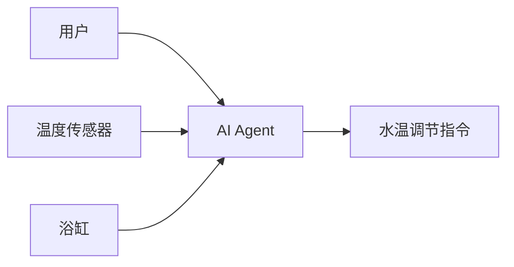
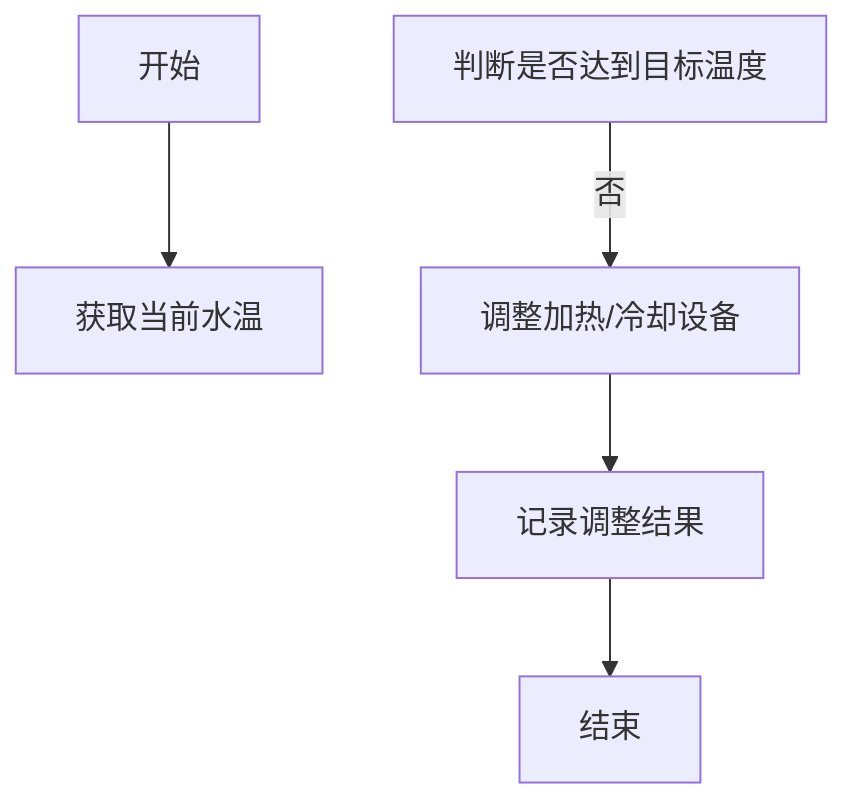
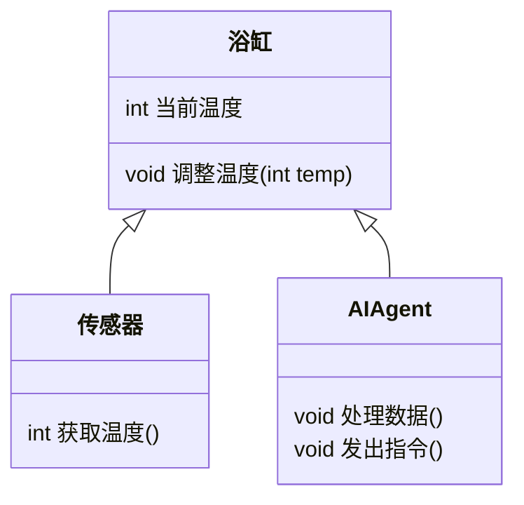
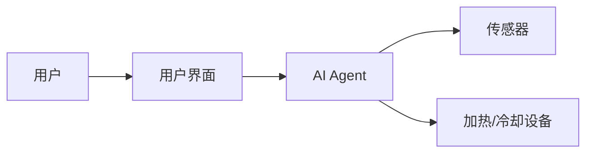

                 


# 智能浴缸：AI Agent的水温调节系统

> 关键词：AI Agent，水温调节，智能浴缸，PID控制，系统架构

> 摘要：本文深入探讨了智能浴缸中AI Agent的水温调节系统，从背景分析、核心概念、算法原理到系统架构、项目实战，全面解析了如何利用AI技术实现水温的智能调节。通过详细的理论分析与代码实现，结合实际案例，展示了AI Agent在智能浴缸中的应用场景和实现方法。

---

## 第一章: 背景介绍与问题分析

### 1.1 问题背景

#### 1.1.1 浴缸水温调节的传统方式
传统的浴缸水温调节方式主要依赖手动操作，用户通过调节浴缸的加热或冷却设备来达到理想的水温。这种方式存在以下问题：
- **效率低下**：用户需要反复调节，无法快速达到目标温度。
- **精度不足**：手动调节容易受到主观因素影响，温度控制不够精确。
- **舒适性差**：用户在调节过程中可能需要频繁调整，影响使用体验。

#### 1.1.2 智能化水温调节的需求
随着智能家居的普及，用户对智能浴缸的需求日益增长。智能化水温调节系统能够：
- 实现自动化控制，提升用户体验。
- 提高调节精度，确保水温恒定。
- 提供个性化设置，满足不同用户的需求。

#### 1.1.3 AI Agent在水温调节中的作用
AI Agent（智能代理）能够通过感知环境、分析数据并执行操作来实现智能化的水温调节。其主要作用包括：
- **实时监测**：通过传感器获取水温数据。
- **智能决策**：基于历史数据和当前状态，优化水温调节策略。
- **自动执行**：根据决策结果调整加热或冷却设备。

### 1.2 问题描述

#### 1.2.1 浴缸水温调节的核心问题
水温调节的核心问题在于如何实现快速、精确且稳定的温度控制。这需要解决以下问题：
- 如何感知水温？
- 如何处理水温数据？
- 如何制定调节策略？

#### 1.2.2 用户需求与痛点分析
用户在使用浴缸时，通常有以下需求：
- 快速达到目标温度。
- 恒定水温，避免频繁波动。
- 根据个人偏好调整水温。
- 操作简便，无需手动调节。

#### 1.2.3 智能浴缸的定义与目标
智能浴缸是一种结合了AI技术的浴缸，其目标是通过AI Agent实现水温的智能化调节，满足用户对舒适性、便捷性和个性化的需求。

### 1.3 问题解决与边界

#### 1.3.1 AI Agent如何解决水温调节问题
AI Agent通过以下方式实现水温调节：
- **实时感知**：利用温度传感器获取水温数据。
- **智能决策**：基于传感器数据和历史记录，优化调节策略。
- **自动执行**：通过控制加热或冷却设备，调整水温。

#### 1.3.2 系统边界与外延
水温调节系统的核心边界包括：
- **输入**：用户设定的目标温度、传感器反馈的当前温度。
- **输出**：加热或冷却设备的控制信号。
- **内部状态**：系统的历史数据、调节策略。

#### 1.3.3 核心要素与组成结构
智能浴缸的水温调节系统主要由以下部分组成：
- **传感器**：实时监测水温。
- **AI Agent**：处理数据并制定调节策略。
- **执行机构**：根据指令调整水温。
- **用户界面**：提供人机交互功能。

---

## 第二章: 核心概念与联系

### 2.1 核心概念原理

#### 2.1.1 AI Agent的基本原理
AI Agent是一种能够感知环境、做出决策并执行操作的智能系统。其基本原理包括：
1. **感知**：通过传感器获取环境数据。
2. **决策**：基于数据进行分析和推理。
3. **执行**：根据决策结果采取行动。

#### 2.1.2 水温调节系统的构成
水温调节系统主要由以下部分构成：
- **温度传感器**：实时监测水温。
- **AI Agent**：处理数据并制定调节策略。
- **加热/冷却设备**：根据指令调整水温。

#### 2.1.3 AI Agent与水温调节的结合
AI Agent通过以下方式实现与水温调节的结合：
- **数据采集**：获取水温和环境数据。
- **数据分析**：分析数据并制定调节策略。
- **指令执行**：通过控制设备调整水温。

### 2.2 核心概念对比

#### 2.2.1 AI Agent与传统控制系统的对比
| 特性         | AI Agent                   | 传统控制系统             |
|--------------|----------------------------|--------------------------|
| 数据处理     | 基于机器学习算法           | 基于固定逻辑             |
| 灵活性       | 高度灵活，适应性强          | 灵活性较低                |
| 学习能力     | 具备学习能力                | 无学习能力                |

#### 2.2.2 水温调节系统的属性特征对比
| 属性         | 传统调节系统                | 智能调节系统              |
|--------------|-----------------------------|--------------------------|
| 精度         | 较低                        | 较高                      |
| 速度         | 较慢                        | 较快                      |
| 便捷性       | 低                         | 高                       |

### 2.3 实体关系架构



---

## 第三章: 算法原理与数学模型

### 3.1 算法原理讲解

#### 3.1.1 PID控制算法
PID（比例-积分-微分）控制是一种常用的反馈控制算法，适用于水温调节系统。

- **比例项（P）**：根据当前误差调整输出。
- **积分项（I）**：消除稳态误差。
- **微分项（D）**：预测误差的变化率。

PID控制公式：
$$ u(t) = K_p e(t) + K_i \int e(t) dt + K_d \frac{de(t)}{dt} $$

其中：
- $K_p$：比例系数
- $K_i$：积分系数
- $K_d$：微分系数
- $e(t)$：误差

#### 3.1.2 PID控制流程图


#### 3.1.3 PID控制代码实现
```python
def pid_control(target_temp, current_temp, Kp, Ki, Kd):
    error = target_temp - current_temp
    integral += error * dt
    derivative = (error - previous_error) / dt
    output = Kp * error + Ki * integral + Kd * derivative
    return output
```

---

## 第四章: 系统分析与架构设计

### 4.1 系统分析

#### 4.1.1 项目场景介绍
智能浴缸的水温调节系统主要用于家庭或公共场所，为用户提供舒适的泡澡体验。

#### 4.1.2 系统功能设计
- **数据采集**：实时采集水温数据。
- **数据处理**：分析数据并制定调节策略。
- **指令执行**：控制加热或冷却设备。

### 4.2 系统架构设计

#### 4.2.1 领域模型


#### 4.2.2 系统架构


---

## 第五章: 项目实战

### 5.1 环境安装

#### 5.1.1 系统要求
- Python 3.8+
- 传感器模块（如DS18B20）
- 加热/冷却设备（如电热器）

#### 5.1.2 安装依赖
```bash
pip install numpy
pip install matplotlib
```

### 5.2 核心代码实现

#### 5.2.1 传感器数据采集
```python
import RPi.GPIO as GPIO
import time

def read_temperature():
    # 传感器数据读取逻辑
    return current_temp
```

#### 5.2.2 PID控制器实现
```python
def pid_control(target_temp, current_temp, Kp, Ki, Kd):
    error = target_temp - current_temp
    integral += error * dt
    derivative = (error - previous_error) / dt
    output = Kp * error + Ki * integral + Kd * derivative
    return output
```

#### 5.2.3 系统主程序
```python
def main():
    target_temp = 37  # 目标温度
    Kp = 1
    Ki = 0.5
    Kd = 0.2
    while True:
        current_temp = read_temperature()
        output = pid_control(target_temp, current_temp, Kp, Ki, Kd)
        adjust_heater(output)
        time.sleep(1)

if __name__ == "__main__":
    main()
```

### 5.3 案例分析

#### 5.3.1 系统运行结果
- **目标温度**：37°C
- **初始温度**：25°C
- **调节过程**：系统通过PID控制快速将水温提升至目标温度，并保持恒定。

---

## 第六章: 最佳实践与总结

### 6.1 小结
通过本文的分析与实现，我们展示了如何利用AI Agent实现智能浴缸的水温调节系统。系统通过传感器采集数据、PID控制器优化调节策略，最终实现快速、精确的水温控制。

### 6.2 注意事项
- 系统调试时需注意传感器的精度和设备的响应速度。
- PID参数需根据实际情况进行调整，以确保最佳调节效果。

### 6.3 拓展阅读
- **相关技术**：PID控制、机器学习在智能控制中的应用。
- **实际应用**：智能家居中的其他智能设备开发。

---

作者：AI天才研究院 & 禅与计算机程序设计艺术

