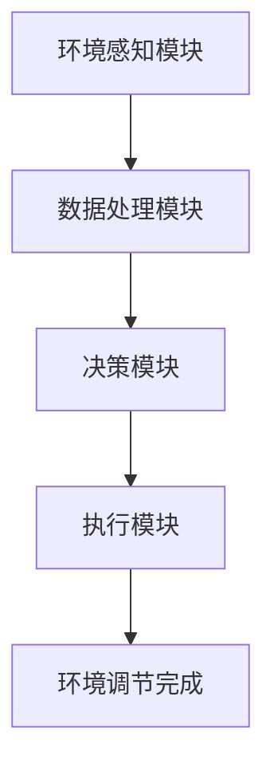
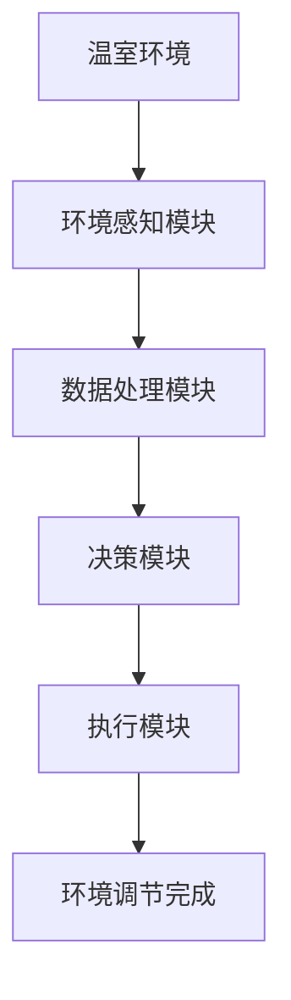
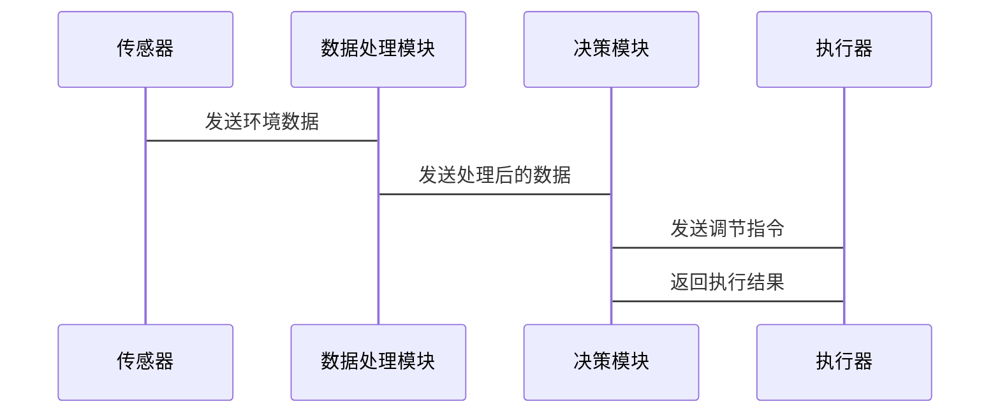

                 


# 智能温室：AI Agent的环境调节系统

> **关键词**：智能温室，AI Agent，环境调节，机器学习，物联网，自动化控制

> **摘要**：  
本文探讨了智能温室中AI Agent（人工智能代理）在环境调节系统中的应用。通过分析温室环境调节的核心问题，结合AI Agent的基本概念和算法原理，提出了一种基于AI Agent的智能温室环境调节系统的设计方案。文章详细介绍了系统的架构设计、算法实现、项目实战以及优化建议，为读者提供了从理论到实践的全面指导。

---

# 引言

智能温室是一种利用计算机技术、物联网技术以及自动化控制技术实现温室环境智能调节的现代农业设施。随着全球气候变化和人口增长的挑战，智能温室在提高农业效率、节约资源、保障粮食安全方面发挥着重要作用。然而，传统的温室环境调节系统存在效率低、能耗高、智能化水平不足等问题。

AI Agent（人工智能代理）作为一种能够感知环境、自主决策并执行任务的智能实体，为解决这些问题提供了新的可能性。本文将从AI Agent的基本概念出发，结合智能温室的环境调节需求，系统地探讨AI Agent在智能温室中的应用，提出一种基于AI Agent的环境调节系统设计方案。

---

# 第1章: 智能温室与AI Agent的背景与概念

## 1.1 智能温室的定义与背景

### 1.1.1 温室的概念与历史发展  
温室是一种通过人工调节温、湿度、光照等环境因素，为植物提供适宜生长条件的设施。传统温室依赖人工操作，存在效率低、资源浪费等问题。随着技术的进步，智能温室逐渐成为现代农业的重要组成部分。

### 1.1.2 智能温室的特点  
智能温室结合了物联网、大数据、人工智能等技术，能够实时感知环境参数，自动调节温、湿度、光照等条件，从而实现高效、精准的农业生产。

### 1.1.3 智能温室在农业中的作用  
智能温室能够显著提高作物产量，减少资源浪费，同时降低人工成本，为现代农业发展提供重要支持。

---

## 1.2 环境调节系统的核心问题

### 1.2.1 温室环境调节的难点  
温室环境调节需要实时感知环境参数（如温度、湿度、光照），并根据作物需求动态调整环境条件。然而，环境变化复杂，作物需求多样，传统控制方法难以实现精准调节。

### 1.2.2 现有解决方案的局限性  
传统温室环境调节系统通常基于固定的规则或简单的反馈控制，难以应对复杂的环境变化和作物需求。

### 1.2.3 AI Agent在环境调节中的潜力  
AI Agent具有感知环境、自主决策、动态调整的能力，能够有效解决传统环境调节系统的局限性。

---

## 1.3 AI Agent的基本概念

### 1.3.1 什么是AI Agent  
AI Agent是一种能够感知环境、自主决策并执行任务的智能实体。它通过传感器获取环境信息，利用算法进行分析和决策，并通过执行器实现目标。

### 1.3.2 AI Agent的核心特征  
1. **自主性**：能够在没有外部干预的情况下独立运行。  
2. **反应性**：能够实时感知环境变化并做出反应。  
3. **目标导向性**：具有明确的目标，并通过行动实现目标。  
4. **学习能力**：能够通过数据学习和优化自身行为。

### 1.3.3 AI Agent与智能温室的结合  
在智能温室中，AI Agent可以作为环境调节的核心模块，负责感知环境参数、分析数据、制定调节策略并执行控制。

---

# 第2章: AI Agent与智能温室的系统架构

## 2.1 系统整体架构

### 2.1.1 系统组成模块  
智能温室环境调节系统主要包括以下几个模块：  
1. **环境感知模块**：负责采集温室内的温度、湿度、光照等参数。  
2. **数据处理模块**：对感知数据进行预处理和特征提取。  
3. **决策模块**：基于数据进行分析，制定环境调节策略。  
4. **执行模块**：根据决策结果，控制温室内的设备（如风机、加湿器、遮光帘等）。  

### 2.1.2 各模块的功能描述  
- **环境感知模块**：通过传感器采集环境数据。  
- **数据处理模块**：对数据进行清洗、归一化处理，并提取特征。  
- **决策模块**：利用机器学习模型进行分析，生成调节策略。  
- **执行模块**：根据决策结果，控制执行器调整环境条件。  

### 2.1.3 系统的总体流程  
系统总体流程如下：  
1. 传感器采集环境数据。  
2. 数据处理模块对数据进行预处理。  
3. 决策模块基于处理后的数据生成调节策略。  
4. 执行模块根据策略调整环境条件。  
5. 系统实时反馈环境变化，形成闭环控制。

---

## 2.2 AI Agent在系统中的角色

### 2.2.1 Agent的感知模块  
AI Agent的感知模块通过传感器获取环境数据，并通过数据处理模块对数据进行分析和特征提取。  

### 2.2.2 Agent的决策模块  
决策模块基于感知数据和作物需求，利用机器学习模型生成环境调节策略。  

### 2.2.3 Agent的执行模块  
执行模块根据决策结果，通过执行器（如风机、加湿器）调整温室环境条件。  

---

## 2.3 系统的输入输出接口

### 2.3.1 输入数据的类型与来源  
- **输入数据类型**：温度、湿度、光照强度、二氧化碳浓度等。  
- **数据来源**：传感器（如温度传感器、湿度传感器、光照传感器等）。  

### 2.3.2 输出控制的信号与目标  
- **输出信号**：风机开关信号、加湿器开关信号、遮光帘开关信号等。  
- **控制目标**：维持温室内的温、湿度在合理范围内，提供适宜的光照条件。  

### 2.3.3 接口的设计与实现  
系统通过标准化接口（如Modbus、HTTP）实现传感器和执行器的通信。

---

## 2.4 本章小结  
本章详细介绍了智能温室环境调节系统的整体架构，以及AI Agent在系统中的角色和功能。通过模块化设计，系统能够实现高效的环境调节。

---

# 第3章: 智能温室环境调节的核心算法

## 3.1 环境感知算法

### 3.1.1 温度、湿度、光照的采集与处理  
环境感知算法通过传感器采集温室内的温度、湿度、光照等参数，并对数据进行预处理和特征提取。

### 3.1.2 数据预处理与特征提取  
数据预处理包括数据清洗、归一化处理等。特征提取则通过提取关键特征（如温度变化率、湿度波动幅度）来简化问题。

---

## 3.2 环境决策算法

### 3.2.1 基于机器学习的决策模型  
决策算法基于感知数据，利用机器学习模型（如支持向量机、随机森林）进行分析，生成环境调节策略。

### 3.2.2 决策逻辑的优化与调整  
通过在线学习和反馈机制，优化决策模型的性能，提高调节精度。

### 3.2.3 多目标优化的实现方法  
多目标优化通过权衡不同目标（如温度、湿度、光照）的优先级，实现最优调节。

---

## 3.3 环境执行算法

### 3.3.1 执行策略的制定  
根据决策结果，制定具体的执行策略（如开启风机、关闭加湿器）。

### 3.3.2 执行过程的监控与反馈  
通过实时监控执行结果，调整策略以适应环境变化。

### 3.3.3 执行结果的评估与优化  
通过评估执行效果，优化执行策略，提高系统效率。

---

## 3.4 算法的数学模型与公式

### 3.4.1 感知模型的数学表达  
$$ y = f(x) $$  

### 3.4.2 决策模型的数学表达  
$$ z = g(y) $$  

### 3.4.3 执行模型的数学表达  
$$ w = h(z) $$  

---

## 3.5 本章小结  
本章详细介绍了智能温室环境调节的核心算法，包括感知算法、决策算法和执行算法的设计与实现。

---

# 第4章: 系统的实现与部署

## 4.1 系统开发环境的搭建

### 4.1.1 开发工具的选择与安装  
开发工具包括Python、TensorFlow、Pandas等。  

### 4.1.2 数据库的搭建与配置  
使用MySQL或MongoDB存储感知数据和决策结果。  

### 4.1.3 网络环境的搭建与测试  
通过局域网或云平台实现传感器和执行器的通信。

---

## 4.2 系统核心模块的实现

### 4.2.1 感知模块的代码实现  
```python
import numpy as np
import pandas as pd

# 读取传感器数据
data = pd.read_csv('sensor_data.csv')
# 数据预处理
data = data.dropna()
# 特征提取
features = data[['temperature', 'humidity', 'light']]
```

### 4.2.2 决策模块的代码实现  
```python
from sklearn.svm import SVC
from sklearn.model_selection import train_test_split

# 训练决策模型
X_train, X_test, y_train, y_test = train_test_split(features, labels)
model = SVC()
model.fit(X_train, y_train)
```

### 4.2.3 执行模块的代码实现  
```python
# 根据决策结果控制执行器
if decision == 'open_fan':
    fan.open()
elif decision == 'close_fan':
    fan.close()
```

---

## 4.3 系统的集成与测试

### 4.3.1 模块的集成与调试  
将感知、决策、执行模块集成到一个统一的系统中，并进行功能调试。

### 4.3.2 系统的功能测试  
测试系统在不同环境条件下的调节效果，验证系统的稳定性和准确性。

### 4.3.3 系统的性能优化  
通过优化算法和调整参数，提高系统的运行效率和调节精度。

---

## 4.4 本章小结  
本章详细介绍了智能温室环境调节系统的实现与部署过程，包括开发环境搭建、核心模块实现以及系统测试与优化。

---

# 第5章: 项目实战与案例分析

## 5.1 项目背景与目标

### 5.1.1 项目背景  
本文项目旨在设计并实现一个基于AI Agent的智能温室环境调节系统，解决传统温室环境调节效率低、智能化水平不足的问题。

### 5.1.2 项目目标  
实现温室环境的智能调节，提高作物产量，降低资源浪费。

---

## 5.2 系统功能设计

### 5.2.1 系统功能模块  
1. **环境感知模块**：采集温室环境数据。  
2. **数据处理模块**：对数据进行预处理和特征提取。  
3. **决策模块**：基于数据生成调节策略。  
4. **执行模块**：根据策略调整环境条件。  

### 5.2.2 功能流程图  


---

## 5.3 系统架构设计

### 5.3.1 系统架构图  


### 5.3.2 系统接口设计  
- **输入接口**：传感器数据接口。  
- **输出接口**：执行器控制接口。  

### 5.3.3 系统交互序列图  


---

## 5.4 项目实战

### 5.4.1 环境安装  
安装必要的开发工具和库（如Python、TensorFlow、Pandas）。  

### 5.4.2 系统核心实现  
实现感知模块、决策模块和执行模块的核心功能。  

### 5.4.3 案例分析  
以某温室为例，分析系统在不同环境条件下的调节效果，验证系统的可行性和有效性。

---

## 5.5 本章小结  
本章通过项目实战，详细介绍了智能温室环境调节系统的实现过程，并通过案例分析验证了系统的有效性。

---

# 第6章: 总结与展望

## 6.1 总结  
本文详细探讨了AI Agent在智能温室环境调节系统中的应用，提出了基于AI Agent的智能温室环境调节系统的设计方案。通过理论分析和实践验证，证明了该系统在提高调节效率、降低资源消耗方面具有显著优势。

---

## 6.2 展望  
未来，随着人工智能和物联网技术的不断发展，智能温室环境调节系统将更加智能化和高效化。可以通过引入更先进的算法（如深度学习、强化学习）进一步优化系统性能，同时拓展系统功能，实现温室作物的精准种植和管理。

---

# 作者信息

**作者：AI天才研究院/AI Genius Institute & 禅与计算机程序设计艺术 /Zen And The Art of Computer Programming**

---

**声明：本文内容遵循CC BY-NC-SA 4.0协议，禁止商业用途，转载请注明出处。**

