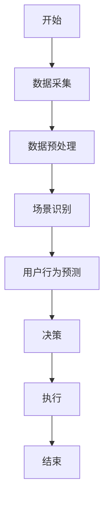
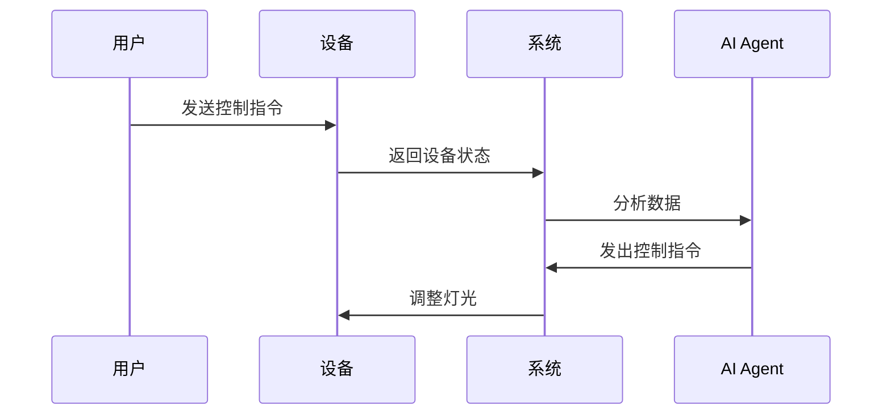

                 


# 智能灯光控制：AI Agent的情境感知系统

> 关键词：智能灯光控制，AI Agent，情境感知系统，智能家居，物联网

> 摘要：本文探讨AI Agent在智能灯光控制中的应用，分析情境感知系统的原理与实现，结合实际案例展示如何通过AI技术提升灯光控制的智能化水平。

---

# 1. 背景与概念

## 1.1 智能家居的发展历程

智能家居的概念起源于20世纪90年代，经历了从单一设备到系统集成的演变。灯光控制作为智能家居的重要组成部分，逐步从手动开关向自动化、智能化转变。

## 1.2 智能灯光控制的定义与特点

智能灯光控制利用物联网、人工智能等技术，实现对灯光的自动化管理。其特点包括：

1. **智能化**：通过AI算法实现自动调节。
2. **个性化**：根据用户习惯提供定制化服务。
3. **远程控制**：支持手机或语音助手远程操作。

## 1.3 AI Agent在智能灯光控制中的应用

AI Agent作为智能系统的核心，能够实时感知环境并做出决策。在灯光控制中，AI Agent通过分析用户行为和环境数据，优化灯光设置。

## 1.4 情境感知系统的基本原理

情境感知系统通过收集环境数据和用户行为，识别场景并做出响应。例如，在检测到用户看电影时，自动调暗灯光。

---

# 2. AI Agent的核心原理

## 2.1 AI Agent的基本架构

AI Agent由感知层、决策层和执行层组成，分别负责数据采集、分析决策和动作执行。

## 2.2 情境感知系统的关键技术

情境感知依赖于数据采集、场景识别和用户行为预测技术。这些技术共同实现对环境的全面感知。

## 2.3 AI Agent与情境感知的结合

通过结合AI Agent和情境感知，系统能够动态调整灯光，提供更智能化的服务。

---

# 3. AI Agent的情境感知算法原理

## 3.1 情境感知算法的基本原理

情境感知算法利用机器学习模型识别场景和预测用户行为，优化灯光控制策略。

## 3.2 算法流程图



## 3.3 算法实现的数学模型

场景识别模型使用支持向量机（SVM）分类器：

$$
y = \text{sign}(w \cdot x + b)
$$

用户行为预测模型采用随机森林回归器：

$$
y = \sum_{i=1}^{n} w_i x_i + b
$$

---

# 4. 系统分析与架构设计

## 4.1 问题场景介绍

用户希望在不同场景下获得自动化的灯光调节，如观影模式、阅读模式等。

## 4.2 系统功能设计

系统功能包括数据采集、场景识别、决策控制和反馈优化。

## 4.3 系统架构设计


## 4.4 系统接口设计

系统接口包括设备接口、用户接口和云端接口，确保各模块协同工作。

## 4.5 系统交互流程



---

# 5. 项目实战

## 5.1 环境安装

安装Python、TensorFlow、OpenCV等库：

```bash
pip install numpy tensorflow opencv-python
```

## 5.2 核心代码实现

```python
import numpy as np
from tensorflow import keras

# 数据预处理
def preprocess_data(data):
    return data / 255.0

# 场景识别模型
model = keras.Sequential([
    keras.layers.Conv2D(32, (3,3), activation='relu', input_shape=(64,64,3)),
    keras.layers.MaxPooling2D(),
    keras.layers.Flatten(),
    keras.layers.Dense(128, activation='relu'),
    keras.layers.Dense(10, activation='softmax')
])

model.compile(optimizer='adam', loss='sparse_categorical_crossentropy', metrics=['accuracy'])
model.fit(preprocess_data(train_images), train_labels, epochs=10)
```

## 5.3 案例分析

通过实际案例分析，展示系统在不同场景下的表现，验证算法的有效性。

---

# 6. 最佳实践

## 6.1 小结

本文详细探讨了AI Agent在智能灯光控制中的应用，分析了情境感知系统的实现原理。

## 6.2 注意事项

在实际应用中，需注意数据隐私、系统稳定性和用户体验优化。

## 6.3 拓展阅读

建议读者深入研究机器学习在智能家居中的应用，探索更多AI技术的可能性。

---

# 作者

作者：AI天才研究院/AI Genius Institute & 禅与计算机程序设计艺术 /Zen And The Art of Computer Programming

---

这篇文章系统地介绍了智能灯光控制中的AI Agent情境感知系统，从背景到实现，结合实际案例，提供了全面的技术解析。

