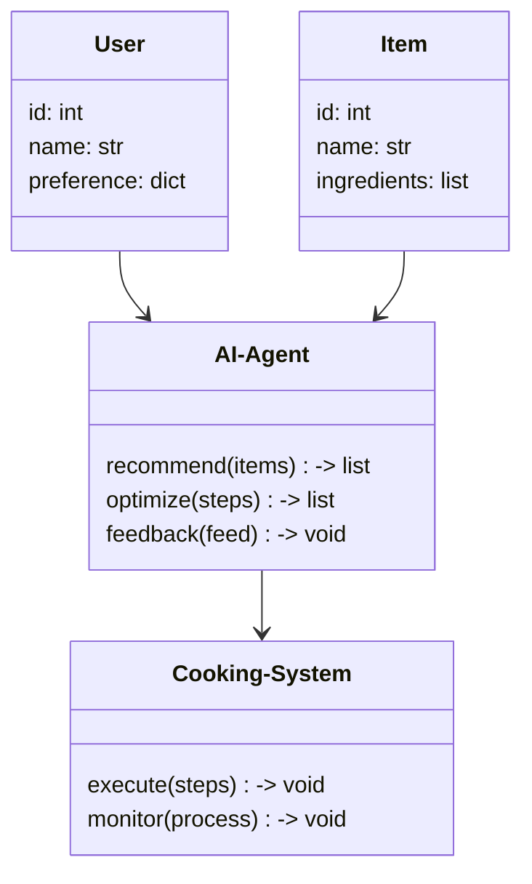
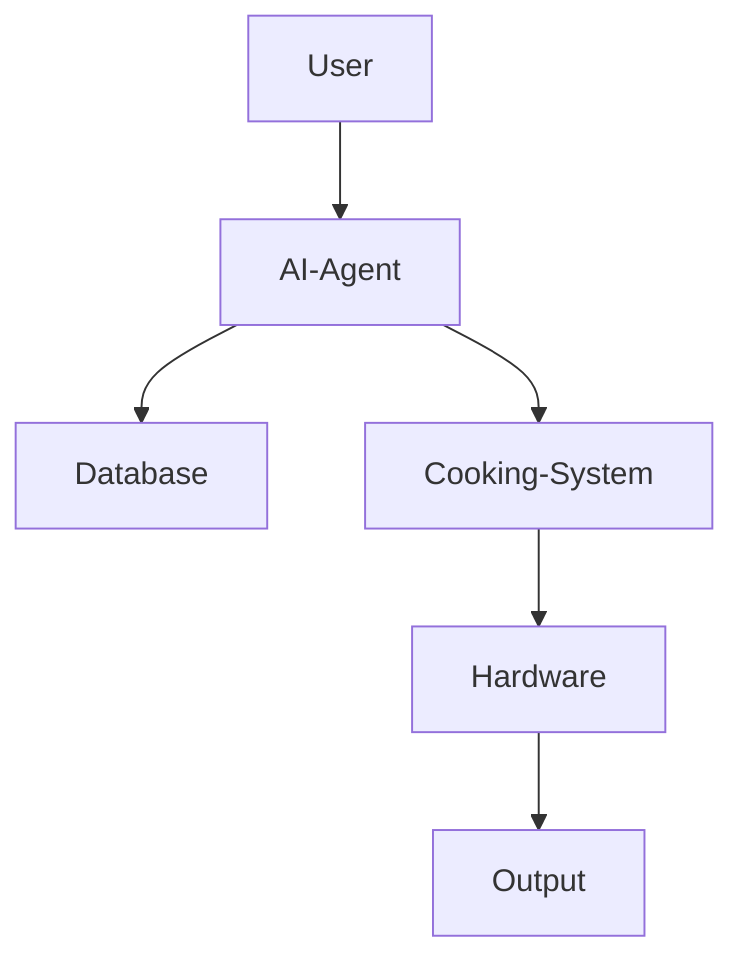
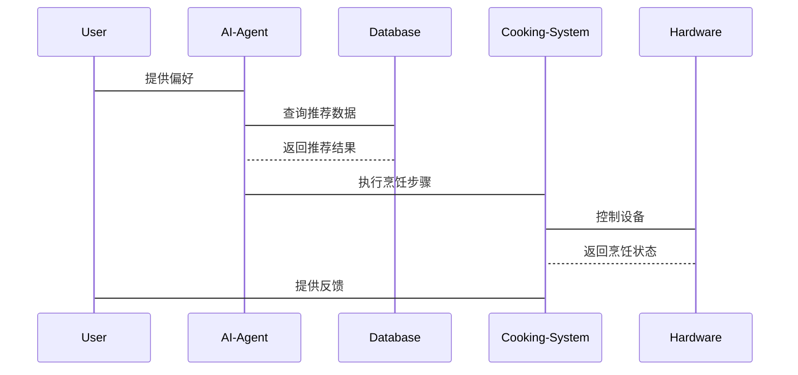

                 


# 智能烹饪台：AI Agent的厨艺提升指导系统

## 关键词：AI Agent、智能烹饪台、厨艺提升、人工智能推荐系统、数据驱动的烹饪指导

## 摘要：  
智能烹饪台是一种结合人工智能技术的智能设备，通过AI Agent（人工智能代理）为用户提供个性化的烹饪指导、食材推荐和厨艺提升服务。本文将详细探讨智能烹饪台的核心概念、算法原理、系统架构以及实际应用场景，帮助读者全面理解这一创新技术的实现与应用。

---

## 第一部分：背景与概述

### 第1章：智能烹饪台的背景与现状

#### 1.1 智能烹饪台的概念与定义
- **1.1.1 智能烹饪台的定义**  
智能烹饪台是一种集成人工智能技术的智能厨房设备，能够通过AI Agent分析用户的烹饪习惯、口味偏好和食材特性，提供个性化的烹饪建议、食材推荐和厨艺提升方案。
- **1.1.2 智能烹饪台的核心功能**  
智能烹饪台的核心功能包括：  
1. 根据用户口味推荐菜谱。  
2. 自动调整烹饪参数（如温度、时间）。  
3. 提供食材搭配建议。  
4. 实时监控烹饪过程并纠错。  
- **1.1.3 智能烹饪台的市场现状**  
随着人工智能技术的快速发展，智能烹饪台逐渐从概念走向商业化，成为智能家居和智慧厨房的重要组成部分。

#### 1.2 AI Agent在烹饪中的应用
- **1.2.1 AI Agent的基本概念**  
AI Agent（人工智能代理）是指能够感知环境、执行任务并做出决策的智能系统。  
- **1.2.2 AI Agent在烹饪中的作用**  
AI Agent在烹饪中的作用主要体现在：  
1. 根据用户数据推荐菜谱。  
2. 自动优化烹饪步骤。  
3. 提供实时烹饪指导。  
- **1.2.3 AI Agent与智能烹饪台的结合**  
AI Agent通过与智能烹饪台的交互，能够实时调整烹饪参数，确保烹饪结果符合用户期望。

#### 1.3 智能烹饪台的优势与挑战
- **1.3.1 智能烹饪台的优势**  
1. 提高烹饪效率。  
2. 降低烹饪难度。  
3. 提供个性化烹饪体验。  
- **1.3.2 智能烹饪台的挑战**  
1. 数据隐私问题。  
2. 系统稳定性要求高。  
3. 用户接受度的不确定性。  
- **1.3.3 智能烹饪台的未来发展**  
随着技术的进步，智能烹饪台将更加智能化、个性化，成为厨房中的全能助手。

---

## 第二部分：核心概念与技术

### 第2章：智能烹饪台的核心概念与联系

#### 2.1 AI Agent的核心概念
- **2.1.1 AI Agent的定义与属性**  
AI Agent具有感知、决策和执行三大核心属性。  
- **2.1.2 AI Agent的分类与特点**  
AI Agent可以根据智能水平分为：  
1. 反应式AI Agent。  
2. 生成式AI Agent。  
3. 混合式AI Agent。  

#### 2.2 智能烹饪台的核心要素
- **2.2.1 烹饪数据**  
烹饪数据包括用户偏好、食材特性、烹饪步骤等。  
- **2.2.2 AI算法**  
AI算法包括推荐算法、自然语言处理和计算机视觉等。  
- **2.2.3 用户交互**  
用户交互包括语音指令、触控操作和视觉反馈等。  

#### 2.3 AI Agent与智能烹饪台的关系
- **2.3.1 AI Agent在智能烹饪台中的角色**  
AI Agent是智能烹饪台的核心驱动力，负责数据处理和决策制定。  
- **2.3.2 AI Agent与烹饪数据的交互**  
AI Agent通过分析烹饪数据，生成个性化的烹饪建议。  
- **2.3.3 AI Agent与用户的交互**  
AI Agent通过用户反馈不断优化烹饪方案，提升用户体验。

---

## 第三部分：算法原理

### 第3章：智能烹饪台的算法原理

#### 3.1 推荐算法
- **3.1.1 协同过滤推荐**  
协同过滤推荐是基于用户行为数据的推荐算法，分为基于用户的协同过滤和基于物品的协同过滤。  
- **3.1.2 基于内容的推荐**  
基于内容的推荐算法通过分析菜谱内容（如食材、步骤）进行推荐。  
- **3.1.3 混合推荐模型**  
混合推荐模型结合协同过滤和基于内容的推荐，能够提高推荐的准确性和多样性。

#### 3.2 烹饪数据处理
- **3.2.1 数据采集与预处理**  
数据采集包括用户输入、传感器数据和外部数据库查询。  
- **3.2.2 数据特征提取**  
数据特征提取包括食材特性提取和用户偏好提取。  
- **3.2.3 数据分析与建模**  
数据分析与建模包括推荐模型训练和优化。

#### 3.3 AI算法的实现
- **3.3.1 推荐算法的数学模型**  
协同过滤推荐的数学模型如下：  
$$sim(i,j) = \frac{\sum_{u} (r_u,i - mean_u)(r_u,j - mean_j)}{\sqrt{\sum_{u} (r_u,i - mean_u)^2} \cdot \sqrt{\sum_{u} (r_u,j - mean_j)^2}}$$  
其中，$sim(i,j)$表示用户$i$和$j$之间的相似度，$r_u,i$表示用户$u$对物品$i$的评分，$mean_u$表示用户$u$的平均评分。  
- **3.3.2 推荐算法的实现代码**  
以下是基于协同过滤的推荐算法实现代码示例：  

```python
import numpy as np
from sklearn.metrics.pairwise import cosine_similarity

# 示例数据：用户-物品评分矩阵
users = ['u1', 'u2', 'u3']
items = ['item1', 'item2', 'item3']
ratings = {
    'u1': {'item1': 5, 'item2': 3, 'item3': 4},
    'u2': {'item1': 4, 'item2': 5, 'item3': 2},
    'u3': {'item1': 3, 'item2': 2, 'item3': 5}
}

# 转换为矩阵形式
rating_matrix = np.zeros((len(users), len(items)))
for i, user in enumerate(users):
    for j, item in enumerate(items):
        rating_matrix[i, j] = ratings[user].get(item, 0)

# 计算余弦相似度
similarity = cosine_similarity(rating_matrix)
print(similarity)
```

---

## 第四部分：系统分析与架构设计

### 第4章：智能烹饪台的系统架构

#### 4.1 问题场景介绍
- **4.1.1 系统目标**  
智能烹饪台的目标是通过AI Agent为用户提供个性化的烹饪指导服务。  
- **4.1.2 项目介绍**  
本项目旨在设计和实现一个基于AI Agent的智能烹饪台系统。  

#### 4.2 系统功能设计
- **4.2.1 领域模型设计**  
以下是领域模型的Mermaid类图：  



- **4.2.2 系统架构设计**  
以下是系统架构的Mermaid架构图：  



- **4.2.3 系统交互设计**  
以下是系统交互的Mermaid序列图：  



---

## 第五部分：项目实战

### 第5章：智能烹饪台的项目实现

#### 5.1 环境安装
- **5.1.1 开发环境**  
需要安装Python、TensorFlow、Keras和Scikit-learn等库。  
- **5.1.2 安装依赖**  
```bash
pip install numpy scikit-learn tensorflow
```

#### 5.2 系统核心实现
- **5.2.1 推荐系统实现**  
以下是基于协同过滤的推荐系统实现代码：  

```python
from sklearn.metrics.pairwise import cosine_similarity
import numpy as np

# 示例数据：用户-物品评分矩阵
users = ['u1', 'u2', 'u3']
items = ['item1', 'item2', 'item3']
ratings = {
    'u1': {'item1': 5, 'item2': 3, 'item3': 4},
    'u2': {'item1': 4, 'item2': 5, 'item3': 2},
    'u3': {'item1': 3, 'item2': 2, 'item3': 5}
}

# 转换为矩阵形式
rating_matrix = np.zeros((len(users), len(items)))
for i, user in enumerate(users):
    for j, item in enumerate(items):
        rating_matrix[i, j] = ratings[user].get(item, 0)

# 计算余弦相似度
similarity = cosine_similarity(rating_matrix)
print(similarity)
```

- **5.2.2 案例分析**  
假设用户u1偏好较高评分的菜品，系统会推荐item1（评分5）和item3（评分4）。  

---

## 第六部分：最佳实践与小结

### 第6章：智能烹饪台的最佳实践

#### 6.1 项目总结
- **6.1.1 核心技术总结**  
智能烹饪台的核心技术包括AI Agent、推荐算法和系统架构设计。  
- **6.1.2 实践经验总结**  
在实际开发中，需要注重数据隐私保护和系统稳定性优化。  

#### 6.2 小结
- **6.2.1 本文的核心内容**  
本文详细探讨了智能烹饪台的核心概念、算法原理和系统架构设计。  
- **6.2.2 读者的收获**  
读者将深入了解AI Agent在智能烹饪台中的应用，掌握推荐算法的实现方法。

#### 6.3 注意事项
- **6.3.1 数据隐私保护**  
在实际应用中，需要严格保护用户的烹饪数据和偏好。  
- **6.3.2 系统优化建议**  
建议在后续开发中加入更多的AI算法优化和用户体验改进。

---

## 第七部分：未来发展与趋势

### 第7章：智能烹饪台的未来发展

#### 7.1 未来技术趋势
- **7.1.1 AI技术的进一步发展**  
未来，AI Agent将更加智能化，能够实时感知和优化烹饪过程。  
- **7.1.2 智能烹饪台的创新应用**  
智能烹饪台将与智能家居、物联网技术深度融合，提供更智能化的烹饪体验。  

#### 7.2 技术挑战与解决方案
- **7.2.1 技术挑战**  
1. 数据隐私保护。  
2. 系统稳定性优化。  
3. 用户接受度提升。  
- **7.2.2 解决方案**  
1. 加强数据加密技术。  
2. 提高系统容错能力。  
3. 提供用户友好的交互界面。  

---

## 作者信息

作者：AI天才研究院/AI Genius Institute & 禅与计算机程序设计艺术 /Zen And The Art of Computer Programming

