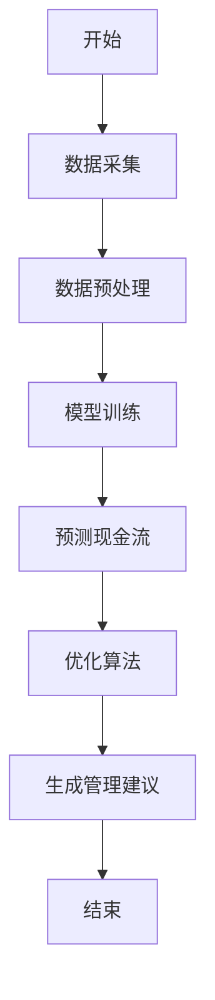
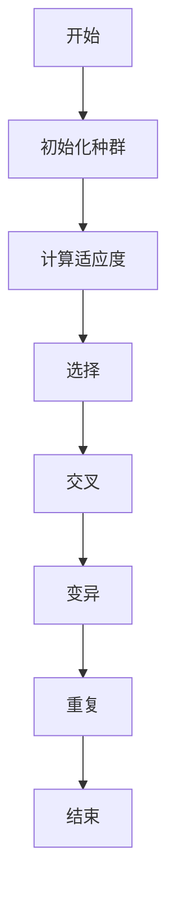
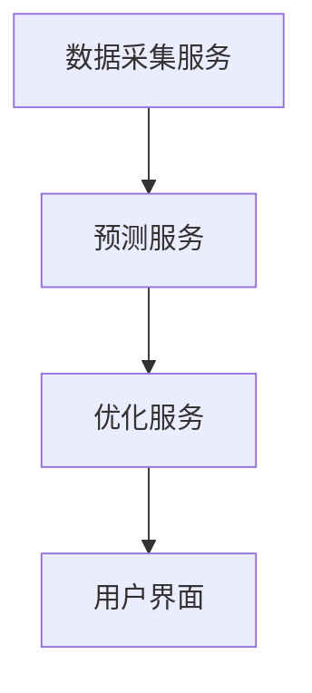

                 


# 《智能现金流优化管理系统》

## 关键词：现金流管理，智能优化，机器学习，系统架构，项目实战

## 摘要

智能现金流优化管理系统是一种结合人工智能和大数据技术的现代财务管理工具，旨在通过智能预测和优化算法，帮助企业提高现金流管理的准确性和效率。本文将从背景介绍、核心概念、算法原理、系统架构设计、项目实战等多个方面详细阐述智能现金流优化管理系统的开发和应用，帮助读者全面理解其工作原理和实际应用价值。

---

## 第一部分：智能现金流优化管理系统的背景与核心概念

### 第1章：智能现金流优化管理系统的背景与问题背景

#### 1.1 现金流管理的重要性

现金流是企业运营的核心命脉，直接关系到企业的生存与发展。传统财务管理依赖人工操作，存在效率低、误差大、风险高等问题。智能现金流优化管理系统通过引入人工智能和大数据技术，能够实时监控现金流状况，预测未来现金流变化，并提出最优的管理建议，从而帮助企业实现高效、精准的现金流管理。

#### 1.2 智能现金流优化管理系统的定义与边界

智能现金流优化管理系统是一种基于人工智能和大数据技术的智能化财务管理工具，通过整合企业内外部数据，利用机器学习算法进行现金流预测和优化，为企业提供实时、动态的现金流管理方案。系统的边界包括数据采集、预测模型、优化算法和风险控制模块，涵盖了从数据输入到最终管理建议的整个流程。

#### 1.3 现金流优化管理的核心问题

现金流优化管理的核心问题包括现金流预测的准确性、现金流分配的合理性以及现金流风险的控制。传统方法依赖于人工经验和静态数据分析，难以应对市场波动和复杂业务场景。智能现金流优化管理系统通过动态数据分析和智能算法，能够有效解决这些问题，为企业提供更精准的现金流管理方案。

### 第2章：现金流优化管理的核心概念与联系

#### 2.1 现金流的类型与生命周期

现金流可以分为流入和流出两大类，包括销售收入、投资收益、贷款、工资支付、采购支出等。现金流的生命周期包括数据采集、预测、分析、优化和执行等阶段。每个阶段都需要不同的技术和方法来实现，例如数据预处理、模型训练和算法优化。

#### 2.2 系统核心要素与属性对比

智能现金流优化管理系统的核心要素包括数据采集模块、预测模型、优化算法和风险控制模块。这些要素在功能、性能和交互方式上存在显著差异。例如，数据采集模块负责获取实时数据，预测模型负责生成预测结果，优化算法负责生成最优方案，风险控制模块负责评估潜在风险。

#### 2.3 实体关系图与流程图

以下是一个现金流管理的实体关系图（ER图）：

```mermaid
erDiagram
    customer[客户] {
        code : string
        name : string
        account : string
    }
    transaction[交易] {
        id : integer
        date : date
        amount : float
        type : string
    }
    cash_flow[现金流] {
        id : integer
        date : date
        amount : float
        source : string
    }
    customer -|> transaction : "进行"
    transaction -|> cash_flow : "产生"
```

流程图展示了现金流管理的主要流程：



---

## 第三部分：智能现金流优化管理系统的算法原理与数学模型

### 第3章：现金流预测与优化算法

#### 3.1 现金流预测的数学模型

现金流预测可以使用线性回归模型、时间序列分析模型等。以下是线性回归模型的数学公式：

$$ y = \beta_0 + \beta_1 x + \epsilon $$

其中，$y$ 是预测的现金流，$x$ 是自变量，$\beta_0$ 和 $\beta_1$ 是回归系数，$\epsilon$ 是误差项。

时间序列分析模型可以使用ARIMA（自回归积分滑动平均模型）：

$$ ARIMA(p, d, q) $$

其中，$p$ 是自回归阶数，$d$ 是差分阶数，$q$ 是滑动平均阶数。

#### 3.2 现金流优化的数学模型

现金流优化可以使用线性规划模型：

$$ \text{最大化/最小化} \sum_{i=1}^n c_i x_i $$

约束条件：

$$ \sum_{i=1}^n a_i x_i \leq b $$

其中，$c_i$ 是目标函数的系数，$a_i$ 是约束条件的系数，$x_i$ 是决策变量，$b$ 是约束常数。

遗传算法模型的流程图如下：



---

## 第四部分：智能现金流优化管理系统的系统架构与设计

### 第4章：系统架构与设计

#### 4.1 系统功能模块设计

智能现金流优化管理系统主要包括以下几个功能模块：

1. 数据采集模块：负责采集企业内外部数据，包括销售数据、采购数据、市场数据等。
2. 现金流预测模块：基于机器学习算法，对未来的现金流进行预测。
3. 现金流优化模块：利用优化算法，生成最优的现金流管理方案。
4. 风险控制模块：评估潜在风险，提出应对策略。

#### 4.2 系统架构设计

系统架构采用微服务架构，主要包括以下几个部分：

1. 数据采集服务：负责数据的采集和预处理。
2. 预测服务：负责现金流的预测和分析。
3. 优化服务：负责现金流的优化和建议生成。
4. 用户界面：提供友好的操作界面，供用户查看和管理现金流。

以下是系统架构图：



---

## 第五部分：项目实战

### 第5章：智能现金流优化管理系统项目实战

#### 5.1 环境安装

首先，需要安装以下工具和库：

- Python 3.8+
- Jupyter Notebook
- Pandas
- Scikit-learn
- Matplotlib

#### 5.2 核心实现代码

以下是现金流预测的代码示例：

```python
import pandas as pd
from sklearn.linear_model import LinearRegression
from sklearn.metrics import mean_squared_error

# 加载数据
data = pd.read_csv('cash_flow.csv')

# 分割数据
X = data[['sales', 'expenses']]
y = data['cash']

# 训练模型
model = LinearRegression()
model.fit(X, y)

# 预测
y_pred = model.predict(X)

# 评估
mse = mean_squared_error(y, y_pred)
print(f'Mean Squared Error: {mse}')
```

以下是现金流优化的代码示例：

```python
import numpy as np
from scipy.optimize import linprog

# 定义目标函数
c = np.array([1, 1])

# 定义约束条件
A = np.array([[1, 0], [0, 1]])
b = np.array([10, 20])

# 解决优化问题
result = linprog(c, A_ub=A, b_ub=b, method='highs')

print(f'Optimal solution: {result.x}')
```

#### 5.3 代码应用解读与分析

以上代码展示了如何使用机器学习和优化算法来实现现金流预测和优化。数据采集模块负责获取实时数据，预测模块基于线性回归模型生成预测结果，优化模块利用线性规划算法生成最优方案。用户界面则将这些结果以直观的方式展示给用户。

---

## 第六部分：总结与最佳实践

### 第6章：总结与最佳实践

#### 6.1 总结

智能现金流优化管理系统通过引入人工智能和大数据技术，能够显著提高现金流管理的效率和准确性。本文详细介绍了系统的背景、核心概念、算法原理、系统架构设计以及项目实战，为读者提供了全面的技术指导。

#### 6.2 最佳实践

1. 数据预处理：确保数据的准确性和完整性。
2. 模型选择：根据具体场景选择合适的算法。
3. 系统优化：定期更新模型和优化算法，以应对市场变化。
4. 风险控制：建立完善的监控机制，及时发现和处理潜在风险。

#### 6.3 小结

智能现金流优化管理系统是现代财务管理的重要工具，通过技术创新和实践应用，能够为企业创造更大的价值。希望本文能够为读者在智能现金流管理系统的开发和应用中提供有益的参考。

---

## 作者：AI天才研究院/AI Genius Institute & 禅与计算机程序设计艺术 /Zen And The Art of Computer Programming

---

以上是《智能现金流优化管理系统》的完整目录和内容概要。

