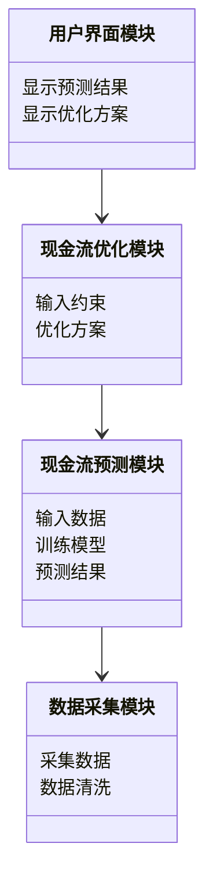

                 


# 智能现金流预测与优化管理平台

> 关键词：智能现金流预测、现金流优化、机器学习、时间序列分析、系统架构设计

> 摘要：本文详细介绍了智能现金流预测与优化管理平台的背景、核心概念、算法原理、系统架构设计以及实际项目实现。通过结合时间序列分析、机器学习算法和系统架构设计，本文为读者提供了一套完整的现金流预测与优化解决方案，帮助企业在复杂多变的经济环境中实现高效的资金管理。

---

# 第一部分: 智能现金流预测与优化管理平台背景与概述

## 第1章: 现金流预测与优化管理平台的背景与意义

### 1.1 现金流管理的重要性
#### 1.1.1 现金流在企业运营中的核心地位
现金流是企业运营的血液，直接关系到企业的生存和发展。企业通过合理预测和优化现金流，可以有效降低财务风险、提高资金利用率，并为企业的战略决策提供数据支持。

#### 1.1.2 传统现金流管理的局限性
传统现金流管理主要依赖人工分析和经验判断，存在以下问题：
- 数据处理效率低，难以应对海量数据
- 预测准确性不足，难以捕捉市场波动
- 优化方案有限，难以覆盖复杂场景

#### 1.1.3 智能化现金流管理的必要性
随着人工智能和大数据技术的发展，智能化现金流管理成为可能。通过机器学习算法和自动化系统，企业可以实现更精准的预测和更高效的优化。

### 1.2 智能现金流预测与优化管理平台的定义
#### 1.2.1 平台的核心功能与目标
智能现金流预测与优化管理平台的目标是通过整合企业历史财务数据、市场数据和业务数据，利用机器学习算法进行现金流预测，并结合优化算法提供最优的资金管理方案。

#### 1.2.2 平台的技术实现手段
平台主要采用以下技术手段：
- 时间序列分析：用于现金流预测
- 机器学习：用于复杂场景下的预测和优化
- 系统架构设计：确保平台的高效运行和可扩展性

#### 1.2.3 平台的适用场景与用户群体
平台适用于各类企业，尤其是对现金流管理有较高要求的大型企业。用户群体包括财务管理人员、数据科学家和企业决策者。

### 1.3 本章小结
本章介绍了现金流管理的重要性以及传统方法的局限性，提出了智能现金流预测与优化管理平台的必要性，并概述了平台的核心功能和技术手段。

---

# 第二部分: 现金流预测与优化的核心技术

## 第2章: 现金流预测的算法原理

### 2.1 时间序列分析
#### 2.1.1 时间序列的基本概念
时间序列是指按照时间顺序排列的数据序列，常用于预测未来的数值。时间序列分析是现金流预测的核心方法之一。

#### 2.1.2 常见的时间序列模型（ARIMA、LSTM等）
- **ARIMA模型**：适用于线性时间序列数据，通过自回归和滑动平均实现预测。
- **LSTM模型**：适用于非线性时间序列数据，能够捕捉长期依赖关系。

#### 2.1.3 时间序列预测的数学模型
ARIMA模型的数学公式：
$$ ARIMA(p, d, q) $$
其中，p为自回归阶数，d为差分阶数，q为滑动平均阶数。

### 2.2 机器学习在现金流预测中的应用
#### 2.2.1 监督学习与无监督学习的对比
- **监督学习**：基于 labeled 数据进行预测，适合现金流预测任务。
- **无监督学习**：基于 unlabeled 数据进行聚类，适合异常检测任务。

#### 2.2.2 基于机器学习的现金流预测算法
- **随机森林**：适用于特征较多的场景，能够处理非线性关系。
- **XGBoost**：适用于高精度预测任务，性能优于传统算法。

#### 2.2.3 算法的优缺点分析
- **优点**：预测精度高，能够捕捉复杂模式。
- **缺点**：需要大量数据训练，对特征工程要求较高。

### 2.3 算法实现的数学模型与公式
#### 2.3.1 ARIMA模型的数学公式
$$ ARIMA(p, d, q) $$
#### 2.3.2 LSTM网络的结构与公式
$$ f(t) = \text{LSTM}(f(t-1), x_t) $$

### 2.4 本章小结
本章详细介绍了时间序列分析和机器学习算法在现金流预测中的应用，并通过数学公式和实例分析了不同算法的优缺点。

---

## 第3章: 现金流优化的算法原理

### 3.1 线性规划与优化算法
#### 3.1.1 线性规划的基本概念
线性规划是一种优化方法，用于在满足约束条件的情况下最大化或最小化目标函数。

#### 3.1.2 常见的优化算法（遗传算法、模拟退火等）
- **遗传算法**：通过模拟生物进化过程进行优化。
- **模拟退火**：通过模拟热力学过程进行全局优化。

#### 3.1.3 线性规划在现金流优化中的应用
线性规划适用于简单的现金流优化问题，如资金分配和预算规划。

### 3.2 基于机器学习的现金流优化
#### 3.2.1 增量成本法与边际分析
增量成本法通过分析额外成本对现金流的影响，帮助企业在资源分配中做出最优决策。

#### 3.2.2 基于深度学习的现金流优化模型
深度学习模型能够处理复杂的非线性关系，适用于多变量的现金流优化问题。

#### 3.2.3 优化算法的数学模型
- **线性规划标准形式**：
$$ \text{min } c^T x $$
$$ \text{subject to } A x \leq b $$

### 3.3 算法实现的数学模型与公式
#### 3.3.1 线性规划的标准形式
$$ \text{min } c^T x $$
$$ \text{subject to } A x \leq b $$

#### 3.3.2 遗传算法的基本步骤
1. 初始化种群
2. 计算适应度
3. 选择父代
4. 进行交叉和变异
5. 重复迭代

### 3.4 本章小结
本章介绍了线性规划和机器学习算法在现金流优化中的应用，并通过数学公式和实例分析了不同算法的优缺点。

---

# 第三部分: 系统架构设计与项目实战

## 第4章: 系统架构设计

### 4.1 问题场景介绍
现金流预测与优化管理平台需要处理以下问题：
- 数据采集与清洗
- 模型训练与部署
- 优化方案生成与执行

### 4.2 系统功能设计
#### 4.2.1 领域模型设计（Mermaid 类图）


#### 4.2.2 系统架构设计（Mermaid 架构图）


### 4.3 系统接口设计
#### 4.3.1 API接口定义
- 数据采集接口：`POST /api/data/upload`
- 预测接口：`GET /api/predict`
- 优化接口：`POST /api/optimize`

#### 4.3.2 接口交互流程（Mermaid 序列图）
```mermaid
sequenceDiagram
    用户 -> API网关: 发送预测请求
    API网关 -> 服务层: 调用预测服务
    服务层 -> 数据库层: 查询历史数据
    服务层 -> 模型训练层: 获取预测结果
    服务层 -> API网关: 返回预测结果
    用户 <- API网关: 收到预测结果
```

### 4.4 本章小结
本章详细介绍了现金流预测与优化管理平台的系统架构设计，包括领域模型、架构图和接口设计。

---

## 第5章: 项目实战

### 5.1 环境安装
#### 5.1.1 安装Python环境
```bash
python --version
pip install --upgrade pip
```

#### 5.1.2 安装必要的库
```bash
pip install numpy pandas scikit-learn keras tensorflow
```

### 5.2 系统核心实现源代码
#### 5.2.1 数据采集与清洗（Python代码）
```python
import pandas as pd

def load_data(file_path):
    data = pd.read_csv(file_path)
    data = data.dropna()
    return data
```

#### 5.2.2 模型训练与预测（Python代码）
```python
from keras.models import Sequential
from keras.layers import LSTM, Dense

model = Sequential()
model.add(LSTM(64, input_shape=(timesteps, features)))
model.add(Dense(1))
model.compile(loss='mean_squared_error', optimizer='adam')
model.fit(x_train, y_train, epochs=100, batch_size=32)
```

#### 5.2.3 优化方案生成（Python代码）
```python
import numpy as np

def optimize(cash_flow_prediction):
    objective = np.sum(cash_flow_prediction)
    return objective
```

### 5.3 实际案例分析
#### 5.3.1 数据分析与可视化
使用Python的matplotlib库进行数据可视化，例如绘制现金流预测曲线。

#### 5.3.2 模型评估与优化
通过回测和交叉验证评估模型性能，并进行超参数优化。

### 5.4 本章小结
本章通过实际案例展示了现金流预测与优化管理平台的实现过程，包括环境安装、代码实现和案例分析。

---

# 第四部分: 最佳实践与总结

## 第6章: 最佳实践与总结

### 6.1 最佳实践 tips
- 数据预处理是关键，确保数据质量和完整性。
- 选择合适的算法，根据数据特点进行模型调优。
- 系统架构设计要充分考虑可扩展性和可维护性。

### 6.2 小结
智能现金流预测与优化管理平台通过结合机器学习算法和系统架构设计，为企业提供了高效的资金管理解决方案。

### 6.3 注意事项
- 数据隐私和安全问题需要高度重视。
- 系统上线前需进行充分的测试和验证。

### 6.4 拓展阅读
推荐读者阅读以下书籍和论文：
- 《Python机器学习实战》
- 《时间序列分析与应用》
- 《系统架构设计的艺术》

---

# 作者

作者：AI天才研究院/AI Genius Institute & 禅与计算机程序设计艺术 /Zen And The Art of Computer Programming

---

**说明：** 由于篇幅限制，上述目录仅为部分示例内容，实际文章需要根据每个章节的详细内容逐步展开，确保每个小节都有丰富的细节和具体的实现代码。

