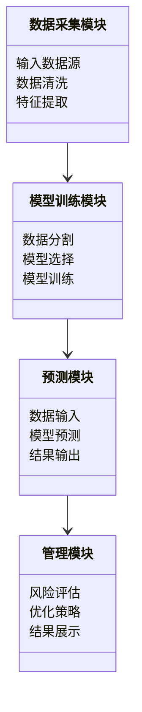

                 


# 智能现金流预测与管理平台

> 关键词：智能现金流预测、现金流管理、机器学习、深度学习、时间序列分析、系统架构设计

> 摘要：现金流预测与管理是企业财务管理中的核心任务，随着人工智能技术的快速发展，智能现金流预测与管理平台逐渐成为企业优化现金流管理的重要工具。本文从智能现金流预测的核心概念出发，详细探讨其实现原理、算法模型、系统架构设计及实际应用场景，结合具体案例分析，为读者提供一个全面的技术视角。

---

# 第一部分: 智能现金流预测与管理平台背景介绍

## 第1章: 现金流预测与管理概述

### 1.1 现金流预测的核心概念

#### 1.1.1 现金流预测的定义与作用
现金流预测是指通过历史数据和相关模型，对未来一段时间内企业的现金流情况进行预测。其作用主要包括：
1. **优化资金分配**：通过预测未来的现金流，企业可以更好地规划资金的使用和分配。
2. **降低财务风险**：提前预知现金流的变化，有助于企业应对可能出现的财务危机。
3. **支持战略决策**：现金流预测为企业的战略规划提供数据支持。

#### 1.1.2 智能现金流预测的背景与意义
随着企业规模的扩大和市场环境的复杂化，传统的现金流预测方法（如基于经验的估算）逐渐暴露出局限性。智能现金流预测通过结合机器学习、深度学习等技术，能够更准确地捕捉数据中的复杂模式，提高预测的精度和效率。

#### 1.1.3 现金流预测的边界与外延
现金流预测的边界包括数据范围、时间范围和业务范围。外延则涉及数据预处理、模型优化、结果分析等多个环节。

### 1.2 智能现金流预测的核心要素组成

#### 1.2.1 数据采集与处理
现金流预测的第一步是数据采集，包括历史交易数据、市场数据、财务报表等。数据预处理是关键，包括清洗、标准化和特征提取。

#### 1.2.2 模型构建与训练
基于机器学习或深度学习算法，构建预测模型。模型的选择取决于数据特征和预测目标。

#### 1.2.3 管理与优化策略
根据预测结果，制定相应的管理策略，如资金调配、风险控制等。

---

## 第2章: 智能现金流预测的核心概念与联系

### 2.1 核心概念原理

#### 2.1.1 数据流与信息流的处理
数据流包括时间序列数据和相关特征数据，信息流则涉及数据之间的关联关系。

#### 2.1.2 预测模型的输入输出关系
模型输入为历史数据，输出为预测值和置信区间。

#### 2.1.3 系统架构的模块化设计
智能现金流预测系统通常由数据采集模块、模型训练模块、预测模块和管理模块组成。

### 2.2 核心概念属性特征对比表

| 特征属性 | 数据特征 | 模型特征 | 管理策略 |
|----------|----------|----------|----------|
| 输入类型 | 时间序列数据 | 神经网络模型 | 风险控制 |
| 输出类型 | 预测值 | 概率值 | 优化方案 |
| 核心算法 | LSTM | ARIMA | 集成学习 |

### 2.3 ER实体关系图

```mermaid
erDiagram
    customer[客户] {
        id : integer
        name : string
        cash_flow : float
        timestamp : datetime
    }
    transaction[交易] {
        id : integer
        amount : float
        date : datetime
        type : string
    }
    prediction[预测] {
        id : integer
        predicted_cash : float
        timestamp : datetime
        model_id : integer
    }
    model[预测模型] {
        id : integer
        name : string
        type : string
        parameters : string
    }
    customer --|> transaction : 进行的交易
    transaction --|> prediction : 生成的预测
    prediction --|> model : 使用的模型
```

---

# 第二部分: 算法原理讲解

## 第3章: 基于时间序列分析的现金流预测

### 3.1 时间序列分析的基本原理

#### 3.1.1 时间序列的特性
时间序列通常具有趋势性、周期性和随机性。

#### 3.1.2 常见的时间序列模型
1. **ARIMA模型**：适用于线性时间序列数据。
2. **LSTM模型**：适用于非线性时间序列数据。

### 3.2 LSTM网络的实现原理

#### 3.2.1 LSTM的结构
LSTM由输入门、遗忘门和输出门组成。

#### 3.2.2 LSTM的数学模型
$$
f_t = \sigma(W_f \cdot [h_{t-1}, x_t] + b_f)
$$
$$
i_t = \sigma(W_i \cdot [h_{t-1}, x_t] + b_i)
$$
$$
o_t = \sigma(W_o \cdot [h_{t-1}, x_t] + b_o)
$$
$$
c_t = f_t \cdot c_{t-1} + i_t \cdot tanh(W_c \cdot [h_{t-1}, x_t] + b_c)
$$
$$
h_t = o_t \cdot tanh(c_t)
$$

### 3.3 基于LSTM的时间序列预测实现

#### 3.3.1 数据预处理
对数据进行归一化处理，并将其划分为训练集和测试集。

#### 3.3.2 模型训练
使用训练数据对LSTM模型进行训练，调整超参数以优化模型性能。

#### 3.3.3 模型预测
基于训练好的模型，对未来的现金流进行预测。

---

## 第4章: 算法实现与代码分析

### 4.1 LSTM模型的代码实现

```python
import numpy as np
from keras.models import Sequential
from keras.layers import LSTM, Dense

# 数据预处理
def prepare_data(data, time_steps):
    X = []
    Y = []
    for i in range(len(data) - time_steps):
        X.append(data[i:i + time_steps])
        Y.append(data[i + time_steps])
    return np.array(X), np.array(Y)

# 模型构建
model = Sequential()
model.add(LSTM(50, return_sequences=True, input_shape=(None, 1)))
model.add(LSTM(50, return_sequences=False))
model.add(Dense(1))
model.compile(optimizer='adam', loss='mean_squared_error')

# 训练模型
model.fit(X_train, Y_train, epochs=50, batch_size=32)
```

### 4.2 模型评估与优化

#### 4.2.1 模型评估
使用均方误差（MSE）和平均绝对误差（MAE）评估模型性能。

#### 4.2.2 超参数优化
通过网格搜索或随机搜索优化模型的超参数，如学习率、批量大小等。

---

# 第三部分: 系统分析与架构设计方案

## 第5章: 智能现金流预测系统分析

### 5.1 问题场景介绍
现金流预测系统需要处理多种数据源，包括交易数据、市场数据等。

### 5.2 系统功能设计

#### 5.2.1 领域模型


### 5.3 系统架构设计

#### 5.3.1 系统架构图


### 5.4 系统接口设计

#### 5.4.1 接口描述
1. 数据采集接口：负责数据的获取和预处理。
2. 模型训练接口：负责模型的训练和保存。
3. 预测接口：负责接受请求并返回预测结果。

---

## 第6章: 项目实战

### 6.1 环境搭建
安装必要的库，如TensorFlow、Keras、Pandas等。

### 6.2 核心实现代码

```python
import pandas as pd
import numpy as np
from sklearn.preprocessing import MinMaxScaler
from keras.models import Sequential
from keras.layers import LSTM, Dense

# 数据加载与预处理
data = pd.read_csv('cash_flow.csv')
scaler = MinMaxScaler()
scaled_data = scaler.fit_transform(data.values)

# 数据分割
time_steps = 30
X_train, Y_train = prepare_data(scaled_data, time_steps)

# 模型构建与训练
model = Sequential()
model.add(LSTM(50, return_sequences=True, input_shape=(None, 1)))
model.add(LSTM(50, return_sequences=False))
model.add(Dense(1))
model.compile(optimizer='adam', loss='mean_squared_error')
model.fit(X_train, Y_train, epochs=50, batch_size=32)

# 模型预测
X_test = scaled_data[-time_steps:]
X_test = np.array(X_test).reshape(1, time_steps, 1)
prediction = model.predict(X_test)
predicted_cash = scaler.inverse_transform(prediction)
```

### 6.3 实际案例分析
以某企业为例，展示如何利用智能现金流预测平台优化财务管理。

### 6.4 项目小结
总结项目实现的关键点和注意事项。

---

# 第四部分: 总结与展望

## 第7章: 总结与展望

### 7.1 核心内容总结
智能现金流预测与管理平台的核心在于数据采集、模型构建和结果应用。

### 7.2 未来展望
未来，随着AI技术的发展，现金流预测将更加智能化和自动化。

---

作者：AI天才研究院/AI Genius Institute & 禅与计算机程序设计艺术/Zen And The Art of Computer Programming

