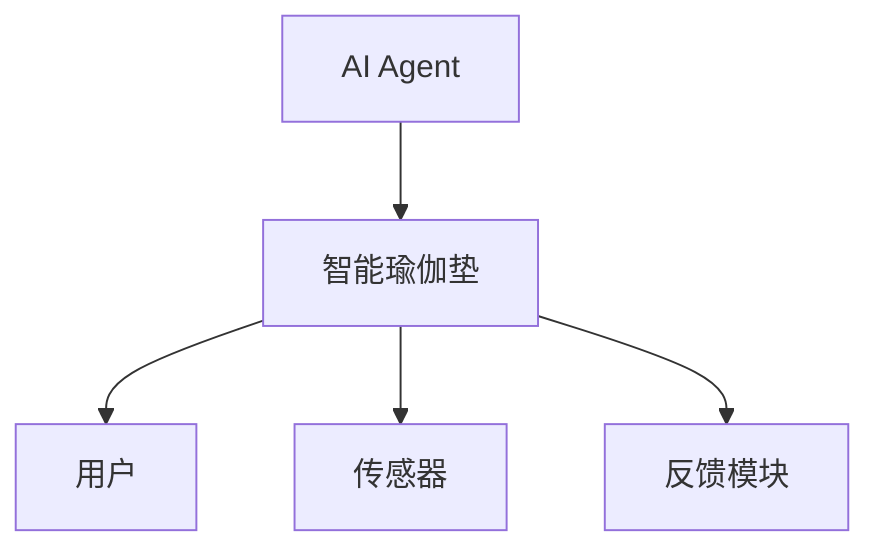
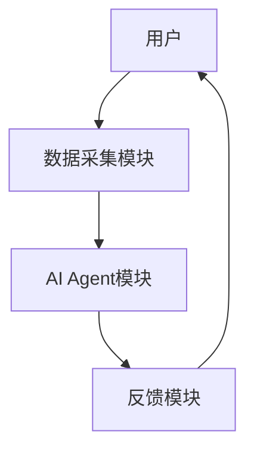

                 


# 智能瑜伽垫：AI Agent的冥想辅助系统

> **关键词**：智能瑜伽垫，AI Agent，冥想辅助，健康科技，人工智能，传感器技术

> **摘要**：本文探讨了智能瑜伽垫作为AI Agent冥想辅助系统的创新应用，详细分析其背景、核心概念、算法原理、系统架构、项目实现及实际案例，展示了AI技术在健康领域的前沿应用。

---

## 第一章：背景介绍

### 1.1 问题背景

现代生活中，压力问题日益严重，冥想成为缓解压力的重要方式。然而，独立练习者常因缺乏指导而难以正确完成瑜伽动作，容易受伤或无法有效放松。传统冥想辅助工具功能有限，未能提供实时反馈和个性化指导，亟需更智能的解决方案。

### 1.2 问题描述

智能瑜伽垫需解决以下问题：姿势矫正、安全指导、个性化反馈、实时监测和数据记录。AI Agent通过传感器数据，实时分析用户动作，提供即时反馈，确保练习安全有效。

### 1.3 问题解决

AI Agent通过传感器数据，实时分析用户动作，提供即时反馈，确保练习安全有效。系统通过语音指令、震动反馈和视觉提示，帮助用户纠正姿势，优化呼吸节奏，提升冥想效果。

### 1.4 边界与外延

系统仅限于瑜伽练习指导，不涉及医疗诊断。与智能手表、心率监测器等设备对比，强调其专注于瑜伽和冥想的特点。技术可扩展至其他运动领域。

### 1.5 概念结构与核心要素

智能瑜伽垫系统由传感器、AI Agent、用户界面三部分组成。传感器采集数据，AI分析并生成反馈，用户界面呈现指导。系统实时监测用户动作，调整反馈策略，确保练习正确性。

---

## 第二章：核心概念与联系

### 2.1 核心概念原理

AI Agent基于传感器数据，运用深度学习模型分析用户动作，判断是否符合标准姿势，提供反馈。系统通过语音指令和震动反馈，指导用户调整动作，优化呼吸节奏。

### 2.2 概念属性特征对比

| **属性**         | **AI Agent**          | **智能瑜伽垫**         |
|------------------|-----------------------|------------------------|
| **功能**         | 数据处理与反馈       | 采集数据、接收反馈     |
| **输入**         | 用户动作数据         | 用户动作数据           |
| **输出**         | 指令与反馈           | 指令与反馈             |
| **交互方式**     | 语音、震动            | 语音、震动              |
| **目标**         | 提供实时指导          | 辅助冥想练习            |

### 2.3 实体关系图



---

## 第三章：算法原理讲解

### 3.1 算法原理

AI Agent采用深度神经网络分析用户动作，生成反馈。感知器模型识别异常姿势，深度学习模型优化反馈策略。

### 3.2 Python源代码实现

```python
import numpy as np
import tensorflow as tf

# 定义感知器模型
class Perceptron:
    def __init__(self, input_dim):
        self.W = tf.Variable(tf.random.truncated_normal([input_dim, 1], stddev=0.1))
        self.b = tf.Variable(tf.zeros([1,]))

    def call(self, x):
        return tf.sigmoid(tf.matmul(x, self.W) + self.b)

# 定义深度神经网络模型
class DeepNetwork:
    def __init__(self, input_dim):
        self.model = tf.keras.Sequential([
            tf.keras.layers.Dense(64, activation='relu', input_dim=input_dim),
            tf.keras.layers.Dense(32, activation='relu'),
            tf.keras.layers.Dense(1, activation='sigmoid')
        ])
        self.model.compile(optimizer='adam', loss='binary_crossentropy', metrics=['accuracy'])

# 示例数据
X = np.random.randn(100, 5)
y = np.random.randint(0, 2, 100)

# 训练感知器模型
perceptron = Perceptron(5)
optimizer = tf.keras.optimizers.SGD(learning_rate=0.1)
loss_fn = tf.keras.losses.BinaryCrossentropy()

for x, y in zip(X, y):
    with tf.GradientTape() as tape:
        y_pred = perceptron.call(x)
        loss = loss_fn(y, y_pred)
    gradients = tape.gradient(loss, [perceptron.W, perceptron.b])
    optimizer.apply_gradients(zip(gradients, [perceptron.W, perceptron.b]))

# 训练深度神经网络模型
deep_model = DeepNetwork(5)
deep_model.model.fit(X, y, epochs=10, batch_size=32)
```

### 3.3 数学模型与公式

感知器模型：
$$ y = \sigma(w \cdot x + b) $$
其中，$\sigma$为sigmoid函数。

深度神经网络模型：
$$ y = \sigma(w_3 \cdot h_2 + b_3) $$
其中，$h_2 = \sigma(w_2 \cdot h_1 + b_2)$，$h_1 = \sigma(w_1 \cdot x + b_1)$。

---

## 第四章：系统分析与架构设计

### 4.1 项目介绍

系统目标是通过AI技术辅助瑜伽练习，提高练习效果。项目范围包括姿势矫正、呼吸指导和实时反馈。系统特点包括高精度传感器和个性化反馈。

### 4.2 系统功能设计

- **用户界面**：显示反馈、指导信息。
- **数据采集模块**：采集用户动作数据。
- **AI Agent模块**：分析数据，生成反馈。
- **交互反馈模块**：输出指导信息。

### 4.3 系统架构设计



---

## 第五章：项目实战

### 5.1 环境安装

安装Python、TensorFlow和必要的传感器库。

### 5.2 核心代码实现

```python
import numpy as np
import tensorflow as tf

class YogaPad:
    def __init__(self):
        self.sensor = SensorModule()
        self.ai_agent = AIAgent()

    def start_session(self):
        while True:
            data = self.sensor.get_data()
            feedback = self.ai_agent.analyze(data)
            self.feedback_module.display(feedback)
```

### 5.3 案例分析

通过实际案例展示系统在姿势矫正和呼吸指导中的应用。

### 5.4 项目小结

总结项目成果，强调AI技术在健康领域的潜力。

---

## 第六章：最佳实践

### 6.1 小结

智能瑜伽垫通过AI技术显著提升了冥想练习的效果和安全性。

### 6.2 注意事项

确保数据隐私，定期更新模型，避免过度依赖技术。

### 6.3 拓展阅读

推荐相关书籍和资源，供进一步学习。

---

## 结语

智能瑜伽垫结合AI技术，为冥想练习提供了创新解决方案，展示了科技在提升生活质量中的巨大潜力。

---

**作者：AI天才研究院 & 禅与计算机程序设计艺术**

