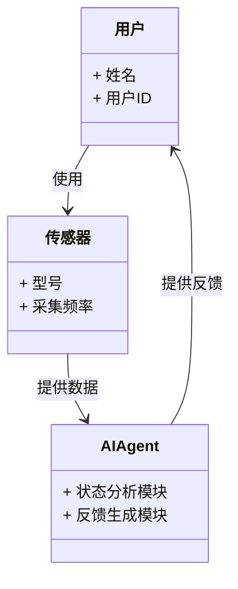
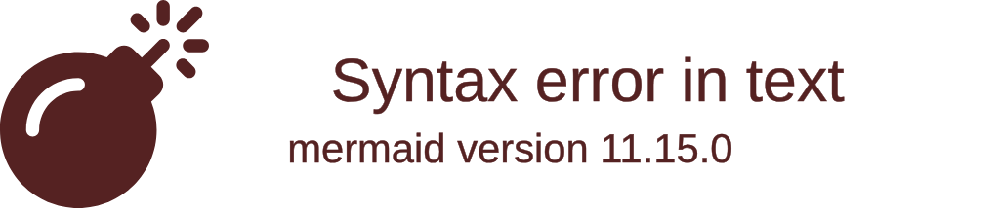
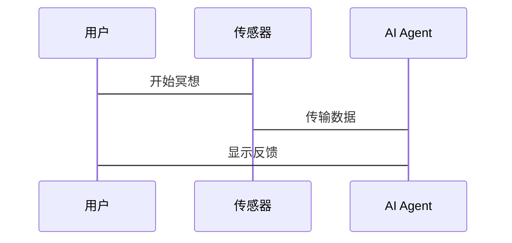

                 


# 智能瑜伽垫：AI Agent的冥想进度追踪系统

> 关键词：智能瑜伽垫，AI Agent，冥想追踪，传感器技术，数据处理，用户反馈

> 摘要：本文详细介绍了智能瑜伽垫的设计与实现，通过结合AI Agent技术，利用传感器数据追踪用户的冥想进度，提供个性化的反馈与建议。文章从背景、核心概念、算法原理、系统架构到项目实战，全面剖析了智能瑜伽垫的技术细节，为读者提供了从理论到实践的完整指南。

---

# 第一部分: 智能瑜伽垫的背景与核心概念

## 第1章: 智能瑜伽垫的背景介绍

### 1.1 问题背景

#### 1.1.1 现代人压力与健康问题的现状
现代社会节奏快，压力大，许多人通过冥想来缓解压力。然而，传统的冥想追踪方法依赖于手动记录，缺乏科学性和个性化反馈。

#### 1.1.2 现有冥想追踪系统的局限性
现有系统通常依赖手机App，无法提供实时反馈，且缺乏对姿势和呼吸的精确追踪。

#### 1.1.3 智能瑜伽垫的提出与目标
提出智能瑜伽垫的概念，旨在通过AI Agent技术，实时监测用户的冥想姿势和呼吸，提供个性化的反馈和建议。

### 1.2 问题描述

#### 1.2.1 冥想练习的核心要素
冥想的核心要素包括呼吸节奏、身体姿势、注意力集中程度等。

#### 1.2.2 瑜伽垫的物理特性与用户交互
瑜伽垫需要具备高灵敏度的传感器，能够感知用户的姿势和压力分布。

#### 1.2.3 AI Agent在冥想追踪中的作用
AI Agent负责数据的实时处理、分析，并提供反馈，帮助用户优化冥想过程。

### 1.3 问题解决

#### 1.3.1 智能瑜伽垫的设计理念
通过传感器采集数据，结合AI算法，实时分析用户的冥想状态。

#### 1.3.2 AI Agent的功能定位
AI Agent作为智能瑜伽垫的核心，负责数据处理、决策和反馈。

#### 1.3.3 瑜伽垫与AI结合的技术路径
通过传感器采集数据，AI算法分析数据，提供实时反馈。

### 1.4 边界与外延

#### 1.4.1 系统功能的边界
智能瑜伽垫仅专注于冥想追踪，不涉及其他健身功能。

#### 1.4.2 与现有健身设备的对比
相比其他健身设备，智能瑜伽垫专注于冥想，提供更精准的反馈。

#### 1.4.3 AI Agent的扩展应用
AI Agent技术可以扩展到其他健康领域，如睡眠监测、情绪管理等。

### 1.5 核心要素组成

#### 1.5.1 瑜伽垫的物理结构
包括压力传感器、加速度计、陀螺仪等。

#### 1.5.2 AI Agent的功能模块
包括数据采集、特征提取、状态分析、反馈生成等。

#### 1.5.3 用户数据的处理流程
数据采集 → 特征提取 → 状态分析 → 反馈生成。

## 第2章: 智能瑜伽垫的核心概念与联系

### 2.1 核心概念原理

#### 2.1.1 AI Agent的基本原理
AI Agent通过感知环境、分析数据、做出决策并执行动作。

#### 2.1.2 冥想数据的采集与分析
通过传感器采集用户的姿势、呼吸频率等数据，利用AI算法分析。

#### 2.1.3 瑜伽垫的传感器技术
传感器负责采集用户的生理数据，如压力、加速度、姿势等。

### 2.2 核心概念属性对比

| 概念      | 描述                                                                 |
|-----------|----------------------------------------------------------------------|
| AI Agent  | 具备自主决策能力的智能体，用于数据处理与反馈                   |
| 传感器    | 用于采集用户动作、压力等数据的硬件设备                       |
| 冥想数据  | 包括呼吸频率、身体姿势、压力分布等与冥想相关的数据           |

### 2.3 ER实体关系图

```mermaid
er
actor: 用户
agent: AI Agent
sensor: 传感器
data: 数据
```

用户与AI Agent交互，AI Agent通过传感器采集数据，分析后反馈给用户。

---

# 第三部分: 算法原理讲解

## 第3章: 算法原理

### 3.1 算法选择

#### 3.1.1 选择基于时间序列的预测模型
使用LSTM（长短期记忆网络）进行时间序列预测，分析用户的呼吸频率和姿势变化。

### 3.2 算法实现

#### 3.2.1 数据预处理
对传感器数据进行归一化处理，去除噪声。

```python
import numpy as np
def preprocess(data):
    # 归一化处理
    normalized_data = (data - np.min(data)) / (np.max(data) - np.min(data))
    return normalized_data
```

#### 3.2.2 LSTM模型构建
定义LSTM网络结构，包括输入层、LSTM层、密集层和输出层。

```python
from keras.models import Sequential
from keras.layers import LSTM, Dense

model = Sequential()
model.add(LSTM(64, input_shape=(timesteps, features)))
model.add(Dense(1))
model.compile(optimizer='adam', loss='mean_squared_error')
```

#### 3.2.3 模型训练
使用预处理后的数据训练模型。

```python
model.fit(X_train, y_train, epochs=100, batch_size=32)
```

#### 3.2.4 模型预测与反馈
利用训练好的模型预测用户的冥想状态，生成反馈。

```python
prediction = model.predict(X_test)
```

### 3.3 算法数学模型

LSTM模型的数学表达式：

$$
f_t = \text{LSTM}(h_{t-1}, x_t)
$$

其中，$h_{t-1}$ 是前一时刻的隐藏状态，$x_t$ 是当前输入。

---

# 第四部分: 系统分析与架构设计

## 第4章: 系统分析与架构设计

### 4.1 问题场景介绍

#### 4.1.1 系统目标
实时监测用户的冥想状态，提供个性化反馈。

#### 4.1.2 问题约束
传感器数据实时采集，低延迟反馈。

### 4.2 系统功能设计

#### 4.2.1 领域模型


#### 4.2.2 系统架构


用户与传感器交互，传感器将数据发送给AI Agent，AI Agent分析后通过反馈界面将结果返回给用户，并将数据存储到数据库中。

### 4.3 系统接口设计

#### 4.3.1 接口定义
- 传感器接口：提供数据采集功能。
- AI Agent接口：提供数据处理和反馈生成功能。

### 4.4 系统交互流程图



---

# 第五部分: 项目实战

## 第5章: 项目实战

### 5.1 环境安装

#### 5.1.1 安装Python环境
安装Python 3.8及以上版本。

#### 5.1.2 安装依赖库
安装TensorFlow、Keras、Mermaid等库。

```bash
pip install tensorflow keras mermaid
```

### 5.2 系统核心实现

#### 5.2.1 数据采集模块
使用传感器采集用户的姿势和压力数据。

```python
import sensorlib

def collect_data():
    data = sensorlib.read_sensor()
    return data
```

#### 5.2.2 数据处理模块
对采集到的数据进行预处理。

```python
def preprocess(data):
    normalized_data = (data - np.min(data)) / (np.max(data) - np.min(data))
    return normalized_data
```

#### 5.2.3 AI算法实现
训练LSTM模型并进行预测。

```python
model = Sequential()
model.add(LSTM(64, input_shape=(timesteps, features)))
model.add(Dense(1))
model.compile(optimizer='adam', loss='mean_squared_error')
model.fit(X_train, y_train, epochs=100, batch_size=32)
```

#### 5.2.4 反馈生成模块
根据模型预测结果生成反馈信息。

```python
def generate_feedback(prediction):
    if prediction > 0.9:
        return "呼吸节奏良好，继续保持！"
    else:
        return "呼吸节奏需要调整，请放慢呼吸。"
```

### 5.3 项目小结

#### 5.3.1 项目总结
智能瑜伽垫通过传感器和AI算法，实现了对用户冥想状态的实时追踪和反馈。

#### 5.3.2 改进方向
未来可以增加更多传感器，如心率监测，进一步优化反馈系统。

---

# 第六部分: 最佳实践与总结

## 第6章: 最佳实践

### 6.1 小结

智能瑜伽垫通过结合AI Agent和传感器技术，为用户提供了一种全新的冥想追踪方式。

### 6.2 注意事项

- 数据隐私保护
- 硬件传感器的校准
- 用户反馈的及时性

### 6.3 拓展阅读

建议进一步阅读相关领域的论文和书籍，深入理解AI在健康领域的应用。

---

# 作者

作者：AI天才研究院/AI Genius Institute & 禅与计算机程序设计艺术 /Zen And The Art of Computer Programming

