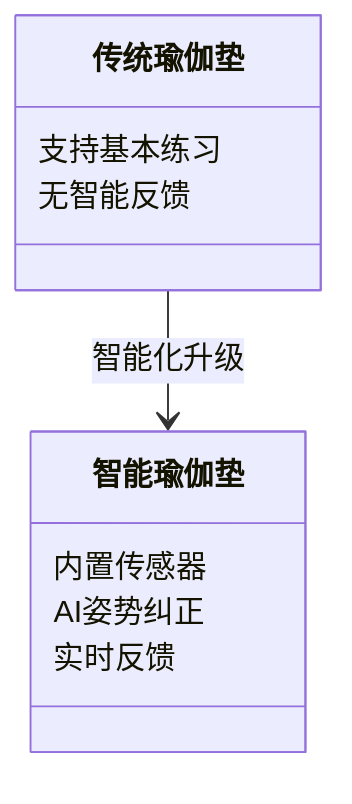
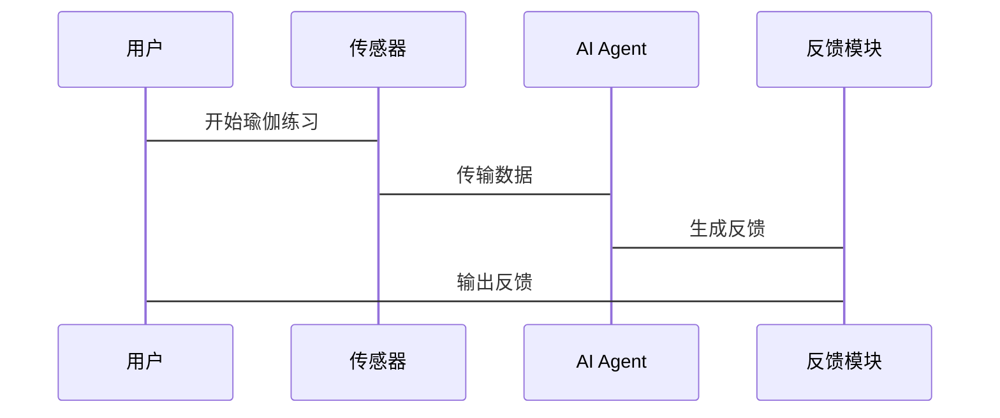

                 


# 智能瑜伽垫：AI Agent的姿势纠正系统

> 关键词：智能瑜伽垫, AI Agent, 姿势纠正, 数据采集, 机器学习, 系统架构

> 摘要：智能瑜伽垫是一种结合了人工智能技术的创新健身设备，通过AI Agent实时监测用户的瑜伽姿势，并提供即时反馈和纠正。本文详细探讨了智能瑜伽垫的核心概念、算法原理、系统架构以及实际项目实现，从技术角度剖析了这一创新产品的实现机制。

---

## 第一部分: 智能瑜伽垫的背景与概念

### 第1章: 问题背景与解决方案

#### 1.1 传统瑜伽教学的局限性
- **问题背景**：瑜伽是一种古老而有效的健身方式，但传统瑜伽教学依赖于人工指导，存在效率低下、成本高昂、难以大规模普及的问题。
- **问题描述**：许多初学者在练习瑜伽时，由于缺乏专业指导，容易出现姿势错误，导致运动损伤或练习效果不佳。
- **解决方案**：通过AI技术实现智能化的瑜伽姿势纠正，使用户能够在任何时间、任何地点进行正确的瑜伽练习。

#### 1.2 智能瑜伽垫的概念与目标
- **概念**：智能瑜伽垫是一种内置了传感器和AI算法的智能设备，能够实时监测用户的瑜伽姿势，并通过反馈机制帮助用户纠正错误动作。
- **目标**：为用户提供个性化、实时的瑜伽姿势纠正服务，降低运动损伤风险，提升练习效果。

#### 1.3 智能瑜伽垫的核心特征对比表
| 特性               | 传统瑜伽垫               | 智能瑜伽垫               |
|--------------------|--------------------------|--------------------------|
| 数据采集           | 无传感器，无法采集数据   | 内置传感器，实时采集数据 |
| 姿势纠正           | 依赖人工指导             | AI自动纠正姿势           |
| 用户反馈           | 口头反馈，延迟较高       | 实时语音或视觉反馈       |
| 适用场景           | 仅限线下教学             | 适用于家庭、健身房等多种场景 |

#### 1.4 智能瑜伽垫与传统瑜伽垫的实体关系图


### 第2章: AI Agent在智能瑜伽垫中的作用

#### 2.1 AI Agent的基本概念
- AI Agent（智能体）是一种能够感知环境、自主决策并采取行动的智能系统。
- 在智能瑜伽垫中，AI Agent负责接收传感器数据，分析用户姿势，并生成纠正反馈。

#### 2.2 AI Agent在姿势纠正中的具体应用
- **数据处理**：AI Agent接收来自瑜伽垫的传感器数据，如加速度、压力分布等。
- **姿势识别**：通过机器学习算法，AI Agent识别用户的瑜伽姿势是否正确。
- **反馈生成**：如果检测到姿势错误，AI Agent会通过语音或视觉方式给出纠正建议。

#### 2.3 AI Agent与智能瑜伽垫的交互机制


---

## 第二部分: AI Agent的算法原理

### 第3章: 数据采集与特征提取

#### 3.1 数据采集流程
- **传感器数据采集**：智能瑜伽垫内置多种传感器，如加速度计、压力传感器等，实时采集用户的运动数据。
- **数据预处理**：对采集到的数据进行降噪、归一化等处理，确保数据的准确性。
- **特征提取**：从预处理后的数据中提取关键特征，如身体重心、关节角度等。

#### 3.2 特征提取的算法实现
- **数学模型**：特征提取可以通过主成分分析（PCA）实现。
  $$ \text{PCA} = \arg\min_{W} \text{Tr}(W^T W) $$
- **Python代码实现**：
  ```python
  import numpy as np
  from sklearn.decomposition import PCA

  # 假设X是原始数据矩阵
  pca = PCA(n_components=3)
  features = pca.fit_transform(X)
  ```

### 第4章: 姿势识别与纠正算法

#### 4.1 姿势识别算法
- **数学模型**：使用支持向量机（SVM）进行姿势分类。
  $$ \text{SVM} = \arg\min_{w,b,\xi} \frac{1}{2}||w||^2 + C\sum_{i=1}^n \xi_i $$
- **Python代码实现**：
  ```python
  from sklearn.svm import SVC

  model = SVC(kernel='rbf', gamma=1e-3, C=100)
  model.fit(features_train, labels_train)
  ```

#### 4.2 姿势纠正的反馈机制
- **反馈生成**：AI Agent根据识别到的错误姿势，生成纠正建议，并通过语音或视觉方式反馈给用户。
- **反馈优化**：根据用户的反馈，AI Agent不断优化纠正策略，提升纠正效果。

---

## 第三部分: 系统分析与架构设计

### 第5章: 系统架构设计

#### 5.1 系统功能模块划分
- **数据采集模块**：负责采集用户的运动数据。
- **AI处理模块**：负责姿势识别和纠正策略生成。
- **用户反馈模块**：负责将纠正建议反馈给用户。

#### 5.2 系统架构图
```mermaid
blockDiagram
    block 数据采集模块 {
        内部: 传感器
    }
    block AI处理模块 {
        内部: 姿势识别算法
    }
    block 用户反馈模块 {
        内部: 反馈生成算法
    }
    数据采集模块 --> AI处理模块 : 数据传输
    AI处理模块 --> 用户反馈模块 : 纠正策略
    用户反馈模块 --> 用户 : 反馈
```

#### 5.3 系统接口设计
- **数据采集接口**：传感器与AI处理模块之间的数据接口。
- **AI处理接口**：AI模块与反馈模块之间的交互接口。
- **用户反馈接口**：反馈模块与用户的交互接口。

---

## 第四部分: 项目实战

### 第6章: 智能瑜伽垫的实现与优化

#### 6.1 环境搭建
- **工具安装**：安装必要的Python库，如NumPy、scikit-learn、Mermaid等。
- **数据集准备**：收集和标注瑜伽姿势数据集。

#### 6.2 核心功能实现
- **数据采集接口**：实现传感器数据的采集和预处理。
- **AI处理模块**：实现姿势识别和纠正策略生成。
- **用户反馈模块**：实现反馈的输出，如语音或视觉提示。

#### 6.3 代码实现与解读
- **数据预处理代码**：
  ```python
  import numpy as np
  def preprocess_data(data):
      # 数据降噪处理
      filtered_data = np.apply_along_axis(lambda x: np.convolve(x, np.ones(3)/3, mode='same'), 0, data)
      return filtered_data
  ```
- **姿势识别代码**：
  ```python
  from sklearn.svm import SVC
  def train_svm(features, labels):
      model = SVC(kernel='rbf', gamma=1e-3, C=100)
      model.fit(features, labels)
      return model
  ```

#### 6.4 项目优化与扩展
- **优化建议**：优化传感器的灵敏度，提升数据采集的准确性。
- **功能扩展**：增加更多瑜伽姿势的识别和纠正功能。

---

## 第五部分: 最佳实践与总结

### 第7章: 实践总结与注意事项

#### 7.1 项目小结
- 智能瑜伽垫的实现依赖于传感器技术和AI算法的结合。
- AI Agent在姿势纠正中的作用至关重要，能够显著提升用户体验。

#### 7.2 注意事项
- 数据采集的准确性直接影响姿势识别的效果。
- 用户反馈的及时性和准确性是确保纠正效果的关键。

#### 7.3 拓展阅读
- 推荐阅读《机器学习实战》和《深度学习入门：基于Python》。

---

## 作者：AI天才研究院/AI Genius Institute & 禅与计算机程序设计艺术 /Zen And The Art of Computer Programming

