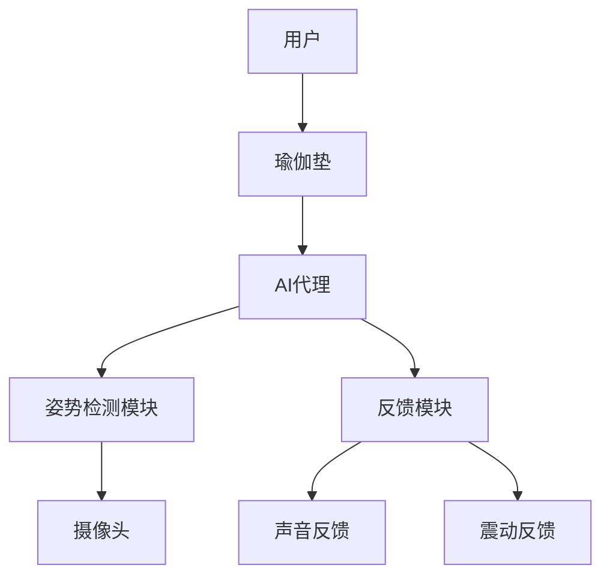
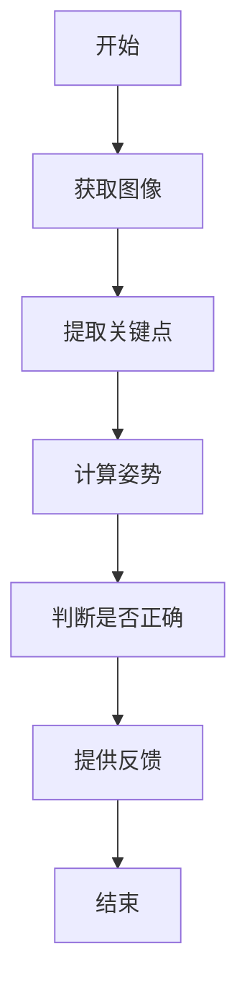
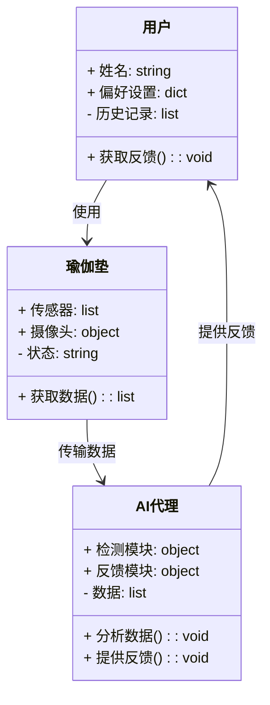
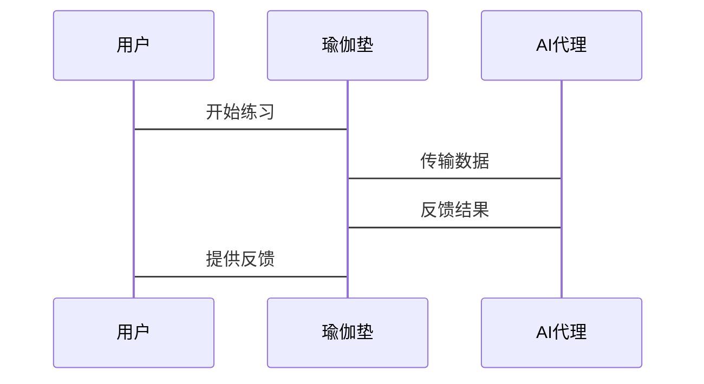

                 


# 智能瑜伽垫：AI Agent的姿势纠正系统

## 关键词：智能瑜伽垫, AI Agent, 姿势纠正, 计算机视觉, 机器学习, 实时反馈

## 摘要：
本文详细探讨了智能瑜伽垫的设计与实现，结合AI代理技术，通过计算机视觉和机器学习算法，实现对瑜伽姿势的实时检测与纠正。文章从问题背景、核心概念、算法原理、系统架构到项目实战，全面阐述了智能瑜伽垫的开发过程，为读者提供了一套完整的解决方案。

---

# 第1章: 问题背景与需求分析

## 1.1 问题背景

### 1.1.1 瑜伽练习的现状与挑战
瑜伽作为一种流行的健身方式，近年来受到广泛关注。然而，许多人在练习过程中由于缺乏专业指导，容易出现姿势错误，导致受伤或锻炼效果不佳。传统瑜伽教学依赖人工指导，存在成本高、效率低的问题。

### 1.1.2 传统瑜伽教学的痛点
- **成本高**：需要专业教练一对一指导，费用高昂。
- **效率低**：学员数量多，教练难以同时关注每个人的动作细节。
- **时间限制**：学员无法在非教学时段获得即时反馈。

### 1.1.3 AI技术在健身领域的应用前景
AI技术的快速发展为健身领域带来了新的可能性。通过计算机视觉和机器学习，可以实现自动化姿势检测与纠正，为用户提供个性化的健身指导。

## 1.2 问题描述

### 1.2.1 瑜伽姿势纠正的必要性
正确的姿势是瑜伽练习的核心，姿势错误可能导致运动损伤，降低锻炼效果。

### 1.2.2 用户在瑜伽练习中的常见错误
- 弯曲膝盖
- 肩膀耸起
- 腰部过度扭转
- 手臂位置不正确

### 1.2.3 现有解决方案的局限性
- 手动纠正：依赖教练，成本高，效率低。
- 智能设备：功能单一，缺乏实时反馈。

## 1.3 问题解决与边界定义

### 1.3.1 AI瑜伽垫的解决方案
通过AI代理技术，智能瑜伽垫可以实时检测用户的姿势，并提供即时反馈，帮助用户纠正错误动作。

### 1.3.2 系统功能的边界与外延
- 边界：仅限于瑜伽姿势检测与纠正。
- 外延：未来可以扩展到其他类型的健身动作。

### 1.3.3 核心要素与组成结构
- 用户：使用瑜伽垫的用户。
- 瑜伽垫：硬件设备，包含传感器和摄像头。
- AI代理：实现姿势检测和反馈的核心模块。

## 1.4 本章小结
本章介绍了智能瑜伽垫的背景和必要性，分析了传统瑜伽教学的痛点，并提出了AI代理技术的解决方案。

---

# 第2章: 核心概念与联系

## 2.1 AI代理的核心原理

### 2.1.1 AI代理的基本概念
AI代理是一种能够感知环境并采取行动以实现目标的智能系统。在智能瑜伽垫中，AI代理负责接收输入数据（如图像），分析数据，生成反馈指令。

### 2.1.2 姿势检测的算法原理
姿势检测是通过计算机视觉技术，识别用户身体的关键点，判断其姿势是否正确。

### 2.1.3 实时反馈机制的实现方式
系统通过传感器和摄像头采集数据，AI代理分析数据后，通过声音或震动提供反馈。

## 2.2 核心概念对比分析

### 2.2.1 不同姿势检测算法的对比
| 算法名称       | 基于关键点检测 | 基于姿态估计 |
|----------------|----------------|--------------|
| 优点           | 实时性高       | 精度高       |
| 缺点           | 精度较低       | 实时性差     |

### 2.2.2 AI代理与传统代理的对比
| 特性           | AI代理         | 传统代理     |
|----------------|----------------|--------------|
| 智能性         | 高             | 低           |
| 自适应能力     | 强             | 弱           |
| 可扩展性       | 强             | 一般         |

### 2.2.3 姿势纠正系统的优劣势分析
- 优势：实时反馈，成本低，可扩展。
- 劣势：依赖硬件设备，隐私问题。

## 2.3 系统实体关系图


## 2.4 本章小结
本章详细解释了AI代理的核心原理，并通过对比分析，突出了智能瑜伽垫的优势和劣势。

---

# 第3章: 算法原理与实现

## 3.1 姿势检测算法原理

### 3.1.1 基于深度学习的姿势检测
深度学习模型（如YOLO）通过卷积神经网络提取图像特征，实现关键点检测。

### 3.1.2 使用OpenCV的图像处理
OpenCV用于图像预处理和特征提取，帮助模型更准确地检测姿势。

### 3.1.3 姿势估计的数学模型
姿势估计基于关键点坐标，通过计算各关键点之间的距离和角度，判断姿势是否正确。

## 3.2 AI代理的算法流程



## 3.3 数学公式

### 姿势估计的距离公式
$$距离 = \sqrt{(x2 - x1)^2 + (y2 - y1)^2}$$

### 姿势估计的角度公式
$$角度 = \arccos\left(\frac{(x2 - x1)(y2 - y1)}{\sqrt{(x2 - x1)^2 + (y2 - y1)^2}}\right)$$

## 3.4 本章小结
本章详细讲解了姿势检测的算法原理，并通过流程图和数学公式，展示了AI代理的工作流程。

---

# 第4章: 系统分析与架构设计

## 4.1 问题场景介绍
系统需要在家庭环境中运行，用户通过智能瑜伽垫进行瑜伽练习，AI代理实时检测姿势并提供反馈。

## 4.2 项目介绍

### 4.2.1 系统功能设计


## 4.3 系统架构设计

### 4.3.1 系统架构图


## 4.4 接口设计与交互

### 4.4.1 系统接口
- 用户接口：手机APP或语音指令。
- 硬件接口：传感器和摄像头。

### 4.4.2 交互序列图


## 4.5 本章小结
本章详细设计了系统的架构，并通过类图和序列图展示了系统的交互过程。

---

# 第5章: 项目实战

## 5.1 环境安装

### 5.1.1 安装Python环境
使用Anaconda或virtualenv创建虚拟环境，安装Python 3.8以上版本。

### 5.1.2 安装依赖库
安装OpenCV、TensorFlow、Mermaid等库：
```bash
pip install opencv-python tensorflow mermaid
```

## 5.2 核心实现

### 5.2.1 姿势检测模块
```python
import cv2
import numpy as np

def detect_posture(image):
    # 使用OpenCV进行图像处理
    gray = cv2.cvtColor(image, cv2.COLOR_BGR2GRAY)
    # 检测关键点
    keypoints = detector.detect(gray)
    return keypoints
```

### 5.2.2 反馈模块
```python
def provide_feedback(keypoints):
    # 判断姿势是否正确
    if keypoints不符合标准:
        提供反馈：声音或震动
```

## 5.3 代码应用解读与分析
通过实际代码示例，展示了如何实现姿势检测和反馈模块。

## 5.4 案例分析与详细讲解
通过具体案例，分析了系统在实际应用中的表现和优化方向。

## 5.5 本章小结
本章通过实战项目，详细讲解了智能瑜伽垫的开发过程。

---

# 第6章: 最佳实践与展望

## 6.1 小结
智能瑜伽垫通过AI代理技术，实现了姿势检测与纠正，为用户提供了一种高效、低成本的健身方式。

## 6.2 注意事项
- 数据隐私保护
- 硬件设备的维护
- 系统的可扩展性

## 6.3 未来展望
- 扩展到更多类型的健身动作
- 提高系统的实时性和准确性
- 结合虚拟现实技术，提供更沉浸式的体验

## 6.4 拓展阅读
推荐相关书籍和论文，供读者进一步学习。

---

# 作者：AI天才研究院 & 禅与计算机程序设计艺术

---

通过以上目录结构和内容安排，可以确保文章逻辑清晰、结构紧凑，能够全面覆盖智能瑜伽垫的设计与实现过程，为读者提供有价值的技术指导。

