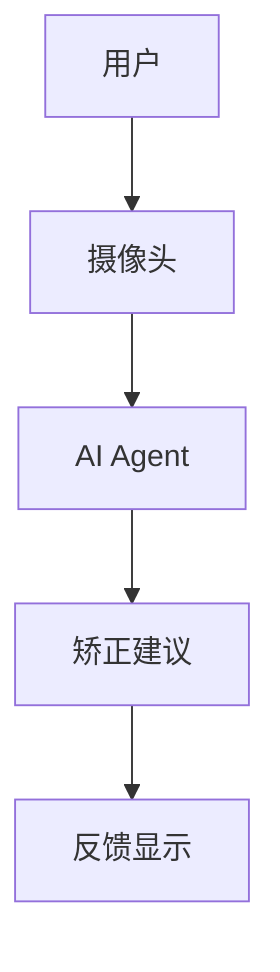
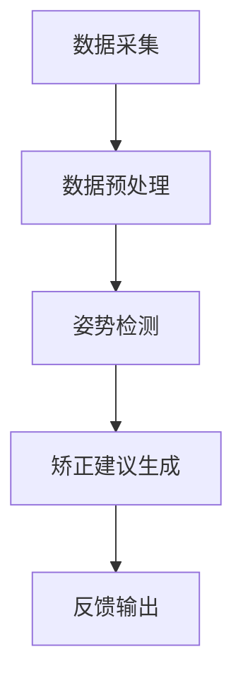
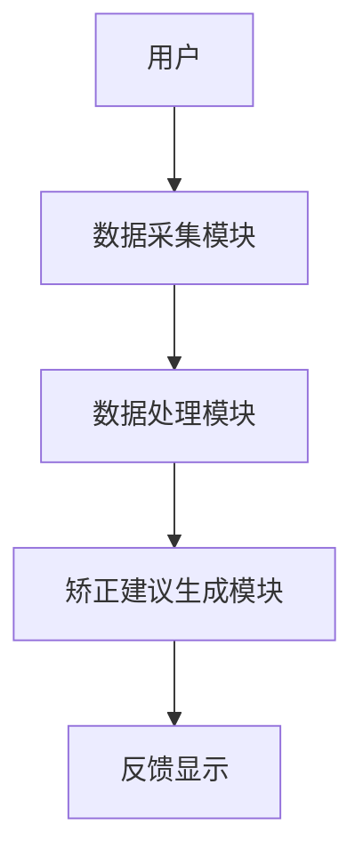
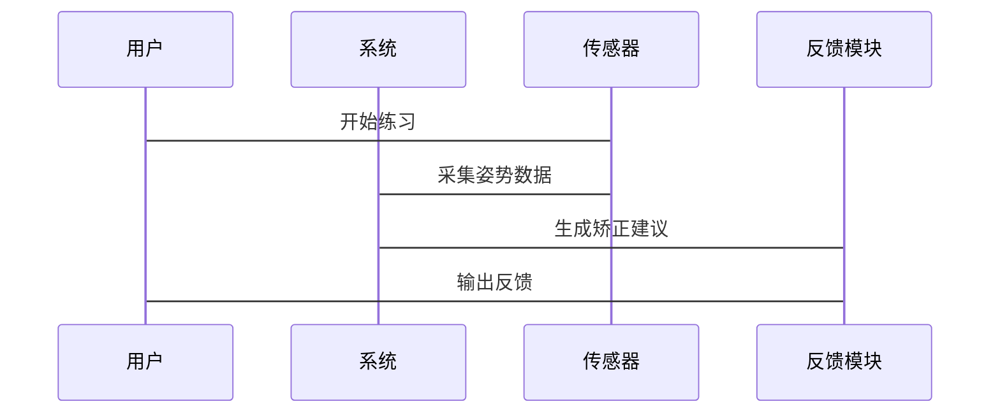

                 


# 智能瑜伽服：AI Agent的姿势矫正系统

**关键词**：智能瑜伽服，AI Agent，姿势矫正，计算机视觉，机器学习，健身技术

**摘要**：  
本文详细探讨了智能瑜伽服与AI Agent结合的姿势矫正系统，介绍了其核心概念、算法原理、系统架构设计以及实际应用。通过分析AI技术在瑜伽姿势矫正中的作用，展示了如何利用计算机视觉和机器学习实现智能化的健身指导。本文还提供了具体的系统设计和代码实现，帮助读者理解并应用这一创新技术。

---

# 第一部分: 智能瑜伽服与AI Agent的背景介绍

## 第1章: 智能瑜伽服的概念与定义

### 1.1 智能瑜伽服的概念与定义

#### 1.1.1 传统瑜伽服的功能与局限性  
传统瑜伽服主要以舒适性和透气性为主，缺乏智能化功能，无法实时监测用户的姿势或提供反馈。  

#### 1.1.2 智能瑜伽服的核心概念  
智能瑜伽服是一种集成AI技术的健身服装，能够通过传感器和摄像头实时监测用户的姿势，并通过AI算法提供矫正建议。  

#### 1.1.3 AI Agent在智能瑜伽服中的作用  
AI Agent作为系统的核心，负责数据的采集、分析和反馈，帮助用户实时矫正姿势，提高练习效果。  

### 1.2 智能瑜伽服的应用场景  

#### 1.2.1 瑜伽练习中的常见问题  
- 姿势不标准，导致锻炼效果不佳。  
- 个别用户由于身体结构差异，难以掌握正确的姿势。  

#### 1.2.2 智能瑜伽服的应用场景分析  
- 家庭瑜伽练习：用户可以在家中使用智能瑜伽服进行自主练习。  
- 健身工作室：教练可以利用智能瑜伽服辅助教学。  

#### 1.2.3 用户需求与痛点分析  
- 用户需求：实时反馈、个性化矫正、便捷性。  
- 痛点：传统瑜伽教学依赖人工经验，缺乏即时反馈。  

### 1.3 智能瑜伽服的技术背景  

#### 1.3.1 人工智能技术的发展现状  
AI技术的快速发展为智能健身设备提供了技术基础，尤其是在计算机视觉和机器学习领域。  

#### 1.3.2 计算机视觉与姿态识别技术  
姿态识别是智能瑜伽服的核心技术之一，通过摄像头或传感器获取人体姿势数据。  

#### 1.3.3 AI Agent在健身领域的应用潜力  
AI Agent能够实时分析数据，提供个性化的反馈，是未来健身技术的重要方向。  

### 1.4 智能瑜伽服与传统瑜伽服的对比  

#### 1.4.1 功能对比分析  
| 功能特性          | 传统瑜伽服       | 智能瑜伽服         |
|--------------------|------------------|--------------------|
| 姿势矫正          | 无               | AI实时矫正         |
| 数据采集          | 无               | 集成传感器/摄像头   |
| 用户反馈          | 口头指导         | 实时语音/震动反馈   |

#### 1.4.2 技术实现方式的差异  
- 传统瑜伽服依赖人工经验，而智能瑜伽服通过AI算法实现自动化矫正。  

#### 1.4.3 用户体验的提升  
智能瑜伽服通过实时反馈和个性化建议，显著提升了用户的练习效果和体验感。  

---

## 第2章: AI Agent的定义与工作原理

### 2.1 AI Agent的基本概念  

#### 2.1.1 AI Agent的定义  
AI Agent是一种智能体，能够感知环境并采取行动以实现特定目标。  

#### 2.1.2 AI Agent的核心特征  
- **自主性**：无需人工干预即可运行。  
- **反应性**：能够实时感知并调整行为。  
- **目标导向性**：通过目标驱动进行决策。  

#### 2.1.3 AI Agent与传统算法的区别  
AI Agent具有更强的适应性和自主性，能够根据环境变化动态调整策略。  

### 2.2 姿势矫正系统的实现原理  

#### 2.2.1 姿势识别的基本流程  
1. 数据采集：通过摄像头或传感器获取用户姿势数据。  
2. 数据处理：对数据进行预处理，提取关键特征。  
3. 姿势检测：利用AI算法识别姿势是否标准。  
4. 矫正建议：根据检测结果生成矫正建议。  

#### 2.2.2 AI Agent在姿势矫正中的作用  
- 数据采集与分析：实时监测用户的姿势数据。  
- 矫正建议生成：基于算法分析提供个性化反馈。  

#### 2.2.3 系统的实时反馈机制  
- 通过语音或震动反馈矫正建议。  
- 根据用户反馈调整算法参数。  

### 2.3 AI Agent与计算机视觉的关系  

#### 2.3.1 计算机视觉在姿势识别中的应用  
- 使用深度学习模型（如姿态估计模型）进行姿势识别。  

#### 2.3.2 AI Agent对视觉数据的处理  
- 将视觉数据输入AI Agent，进行分析和决策。  

#### 2.3.3 系统的整体架构  


---

## 第3章: 姿势矫正系统的算法原理

### 3.1 姿势识别算法的实现  

#### 3.1.1 姿势识别的基本原理  
- 使用深度学习模型（如YOLO或OpenPose）进行姿势检测。  

#### 3.1.2 基于AI Agent的姿势矫正算法  


#### 3.1.3 算法的优化与改进  
- 引入用户反馈进行模型优化。  

### 3.2 算法的数学模型与公式  

#### 3.2.1 姿势检测的数学模型  
姿态估计模型通常基于概率图模型，公式如下：  
$$ P(Y|X) = \frac{P(X|Y)P(Y)}{P(X)} $$  
其中，$Y$表示姿势标签，$X$表示输入图像。  

#### 3.2.2 矫正建议的生成算法  
基于偏差分析的矫正策略：  
$$ \text{矫正建议} = \argmin_{i} \sum_{j=1}^{n} |y_j - y_j'| $$  
其中，$y_j$表示实际姿势，$y_j'$表示理想姿势。  

---

## 第4章: 系统架构与设计

### 4.1 系统的整体架构  

#### 4.1.1 系统的功能模块划分  
- 数据采集模块：负责采集用户姿势数据。  
- 数据处理模块：对数据进行预处理和分析。  
- 矫正建议生成模块：基于分析结果生成矫正建议。  

#### 4.1.2 系统的层次结构  


#### 4.1.3 系统的交互流程  
1. 用户穿上智能瑜伽服，启动系统。  
2. 系统通过摄像头或传感器采集姿势数据。  
3. 数据处理模块分析数据，生成矫正建议。  
4. 矫正建议通过语音或震动反馈给用户。  

### 4.2 系统的接口设计  

#### 4.2.1 系统接口的定义  
- 输入接口：摄像头、传感器。  
- 输出接口：语音模块、震动模块。  

#### 4.2.2 系统的交互流程  


---

## 第5章: 项目实战

### 5.1 项目环境与工具安装  

#### 5.1.1 开发环境  
- 操作系统：Windows/Linux/MacOS  
- 开发工具：Python、OpenCV、TensorFlow  

#### 5.1.2 安装必要的库  
```bash
pip install numpy
pip install opencv-python
pip install tensorflow
```

### 5.2 核心代码实现  

#### 5.2.1 数据采集与处理  
```python
import cv2
import numpy as np

def capture_pose():
    cap = cv2.VideoCapture(0)
    while True:
        ret, frame = cap.read()
        cv2.imshow('Pose Capture', frame)
        if cv2.waitKey(1) & 0xFF == ord('q'):
            break
    cap.release()
    cv2.destroyAllWindows()
    return frame
```

#### 5.2.2 姿势检测与分析  
```python
import tensorflow as tf
from tensorflow.keras.models import load_model

def detect_pose(frame):
    model = load_model('pose_model.h5')
    prediction = model.predict(frame)
    return prediction
```

#### 5.2.3 矫正建议生成  
```python
def generate_feedback(prediction):
    feedback = []
    if prediction[0] < 0.5:
        feedback.append("肩膀稍向后展，保持放松。")
    if prediction[1] > 0.6:
        feedback.append("膝盖弯曲幅度过大，适当调整。")
    return feedback
```

### 5.3 实际案例分析  

#### 5.3.1 案例分析  
- 用户A：矫正驼背问题。  
- 系统反馈：实时提醒用户保持脊柱中立位。  

#### 5.3.2 矫正效果评估  
通过对比用户前后数据，评估矫正效果，优化算法模型。  

---

## 第6章: 最佳实践与总结

### 6.1 最佳实践 tips  
- 定期更新算法模型，提升矫正精度。  
- 根据用户反馈优化系统功能。  

### 6.2 小结  
智能瑜伽服通过AI Agent实现了智能化的姿势矫正，显著提升了用户的练习效果和体验感。  

### 6.3 注意事项  
- 数据隐私保护：确保用户数据的安全性。  
- 系统兼容性：支持多种设备和环境。  

### 6.4 拓展阅读  
- 《深度学习入门：基于Python》  
- 《计算机视觉实战：OpenCV与TensorFlow结合》  

---

# 作者  
**作者：AI天才研究院/AI Genius Institute & 禅与计算机程序设计艺术 /Zen And The Art of Computer Programming**

---

以上是《智能瑜伽服：AI Agent的姿势矫正系统》的完整目录和文章内容，希望对您有所帮助！

