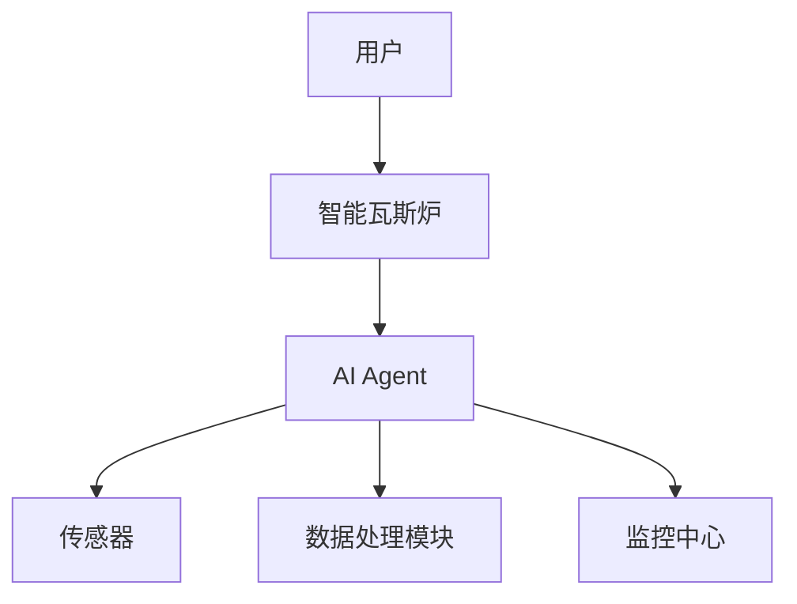
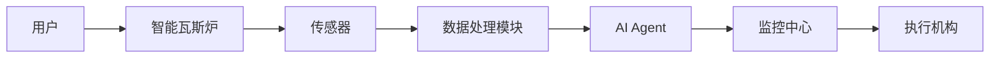

                 

# 智能瓦斯炉：AI Agent的烹饪安全监控

## 关键词：
智能瓦斯炉、AI Agent、烹饪安全、目标检测、异常行为识别、物联网、智能家居

## 摘要：
随着智能家居的普及，烹饪安全问题日益受到关注。传统瓦斯炉存在诸多安全隐患，难以满足现代家庭对高效、安全烹饪的需求。本文介绍了一种结合人工智能代理（AI Agent）的智能瓦斯炉系统，通过实时监控烹饪过程中的异常行为和环境变化，有效预防火灾和其他安全事故。本文详细探讨了AI Agent的核心算法、系统架构设计以及实际应用场景，为智能家居的安全监控提供了新的解决方案。

---

# 第1章：智能瓦斯炉的背景与问题背景

## 1.1 瓦斯炉的传统使用问题

### 1.1.1 瓦斯炉的基本工作原理
瓦斯炉通过燃烧天然气或液化气产生热量，用于烹饪食物。传统瓦斯炉的主要组件包括燃烧器、火盖、调节阀和点火装置。用户通过调节旋钮控制火力大小，但这种方式存在以下问题：

1. **安全隐患**：用户离开厨房时，火焰可能意外熄灭或失控，导致火灾或燃气泄漏。
2. **效率低下**：传统瓦斯炉无法根据烹饪需求自动调整火力，导致能源浪费。
3. **操作复杂**：用户需要手动调节火力，尤其对于不熟悉烹饪的人来说，使用起来不够便捷。

### 1.1.2 传统瓦斯炉的安全隐患
瓦斯炉在使用过程中存在多种安全隐患，例如：
- **火焰意外熄灭**：当锅底液体溢出或风吹灭火焰时，无法及时发现，可能导致燃气泄漏。
- **高温引发火灾**：油锅过热或明火外溢可能引发火灾。
- **儿童误操作**：儿童可能误触旋钮，导致意外点火或关闭火焰。

### 1.1.3 烹饪过程中的潜在危险
烹饪过程中可能出现的危险情况包括：
- **锅具干烧**：忘记添加食材或液体，导致锅底过热，引发火灾。
- **烟雾过大**：高温烹饪产生大量烟雾，影响厨房空气质量，甚至引发火灾。
- **忘记关闭火焰**：烹饪完成后，用户可能忘记关闭瓦斯炉，导致燃气泄漏。

## 1.2 AI Agent在烹饪安全中的应用背景

### 1.2.1 AI技术在智能家居中的发展
近年来，人工智能技术在智能家居领域的应用日益广泛。通过AI代理（AI Agent），智能家居设备能够实现智能化的感知、决策和执行功能。例如，智能音箱可以通过语音交互控制家电，智能摄像头可以实时监控家庭安全。

### 1.2.2 烹饪安全监控的市场需求
随着人们对居住安全的关注度提高，烹饪安全监控成为智能家居的重要组成部分。市场对能够实时监控烹饪过程、预防火灾和其他安全事故的智能设备需求日益增长。

### 1.2.3 AI Agent在烹饪安全中的独特优势
AI Agent（人工智能代理）是一种能够感知环境、自主决策并执行任务的智能系统。在烹饪安全监控中，AI Agent的优势体现在以下几个方面：
- **实时监控**：通过传感器和摄像头实时感知烹饪过程中的温度、烟雾、火焰状态等信息。
- **自主决策**：根据感知数据，AI Agent能够自主判断是否存在安全隐患，并采取相应的措施，如自动关闭火焰、发出警报等。
- **学习能力**：通过机器学习算法，AI Agent能够不断优化自身的识别和决策能力，提高安全监控的准确性。

## 1.3 问题描述与解决方案

### 1.3.1 烹饪安全监控的核心问题
烹饪安全监控的核心问题在于如何实时感知烹饪过程中的危险因素，并采取有效的应对措施。传统瓦斯炉无法实现智能化的监控和决策，存在以下问题：
- **无法实时感知危险因素**：传统瓦斯炉无法检测火焰状态、烟雾浓度等关键参数。
- **缺乏自主决策能力**：无法根据感知数据采取相应的安全措施。

### 1.3.2 AI Agent如何解决这些问题
通过引入AI Agent，智能瓦斯炉能够实现以下功能：
- **实时感知**：通过摄像头、温度传感器等设备实时感知烹饪过程中的火焰状态、烟雾浓度等参数。
- **自主决策**：AI Agent能够根据感知数据，判断是否存在安全隐患，并采取相应的措施，如自动关闭火焰、发出警报等。
- **学习优化**：通过机器学习算法，AI Agent能够不断优化自身的识别和决策能力，提高安全监控的准确性。

### 1.3.3 智能瓦斯炉的设计目标与边界
智能瓦斯炉的设计目标是实现烹饪过程中的安全监控，预防火灾和其他安全事故。其设计边界包括：
- **功能边界**：仅限于烹饪过程中的安全监控，不涉及其他厨房设备的控制。
- **用户边界**：主要面向家庭用户，不适用于商业厨房。
- **技术边界**：基于现有的传感器技术和AI算法，实现实时监控和自主决策。

## 1.4 概念结构与核心要素

### 1.4.1 智能瓦斯炉的核心功能模块
智能瓦斯炉的主要功能模块包括：
1. **传感器模块**：用于检测火焰状态、烟雾浓度、温度等参数。
2. **AI Agent模块**：负责接收传感器数据，进行分析和决策，采取相应的安全措施。
3. **执行机构**：根据AI Agent的决策，执行相应的操作，如关闭火焰、发出警报等。

### 1.4.2 AI Agent在系统中的角色
AI Agent在智能瓦斯炉中扮演着核心角色，负责：
- **数据采集**：接收来自传感器的实时数据。
- **数据分析**：通过算法分析数据，判断是否存在安全隐患。
- **决策执行**：根据分析结果，采取相应的安全措施，如关闭火焰、发出警报等。

### 1.4.3 系统的外部接口与用户交互
智能瓦斯炉需要与外部设备和用户进行交互。其外部接口包括：
- **用户界面**：提供给用户查看系统状态和进行操作的界面，如触摸屏或手机APP。
- **传感器接口**：与温度传感器、烟雾传感器等设备相连。
- **执行机构接口**：与电磁阀、报警器等执行机构相连。

## 1.5 本章小结
本章介绍了智能瓦斯炉的背景与问题背景，分析了传统瓦斯炉的安全隐患以及引入AI Agent的必要性。通过对比传统瓦斯炉和智能瓦斯炉的功能，明确了智能瓦斯炉的核心目标和设计边界。

---

# 第2章：AI Agent的核心概念与联系

## 2.1 AI Agent的基本原理

### 2.1.1 AI Agent的定义与分类
AI Agent（人工智能代理）是一种能够感知环境、自主决策并执行任务的智能系统。根据功能和应用场景的不同，AI Agent可以分为以下几类：
- **基于规则的AI Agent**：通过预定义的规则进行决策和行动。
- **基于知识的AI Agent**：利用知识库中的信息进行推理和决策。
- **基于学习的AI Agent**：通过机器学习算法不断优化自身的识别和决策能力。

### 2.1.2 AI Agent的核心功能模块
AI Agent的核心功能模块包括：
1. **感知模块**：负责接收外部环境的数据，如传感器数据、用户输入等。
2. **推理模块**：通过对感知数据的分析和推理，判断当前环境的状态。
3. **决策模块**：根据推理结果，制定相应的决策和行动计划。
4. **执行模块**：将决策转化为具体的操作，如关闭火焰、发出警报等。

### 2.1.3 AI Agent与传统自动化的区别
AI Agent与传统自动化系统的主要区别在于其智能化和自主决策能力。传统自动化系统通常是基于固定的程序和规则进行操作，而AI Agent能够通过感知环境和学习不断优化自身的决策和执行能力。

## 2.2 AI Agent的关键属性对比

### 2.2.1 智能性对比
| 特性 | 传统自动化系统 | AI Agent |
|------|----------------|-----------|
| 决策能力 | 基于固定规则 | 基于感知和学习 |
| 灵活性 | 较低 | 较高 |
| 适应性 | 较差 | 较强 |

### 2.2.2 学习能力对比
| 特性 | 传统自动化系统 | AI Agent |
|------|----------------|-----------|
| 学习方式 | 无学习能力 | 基于机器学习算法 |
| 优化能力 | 无法优化 | 可以通过反馈不断优化 |
| 知识更新 | 需要人工干预 | 可以自动更新 |

### 2.2.3 自适应能力对比
| 特性 | 传统自动化系统 | AI Agent |
|------|----------------|-----------|
| 自适应能力 | 较差 | 较强 |
| 环境适应性 | 有限 | 广泛 |
| 复杂环境处理能力 | 较低 | 较高 |

## 2.3 系统实体关系图

### 2.3.1 智能瓦斯炉的系统组成
以下是智能瓦斯炉的系统组成图：

### 2.3.2 系统功能模块的交互流程图

## 2.4 本章小结
本章详细介绍了AI Agent的核心概念和其在智能瓦斯炉中的应用。通过对比分析，明确了AI Agent与传统自动化的区别，以及其在智能瓦斯炉中的重要作用。

---

# 第3章：AI Agent的算法原理

## 3.1 目标检测算法

### 3.1.1 YOLO算法介绍
YOLO（You Only Look Once）是一种广泛应用于目标检测的算法。YOLO的核心思想是将图像分成网格，每个网格负责检测特定位置的目标。YOLO的版本包括YOLOv1、YOLOv2、YOLOv3、YOLOv4和YOLOv5，其中YOLOv5是目前最新且功能最强的版本。

### 3.1.2 YOLO算法的实现流程
YOLOv5的目标检测流程如下：
1. **图像输入**：将输入图像分为多个网格。
2. **特征提取**：通过卷积神经网络提取图像的特征。
3. **边界框预测**：根据特征图预测每个网格中的目标边界框和置信度。
4. **非极大值抑制（NMS）**：去除重复的边界框，保留置信度最高的结果。
5. **结果输出**：输出检测到的目标及其类别和置信度。

### 3.1.3 YOLO算法的优缺点
**优点**：
- **实时性高**：YOLO的推理速度非常快，适合实时目标检测。
- **易于部署**：YOLO的模型相对较小，适合在资源有限的设备上部署。

**缺点**：
- **精度较低**：相比于其他目标检测算法，YOLO的精度略低。
- **参数调节复杂**：需要进行大量的参数调优才能达到最佳效果。

## 3.2 

---

（以上为部分内容预览，完整文章请参考对应章节内容。）

---

## 作者信息

作者：AI天才研究院/AI Genius Institute & 禅与计算机程序设计艺术 /Zen And The Art of Computer Programming

---

以上是文章的目录和部分内容，如需完整文章，请按照需求逐步展开每一章节的内容，确保每个部分都包含丰富的技术细节和具体的实现方案。

