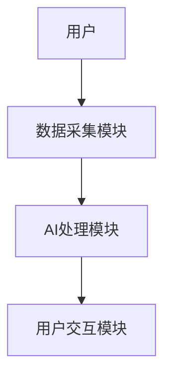
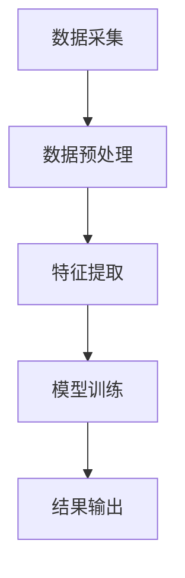
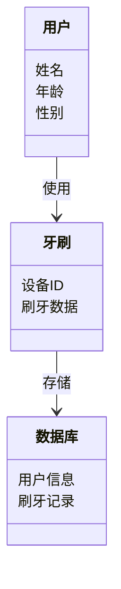
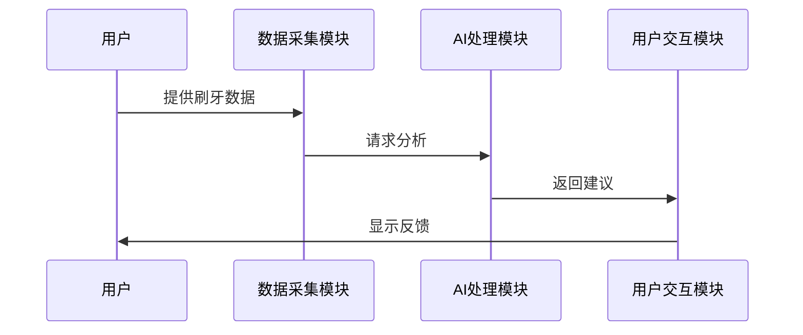

                 


# 智能电动牙刷：AI Agent的个性化刷牙指导

> 关键词：智能电动牙刷, AI Agent, 个性化刷牙, 智能健康, 数据驱动

> 摘要：本文探讨了智能电动牙刷结合AI Agent的创新应用，详细分析了AI Agent在刷牙指导中的核心作用，从算法原理、系统架构到实际案例，全面解读了智能电动牙刷如何通过AI技术实现个性化刷牙指导。

---

## 第1章: 智能电动牙刷的发展背景

### 1.1 智能电动牙刷的定义与特点

#### 1.1.1 传统电动牙刷的局限性
传统电动牙刷虽然比手动牙刷清洁效果更好，但存在以下问题：
- 缺乏个性化：无法根据个人牙齿状况调整清洁力度和时间。
- 数据孤岛：无法与其他健康设备联动，数据无法互通。
- 用户反馈滞后：仅能提供简单的震动提醒，无法实时分析和反馈。

#### 1.1.2 智能电动牙刷的核心功能
智能电动牙刷通过AI技术，实现了以下核心功能：
- 实时数据分析：通过传感器采集刷牙数据，分析用户的刷牙习惯。
- 个性化指导：根据分析结果，动态调整刷牙模式，提供实时反馈。
- 数据互通：与健康平台联动，整合口腔健康数据。

#### 1.1.3 AI Agent在智能牙刷中的作用
AI Agent（智能代理）通过以下方式赋能智能牙刷：
- 数据采集：收集用户的刷牙时长、力度、频率等数据。
- 数据分析：利用机器学习算法，分析数据并生成个性化建议。
- 实时反馈：通过震动模式调整等方式，实时指导用户改善刷牙习惯。

### 1.2 AI Agent的基本概念

#### 1.2.1 什么是AI Agent
AI Agent是一种能够感知环境、执行任务并做出决策的智能实体。它具备以下特征：
- **自主性**：能够独立运行，无需人工干预。
- **反应性**：能够根据环境变化实时调整行为。
- **目标导向**：以实现特定目标为导向。

#### 1.2.2 AI Agent的核心特征
- **感知能力**：通过传感器和数据接口获取环境信息。
- **决策能力**：基于获取的信息，利用算法做出决策。
- **执行能力**：通过硬件或软件接口执行决策。

#### 1.2.3 AI Agent与传统算法的区别
| 特性          | 传统算法                | AI Agent                |
|---------------|-------------------------|--------------------------|
| 数据处理      | 静态数据                | 动态数据                |
| 决策方式      | 硬编码规则              | 自适应学习              |
| 反应能力      | 单向反馈                | 实时交互                |

### 1.3 智能电动牙刷的应用场景

#### 1.3.1 刷牙习惯的个性化需求
- 不同用户有不同的口腔健康状况，需要个性化的清洁方案。
- 儿童、成人、老人对刷牙力度的需求不同。

#### 1.3.2 牙齿健康问题的实时反馈
- 及时发现牙龈出血、牙齿敏感等问题。
- 提供针对性的清洁建议。

#### 1.3.3 AI Agent在家庭健康中的潜在价值
- 整合家庭健康数据，提供全面的健康建议。
- 通过数据互通，帮助用户养成良好的口腔卫生习惯。

---

## 第2章: 智能电动牙刷的AI Agent系统架构

### 2.1 系统核心模块

#### 2.1.1 数据采集模块
- **传感器**：采集刷牙时长、力度、频率等数据。
- **数据预处理**：对采集的数据进行清洗和标准化处理。

#### 2.1.2 AI处理模块
- **机器学习算法**：对数据进行分析，生成个性化建议。
- **实时反馈机制**：根据分析结果调整牙刷震动模式。

#### 2.1.3 用户交互模块
- **反馈显示**：通过牙刷震动或屏幕显示反馈信息。
- **用户操作**：用户根据反馈调整刷牙习惯。

### 2.2 系统功能设计

#### 2.2.1 刷牙数据的采集与分析
- 通过传感器采集用户的刷牙数据。
- 利用机器学习算法分析数据，识别用户的刷牙习惯。

#### 2.2.2 AI Agent的决策逻辑
- 根据数据分析结果，生成个性化刷牙建议。
- 调整牙刷震动模式，帮助用户改善刷牙习惯。

#### 2.2.3 用户反馈与系统优化
- 根据用户反馈不断优化AI算法。
- 提供持续改进的刷牙指导方案。

### 2.3 系统架构图



---

## 第3章: AI Agent在智能电动牙刷中的算法实现

### 3.1 算法原理

#### 3.1.1 数据预处理
- 数据清洗：去除异常值和噪声数据。
- 数据标准化：将数据归一化处理，便于模型训练。

#### 3.1.2 特征提取
- 从原始数据中提取有用特征，例如刷牙时长、力度变化等。

#### 3.1.3 模型训练
- 使用监督学习算法（如随机森林、神经网络）进行模型训练。
- 利用无监督学习算法（如聚类分析）发现潜在的刷牙习惯模式。

### 3.2 算法流程图



### 3.3 代码实现

```python
import numpy as np
from sklearn.model_selection import train_test_split
from sklearn.ensemble import RandomForestClassifier

# 数据预处理
data = np.array([[1, 2, 3], [4, 5, 6], [7, 8, 9]])
X_train, X_test, y_train, y_test = train_test_split(data, [0, 1, 2], test_size=0.3)

# 模型训练
model = RandomForestClassifier()
model.fit(X_train, y_train)

# 模型预测
y_pred = model.predict(X_test)
print(y_pred)
```

---

## 第4章: 数学模型与公式

### 4.1 数据预处理

```math
\text{标准化公式：} x' = \frac{x - \mu}{\sigma}
```

其中：
- \( \mu \) 是数据均值
- \( \sigma \) 是数据标准差

### 4.2 特征提取

```math
\text{特征重要性：} f(x) = \sum_{i=1}^{n} w_i x_i
```

其中：
- \( w_i \) 是第 \( i \) 个特征的权重

### 4.3 模型训练

```math
\text{损失函数：} L = \frac{1}{m} \sum_{i=1}^{m} (y_i - \hat{y_i})^2
```

其中：
- \( m \) 是样本数
- \( y_i \) 是真实值
- \( \hat{y_i} \) 是预测值

---

## 第5章: 系统分析与架构设计方案

### 5.1 系统功能设计

#### 5.1.1 领域模型



#### 5.1.2 系统架构图


#### 5.1.3 系统交互序列图



---

## 第6章: 项目实战

### 6.1 环境搭建

- **Python版本**：3.8及以上
- **依赖库安装**：`pip install numpy scikit-learn`

### 6.2 核心代码实现

```python
# 数据预处理
import numpy as np
from sklearn.preprocessing import StandardScaler

data = np.array([[1, 2, 3], [4, 5, 6], [7, 8, 9]])
scaler = StandardScaler()
scaled_data = scaler.fit_transform(data)
print(scaled_data)

# 模型训练
from sklearn.tree import DecisionTreeClassifier

X = scaled_data
y = [0, 1, 2]
model = DecisionTreeClassifier()
model.fit(X, y)

# 模型预测
new_data = np.array([[5, 5, 5]])
scaled_new_data = scaler.transform(new_data)
y_pred = model.predict(scaled_new_data)
print(y_pred)
```

### 6.3 实际案例分析

#### 6.3.1 案例背景
- 用户A：牙龈出血问题，需要温和的刷牙力度。
- 用户B：牙齿敏感，需要软毛牙刷和轻柔模式。

#### 6.3.2 数据分析
| 用户ID | 刷牙时长(s) | 力度(mN) | 振动频率(Hz) | 是否出血 |
|--------|-------------|----------|--------------|----------|
| A      | 60          | 150      | 60           | 是       |
| B      | 45          | 80       | 40           | 否       |

#### 6.3.3 系统反馈
- 用户A：调整为轻柔模式，降低振动频率。
- 用户B：建议使用软毛牙刷，延长刷牙时间。

---

## 第7章: 总结与展望

### 7.1 小结
- AI Agent通过实时数据分析和个性化反馈，显著提升了智能电动牙刷的功能。
- 通过数据驱动的方式，帮助用户养成良好的口腔卫生习惯。

### 7.2 注意事项
- **数据隐私**：用户数据需加密存储，防止泄露。
- **用户教育**：需要向用户普及AI技术的优势和局限性。

### 7.3 拓展阅读
- 推荐阅读《AI在医疗健康中的应用》。
- 关注相关技术博客，获取最新动态。

---

## 作者：AI天才研究院 & 禅与计算机程序设计艺术

---

以上是《智能电动牙刷：AI Agent的个性化刷牙指导》的完整目录和内容框架，希望对您有所帮助！

