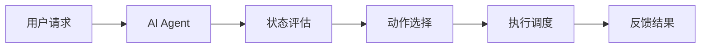

                 


# 第一部分: 智能电梯与AI Agent的背景介绍

# 第1章: 智能电梯与AI Agent概述

## 1.1 智能电梯的发展历程
### 1.1.1 传统电梯的工作原理
### 1.1.2 智能电梯的概念与特点
### 1.1.3 AI Agent在智能电梯中的应用

## 1.2 AI Agent的基本概念
### 1.2.1 AI Agent的定义与分类
### 1.2.2 AI Agent的核心功能与优势
### 1.2.3 AI Agent与传统电梯调度算法的对比

## 1.3 智能电梯调度算法的背景与意义
### 1.3.1 传统电梯调度算法的局限性
### 1.3.2 AI Agent在电梯调度中的应用价值
### 1.3.3 智能电梯调度算法的未来发展趋势

# 第2章: 智能电梯调度算法的核心概念与联系

## 2.1 AI Agent与电梯调度算法的关系
### 2.1.1 AI Agent在电梯调度中的角色
### 2.1.2 电梯调度算法的基本原理
### 2.1.3 AI Agent如何优化电梯调度算法

## 2.2 核心概念与联系
### 2.2.1 AI Agent的核心属性特征对比表
| 属性 | 描述 |
|------|------|
| 智能性 | 基于AI技术实现自主决策 |
| 反应性 | 能够实时响应电梯请求 |
| 学习能力 | 可以通过数据优化调度策略 |

### 2.2.2 ER实体关系图（使用 Mermaid）

```mermaid
er
actor(AI Agent) 
actor(电梯系统) 
actor(用户请求)
```

## 2.3 算法原理讲解
### 2.3.1 强化学习算法在电梯调度中的应用


### 2.3.2 动态规划算法在电梯调度中的应用


# 第3章: 智能电梯调度算法的数学模型与公式

## 3.1 基于强化学习的电梯调度算法
### 3.1.1 强化学习的基本原理
### 3.1.2 Q-learning算法在电梯调度中的应用
$$ Q(s,a) = Q(s,a) + \alpha [r + \gamma \max Q(s',a') - Q(s,a)] $$

## 3.2 基于动态规划的电梯调度算法
### 3.2.1 动态规划的基本原理
### 3.2.2 最短路径算法在电梯调度中的应用
$$ \text{最短路径} = \s

