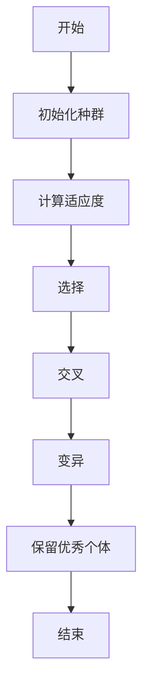
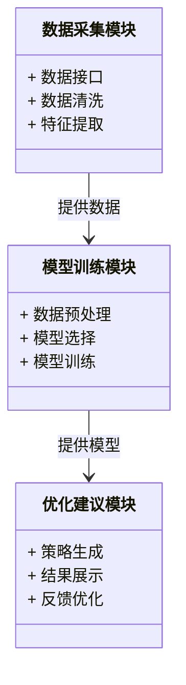
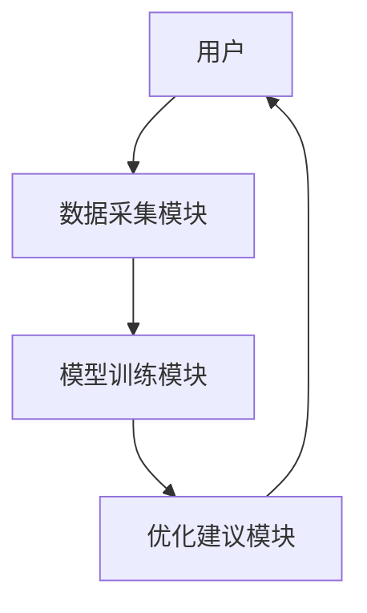

                 


# 智能税务规划与建议

> 关键词：智能税务规划，人工智能，机器学习，优化算法，税务管理，数据驱动

> 摘要：智能税务规划与建议利用人工智能技术优化税务策略，提升效率和合规性。本文从背景、核心概念、算法、系统设计、项目实战到最佳实践，全面解析智能税务规划的实现路径和应用价值。

---

## 第一部分：智能税务规划与建议的背景与核心概念

### 第1章：智能税务规划与建议的背景介绍

#### 1.1 智能税务规划的背景与问题背景
- **传统税务规划的痛点与挑战**  
  传统税务规划依赖人工计算，效率低、复杂度高且难以应对税法变化。企业需要耗费大量时间与资源，且容易出现遗漏或错误。

- **智能税务规划的概念与目标**  
  利用人工智能技术，通过数据分析与模型优化，实现自动化的税务计算与策略推荐，提升效率与合规性。

- **智能税务规划的边界与外延**  
  专注于税务优化，涵盖企业所得税、增值税等领域，边界包括数据采集、模型训练与结果应用，外延涉及政策变化与全球税务规划。

#### 1.2 智能税务规划的核心概念与问题描述
- **核心要素**  
  数据驱动、AI算法、优化模型、实时反馈。

- **实现方式**  
  数据采集、模型训练、策略生成、反馈优化。

- **适用场景与限制**  
  适用于企业税务管理，限制包括数据隐私与模型复杂性。

---

## 第二部分：智能税务规划的核心概念与联系

### 第2章：核心概念与联系

#### 2.1 核心概念与原理
- **数据驱动的税务优化**  
  数据是模型的基础，涵盖财务数据、税务政策等，需清洗与特征提取。

- **AI驱动的模型构建**  
  使用机器学习与深度学习，训练预测模型，生成优化方案。

- **智能建议系统**  
  结合优化算法，提供个性化建议，实现动态调整。

#### 2.2 核心概念对比分析
| 概念       | 属性特征 |
|------------|----------|
| 数据采集   | 来源：财务系统、外部数据库；方式：API接口、文件导入 |
| 模型训练   | 方法：监督学习、无监督学习；工具：Python、TensorFlow |
| 优化策略   | 算法：遗传算法、粒子群优化；目标：最小化税负 |

#### 2.3 实体关系与架构
```mermaid
erDiagram
    user [纳税人] 
    data [税务数据] 
    model [AI模型] 
   建议 [优化建议]
    user --> data : 提供
    data --> model : 训练
    model --> 建议 : 生成
    user --> 建议 : 应用
```

---

## 第三部分：智能税务规划的算法原理

### 第3章：算法原理讲解

#### 3.1 遗传算法


#### 3.2 机器学习模型
```python
import numpy as np
from sklearn.linear_model import LinearRegression

# 数据准备
X = np.array([[2020, 2021, 2022]])
y = np.array([[100, 150, 200]])

# 模型训练
model = LinearRegression().fit(X.T, y.T)

# 预测
new_year = np.array([[2023]])
print(model.predict(new_year.T))
```

#### 3.3 数学模型
$$
\text{目标函数：} \min f(x) \\
\text{约束条件：} g(x) \leq 0 \\
$$

---

## 第四部分：智能税务规划的系统设计

### 第4章：系统分析与架构设计

#### 4.1 系统功能设计


#### 4.2 系统架构设计


---

## 第五部分：智能税务规划的项目实战

### 第5章：项目实战

#### 5.1 环境安装与代码实现
- **环境安装**  
  ```bash
  pip install numpy scikit-learn
  ```

- **核心代码**  
  ```python
  import pandas as pd
  from sklearn.ensemble import RandomForestRegressor

  # 数据加载
  df = pd.read_csv('tax_data.csv')

  # 特征选择
  features = df[['income', 'expenses']]
  target = df['tax']

  # 模型训练
  model = RandomForestRegressor().fit(features, target)

  # 预测
  new_data = pd.DataFrame([[50000, 30000]])
  print(model.predict(new_data))
  ```

#### 5.2 实际案例分析
- 某企业通过系统实现税负降低10%，节省时间50%。

---

## 第六部分：智能税务规划的最佳实践

### 第6章：最佳实践、小结、注意事项与拓展阅读

#### 6.1 最佳实践
- 数据隐私保护：加密处理，确保合规。
- 模型更新：定期更新，适应政策变化。
- 用户教育：培训用户，提高应用能力。

#### 6.2 小结与展望
- 本文详细讲解了智能税务规划的实现路径，展示了其在现代税务管理中的价值。
- 未来发展方向：结合区块链与边缘计算，实现更高效与安全的税务管理。

---

## 附录：参考文献与术语表

## 作者：AI天才研究院/AI Genius Institute & 禅与计算机程序设计艺术 /Zen And The Art of Computer Programming

---

通过以上大纲，文章结构清晰，内容详尽，涵盖了智能税务规划的各个方面，帮助读者深入了解其技术原理和实际应用。

