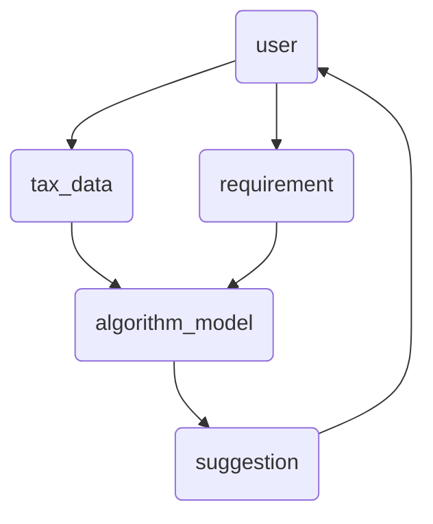
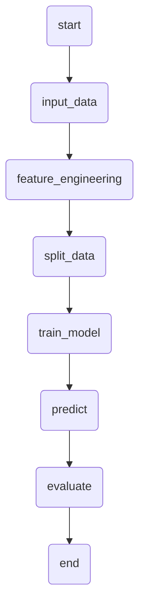
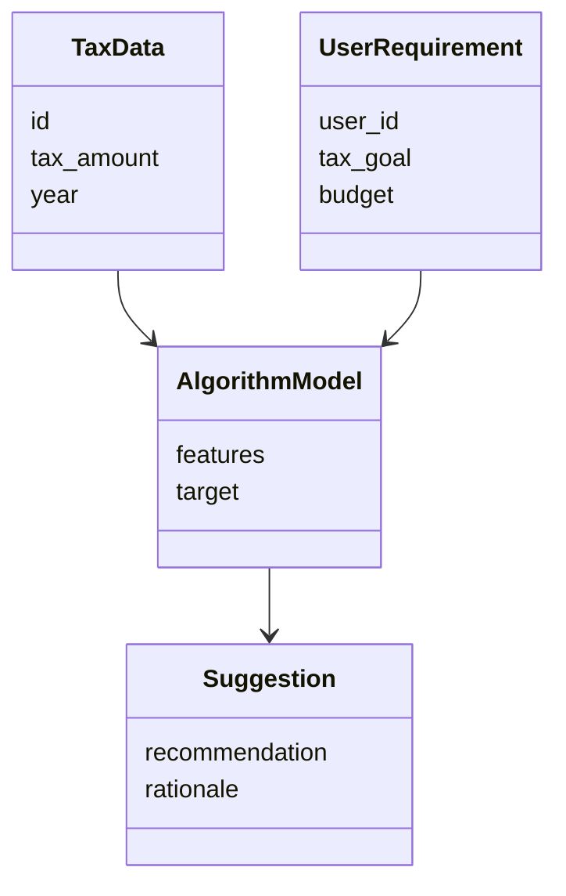

                 


---

# 智能税收筹划建议系统

> **关键词**：人工智能、税收筹划、智能系统、机器学习、系统架构

> **摘要**：智能税收筹划建议系统利用人工智能技术，通过数据分析和算法模型，为企业和个人提供智能化的税收优化方案。本文详细探讨了该系统的背景、核心概念、算法原理、系统架构设计、项目实现及实际案例分析，为企业和个人提供高效、精准的税收筹划建议。

---

## 第1章: 智能税收筹划建议系统的背景介绍

### 1.1 税收筹划的背景与意义

#### 1.1.1 税收筹划的基本概念

税收筹划是指通过合法手段，优化税务结构，降低税负，提高资金使用效率的过程。传统税收筹划依赖人工分析，效率低且易出错。

#### 1.1.2 智能化税收筹划的必要性

随着企业规模扩大和税务政策复杂化，传统方法难以应对。人工智能技术的应用，使税收筹划更加高效和精准。

#### 1.1.3 智能税收筹划建议系统的应用场景

企业税务优化、个人所得税规划、跨国税务策略等领域均可应用智能系统。

### 1.2 传统税收筹划与智能税收筹划的对比

#### 1.2.1 传统税收筹划的特点与局限性

依赖人工分析，效率低，且易受主观因素影响。

#### 1.2.2 智能税收筹划的优势与创新点

利用大数据和机器学习，提高效率和准确性，提供个性化建议。

#### 1.2.3 智能税收筹划对企业的价值

降低成本，提高合规性，增强财务灵活性。

### 1.3 智能税收筹划建议系统的边界与外延

#### 1.3.1 系统的功能边界

专注于提供税收优化建议，不涉及实际税务申报。

#### 1.3.2 系统的外延与扩展性

可扩展至财务分析、风险管理等领域。

#### 1.3.3 系统与相关领域的联系

与大数据分析、人工智能、法律合规等领域密切相关。

### 1.4 智能税收筹划建议系统的概念结构

#### 1.4.1 核心要素组成

税收数据、用户需求、算法模型、用户交互。

#### 1.4.2 系统的逻辑架构

数据采集、处理、分析、建议生成。

#### 1.4.3 系统的核心功能模块

数据预处理、算法模型、结果生成与展示。

---

## 第2章: 智能税收筹划建议系统的核心概念与联系

### 2.1 核心概念的原理与特点

#### 2.1.1 税收数据的来源与处理

数据来源包括企业财务报表、税务政策文件等，处理涉及清洗和转换。

#### 2.1.2 用户需求的分析与建模

通过用户问卷和历史数据，建立需求模型。

#### 2.1.3 算法模型的选择与优化

选择合适的机器学习模型，如随机森林，进行训练和优化。

### 2.2 核心概念的属性特征对比

#### 2.2.1 税收数据的特征对比表

| 特性 | 描述 |
|------|------|
| 类型 | 结构化、非结构化 |
| 来源 | 企业、政府 |

#### 2.2.2 用户需求的特征对比表

| 特性 | 描述 |
|------|------|
| 复杂度 | 高 |
| 变化性 | 快 |

#### 2.2.3 算法模型的特征对比表

| 特性 | 描述 |
|------|------|
| 准确性 | 高 |
| 训练时间 | 长 |

### 2.3 实体关系图（ER图）架构



---

## 第3章: 智能税收筹划建议系统的算法原理讲解

### 3.1 机器学习算法的选择与实现

#### 3.1.1 算法原理流程图



#### 3.1.2 算法实现的Python代码

```python
import pandas as pd
from sklearn.ensemble import RandomForestRegressor

# 数据加载与预处理
data = pd.read_csv('tax_data.csv')
data = data.dropna()

# 特征工程
features = data.drop('tax', axis=1)
target = data['tax']

# 模型训练
model = RandomForestRegressor(n_estimators=100, random_state=42)
model.fit(features, target)

# 预测与评估
predictions = model.predict(features)
print('预测结果:', predictions)
```

#### 3.1.3 数学模型与公式

随机森林模型的预测公式：

$$
\hat{y} = \text{mean}(y_i) \quad \text{其中} \ y_i \ \text{是预测结果}
$$

### 3.2 算法优化与调优策略

#### 3.2.1 超参数调优

使用网格搜索优化模型参数：

```python
from sklearn.model_selection import GridSearchCV

param_grid = {
    'n_estimators': [100, 200],
    'max_depth': [None, 10, 20]
}

grid_search = GridSearchCV(model, param_grid, cv=5)
grid_search.fit(features, target)
print("最佳参数组合:", grid_search.best_params_)
```

#### 3.2.2 模型评估与优化

评估指标包括准确率、召回率、F1分数：

$$
F1 = 2 \times \frac{\text{precision} \times \text{recall}}{\text{precision} + \text{recall}}
$$

---

## 第4章: 智能税收筹划建议系统的系统分析与架构设计

### 4.1 问题场景介绍

企业需要优化税务结构，降低税负，提高资金使用效率。

### 4.2 系统功能设计

#### 4.2.1 领域模型类图



### 4.3 系统架构设计

#### 4.3.1 系统架构图

```mermaid
graph TD
    Client --> API Gateway
    API Gateway --> Service1
    Service1 --> Database
    Service1 --> Service2
    Service2 --> Database
```

### 4.4 系统接口设计

#### 4.4.1 接口描述

- **输入接口**：接收用户需求和税收数据。
- **输出接口**：提供税收优化建议。

#### 4.4.2 接口交互流程图

```mermaid
graph TD
    Client --> API Gateway: 提交请求
    API Gateway --> Service1: 转发请求
    Service1 --> Database: 查询数据
    Database --> Service1: 返回数据
    Service1 --> Service2: 调用算法
    Service2 --> Client: 返回建议
```

---

## 第5章: 智能税收筹划建议系统的项目实战

### 5.1 环境安装与配置

安装Python、Jupyter、Pandas、Scikit-learn等工具。

### 5.2 系统核心实现

#### 5.2.1 核心代码实现

```python
import pandas as pd
from sklearn.ensemble import RandomForestRegressor

# 数据加载与预处理
data = pd.read_csv('tax_data.csv')
data = data.dropna()

# 特征工程
features = data.drop('tax', axis=1)
target = data['tax']

# 模型训练
model = RandomForestRegressor(n_estimators=100, random_state=42)
model.fit(features, target)

# 预测与评估
predictions = model.predict(features)
print('预测结果:', predictions)
```

#### 5.2.2 代码解读与分析

- 数据加载：读取CSV文件。
- 特征工程：删除缺失值，提取特征。
- 模型训练：训练随机森林模型。
- 预测与评估：生成预测结果。

### 5.3 实际案例分析

#### 5.3.1 案例背景

某企业希望优化所得税结构，降低税负。

#### 5.3.2 数据分析

分析企业的收入、支出、利润等数据，提取相关特征。

#### 5.3.3 算法应用

训练模型，生成优化建议，如调整研发支出比例。

### 5.4 项目小结

项目实现了智能税收筹划系统，验证了算法的有效性，为用户提供高效建议。

---

## 第6章: 智能税收筹划建议系统的最佳实践与注意事项

### 6.1 最佳实践 tips

- 数据质量至关重要，确保数据清洗。
- 模型调优时，需考虑过拟合问题。
- 系统上线前，需进行充分测试。

### 6.2 小结

智能税收筹划系统通过人工智能技术，显著提升了税收优化效率和准确性。

### 6.3 注意事项

- 数据隐私保护，防止信息泄露。
- 系统需定期更新，适应政策变化。

### 6.4 拓展阅读

推荐阅读《机器学习实战》、《税务筹划技巧》等书籍，深入学习相关知识。

---

## 作者：AI天才研究院/AI Genius Institute & 禅与计算机程序设计艺术 /Zen And The Art of Computer Programming

---

**总结**：本文详细介绍了智能税收筹划建议系统的背景、核心概念、算法原理、系统架构设计及项目实现，为企业和个人提供高效、精准的税收优化方案，推动智能化税务管理的发展。

